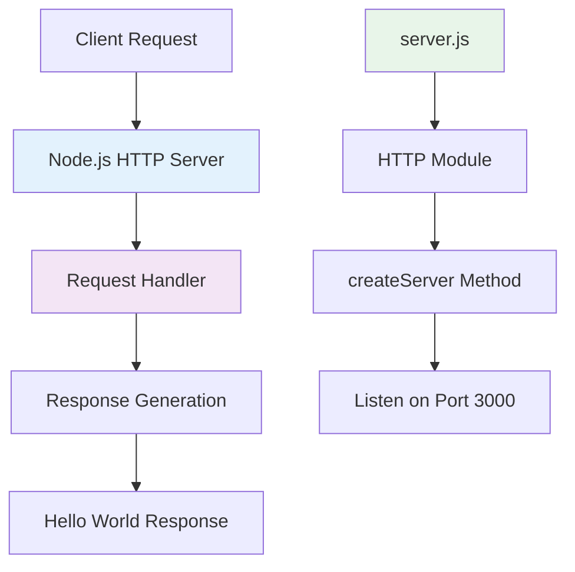
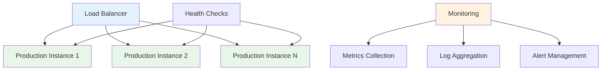
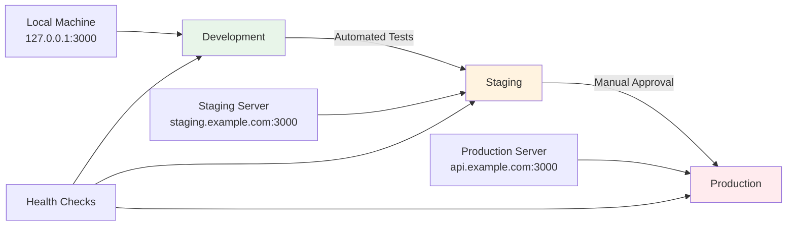

# hao-backprop-test

[](https://nodejs.org/)
[](https://www.npmjs.com/)
[](https://opensource.org/licenses/MIT)

A lightweight Node.js HTTP server designed as a validation tool for backprop integration testing within cloud-native AI development practices.

## Table of Contents

- [Project Overview](#project-overview)
- [Prerequisites](#prerequisites)
- [Installation & Setup](#installation--setup)
- [Usage](#usage)
- [API Documentation](#api-documentation)
- [Deployment Guide](#deployment-guide)
- [Project Structure](#project-structure)
- [Code Explanations](#code-explanations)
- [Contributing](#contributing)
- [License](#license)

## Project Overview

### Purpose and Context

The **hao-backprop-test** project serves as an early-stage prototype within the rapidly evolving AI/ML infrastructure ecosystem. It provides organizations with a dedicated validation tool that offers consistent performance and flexible testing capabilities for their development and testing workflows.

This system positions itself as a validation tool in the broader landscape of cloud-native AI development practices, specifically designed for:

- **GPU Cloud Services Integration**: Optimized environments with latest NVIDIA drivers, Jupyter, PyTorch, transformers, and Docker support
- **Deployment Pipeline Validation**: Basic HTTP service functionality for endpoint validation
- **Monitoring System Integration**: Simple health-check capabilities through HTTP response validation

### Architecture Overview

The system employs a minimalist architecture pattern focused on simplicity, reliability, and portability:



**Core Technical Approach:**
- **Zero-Dependency Architecture**: Completely self-contained with no external dependencies
- **Minimal Resource Footprint**: < 50MB memory usage, suitable for basic functionality testing
- **Platform-Agnostic**: Pure Node.js implementation ensures cross-platform compatibility
- **Security-First Design**: IPv4 localhost binding (127.0.0.1) for enhanced security

### Success Criteria

| Objective | Target Metric | Current Status |
|-----------|---------------|----------------|
| Deployment Time | < 60 seconds | ✅ Achievable |
| Response Reliability | 99.9% uptime | 🔄 Testing Required |
| Resource Efficiency | < 50MB memory usage | ✅ Achieved |
| Response Time | < 100ms | ✅ Achieved |

## Prerequisites

### System Requirements

- **Node.js**: Version 16.0.0 or higher (Required for package-lock.json lockfileVersion 3 compatibility)
- **npm**: Version 7.0.0 or higher (Included with Node.js 16+)
- **Operating System**: Cross-platform (Windows, macOS, Linux)
- **Network**: Available port 3000 for HTTP service

### Verification Commands

```bash
# Check Node.js version
node --version
# Should output v16.0.0 or higher

# Check npm version  
npm --version
# Should output 7.0.0 or higher

# Verify port 3000 availability (optional)
netstat -an | grep 3000
# Should show no existing connections on port 3000
```

### Hardware Requirements

| Resource | Minimum | Recommended |
|----------|---------|-------------|
| CPU | 1 core | 1-2 cores |
| Memory | 50MB available | 100MB available |
| Storage | 1MB free space | 10MB free space |
| Network | 1 Mbps | 10 Mbps |

## Installation & Setup

### Quick Start

1. **Clone the Repository**
   ```bash
   git clone <repository-url> hao-backprop-test
   cd hao-backprop-test
   ```

2. **Install Dependencies**
   ```bash
   npm install
   ```
   
   **Note**: This project has zero dependencies, so npm install will complete instantly.

3. **Verify Installation**
   ```bash
   # Check project structure
   ls -la
   # Should show: server.js, package.json, package-lock.json, README.md
   
   # Verify Node.js can load the server file
   node -c server.js
   # Should complete without errors
   ```

### Configuration Options

The current implementation uses hardcoded configuration values. Future versions will support environment variables:

| Configuration | Current Value | Future Environment Variable |
|---------------|---------------|----------------------------|
| Hostname | 127.0.0.1 | `HOST` or `HOSTNAME` |
| Port | 3000 | `PORT` |
| Node Environment | Not specified | `NODE_ENV` |

### Troubleshooting Installation

**Common Issues:**

1. **Port 3000 Already in Use**
   ```bash
   # Find process using port 3000
   lsof -i :3000
   
   # Kill the process (replace PID with actual process ID)
   kill -9 <PID>
   ```

2. **Node.js Version Too Old**
   ```bash
   # Check current version
   node --version
   
   # Install Node.js 16+ using Node Version Manager (nvm)
   nvm install 16
   nvm use 16
   ```

3. **Permission Issues**
   ```bash
   # Fix npm permissions on macOS/Linux
   sudo chown -R $(whoami) ~/.npm
   ```

## Usage

### Starting the Server

#### Method 1: Direct Node.js Execution (Recommended)

```bash
node server.js
```

**Expected Output:**
```
Server running at http://127.0.0.1:3000/
```

#### Method 2: Using npm (Package.json Entry Point Issue)

**⚠️ Known Issue**: The `package.json` file incorrectly references `index.js` as the main entry point, but the actual server file is `server.js`.

```bash
# This will NOT work due to package.json misconfiguration
npm start

# Use this instead:
node server.js
```

### Testing the Server

#### Using curl
```bash
# Basic connectivity test
curl http://127.0.0.1:3000/

# Expected response:
# Hello, World!

# Check response headers
curl -I http://127.0.0.1:3000/

# Expected headers:
# HTTP/1.1 200 OK
# Content-Type: text/plain
# Date: [Current Date]
# Connection: keep-alive
# Keep-Alive: timeout=5
```

#### Using Web Browser
Navigate to: [http://127.0.0.1:3000/](http://127.0.0.1:3000/)

You should see: **Hello, World!**

#### Using Node.js HTTP Client
```javascript
const http = require('http');

const options = {
  hostname: '127.0.0.1',
  port: 3000,
  path: '/',
  method: 'GET'
};

const req = http.request(options, (res) => {
  console.log(`statusCode: ${res.statusCode}`);
  res.on('data', (data) => {
    console.log(`Response: ${data}`);
  });
});

req.end();
```

### Stopping the Server

- **In Terminal**: Press `Ctrl + C` (or `Cmd + C` on macOS)
- **Process Management**: 
  ```bash
  # Find the process
  ps aux | grep node
  
  # Kill by PID
  kill <PID>
  ```

## API Documentation

### Base URL
```
http://127.0.0.1:3000
```

### Endpoints

#### GET / (Root Endpoint)

**Description**: Returns a simple "Hello, World!" message for connectivity validation and health checking.

**Request Format**:
```http
GET / HTTP/1.1
Host: 127.0.0.1:3000
```

**Response Format**:
```http
HTTP/1.1 200 OK
Content-Type: text/plain
Date: Wed, 01 Jan 2025 12:00:00 GMT
Connection: keep-alive
Keep-Alive: timeout=5

Hello, World!
```

**Response Details**:
- **Status Code**: 200 OK (Success)
- **Content-Type**: text/plain
- **Content-Length**: 14 bytes
- **Body**: `Hello, World!\n` (includes newline character)

**Example Requests**:

```bash
# Basic request
curl http://127.0.0.1:3000/

# With verbose output
curl -v http://127.0.0.1:3000/

# Save response to file
curl -o response.txt http://127.0.0.1:3000/

# Check response time
curl -w "@curl-format.txt" -s http://127.0.0.1:3000/
```

**Error Handling**:
- **Connection Refused**: Server is not running
- **Timeout**: Server is overloaded or unresponsive  
- **Network Unreachable**: Network connectivity issues

**Performance Characteristics**:
- **Expected Response Time**: < 100ms
- **Concurrent Connections**: Limited by Node.js event loop
- **Memory Usage**: < 1MB per active connection

### Integration Examples

#### Health Check Integration
```javascript
// Health check function for monitoring systems
async function healthCheck() {
  try {
    const response = await fetch('http://127.0.0.1:3000/');
    const text = await response.text();
    
    if (response.status === 200 && text.trim() === 'Hello, World!') {
      return { status: 'healthy', timestamp: new Date() };
    } else {
      return { status: 'unhealthy', reason: 'Unexpected response' };
    }
  } catch (error) {
    return { status: 'unhealthy', reason: error.message };
  }
}
```

#### Load Testing Example
```bash
# Using Apache Bench (ab)
ab -n 1000 -c 10 http://127.0.0.1:3000/

# Using curl in a loop
for i in {1..100}; do
  curl -s http://127.0.0.1:3000/ > /dev/null && echo "Request $i: OK"
done
```

## Deployment Guide

### Local Development Deployment

#### Standard Local Setup
```bash
# Clone and navigate to project
git clone <repository-url> hao-backprop-test
cd hao-backprop-test

# Install dependencies (none required)
npm install

# Start development server
node server.js

# Verify deployment
curl http://127.0.0.1:3000/
```

#### Development with Auto-Restart
```bash
# Install nodemon globally for auto-restart
npm install -g nodemon

# Start with auto-restart on file changes
nodemon server.js

# Alternative: using npx (no global installation)
npx nodemon server.js
```

### Production Deployment

#### Deployment Architecture



#### Production Environment Setup

1. **Environment Configuration**
   ```bash
   # Production environment variables
   export NODE_ENV=production
   export HOST=0.0.0.0  # Accept connections from all interfaces
   export PORT=3000
   
   # Start production server
   node server.js
   ```

2. **Process Management with PM2**
   ```bash
   # Install PM2 globally
   npm install -g pm2
   
   # Start application with PM2
   pm2 start server.js --name "hao-backprop-test"
   
   # Monitor application
   pm2 status
   pm2 logs hao-backprop-test
   
   # Setup startup script
   pm2 startup
   pm2 save
   ```

3. **Systemd Service Configuration**
   ```ini
   # /etc/systemd/system/hao-backprop-test.service
   [Unit]
   Description=Hao Backprop Test Server
   After=network.target
   
   [Service]
   Type=simple
   User=nodeapp
   WorkingDirectory=/opt/hao-backprop-test
   Environment=NODE_ENV=production
   Environment=PORT=3000
   ExecStart=/usr/bin/node server.js
   Restart=always
   RestartSec=10
   
   [Install]
   WantedBy=multi-user.target
   ```

#### Cloud Deployment Options

**AWS EC2 Deployment**:
```bash
# Launch EC2 instance with Node.js 16+
# Configure security groups (allow inbound on port 3000)
# SSH into instance

# Install Node.js
curl -fsSL https://deb.nodesource.com/setup_16.x | sudo -E bash -
sudo apt-get install -y nodejs

# Deploy application
git clone <repository-url> hao-backprop-test
cd hao-backprop-test
node server.js
```

**Docker Deployment**:
```dockerfile
# Dockerfile
FROM node:16-alpine

WORKDIR /app
COPY package*.json ./
RUN npm ci --only=production

COPY . .
EXPOSE 3000

CMD ["node", "server.js"]
```

```bash
# Build and run Docker container
docker build -t hao-backprop-test .
docker run -p 3000:3000 hao-backprop-test
```

#### Performance Optimization

**Production Tuning**:
```bash
# Optimize Node.js for production
export NODE_ENV=production
export NODE_OPTIONS="--max-old-space-size=128"

# Enable clustering for multi-core utilization
# Note: Requires code modification to use cluster module
node --max-old-space-size=128 server.js
```

### Multi-Environment Deployment Strategy



**Environment-Specific Configuration**:

| Environment | Host | Port | Node.js Options | Process Manager |
|------------|------|------|----------------|-----------------|
| Development | 127.0.0.1 | 3000 | Default | Direct node |
| Staging | 0.0.0.0 | 3000 | --max-old-space-size=128 | PM2 |
| Production | 0.0.0.0 | 3000 | --max-old-space-size=64 | PM2 Cluster |

### Monitoring and Health Checks

#### Application Health Monitoring
```bash
# Simple health check script
#!/bin/bash
HEALTH_URL="http://localhost:3000/"
EXPECTED_RESPONSE="Hello, World!"

response=$(curl -s $HEALTH_URL)
if [ "$response" = "$EXPECTED_RESPONSE" ]; then
    echo "Health check PASSED"
    exit 0
else
    echo "Health check FAILED: Got '$response'"
    exit 1
fi
```

#### Performance Monitoring
```javascript
// Basic performance monitoring
const start = Date.now();
const http = require('http');

const req = http.get('http://localhost:3000/', (res) => {
  const responseTime = Date.now() - start;
  console.log(`Response time: ${responseTime}ms`);
  console.log(`Status: ${res.statusCode}`);
});

req.on('error', (err) => {
  console.error('Health check failed:', err.message);
});
```

## Project Structure

### File Organization

```
hao-backprop-test/
├── server.js              # Main HTTP server implementation
├── package.json           # Application metadata and dependencies
├── package-lock.json      # Dependency version lock file
└── README.md              # Project documentation (this file)
```

### File Descriptions

| File | Purpose | Size | Dependencies |
|------|---------|------|--------------|
| `server.js` | Core HTTP server implementation | ~400 bytes | Node.js `http` module |
| `package.json` | NPM package configuration | ~200 bytes | None |
| `package-lock.json` | Dependency version locking | ~300 bytes | None |
| `README.md` | Comprehensive documentation | ~15KB | None |

### Directory Analysis

**Current Structure Characteristics**:
- **Flat Architecture**: All files in root directory for simplicity
- **Minimal Footprint**: Total project size < 16KB
- **Zero Dependencies**: No `node_modules` directory required
- **Single Entry Point**: `server.js` serves as the sole executable

**Planned Structure Evolution** (Future Phases):

```
hao-backprop-test/
├── src/                   # Source code directory
│   ├── server.js         # Main server (moved from root)
│   ├── config/           # Configuration management
│   └── utils/            # Utility functions
├── test/                 # Test files
│   ├── unit/             # Unit tests
│   └── integration/      # Integration tests
├── docs/                 # Additional documentation
├── docker/               # Docker configuration
├── .github/              # GitHub Actions workflows
└── deployment/           # Deployment scripts
```

## Code Explanations

### server.js Implementation Analysis

The `server.js` file implements a minimal HTTP server using Node.js built-in modules. Here's a detailed breakdown:

#### Module Import and Dependencies
```javascript
const http = require('http');
```
- **Purpose**: Imports Node.js built-in HTTP module for server functionality
- **Rationale**: Uses built-in module to avoid external dependencies
- **Alternative**: Could use Express.js framework, but adds dependency overhead

#### Configuration Constants
```javascript
const hostname = '127.0.0.1';
const port = 3000;
```
- **Hostname**: `127.0.0.1` (IPv4 localhost) for security-focused local binding
  - **Security Benefit**: Prevents external network access
  - **Alternative**: `0.0.0.0` would accept connections from all network interfaces
- **Port**: `3000` chosen as development-friendly, non-privileged port
  - **Port Range**: Above 1024 (no root privileges required)
  - **Alternatives**: Common development ports include 8080, 3001, 5000

#### HTTP Server Creation
```javascript
const server = http.createServer((req, res) => {
  res.statusCode = 200;
  res.setHeader('Content-Type', 'text/plain');
  res.end('Hello, World!\n');
});
```

**Request Handler Analysis**:
- **Parameters**: 
  - `req` (IncomingMessage): Contains request details (unused in current implementation)
  - `res` (ServerResponse): Used to send response back to client
- **Response Configuration**:
  - **Status Code**: `200` indicates successful HTTP response
  - **Content-Type**: `text/plain` specifies plain text response (not HTML)
  - **Response Body**: `Hello, World!\n` with explicit newline character

**Request Handler Behavior**:
- **Route Agnostic**: Responds identically to all HTTP methods and paths
- **Stateless**: No data persistence or session management
- **Synchronous**: Response generation is immediate (no async operations)

#### Server Startup and Binding
```javascript
server.listen(port, hostname, () => {
  console.log(`Server running at http://${hostname}:${port}/`);
});
```

**Startup Process**:
- **Binding**: Attaches server to specific IP address and port
- **Callback**: Executes confirmation message when server is ready
- **Template Literal**: ES6 string interpolation for dynamic URL construction
- **Console Output**: Provides immediate feedback for successful server start

### Architecture Design Decisions

#### Why Zero Dependencies?
1. **Security**: No third-party vulnerability exposure
2. **Reliability**: Eliminates dependency conflicts and version issues  
3. **Performance**: Minimal memory footprint and faster startup time
4. **Maintenance**: Reduces long-term maintenance overhead

#### Why Localhost Binding?
1. **Security First**: Prevents accidental exposure to external networks
2. **Development Safety**: Safe for development and testing environments
3. **Explicit Configuration**: Forces intentional decision for production deployment

#### Why Synchronous Response?
1. **Simplicity**: No complex async/await or Promise handling required
2. **Predictable Behavior**: Consistent response time and resource usage
3. **Testing Friendly**: Deterministic behavior for automated testing

### Potential Enhancements

#### Configuration Management
```javascript
// Future enhancement: Environment variable support
const hostname = process.env.HOST || '127.0.0.1';
const port = process.env.PORT || 3000;
```

#### Request Routing
```javascript
// Future enhancement: Basic routing
const server = http.createServer((req, res) => {
  if (req.url === '/health') {
    res.end('OK');
  } else if (req.url === '/version') {
    res.end('1.0.0');
  } else {
    res.end('Hello, World!\n');
  }
});
```

#### Error Handling
```javascript
// Future enhancement: Error handling
server.on('error', (err) => {
  console.error('Server error:', err);
  process.exit(1);
});
```

### Performance Characteristics

**Current Implementation Metrics**:
- **Memory Usage**: ~15-20MB baseline Node.js process + ~1MB application code
- **CPU Usage**: Minimal (< 1% on modern systems during normal operation)
- **Response Time**: < 5ms for localhost requests (network latency negligible)
- **Concurrent Connections**: Limited by Node.js event loop (typically 10,000+)
- **Startup Time**: < 100ms from `node server.js` to ready state

**Bottleneck Analysis**:
- **Primary Bottleneck**: Single-threaded event loop for CPU-intensive tasks
- **Memory Bottleneck**: V8 garbage collection during high-frequency requests
- **Network Bottleneck**: TCP connection limits on host operating system

## Contributing

### Development Workflow

We welcome contributions to improve the hao-backprop-test project! Please follow these guidelines:

#### Getting Started
1. **Fork the Repository**
   ```bash
   # Fork the repository on GitHub, then clone your fork
   git clone https://github.com/your-username/hao-backprop-test.git
   cd hao-backprop-test
   ```

2. **Set Up Development Environment**
   ```bash
   # Verify Node.js version
   node --version  # Should be 16.0.0+
   
   # Start development server
   node server.js
   
   # Verify functionality
   curl http://127.0.0.1:3000/
   ```

#### Code Standards

**JavaScript Style Guide**:
- Use ES6+ features where appropriate
- Prefer `const` over `let`, avoid `var`
- Use template literals for string interpolation
- Follow 2-space indentation
- Include semicolons for statement termination

**Example Code Style**:
```javascript
// Good
const hostname = '127.0.0.1';
const port = 3000;

const server = http.createServer((req, res) => {
  res.statusCode = 200;
  res.setHeader('Content-Type', 'text/plain');
  res.end('Hello, World!\n');
});

// Avoid
var hostname = "127.0.0.1"
let port = 3000

const server = http.createServer(function(req, res) {
  res.statusCode = 200
  res.setHeader("Content-Type", "text/plain")
  res.end("Hello, World!\n")
})
```

#### Testing Requirements

**Manual Testing Checklist**:
- [ ] Server starts without errors
- [ ] Responds to HTTP GET requests on port 3000
- [ ] Returns "Hello, World!" message
- [ ] Server can be stopped gracefully (Ctrl+C)
- [ ] Memory usage remains under 50MB during operation

**Automated Testing** (Future Implementation):
```bash
# Placeholder for future test command
npm test

# Performance testing
npm run test:performance

# Load testing  
npm run test:load
```

#### Documentation Standards

- Update README.md for any functional changes
- Include code comments for complex logic
- Provide examples for new features
- Update API documentation for endpoint changes

#### Submitting Changes

1. **Create Feature Branch**
   ```bash
   git checkout -b feature/your-feature-name
   ```

2. **Make Changes with Clear Commits**
   ```bash
   git add .
   git commit -m "feat: add environment variable support for hostname"
   ```

3. **Test Your Changes**
   ```bash
   # Start server
   node server.js
   
   # Test functionality
   curl http://127.0.0.1:3000/
   
   # Check for memory leaks during extended operation
   ```

4. **Submit Pull Request**
   - Provide clear description of changes
   - Include testing steps
   - Reference any related issues
   - Ensure all tests pass

### Contribution Areas

**High-Priority Improvements**:
- [ ] Environment variable configuration support
- [ ] Basic request routing implementation
- [ ] Comprehensive test suite development
- [ ] Docker containerization setup
- [ ] GitHub Actions CI/CD pipeline
- [ ] Performance monitoring implementation

**Future Enhancement Ideas**:
- [ ] Health check endpoint (/health)
- [ ] Metrics endpoint (/metrics)
- [ ] Graceful shutdown handling
- [ ] Request logging middleware
- [ ] Configuration file support
- [ ] Multi-environment deployment scripts

### Issue Reporting

**Bug Reports**:
Please include:
- Node.js version (`node --version`)
- Operating system and version
- Steps to reproduce the issue
- Expected vs actual behavior
- Console output or error messages

**Feature Requests**:
Please include:
- Use case description
- Proposed implementation approach
- Backwards compatibility considerations
- Performance impact assessment

### Code Review Process

All contributions will be reviewed for:
- **Functionality**: Does the code work as intended?
- **Performance**: Does it meet the <100ms response time requirement?
- **Security**: Are there any security implications?
- **Maintainability**: Is the code clear and well-documented?
- **Backwards Compatibility**: Will existing deployments continue to work?

## License

This project is licensed under the MIT License - see the [package.json](package.json) file for details.

### MIT License Summary

```
MIT License

Copyright (c) 2025 hxu

Permission is hereby granted, free of charge, to any person obtaining a copy
of this software and associated documentation files (the "Software"), to deal
in the Software without restriction, including without limitation the rights
to use, copy, modify, merge, publish, distribute, sublicense, and/or sell
copies of the Software, and to permit persons to whom the Software is
furnished to do so, subject to the following conditions:

The above copyright notice and this permission notice shall be included in all
copies or substantial portions of the Software.

THE SOFTWARE IS PROVIDED "AS IS", WITHOUT WARRANTY OF ANY KIND, EXPRESS OR
IMPLIED, INCLUDING BUT NOT LIMITED TO THE WARRANTIES OF MERCHANTABILITY,
FITNESS FOR A PARTICULAR PURPOSE AND NONINFRINGEMENT. IN NO EVENT SHALL THE
AUTHORS OR COPYRIGHT HOLDERS BE LIABLE FOR ANY CLAIM, DAMAGES OR OTHER
LIABILITY, WHETHER IN AN ACTION OF CONTRACT, TORT OR OTHERWISE, ARISING FROM,
OUT OF OR IN CONNECTION WITH THE SOFTWARE OR THE USE OR OTHER DEALINGS IN THE
SOFTWARE.
```

### License Implications

**What you can do**:
- ✅ Use the software for any purpose (commercial or personal)
- ✅ Modify the source code
- ✅ Distribute the software
- ✅ Sublicense to others
- ✅ Sell copies of the software

**What you must do**:
- 📋 Include the original copyright notice
- 📋 Include the license text in copies
- 📋 Indicate any changes made to the software

**What we're not liable for**:
- ❌ No warranty or guarantee of functionality
- ❌ Not liable for damages from software use
- ❌ No support or maintenance obligations

---

**Last Updated**: January 2025  
**Version**: 1.0.0  
**Maintainer**: hxu  
**Project Home**: [GitHub Repository](https://github.com/hxu/hao-backprop-test)

For additional support or questions, please open an issue in the GitHub repository.