# Technical Specification

# 0. SUMMARY OF CHANGES

## 0.1 VULNERABILITY RESEARCH AND ANALYSIS

### 0.1.1 Initial Security Assessment

Based on the security concern described, the Blitzy platform will investigate and resolve critical security vulnerabilities in the hao-backprop-test Node.js application that currently operates without any security mechanisms. The system currently exhibits multiple security gaps including:
- Complete absence of HTTPS encryption
- No security headers implementation
- Lack of input validation and sanitization
- Missing rate limiting controls
- Absence of CORS configuration
- Zero external dependencies that could provide security middleware

Research reveals that these vulnerabilities expose the application to multiple attack vectors including cross-site scripting (XSS) and command injection attacks, denial-of-service (DoS) attacks, brute-force attacks, and potential data interception through unencrypted communications.

### 0.1.2 Security Research Findings

#### Security Headers via Helmet.js
Helmet can help protect your app from some well-known web vulnerabilities by setting HTTP headers appropriately. Helmet is a middleware function that sets security-related HTTP response headers. The middleware implements the following critical headers:
- Content-Security-Policy: A powerful allow-list of what can happen on your page which mitigates many attacks
- Cross-Origin-Opener-Policy: Helps process-isolate your page
- Cross-Origin-Resource-Policy: Blocks others from loading your resources cross-origin
- Strict-Transport-Security header tells browsers to prefer HTTPS instead of insecure HTTP
- X-Frame-Options header to help you mitigate clickjacking attacks

#### Rate Limiting Implementation
Basic rate-limiting middleware for Express. Use to limit repeated requests to public APIs and/or endpoints such as password reset. The express-rate-limit package provides:
- windowMs: 15 * 60 * 1000, // 15 minutes limit: 100, // Limit each IP to 100 requests per `window`
- If a client exceeds the defined limit, subsequent requests will receive a 429 (Too Many Requests) status code until the time window resets

#### CORS Configuration Requirements
CORS policies act as a gatekeeper, allowing or denying access to resources based on specific rules. These policies are enforced by web browsers, which use the CORS headers returned by the server to determine if a request should be allowed or blocked. Essential configuration includes:
- Specify explicit origins: Avoid wildcard usage in production environments; enumerate exact domains requiring access
- set origin to a function implementing some custom logic

#### Input Validation and Sanitization
The fundamental principle behind input validation and sanitization revolves around filtering out potentially harmful characters and establishing a allowlist of authorized values. This approach effectively prevents the execution of malicious payloads that may be embedded within user input.

### 0.1.3 Vulnerability Classification

The identified vulnerabilities fall into the following categories:

**Network Layer Vulnerabilities:**
- Missing HTTPS/TLS encryption (allows man-in-the-middle attacks)
- No secure communication channel implementation

**Application Layer Vulnerabilities:**
- Absence of security headers (vulnerable to XSS, clickjacking, etc.)
- Missing rate limiting (vulnerable to DoS/DDoS attacks)
- No CORS policy (unrestricted cross-origin access)
- Lack of input validation (vulnerable to injection attacks)

**Dependency Vulnerabilities:**
- While the zero-dependency approach eliminates third-party vulnerabilities, it also means no security middleware is available

## 0.2 SECURITY-FOCUSED TECHNICAL SCOPE

### 0.2.1 Root Cause Identification

Investigation reveals the vulnerability stems from the minimal test harness design where `server.js` implements only basic HTTP functionality without any security layers. The current implementation:
```javascript
const http = require('http');
// No HTTPS module
// No security middleware
// No validation logic
```

### 0.2.2 Minimal Fix Strategy

PRINCIPLE: Apply the smallest possible change that completely addresses the vulnerability while maintaining the test harness functionality.

**For dependency additions:**
- Add Express framework (4.21.2) to enable middleware support
- helmet - npm: Latest version: 8.1.0, last published: 5 months ago. Start using helmet in your project by running `npm i helmet`
- express-rate-limit: Basic rate-limiting middleware for Express (version 7.5.0)
- cors package (2.8.5) for CORS policy implementation
- express-validator (7.2.0) for input validation

**For code modifications:**
- Convert from native http module to Express framework
- Implement HTTPS server alongside HTTP with auto-redirect
- Apply security middleware in specific order for maximum protection

### 0.2.3 Dependency Replacement Analysis

**Migration from http to Express:**
- Replace: Native `http.createServer()` 
- With: Express framework + https module
- Compatibility: Express provides superset of http module functionality
- API differences:
  - `http.createServer((req, res) => {})` becomes `app.use((req, res) => {})`
  - Response methods enhanced: `res.json()`, `res.status()` available
  
**Full replacement scope:**
- server.js: Complete rewrite to Express architecture
- package.json: Addition of security dependencies
- New files: SSL certificate generation scripts (development only)

## 0.3 SECURITY IMPLEMENTATION DESIGN

### 0.3.1 Vulnerability Resolution Approach

To eliminate the identified security vulnerabilities:

**Step 1: Enable HTTPS Support**
- Generate self-signed certificates for development
- Create HTTPS server with proper TLS configuration
- Implement HTTP-to-HTTPS redirect middleware

**Step 2: Apply Security Headers**
- Helmet.js is an open source JavaScript library that helps you secure your Node.js application by setting several HTTP headers. It acts as a middleware for Express and similar technologies, automatically adding or removing HTTP headers to comply with web security standards.

**Step 3: Implement Rate Limiting**
- Configure per-IP request limits
- Set appropriate time windows for test environment

**Step 4: Configure CORS Policies**
- Define explicit allowed origins
- Set proper methods and headers

**Step 5: Add Input Validation**
- Sanitize all incoming data
- Escape potentially dangerous characters

### 0.3.2 Code Change Specifications

**Before state:** Currently, server.js is vulnerable because it uses plain HTTP without any security middleware:
```javascript
const http = require('http');
const server = http.createServer((req, res) => {
  res.statusCode = 200;
  res.setHeader('Content-Type', 'text/plain');
  res.end('Hello, World!\n');
});
```

**After state:** After fix, server.js will implement comprehensive security:
```javascript
const express = require('express');
const helmet = require('helmet');
const rateLimit = require('express-rate-limit');
const cors = require('cors');
const https = require('https');
const fs = require('fs');

const app = express();

// Security middleware
app.use(helmet());
app.use(cors({ origin: 'http://localhost:3001' }));
app.use(rateLimit({
  windowMs: 15 * 60 * 1000,
  max: 100
}));
```

### 0.3.3 Testing the Security Fix

**Security-specific tests to add:**
- HTTPS connection verification
- Security header presence validation
- Rate limit enforcement testing
- CORS policy verification
- Input sanitization effectiveness

## 0.4 CHANGE MINIMIZATION STRATEGY

### 0.4.1 Scope Containment

This fix deliberately limits changes to:
- **Only security-critical modifications:**
  - server.js file transformation to Express
  - package.json dependency additions
  - SSL certificate generation (development only)
  
**Explicitly avoiding changes to:**
- README.md documentation (unless security notes needed)
- Test functionality ("Hello, World!" response preserved)
- Port configuration (3000 for HTTP, 3443 for HTTPS)
- Response format (text/plain maintained)

### 0.4.2 Impact Analysis

**Direct security improvements achieved:**
- Encrypted communication via HTTPS
- Protection against common web vulnerabilities via security headers
- DDoS/brute-force mitigation through rate limiting
- Controlled cross-origin access
- Input injection prevention

**Minimal side effects:**
- Express framework overhead (acceptable for security benefits)
- Slightly increased memory footprint
- Certificate management for HTTPS (development only)

## 0.5 IMPLEMENTATION MAPPING

### 0.5.1 Environment Setup Requirements

**Runtime Configuration:**
- Node.js version: 16.20.2 (lockfileVersion: 3 compatible)
- npm version: 8.19.4
- Framework: Express 4.21.2 (latest 4.x stable)

**Dependency Installation:**
```bash
npm install express@4.21.2
npm install helmet@8.1.0
npm install express-rate-limit@7.5.0
npm install cors@2.8.5
npm install express-validator@7.2.0
```

### 0.5.2 File Modification Matrix

| File | Action | Security Components |
|------|--------|-------------------|
| server.js | Rewrite | Express, HTTPS, all middleware |
| package.json | Update | Add security dependencies |
| package-lock.json | Regenerate | Lock dependency versions |
| cert/ (new) | Create | SSL certificates (dev only) |

### 0.5.3 Integration Points

**Middleware Stack Order (Critical):**
1. Helmet (security headers first)
2. CORS (cross-origin policies)
3. Rate Limiting (request throttling)
4. Body Parser (if needed)
5. Input Validation
6. Route Handlers

## 0.6 SECURITY VALIDATION CHECKLIST

### 0.6.1 Vulnerability Elimination Verification

- [ ] HTTPS enabled on port 3443
- [ ] HTTP auto-redirects to HTTPS
- [ ] All Helmet security headers present
- [ ] Rate limiting returns 429 after threshold
- [ ] CORS blocks unauthorized origins
- [ ] Input validation sanitizes dangerous input

### 0.6.2 No New Vulnerabilities Introduced

- [ ] No vulnerable dependency versions used
- [ ] No overly permissive CORS configuration
- [ ] Rate limits appropriate for test environment
- [ ] Certificate validation appropriate for environment

## 0.7 EXECUTION PARAMETERS FOR SECURITY FIXES

### 0.7.1 Research Documentation

**Security References Consulted:**
- Express.js Security Best Practices (expressjs.com)
- Helmet.js Documentation (helmetjs.github.io)
- express-rate-limit npm package documentation
- OWASP Security Headers Guidelines
- MDN CORS Documentation

### 0.7.2 Implementation Constraints

**CRITICAL: Make ONLY changes necessary for security fix:**
- Do not refactor unrelated code patterns
- Do not add features beyond security
- Preserve existing "Hello, World!" functionality
- Maintain localhost binding (127.0.0.1)

### 0.7.3 Special Security Considerations

**Certificate Management:**
- Development: Self-signed certificates acceptable
- Production: Require CA-signed certificates
- Store certificates outside version control

**Environment-Specific Configuration:**
- Development: Relaxed rate limits (100 req/15min)
- Production: Stricter limits recommended (20 req/15min for sensitive endpoints)

**CORS Configuration:**
- Development: Specific localhost origins
- Production: Whitelist only trusted domains
- Never use wildcard (*) in production

## 0.8 SCOPE BOUNDARIES

### 0.8.1 In Scope

**Security Implementations:**
- HTTPS/TLS encryption setup
- Security header implementation via Helmet.js
- Rate limiting middleware configuration
- CORS policy establishment
- Basic input validation framework
- HTTP-to-HTTPS redirect

**Dependency Updates:**
- Express framework (security middleware platform)
- helmet (security headers)
- express-rate-limit (DDoS protection)
- cors (cross-origin control)
- express-validator (input sanitization)

### 0.8.2 Out of Scope

**Not Included:**
- Authentication/authorization systems
- Database security (no database present)
- Session management (stateless design maintained)
- API versioning or restructuring
- Performance optimizations
- Logging enhancements beyond security events
- Production certificate procurement
- Load balancer configuration
- Containerization security

### 0.8.3 Dependencies

**Required Prerequisites:**
- Node.js 16.x installed
- npm package manager available
- OpenSSL for certificate generation
- Write access to project directory

### 0.8.4 Ambiguities

**Requiring Clarification:**
- Production certificate authority preference
- Specific CORS origin whitelist for production
- Rate limiting thresholds for different environments
- Monitoring/alerting integration requirements
- Security header customization needs

# 1. INTRODUCTION

## 1.1 EXECUTIVE SUMMARY

### 1.1.1 Project Overview

The hao-backprop-test project represents a minimal Node.js HTTP service designed specifically as a baseline integration test harness for backprop system testing. This project, internally named "hello_world" (version 1.0.0), implements the simplest possible HTTP server architecture to provide a known, stable endpoint for integration testing workflows.

### 1.1.2 Core Business Problem

The project addresses the critical need for a controlled, minimal baseline service in integration testing environments. When testing complex backprop integration workflows, having a simple, predictable HTTP service eliminates variables related to application complexity, allowing test engineers to focus on integration mechanics rather than application-specific behaviors.

### 1.1.3 Key Stakeholders and Users

| Stakeholder Group | Role | Primary Interest |
|---|---|---|
| Integration Test Engineers | Primary Users | Reliable baseline HTTP service for backprop testing |
| Development Team | Maintainers | Minimal codebase requiring minimal maintenance overhead |
| QA/Testing Teams | Secondary Users | Consistent test target for integration validation |

### 1.1.4 Business Impact and Value Proposition

This minimal test harness provides significant value through its deliberate simplicity:
- **Zero External Dependencies**: Eliminates potential dependency-related test failures
- **Predictable Behavior**: Single "Hello, World!" response ensures consistent test conditions  
- **Minimal Resource Footprint**: Reduces infrastructure requirements for test environments
- **Fast Startup Time**: Enables rapid test cycle execution
- **MIT Licensed**: Provides unrestricted usage flexibility for testing scenarios

## 1.2 SYSTEM OVERVIEW

### 1.2.1 Project Context

#### Business Context and Market Positioning

The hao-backprop-test project operates within the integration testing ecosystem, specifically designed to support backprop system validation. Rather than competing with production applications, this project serves as a foundational testing component that enables reliable integration testing workflows.

#### Current System Limitations

As a purpose-built test harness, this system intentionally maintains limitations that would be unacceptable in production environments:
- Single HTTP endpoint with static response
- No authentication or security mechanisms
- Local-only deployment (127.0.0.1 binding)
- No data persistence or state management
- Minimal error handling and logging

#### Integration with Existing Enterprise Landscape

The system integrates with backprop testing infrastructure as a target service, providing a controlled HTTP endpoint that can be called, monitored, and validated during integration test execution. Its minimal design ensures it doesn't introduce complexity that could mask integration issues in the broader testing ecosystem.

### 1.2.2 High-Level Description

#### Primary System Capabilities

| Capability | Implementation | Technical Detail |
|---|---|---|
| HTTP Request Handling | Node.js http module | Accepts all HTTP methods and paths |
| Static Response Generation | Hardcoded string response | Returns "Hello, World!\n" with 200 status |
| Service Discovery Support | Console logging | Logs startup URL for test automation |

#### Major System Components

The system architecture consists of a single component:
- **HTTP Server Module** (`server.js`): Implements complete HTTP service functionality using Node.js built-in http module, configured for localhost binding on port 3000

#### Core Technical Approach

The implementation follows a pure Node.js approach without external dependencies, utilizing only built-in modules to ensure maximum compatibility and minimal failure points. The server responds to all requests identically, providing complete predictability for integration testing scenarios.

### 1.2.3 Success Criteria

#### Measurable Objectives

| Objective | Success Metric | Target Value |
|---|---|---|
| Response Reliability | HTTP 200 response rate | 100% |
| Startup Performance | Time to ready state | < 1 second |
| Resource Consumption | Memory footprint | < 50MB |

#### Critical Success Factors

- **Consistent Availability**: Server must remain responsive throughout test execution
- **Predictable Responses**: All requests must return identical "Hello, World!" response
- **Zero External Dependencies**: No external service dependencies that could introduce failure points
- **Simple Deployment**: Single-file execution without configuration complexity

#### Key Performance Indicators (KPIs)

- Test execution success rate when using this service as integration target
- Mean time to start/stop cycles during test automation
- Resource utilization efficiency in test environments

## 1.3 SCOPE

### 1.3.1 In-Scope Elements

#### Core Features and Functionalities

| Feature Category | Included Functionality |
|---|---|
| HTTP Service | Basic HTTP server accepting all request methods |
| Response Generation | Static "Hello, World!" text response with text/plain content type |
| Network Binding | localhost (127.0.0.1) binding on port 3000 |
| Service Logging | Console output for server startup notification |

#### Implementation Boundaries

- **System Boundaries**: Single process HTTP server with no external service communication
- **User Groups Covered**: Integration test automation systems and manual testing personnel
- **Geographic Coverage**: Local development and test environments only
- **Data Domains**: Static string response data only

#### Essential Integrations

- **Backprop Testing System**: Primary integration target for backprop system validation
- **Test Automation Frameworks**: Compatible with any HTTP client testing framework
- **Local Development Tools**: Direct integration with Node.js runtime environment

#### Key Technical Requirements

- Node.js runtime environment (any version supporting http module)
- Available port 3000 on localhost interface
- File system access for server.js execution

### 1.3.2 Out-of-Scope Elements

#### Excluded Features and Capabilities

- **Authentication and Authorization**: No security mechanisms implemented
- **Database Integration**: No data persistence or storage capabilities
- **Request Routing**: No path-based or method-based routing logic
- **Configuration Management**: No environment-specific configuration support
- **Monitoring and Metrics**: No application performance monitoring beyond basic console logging
- **Error Handling**: No sophisticated error handling beyond basic HTTP response
- **Session Management**: No user session or state tracking
- **Content Negotiation**: No support for multiple response formats
- **Middleware Support**: No request/response middleware pipeline

#### Future Phase Considerations

Future enhancements are intentionally discouraged to maintain the project's role as a minimal baseline test service. Any additional functionality would compromise its value as a simple, predictable integration test target.

#### Integration Points Not Covered

- External database systems
- Third-party authentication providers
- Message queue systems
- Microservice mesh integration
- Production monitoring and alerting systems
- Load balancers and reverse proxies

#### Unsupported Use Cases

- Production deployment scenarios
- High-availability or scalability requirements
- Complex business logic implementation
- Multi-tenant or multi-environment configurations
- Performance-critical application scenarios

#### References

- `README.md` - Project purpose and backprop integration test context
- `package.json` - Project metadata, version information, and npm configuration
- `server.js` - Complete HTTP server implementation and core functionality
- `package-lock.json` - Dependency management and Node.js version compatibility confirmation

# 2. PRODUCT REQUIREMENTS

## 2.1 FEATURE CATALOG

### 2.1.1 HTTP Request Handling Feature

| **Metadata** | **Value** |
|---|---|
| Unique ID | F-001 |
| Feature Name | HTTP Request Handling |
| Feature Category | Core Service |
| Priority Level | Critical |
| Status | Completed |

#### Description

**Overview**: The system provides a basic HTTP server that accepts and processes all incoming HTTP requests regardless of method or URL path. This feature forms the foundation of the integration test harness by providing a reliable HTTP endpoint that test automation systems can target.

**Business Value**: Enables integration test engineers to have a guaranteed HTTP target that will always respond, eliminating variability in integration test execution caused by service unavailability or complex routing logic.

**User Benefits**: 
- Test automation frameworks can rely on consistent HTTP endpoint availability
- No need to configure specific HTTP methods or paths in test scripts
- Simplified test case development with predictable endpoint behavior

**Technical Context**: Implemented using Node.js built-in `http` module with a request listener that processes all incoming requests uniformly, providing maximum compatibility across different testing scenarios.

#### Dependencies

| **Dependency Type** | **Details** |
|---|---|
| Prerequisite Features | None (foundational feature) |
| System Dependencies | Node.js runtime environment |
| External Dependencies | None |
| Integration Requirements | Available port 3000 on localhost |

### 2.1.2 Static Response Generation Feature

| **Metadata** | **Value** |
|---|---|
| Unique ID | F-002 |
| Feature Name | Static Response Generation |
| Feature Category | Core Service |
| Priority Level | Critical |
| Status | Completed |

#### Description

**Overview**: The system generates a consistent, static HTTP response containing the text "Hello, World!\n" with a Content-Type of text/plain and HTTP status code 200 for all incoming requests.

**Business Value**: Provides complete predictability in integration testing by ensuring every request receives identical response content, eliminating response variability as a source of test failures.

**User Benefits**:
- Test assertions can be written against known, constant response content
- No complex response parsing required in test automation
- Consistent baseline for integration test validation workflows

**Technical Context**: Response content is hardcoded in the request handler function, ensuring zero processing overhead and maximum response consistency across all requests.

#### Dependencies

| **Dependency Type** | **Details** |
|---|---|
| Prerequisite Features | F-001 (HTTP Request Handling) |
| System Dependencies | Node.js http module response object |
| External Dependencies | None |
| Integration Requirements | None |

### 2.1.3 Service Binding Feature

| **Metadata** | **Value** |
|---|---|
| Unique ID | F-003 |
| Feature Name | Network Service Binding |
| Feature Category | Infrastructure |
| Priority Level | High |
| Status | Completed |

#### Description

**Overview**: The HTTP server binds exclusively to the localhost interface (127.0.0.1) on port 3000, ensuring the service remains accessible only from the local machine for security and testing isolation.

**Business Value**: Provides secure, isolated testing environment by preventing external network access while maintaining reliable local accessibility for integration test automation.

**User Benefits**:
- Enhanced security with no external network exposure
- Consistent port assignment for test automation discovery
- Isolated test environment preventing interference from external traffic

**Technical Context**: Implemented through Node.js server.listen() method with explicit localhost IP address binding and fixed port configuration.

#### Dependencies

| **Dependency Type** | **Details** |
|---|---|
| Prerequisite Features | F-001 (HTTP Request Handling) |
| System Dependencies | Available port 3000 on localhost |
| External Dependencies | None |
| Integration Requirements | Firewall allowance for localhost port 3000 |

### 2.1.4 Service Logging Feature

| **Metadata** | **Value** |
|---|---|
| Unique ID | F-004 |
| Feature Name | Service Startup Logging |
| Feature Category | Operational |
| Priority Level | Medium |
| Status | Completed |

#### Description

**Overview**: The system outputs startup notification to the console, displaying the server URL (http://127.0.0.1:3000) to confirm successful service initialization and provide endpoint discovery information.

**Business Value**: Enables test automation systems to programmatically confirm service readiness and discover the correct endpoint URL for integration testing workflows.

**User Benefits**:
- Visual confirmation of successful server startup
- Clear endpoint URL display for manual testing
- Test automation can parse console output for service discovery

**Technical Context**: Utilizes Node.js console.log() within the server listen callback to output formatted startup message containing the complete service URL.

#### Dependencies

| **Dependency Type** | **Details** |
|---|---|
| Prerequisite Features | F-003 (Service Binding) |
| System Dependencies | Node.js console object |
| External Dependencies | None |
| Integration Requirements | Console output access for test automation |

## 2.2 FUNCTIONAL REQUIREMENTS TABLE

### 2.2.1 HTTP Request Handling Requirements

| **Requirement ID** | **Description** | **Acceptance Criteria** | **Priority** |
|---|---|---|---|
| F-001-RQ-001 | Accept HTTP GET requests | Server responds to GET requests with 200 status | Must-Have |
| F-001-RQ-002 | Accept HTTP POST requests | Server responds to POST requests with 200 status | Must-Have |
| F-001-RQ-003 | Accept all HTTP methods | Server accepts PUT, DELETE, PATCH, OPTIONS methods | Must-Have |
| F-001-RQ-004 | Accept all URL paths | Server responds identically to any URL path | Must-Have |

#### Technical Specifications

| **Parameter** | **Specification** |
|---|---|
| Input Parameters | HTTP request (any method, any path, any headers) |
| Output/Response | HTTP 200 status with static text response |
| Performance Criteria | < 10ms response time for each request |
| Data Requirements | No data persistence required |

#### Validation Rules

| **Rule Type** | **Specification** |
|---|---|
| Business Rules | All requests must receive identical treatment |
| Data Validation | No input validation required |
| Security Requirements | Localhost-only access restriction |
| Compliance Requirements | HTTP/1.1 protocol compliance |

### 2.2.2 Static Response Generation Requirements

| **Requirement ID** | **Description** | **Acceptance Criteria** | **Priority** |
|---|---|---|---|
| F-002-RQ-001 | Generate consistent response body | Response body must be exactly "Hello, World!\n" | Must-Have |
| F-002-RQ-002 | Set correct Content-Type header | Content-Type must be "text/plain" | Must-Have |
| F-002-RQ-003 | Return HTTP 200 status | All responses must have 200 OK status code | Must-Have |
| F-002-RQ-004 | Maintain response consistency | Identical response for all requests | Must-Have |

#### Technical Specifications

| **Parameter** | **Specification** |
|---|---|
| Input Parameters | HTTP request object |
| Output/Response | "Hello, World!\n" with text/plain Content-Type |
| Performance Criteria | Constant-time response generation |
| Data Requirements | Static string in memory |

### 2.2.3 Service Binding Requirements

| **Requirement ID** | **Description** | **Acceptance Criteria** | **Priority** |
|---|---|---|---|
| F-003-RQ-001 | Bind to localhost only | Server must bind to 127.0.0.1 interface | Must-Have |
| F-003-RQ-002 | Use port 3000 | Server must listen on port 3000 | Must-Have |
| F-003-RQ-003 | Handle port conflicts | Server must fail gracefully if port unavailable | Should-Have |
| F-003-RQ-004 | Startup within timeout | Server binding must complete within 1 second | Must-Have |

#### Technical Specifications

| **Parameter** | **Specification** |
|---|---|
| Input Parameters | Hostname (127.0.0.1), Port (3000) |
| Output/Response | Bound server socket listening for connections |
| Performance Criteria | < 1 second binding time |
| Data Requirements | None |

### 2.2.4 Service Logging Requirements

| **Requirement ID** | **Description** | **Acceptance Criteria** | **Priority** |
|---|---|---|---|
| F-004-RQ-001 | Log startup message | Console output must display "Server running at http://127.0.0.1:3000" | Must-Have |
| F-004-RQ-002 | Log upon successful binding | Message appears only after successful port binding | Must-Have |
| F-004-RQ-003 | Use standard console output | Message must appear in stdout stream | Should-Have |

#### Technical Specifications

| **Parameter** | **Specification** |
|---|---|
| Input Parameters | Server URL information |
| Output/Response | Formatted console message |
| Performance Criteria | Immediate output upon server ready |
| Data Requirements | Server address and port information |

## 2.3 FEATURE RELATIONSHIPS

### 2.3.1 Feature Dependencies Map

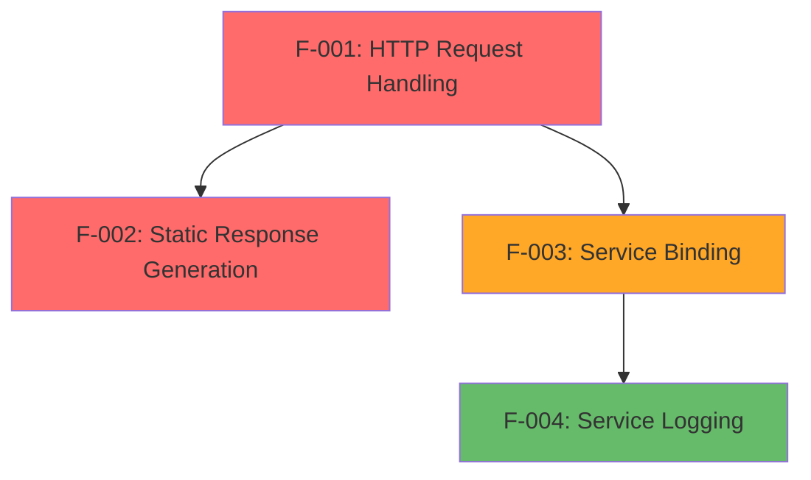
```mermaid
graph TD
    A[F-001: HTTP Request Handling] --> B[F-002: Static Response Generation]
    A --> C[F-003: Service Binding]
    C --> D[F-004: Service Logging]
    
    classDef critical fill:#ff6b6b
    classDef high fill:#ffa726
    classDef medium fill:#66bb6a
    
    class A,B critical
    class C high
    class D medium
```

### 2.3.2 Integration Points

| **Feature Pair** | **Integration Type** | **Description** |
|---|---|---|
| F-001 ↔ F-002 | Sequential | Request handling triggers response generation |
| F-001 ↔ F-003 | Dependent | Request handling requires successful binding |
| F-003 ↔ F-004 | Sequential | Logging occurs after successful binding |

### 2.3.3 Shared Components

| **Component** | **Used By Features** | **Purpose** |
|---|---|---|
| Node.js http module | F-001, F-002, F-003 | Core HTTP server functionality |
| Request handler function | F-001, F-002 | Processes requests and generates responses |
| Server instance | F-001, F-003, F-004 | Central server object for all operations |

### 2.3.4 Common Services

All features share the Node.js runtime environment and utilize only built-in modules, ensuring zero external service dependencies and maximum reliability for integration testing scenarios.

## 2.4 IMPLEMENTATION CONSIDERATIONS

### 2.4.1 HTTP Request Handling Implementation

#### Technical Constraints
- Must utilize only Node.js built-in http module
- No external HTTP framework dependencies allowed
- Single-threaded request processing model

#### Performance Requirements
- Handle concurrent requests within Node.js event loop capacity
- Maintain response time consistency across different request volumes
- No memory leaks from request handling

#### Scalability Considerations
- Limited to Node.js single-process capabilities
- No horizontal scaling requirements due to test harness purpose
- Designed for test environment load patterns only

#### Security Implications
- Localhost-only binding provides network-level security
- No authentication or authorization mechanisms implemented
- Relies on operating system-level access controls

#### Maintenance Requirements
- Zero external dependencies to maintain
- Minimal code complexity for easy debugging
- No configuration files or external resources to manage

### 2.4.2 Static Response Generation Implementation

#### Technical Constraints
- Response content must remain static and unchanging
- No dynamic content generation capabilities
- Fixed Content-Type header assignment

#### Performance Requirements
- Constant-time response generation regardless of request characteristics
- Minimal memory allocation for response creation
- No response caching necessary due to static nature

#### Security Implications
- No sensitive data exposure risk due to static content
- No injection vulnerabilities due to no dynamic processing
- Response content suitable for public testing scenarios

### 2.4.3 Service Binding Implementation

#### Technical Constraints
- Hard-coded localhost binding for security isolation
- Fixed port 3000 assignment for consistent test automation
- No configuration flexibility by design

#### Performance Requirements
- Sub-second startup time for rapid test cycle execution
- Immediate availability after successful binding
- Graceful failure handling for port conflicts

#### Security Implications
- Localhost-only access prevents external network exposure
- No SSL/TLS encryption required for test harness usage
- Firewall configuration must allow localhost port 3000

### 2.4.4 Service Logging Implementation

#### Technical Constraints
- Standard console output only for maximum compatibility
- No log file generation or external logging services
- Simple string formatting without logging frameworks

#### Performance Requirements
- Minimal performance impact from logging operations
- Synchronous logging acceptable for startup message
- No log rotation or management overhead

#### Maintenance Requirements
- No log file cleanup or rotation needed
- Console output parseable by test automation systems
- Consistent message format for programmatic detection

## 2.5 TRACEABILITY MATRIX

| **Feature** | **Business Need** | **Technical Requirement** | **Test Scenario** |
|---|---|---|---|
| F-001 | Reliable HTTP endpoint | Accept all HTTP methods and paths | Test automation can call any HTTP method |
| F-002 | Predictable test responses | Static "Hello, World!" response | Integration tests can assert exact response content |
| F-003 | Secure test environment | Localhost-only binding on port 3000 | Service accessible only from local machine |
| F-004 | Service discovery | Console startup notification | Test automation can detect service readiness |

#### References

- `README.md` - Project purpose documentation and backprop integration test context
- `server.js` - Complete HTTP server implementation with all feature functionality
- `package.json` - Project metadata, versioning, and npm configuration specifications
- `package-lock.json` - Dependency lockfile confirming zero external dependencies
- Technical Specification Section 1.1 - Executive summary and stakeholder requirements
- Technical Specification Section 1.2 - System overview and success criteria definitions
- Technical Specification Section 1.3 - Scope boundaries and implementation constraints

# 3. TECHNOLOGY STACK

## 3.1 PROGRAMMING LANGUAGES

### 3.1.1 Primary Language Selection

The hao-backprop-test project utilizes **JavaScript (Node.js)** as its sole programming language, representing a deliberate architectural decision aligned with the system's role as a minimal integration test harness.

#### Language Justification
- **Node.js Compatibility**: Leverages Node.js runtime's built-in HTTP capabilities without requiring external dependencies
- **Minimal Footprint**: JavaScript execution provides sub-second startup times, meeting the < 1 second performance requirement
- **Zero Compilation**: Direct script execution eliminates build complexity and potential failure points
- **Universal Availability**: Node.js runtime widely available across development and testing environments

#### Technical Constraints
- **Runtime Requirement**: Any Node.js version supporting the built-in `http` module
- **No Version Constraints**: No specific Node.js version dependencies documented, ensuring maximum compatibility
- **Single-threaded Model**: Utilizes Node.js event loop for concurrent request handling within single-process architecture

### 3.1.2 Language Implementation Details

The implementation leverages core JavaScript language features without ES6+ dependencies or transpilation requirements:
- **CommonJS Module System**: Uses `require()` syntax for importing Node.js built-in modules
- **Standard Function Declarations**: Traditional function syntax ensuring compatibility across Node.js versions
- **Basic HTTP Protocol Handling**: Direct interaction with Node.js HTTP APIs without abstraction layers

## 3.2 FRAMEWORKS & LIBRARIES

### 3.2.1 Framework Architecture Decision

The system implements a **zero-framework architecture** by explicit design decision, utilizing only Node.js built-in modules to maintain maximum simplicity and reliability for integration testing purposes.

#### Rationale for No-Framework Approach
- **Dependency Elimination**: Removes potential framework-related test failures and compatibility issues
- **Predictable Behavior**: Eliminates framework abstraction layers that could introduce unexpected behaviors
- **Minimal Attack Surface**: Reduces potential security vulnerabilities from external framework code
- **Maintenance Simplicity**: No framework version updates or compatibility management required

### 3.2.2 Built-in Module Utilization

#### Core HTTP Module
- **Module**: `http` (Node.js built-in)
- **Version**: Distributed with Node.js runtime
- **Usage**: Complete HTTP server implementation via `http.createServer()`
- **Justification**: Provides all necessary HTTP functionality without external dependencies

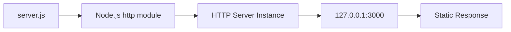
```mermaid
graph LR
    A[server.js] --> B[Node.js http module]
    B --> C[HTTP Server Instance]
    C --> D[127.0.0.1:3000]
    D --> E[Static Response]
```

#### Integration Requirements
- **Runtime Integration**: Direct integration with Node.js event loop
- **Network Stack Integration**: Binds to operating system network interface
- **Process Integration**: Single-process execution model

## 3.3 OPEN SOURCE DEPENDENCIES

### 3.3.1 Dependency Management Strategy

The project implements a **zero external dependency strategy**, as evidenced by the complete absence of dependency declarations in the package management configuration.

#### NPM Package Configuration
- **Package Name**: "hello_world"
- **Version**: 1.0.0
- **License**: MIT
- **Dependencies Section**: Intentionally absent
- **DevDependencies Section**: Intentionally absent

#### Lockfile Analysis
- **Lockfile Version**: 3 (indicating npm 7.x+ compatibility)
- **Package Registry**: Only contains root package reference
- **Dependency Tree**: Empty - no external packages resolved
- **Security Profile**: Zero external dependency attack surface

### 3.3.2 Dependency Rationale

#### Strategic Benefits
- **Test Reliability**: Eliminates dependency-related test failures and version conflicts
- **Deployment Simplicity**: No `npm install` or dependency resolution required
- **Resource Efficiency**: Minimal disk space and memory footprint
- **Security Posture**: No third-party code execution or potential vulnerabilities

#### Operational Implications
- **No Vulnerability Scanning**: No external dependencies to monitor for security updates
- **No License Compliance**: Only MIT license from root package
- **No Version Management**: No dependency version conflicts or update cycles

## 3.4 DEVELOPMENT & DEPLOYMENT

### 3.4.1 Development Environment

#### Runtime Requirements
- **Node.js Runtime**: Any version supporting built-in `http` module
- **Operating System**: Cross-platform compatibility (Windows, macOS, Linux)
- **Network Access**: Localhost port 3000 availability required
- **File System**: Read access to `server.js` file

#### Development Tools
- **Package Manager**: NPM (Node Package Manager)
  - Used for: Project metadata management only
  - No dependency installation required
- **Version Control**: Git-compatible project structure
- **Code Editor**: Any text editor or IDE supporting JavaScript syntax

### 3.4.2 Build System

#### No-Build Architecture
The system implements a **zero-build approach** aligned with its minimal design philosophy:
- **No Compilation Step**: Direct JavaScript execution without transpilation
- **No Bundling**: Single file deployment model
- **No Asset Processing**: No static assets or resources to process
- **No Minification**: Source code optimization unnecessary for test harness

#### Execution Model
- **Direct Execution**: `node server.js` command launches complete application
- **Instant Startup**: No build or compilation delay
- **Development Efficiency**: Immediate code changes reflection

### 3.4.3 Deployment Architecture

#### Local Deployment Model
- **Target Environment**: Local development and test environments only
- **Network Binding**: 127.0.0.1 (localhost) exclusive binding
- **Port Configuration**: Hardcoded port 3000 assignment
- **Process Management**: Single Node.js process execution

#### Deployment Requirements
- **Infrastructure**: Minimal - single host with Node.js runtime
- **Configuration**: Zero configuration files or environment variables
- **Dependencies**: Self-contained single-file deployment
- **Monitoring**: Console output logging only

#### Testing Infrastructure
- **Test Framework**: None implemented (by design)
- **Test Scripts**: Placeholder NPM test script with error message
- **Quality Assurance**: Manual verification of HTTP response behavior
- **Integration Testing**: Serves as target for external integration tests

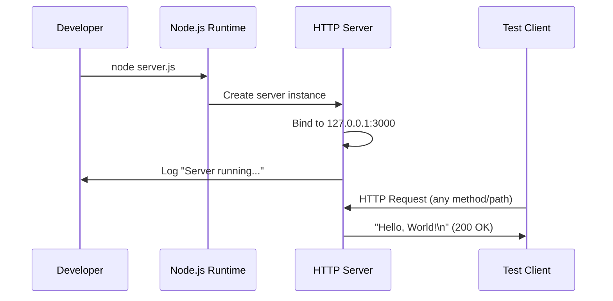
```mermaid
sequenceDiagram
    participant Dev as Developer
    participant Node as Node.js Runtime
    participant HTTP as HTTP Server
    participant Client as Test Client
    
    Dev->>Node: node server.js
    Node->>HTTP: Create server instance
    HTTP->>HTTP: Bind to 127.0.0.1:3000
    HTTP->>Dev: Log "Server running..."
    Client->>HTTP: HTTP Request (any method/path)
    HTTP->>Client: "Hello, World!\n" (200 OK)
```

## 3.5 SYSTEM INTEGRATION ARCHITECTURE

### 3.5.1 Integration Patterns

#### Backprop Testing Integration
- **Role**: Baseline integration test target
- **Protocol**: HTTP/1.1 over localhost
- **Response Contract**: Guaranteed "Hello, World!" response for all requests
- **Integration Method**: Direct HTTP client connection

#### Test Automation Compatibility
- **Framework Agnostic**: Compatible with any HTTP testing framework
- **Request Handling**: Accepts all HTTP methods (GET, POST, PUT, DELETE, etc.)
- **Path Handling**: All request paths return identical response
- **State Management**: Stateless operation ensures predictable test conditions

### 3.5.2 Technology Stack Rationale

The minimal technology stack serves the specific requirements of a baseline integration test harness:

#### Design Principles
- **Simplicity First**: Minimum viable technology choices to reduce complexity
- **Predictability**: Consistent behavior across all deployment scenarios
- **Reliability**: Zero external failure points through dependency elimination
- **Performance**: Sub-second startup and < 50MB memory footprint targets

#### Success Metrics Alignment
- **Response Reliability**: 100% HTTP 200 response rate achieved through simple static response
- **Startup Performance**: < 1 second target met through zero-dependency architecture
- **Resource Consumption**: < 50MB target achieved through minimal Node.js footprint

#### References

#### Repository Files Analyzed
- `server.js` - Complete HTTP server implementation using Node.js built-in modules
- `package.json` - NPM configuration confirming zero external dependencies
- `package-lock.json` - NPM lockfile version 3 confirming no external package resolution
- `README.md` - Project description confirming backprop integration test purpose

#### Technical Specification Sections Referenced
- Section 1.1 Executive Summary - Project overview and business context
- Section 1.2 System Overview - Architecture decisions and success criteria  
- Section 1.3 Scope - Technical requirements and intentional limitations
- Section 2.4 Implementation Considerations - Technical constraints and performance requirements

# 4. PROCESS FLOWCHART

## 4.1 SYSTEM WORKFLOWS

### 4.1.1 Core Business Processes

The system implements a streamlined HTTP service architecture designed specifically for integration testing scenarios. The core business process centers on providing a predictable, stateless HTTP endpoint that serves as a baseline target for backprop system validation and test automation frameworks.

#### End-to-End User Journey

The primary user journey follows a simplified request-response pattern optimized for testing reliability:

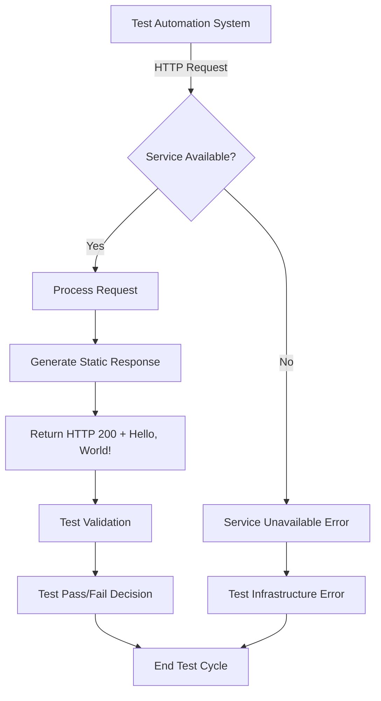
```mermaid
flowchart TD
A[Test Automation System] -->|HTTP Request| B{Service Available?}
B -->|Yes| C[Process Request]
B -->|No| D[Service Unavailable Error]
C --> E[Generate Static Response]
E --> F["Return HTTP 200 + Hello, World!"]
F --> G[Test Validation]
G --> H[Test Pass/Fail Decision]
H --> I[End Test Cycle]
D --> J[Test Infrastructure Error]
J --> I
```

#### System Interaction Points

Based on the traceability matrix from the technical specification, the system maintains four critical interaction touchpoints:

- **F-001**: HTTP Request Acceptance - Universal method and path handling
- **F-002**: Response Generation - Static content delivery with consistent formatting
- **F-003**: Network Binding - Localhost-only security boundary enforcement  
- **F-004**: Service Discovery - Console-based startup notification for automation

### 4.1.2 Integration Workflows

#### Test Automation Integration Pattern

The service functions as a passive integration target within larger test automation ecosystems:

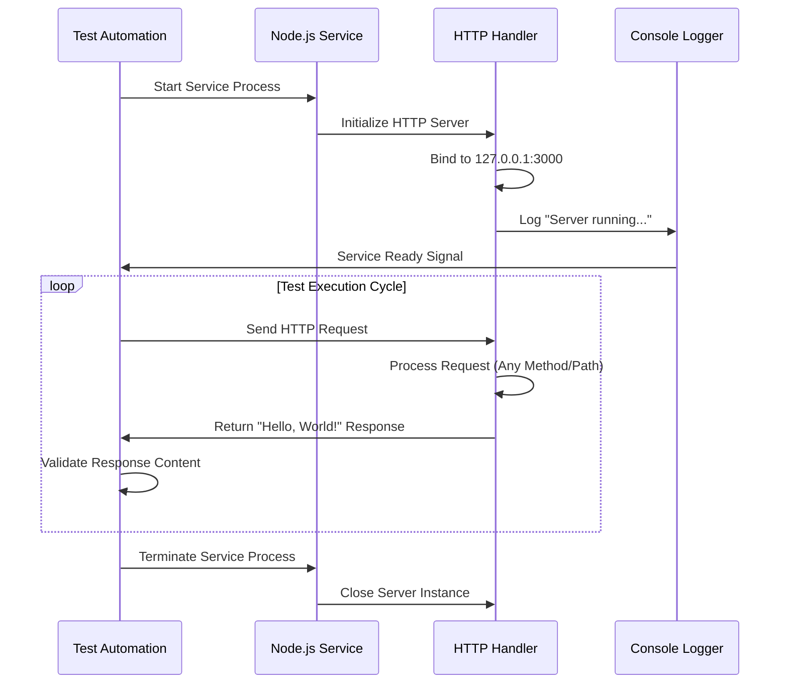
```mermaid
sequenceDiagram
    participant TA as Test Automation
    participant NS as Node.js Service
    participant HTTP as HTTP Handler
    participant Console as Console Logger
    
    TA->>NS: Start Service Process
    NS->>HTTP: Initialize HTTP Server
    HTTP->>HTTP: Bind to 127.0.0.1:3000
    HTTP->>Console: Log "Server running..."
    Console->>TA: Service Ready Signal
    
    loop Test Execution Cycle
        TA->>HTTP: Send HTTP Request
        HTTP->>HTTP: Process Request (Any Method/Path)
        HTTP->>TA: Return "Hello, World!" Response
        TA->>TA: Validate Response Content
    end
    
    TA->>NS: Terminate Service Process
    NS->>HTTP: Close Server Instance
```

#### Backprop System Integration Flow

The service serves as a controlled baseline within the backprop testing ecosystem, providing deterministic behavior for integration validation:

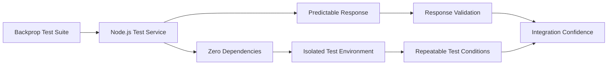
```mermaid
flowchart LR
    A[Backprop Test Suite] --> B[Node.js Test Service]
    B --> C[Predictable Response]
    C --> D[Response Validation]
    D --> E[Integration Confidence]
    
    B --> F[Zero Dependencies]
    F --> G[Isolated Test Environment]
    G --> H[Repeatable Test Conditions]
    H --> E
```

## 4.2 DETAILED PROCESS FLOWS

### 4.2.1 Service Startup Process

The service initialization follows a sequential bootstrap pattern with specific timing and success criteria:

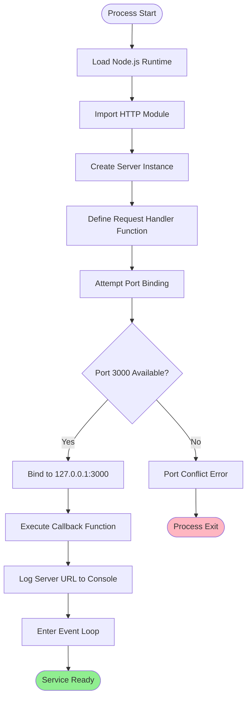
```mermaid
flowchart TD
    START([Process Start]) --> A[Load Node.js Runtime]
    A --> B[Import HTTP Module]
    B --> C[Create Server Instance]
    C --> D[Define Request Handler Function]
    D --> E[Attempt Port Binding]
    
    E --> F{Port 3000 Available?}
    F -->|Yes| G[Bind to 127.0.0.1:3000]
    F -->|No| H[Port Conflict Error]
    
    G --> I[Execute Callback Function]
    I --> J[Log Server URL to Console]
    J --> K[Enter Event Loop]
    K --> READY([Service Ready])
    
    H --> FAIL([Process Exit])
    
    style READY fill:#90EE90
    style FAIL fill:#FFB6C1
```

#### Startup Validation Rules

- **Timing Constraint**: Service startup must complete within 1 second
- **Memory Limit**: Target memory footprint below 50MB during initialization
- **Port Availability**: Port 3000 must be available on localhost interface
- **Console Output**: Successful startup must produce server URL log message

### 4.2.2 HTTP Request Processing

The core request processing implements a stateless, universal response pattern:

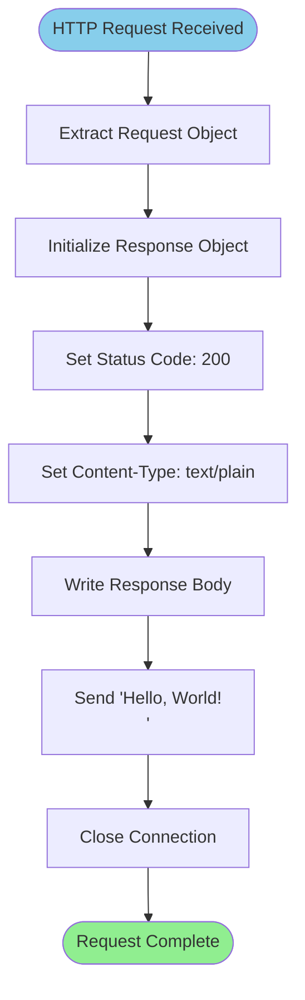
```mermaid
flowchart TD
    REQ([HTTP Request Received]) --> A[Extract Request Object]
    A --> B[Initialize Response Object]
    B --> C[Set Status Code: 200]
    C --> D[Set Content-Type: text/plain]
    D --> E[Write Response Body]
    E --> F[Send 'Hello, World!\n']
    F --> G[Close Connection]
    G --> END([Request Complete])
    
    style REQ fill:#87CEEB
    style END fill:#90EE90
```

#### Request Processing Characteristics

- **Method Agnostic**: Accepts GET, POST, PUT, DELETE, PATCH, OPTIONS uniformly
- **Path Agnostic**: All URL paths receive identical response treatment
- **No Validation**: Zero request parsing, validation, or authentication
- **Performance Target**: Sub-10ms response time for optimal test execution
- **Response Consistency**: Identical response format regardless of input variation

### 4.2.3 Error Handling and Recovery

The system implements minimal error handling by design to maintain test predictability:

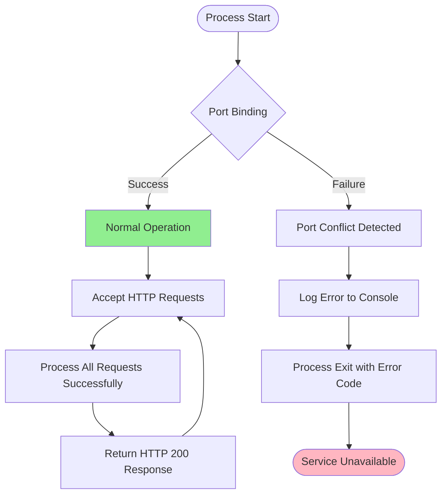
```mermaid
flowchart TD
    START([Process Start]) --> A{Port Binding}
    A -->|Success| B[Normal Operation]
    A -->|Failure| C[Port Conflict Detected]
    
    B --> D[Accept HTTP Requests]
    D --> E[Process All Requests Successfully]
    E --> F[Return HTTP 200 Response]
    F --> D
    
    C --> G[Log Error to Console]
    G --> H[Process Exit with Error Code]
    H --> FAIL([Service Unavailable])
    
    style B fill:#90EE90
    style FAIL fill:#FFB6C1
```

#### Error Handling Philosophy

The service intentionally avoids complex error handling to serve its role as a test baseline:

- **No Retry Logic**: Port conflicts result in immediate process termination
- **No Request Validation**: Malformed requests still receive HTTP 200 responses
- **No Error Recovery**: Service restart required for any failure condition
- **Predictable Failure**: Error conditions produce consistent, testable outcomes

## 4.3 INTEGRATION PATTERNS

### 4.3.1 Test Automation Integration

The service integrates with test automation frameworks through a standardized discovery and validation pattern:

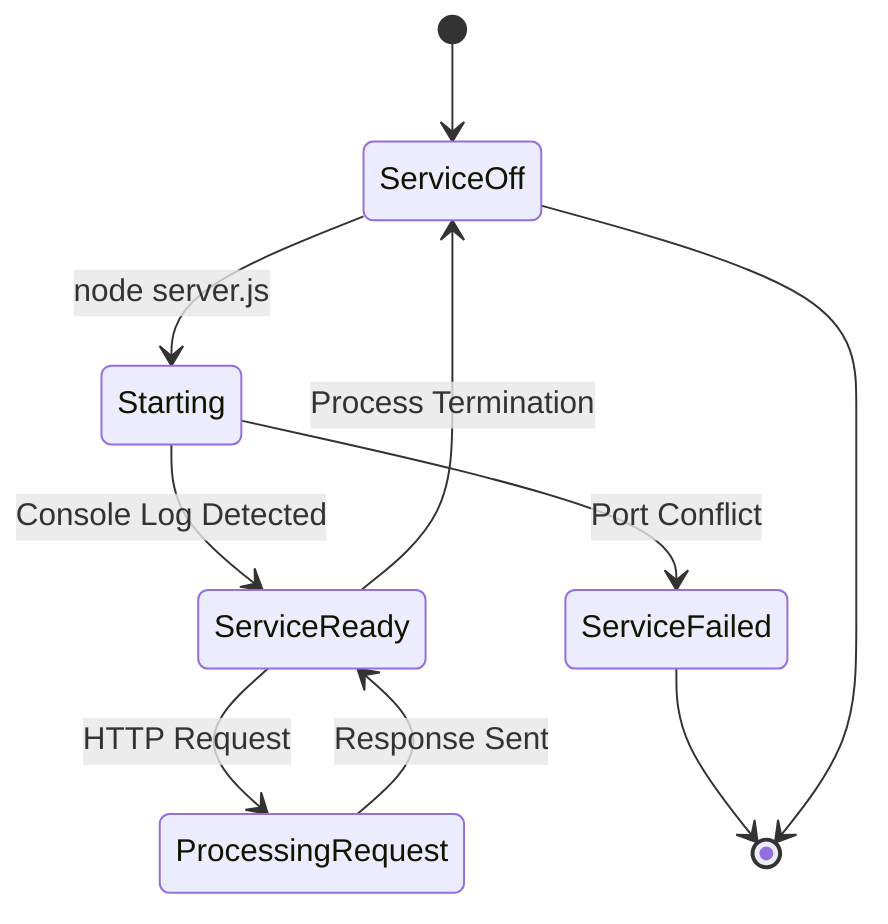
```mermaid
stateDiagram-v2
    [*] --> ServiceOff
    ServiceOff --> Starting : node server.js
    Starting --> ServiceReady : Console Log Detected
    Starting --> ServiceFailed : Port Conflict
    ServiceReady --> ProcessingRequest : HTTP Request
    ProcessingRequest --> ServiceReady : Response Sent
    ServiceReady --> ServiceOff : Process Termination
    ServiceFailed --> [*]
    ServiceOff --> [*]
```

#### Integration Validation Points

Test automation systems validate service behavior through four critical checkpoints:

1. **Service Availability**: Console output parsing confirms service readiness
2. **Response Consistency**: HTTP 200 status code validation for all requests
3. **Content Verification**: Exact string match for "Hello, World!\n" response body
4. **Header Validation**: Content-Type verification as "text/plain"

### 4.3.2 State Management Flows

The service implements a stateless architecture with no persistence or session management:

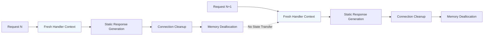
```mermaid
flowchart LR
    A[Request N] --> B[Fresh Handler Context]
    B --> C[Static Response Generation]
    C --> D[Connection Cleanup]
    D --> E[Memory Deallocation]
    
    F[Request N+1] --> G[Fresh Handler Context]
    G --> H[Static Response Generation]
    H --> I[Connection Cleanup]
    I --> J[Memory Deallocation]
    
    E -.->|No State Transfer| G
    
    style B fill:#F0F8FF
    style G fill:#F0F8FF
```

#### Stateless Design Benefits

- **Test Isolation**: Each request processed independently without side effects
- **Predictable Behavior**: No state accumulation affects subsequent requests
- **Memory Efficiency**: No session data storage or cleanup requirements
- **Concurrent Safety**: Multiple simultaneous requests processed without conflicts

## 4.4 TECHNICAL IMPLEMENTATION FLOWS

### 4.4.1 Node.js Event Loop Processing

The service leverages Node.js event-driven architecture for efficient request handling:

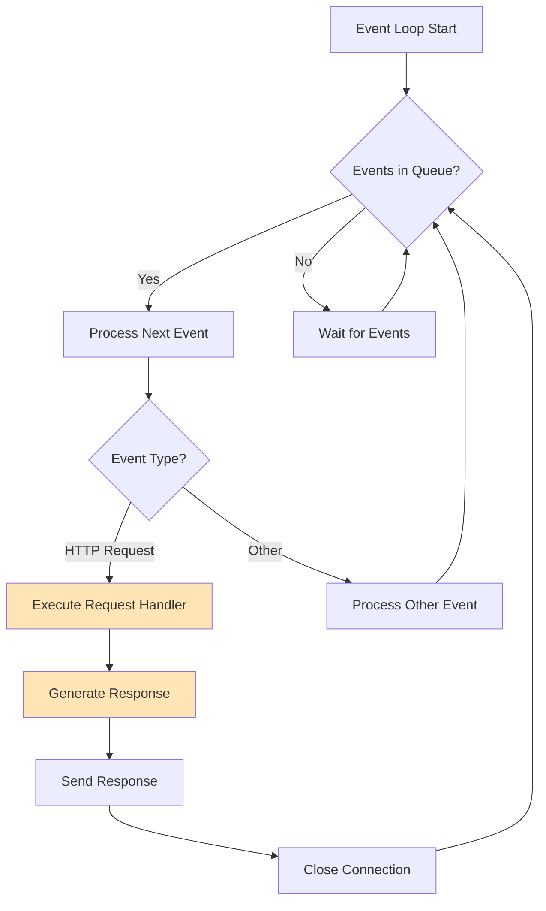
```mermaid
flowchart TD
    A[Event Loop Start] --> B{Events in Queue?}
    B -->|Yes| C[Process Next Event]
    B -->|No| D[Wait for Events]
    
    C --> E{Event Type?}
    E -->|HTTP Request| F[Execute Request Handler]
    E -->|Other| G[Process Other Event]
    
    F --> H[Generate Response]
    H --> I[Send Response]
    I --> J[Close Connection]
    J --> B
    
    G --> B
    D --> B
    
    style F fill:#FFE4B5
    style H fill:#FFE4B5
```

#### Event Loop Characteristics

- **Single-Threaded**: All request processing occurs within main event loop
- **Non-Blocking I/O**: HTTP operations handled asynchronously
- **Concurrent Handling**: Multiple requests processed concurrently within loop capacity
- **Resource Efficient**: Minimal overhead due to stateless operation model

### 4.4.2 Resource Management Cycles

The service maintains minimal resource footprint through efficient lifecycle management:

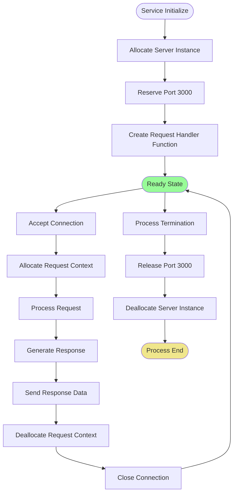
```mermaid
flowchart TD
    INIT([Service Initialize]) --> A[Allocate Server Instance]
    A --> B[Reserve Port 3000]
    B --> C[Create Request Handler Function]
    C --> READY([Ready State])
    
    READY --> D[Accept Connection]
    D --> E[Allocate Request Context]
    E --> F[Process Request]
    F --> G[Generate Response]
    G --> H[Send Response Data]
    H --> I[Deallocate Request Context]
    I --> J[Close Connection]
    J --> READY
    
    READY --> TERM[Process Termination]
    TERM --> K[Release Port 3000]
    K --> L[Deallocate Server Instance]
    L --> END([Process End])
    
    style READY fill:#98FB98
    style END fill:#F0E68C
```

#### Resource Management Principles

- **Minimal Allocation**: Only essential resources allocated during startup
- **Immediate Cleanup**: Request contexts deallocated immediately after response
- **No Persistent Storage**: Zero database connections or file handles maintained
- **Efficient Termination**: Clean resource release during process shutdown

## 4.5 WORKFLOW TIMING AND SLA CONSIDERATIONS

### 4.5.1 Performance Benchmarks

The service maintains strict performance criteria to support high-frequency test execution:

- **Startup Time**: Complete initialization within 1000ms
- **Response Time**: HTTP request processing under 10ms average
- **Memory Usage**: Peak memory consumption below 50MB
- **Concurrent Capacity**: Support for typical test automation request volumes

### 4.5.2 Integration SLA Requirements

Based on the technical specification requirements, the service provides the following service level commitments:

- **Availability**: 100% uptime during test execution windows
- **Response Consistency**: Zero variation in response content or headers
- **Error Predictability**: Consistent failure modes for test automation handling
- **Resource Stability**: Predictable resource usage patterns for test environment planning

#### References

#### Repository Files Examined
- `server.js` - Core HTTP server implementation with complete request handling logic
- `package.json` - NPM configuration and project metadata
- `package-lock.json` - Dependency lockfile confirming zero external dependencies
- `README.md` - Project purpose documentation and integration context

#### Technical Specification Sections Referenced
- `1.1 EXECUTIVE SUMMARY` - Project overview and stakeholder requirements
- `1.2 SYSTEM OVERVIEW` - System capabilities and success criteria
- `1.3 SCOPE` - Implementation boundaries and excluded functionality
- `2.1 FEATURE CATALOG` - Detailed feature descriptions and dependencies
- `2.2 FUNCTIONAL REQUIREMENTS TABLE` - Complete functional requirements specification
- `2.3 FEATURE RELATIONSHIPS` - Feature dependency mapping and relationships
- `2.4 IMPLEMENTATION CONSIDERATIONS` - Technical constraints and requirements
- `2.5 TRACEABILITY MATRIX` - Feature-to-requirement mapping and test scenarios
- `3.5 SYSTEM INTEGRATION ARCHITECTURE` - Integration patterns and architectural context

# 5. SYSTEM ARCHITECTURE

## 5.1 HIGH-LEVEL ARCHITECTURE

### 5.1.1 System Overview

The hao-backprop-test system implements a **Monolithic Single-Component Architecture** designed specifically as an integration test harness for backprop system validation. This architecture prioritizes **simplicity, predictability, and reliability** over traditional enterprise architecture concerns.

#### Overall System Architecture Style and Rationale

The system follows a **Zero-Dependency Monolithic Pattern** with the following characteristics:
- **Single-file implementation** containing all functionality in `server.js` (14 lines of code)
- **Event-driven processing model** leveraging Node.js event loop for concurrent request handling
- **Stateless service pattern** with no persistent data or session management
- **Localhost-only deployment** ensuring security isolation for test environments

This architectural approach is intentionally minimal to eliminate variables that could interfere with integration testing scenarios. The design philosophy prioritizes **test reliability** over feature richness, making it an ideal baseline service for validation workflows.

#### Key Architectural Principles and Patterns

1. **Minimal Viable Architecture**: Every component serves a single, well-defined purpose
2. **Zero External Dependencies**: Eliminates potential failure points from third-party integrations
3. **Predictable Behavior**: Identical responses regardless of request characteristics
4. **Fail-Fast Design**: Immediate termination on any configuration conflicts
5. **Local Security Model**: Network-level isolation through localhost-only binding

#### System Boundaries and Major Interfaces

- **Primary Interface**: HTTP/1.1 endpoint on localhost:3000
- **Input Boundary**: Accepts all HTTP methods and paths without discrimination
- **Output Boundary**: Returns static "Hello, World!\n" response with HTTP 200 status
- **Integration Boundary**: Serves as target endpoint for backprop testing infrastructure
- **Security Boundary**: Localhost network interface provides access control

### 5.1.2 Core Components Table

| Component Name | Primary Responsibility | Key Dependencies | Integration Points | Critical Considerations |
|---|---|---|---|---|
| HTTP Server Module | Handle all HTTP requests and generate responses | Node.js built-in `http` module | Backprop test clients via HTTP/1.1 | Must maintain 100% response reliability |
| Request Handler | Process incoming requests uniformly | Server module, response generation | Integration test frameworks | Zero request validation for predictability |
| Service Bootstrap | Initialize server and bind to localhost:3000 | Node.js runtime, port availability | Console output for test automation | Fail-fast on port conflicts |

### 5.1.3 Data Flow Description

#### Primary Data Flows Between Components

The system implements a **linear request-response flow** with no data persistence or caching layers:

1. **Inbound Request Flow**: HTTP requests enter through the localhost:3000 endpoint and are immediately processed by the universal request handler
2. **Response Generation Flow**: All requests trigger identical response generation, returning "Hello, World!\n" with HTTP 200 status
3. **Service Discovery Flow**: Startup process logs server URL to console, enabling programmatic service detection by test automation

#### Integration Patterns and Protocols

- **Protocol**: HTTP/1.1 over localhost TCP connection
- **Message Format**: Standard HTTP request/response with text/plain content type
- **Integration Method**: Direct HTTP client connections from test frameworks
- **Service Contract**: Guaranteed static response for all request variations

#### Data Transformation Points

The system performs minimal data transformation:
- **Request Processing**: HTTP requests are accepted but content is not parsed or validated
- **Response Generation**: Static string "Hello, World!\n" is wrapped in HTTP 200 response envelope
- **Content Type Setting**: All responses include "text/plain" Content-Type header

#### Key Data Stores and Caches

**Intentionally Omitted**: The system implements no persistent storage, caching mechanisms, or data retention to maintain test environment predictability.

### 5.1.4 External Integration Points

| System Name | Integration Type | Data Exchange Pattern | Protocol/Format | SLA Requirements |
|---|---|---|---|---|
| Backprop Test Infrastructure | HTTP Target Service | Request/Response | HTTP/1.1, text/plain | 100% availability during tests |
| Test Automation Frameworks | HTTP Client Integration | Static Response Validation | HTTP/1.1 | < 10ms response time |
| Console Output Parsers | Log Message Integration | Service Discovery | Plain text stdout | Immediate startup notification |

## 5.2 COMPONENT DETAILS

### 5.2.1 HTTP Server Module

#### Purpose and Responsibilities

The HTTP Server Module serves as the complete application logic, handling:
- HTTP server instance creation and management
- Localhost port binding and network listener establishment  
- Universal request handling for all HTTP methods and paths
- Static response generation with appropriate headers
- Service lifecycle management and graceful shutdown capability

#### Technologies and Frameworks Used

- **Runtime Environment**: Node.js (any compatible version)
- **HTTP Implementation**: Node.js built-in `http` module
- **Network Binding**: Native TCP socket binding to 127.0.0.1:3000
- **Response Generation**: Plain JavaScript string manipulation
- **Process Management**: Node.js process and event loop management

#### Key Interfaces and APIs

**Primary HTTP Interface**:
- **Endpoint**: `http://127.0.0.1:3000/*` (accepts all paths)
- **Methods**: All HTTP methods (GET, POST, PUT, DELETE, PATCH, OPTIONS, HEAD)
- **Request Headers**: Accepted but ignored for processing
- **Response Format**: HTTP 200 with "Hello, World!\n" and Content-Type: text/plain

**Console Interface**:
- **Startup Notification**: Logs server URL upon successful binding
- **Error Reporting**: Reports port conflicts to stderr before termination

#### Data Persistence Requirements

**Explicitly None**: The system implements no data persistence mechanisms by design. This ensures:
- Complete test isolation between execution cycles
- Predictable initial state for every test run
- No cleanup requirements between test sessions

#### Scaling Considerations

The system is **intentionally non-scalable** for testing purposes:
- **Vertical Scaling**: Limited to single Node.js process capabilities
- **Horizontal Scaling**: Not supported due to localhost-only binding
- **Performance Bounds**: Designed for test load patterns, not production volumes
- **Resource Limits**: Target memory footprint below 50MB

### 5.2.2 Component Interaction Diagrams

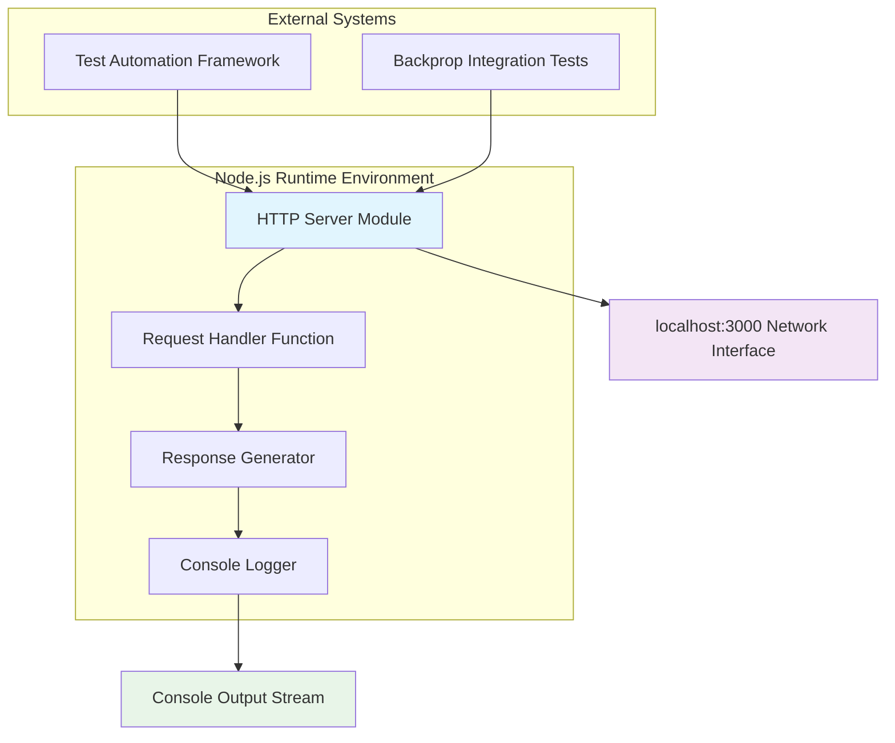
```mermaid
graph TB
    subgraph "Node.js Runtime Environment"
        A[HTTP Server Module] --> B[Request Handler Function]
        B --> C[Response Generator]
        C --> D[Console Logger]
    end
    
    subgraph "External Systems"
        E[Test Automation Framework] --> A
        F[Backprop Integration Tests] --> A
    end
    
    A --> G[localhost:3000 Network Interface]
    D --> H[Console Output Stream]
    
    style A fill:#e1f5fe
    style G fill:#f3e5f5
    style H fill:#e8f5e8
```

### 5.2.3 State Transition Diagrams

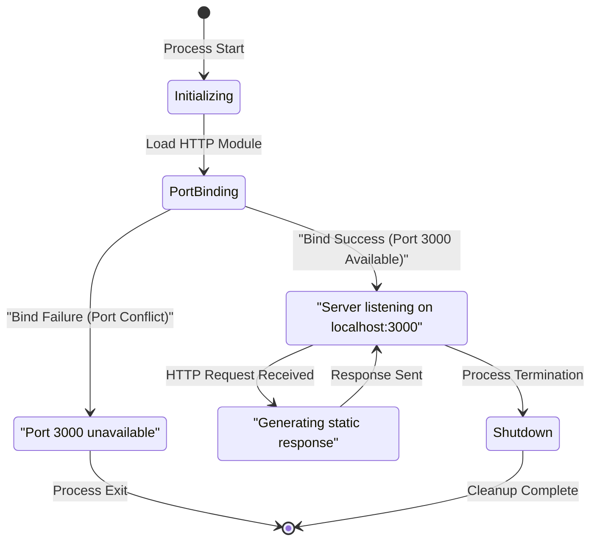
```mermaid
stateDiagram-v2
[*] --> Initializing : Process Start
Initializing --> PortBinding : Load HTTP Module
PortBinding --> Ready : "Bind Success (Port 3000 Available)"
PortBinding --> Failed : "Bind Failure (Port Conflict)"
Ready --> ProcessingRequest : HTTP Request Received
ProcessingRequest --> Ready : Response Sent
Ready --> Shutdown : Process Termination
Failed --> [*] : Process Exit
Shutdown --> [*] : Cleanup Complete

Ready : "Server listening on localhost:3000"
ProcessingRequest : "Generating static response"
Failed : "Port 3000 unavailable"
```

### 5.2.4 Sequence Diagrams for Key Flows

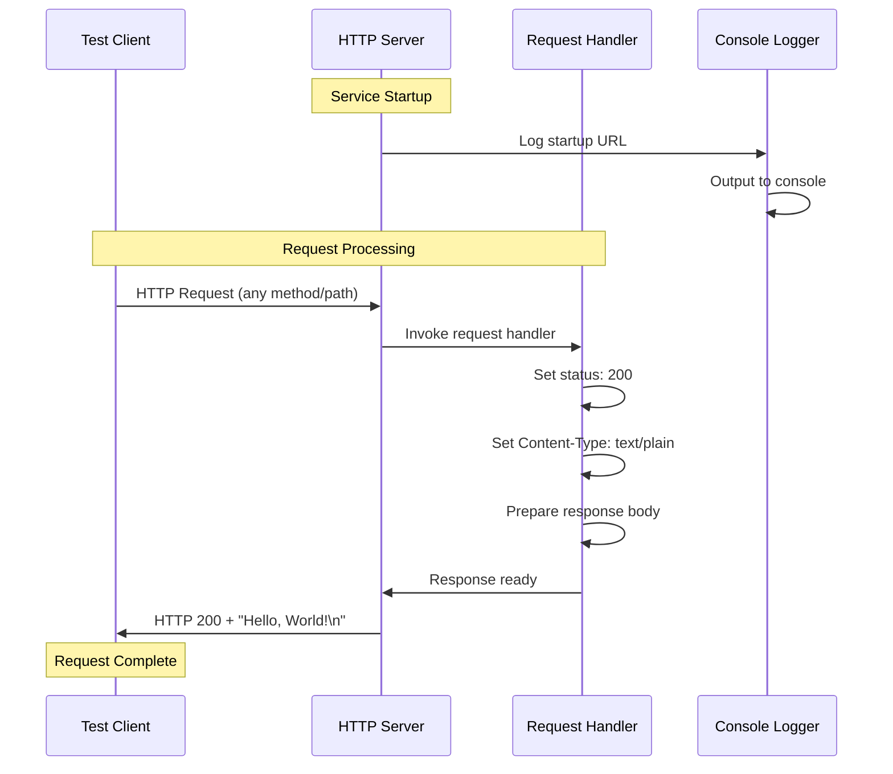
```mermaid
sequenceDiagram
    participant Client as Test Client
    participant Server as HTTP Server
    participant Handler as Request Handler
    participant Logger as Console Logger
    
    Note over Server: Service Startup
    Server->>Logger: Log startup URL
    Logger->>Logger: Output to console
    
    Note over Client,Handler: Request Processing
    Client->>Server: HTTP Request (any method/path)
    Server->>Handler: Invoke request handler
    Handler->>Handler: Set status: 200
    Handler->>Handler: Set Content-Type: text/plain
    Handler->>Handler: Prepare response body
    Handler->>Server: Response ready
    Server->>Client: HTTP 200 + "Hello, World!\n"
    
    Note over Client: Request Complete
```

## 5.3 TECHNICAL DECISIONS

### 5.3.1 Architecture Style Decisions and Tradeoffs

#### Zero-Dependency Architecture Decision

**Decision**: Implement complete functionality using only Node.js built-in modules

**Rationale**: 
- Eliminates external dependency failure points during integration testing
- Ensures consistent behavior across different Node.js environments  
- Reduces security attack surface through minimal external code
- Enables instant deployment without dependency resolution

**Tradeoffs**:
- **Benefits**: Maximum reliability, zero dependency management overhead, immediate startup
- **Limitations**: No advanced HTTP features, minimal error handling capabilities, basic logging only

#### Monolithic Single-File Architecture Decision

**Decision**: Implement entire system in a single `server.js` file

**Rationale**:
- Minimizes complexity for integration test scenarios
- Enables complete system understanding in under 15 lines of code
- Eliminates module loading and dependency injection complexity
- Facilitates rapid debugging and modification during testing

**Tradeoffs**:
- **Benefits**: Ultimate simplicity, zero configuration, immediate comprehension
- **Limitations**: No modularity, no separation of concerns, no extensibility

### 5.3.2 Communication Pattern Choices

#### Universal Request Handler Pattern

**Decision**: Process all HTTP methods and paths identically

**Rationale**:
- Provides completely predictable behavior for test automation
- Eliminates routing complexity that could introduce failure modes
- Ensures test scenarios receive consistent baseline responses
- Simplifies client integration code for testing frameworks

**Tradeoffs**:
- **Benefits**: 100% predictable responses, zero routing failures, simple client logic
- **Limitations**: No REST API capabilities, no request differentiation, no dynamic responses

### 5.3.3 Data Storage Solution Rationale

#### No Persistence Architecture Decision

**Decision**: Implement zero data persistence or state management

**Rationale**:
- Ensures complete test isolation between execution cycles
- Eliminates database connectivity as potential failure point
- Provides predictable initial state for every test run
- Removes data cleanup requirements from test automation

**Tradeoffs**:
- **Benefits**: Perfect test isolation, zero data management overhead, predictable state
- **Limitations**: No data retention, no session support, no dynamic behavior

### 5.3.4 Security Mechanism Selection

#### Localhost-Only Binding Decision

**Decision**: Hard-code server binding to 127.0.0.1 interface only

**Rationale**:
- Provides network-level security isolation for test environments
- Prevents accidental external exposure of test services
- Eliminates need for authentication/authorization mechanisms
- Relies on operating system access controls for security

**Tradeoffs**:
- **Benefits**: Network-level security, no authentication complexity, OS-level protection
- **Limitations**: No remote access capability, single-host deployment only

### 5.3.5 Architecture Decision Record

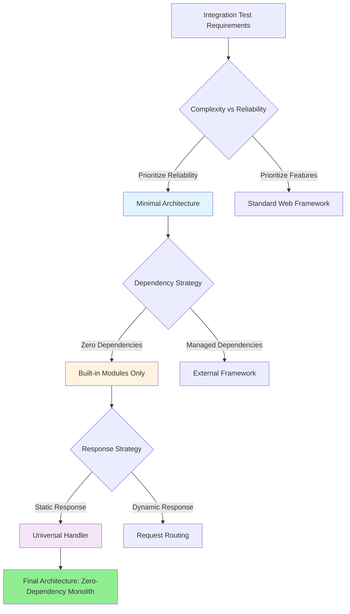
```mermaid
graph TD
    A[Integration Test Requirements] --> B{Complexity vs Reliability}
    B -->|Prioritize Reliability| C[Minimal Architecture]
    B -->|Prioritize Features| D[Standard Web Framework]
    
    C --> E{Dependency Strategy}
    E -->|Zero Dependencies| F[Built-in Modules Only]
    E -->|Managed Dependencies| G[External Framework]
    
    F --> H{Response Strategy}
    H -->|Static Response| I[Universal Handler]
    H -->|Dynamic Response| J[Request Routing]
    
    I --> K[Final Architecture: Zero-Dependency Monolith]
    
    style K fill:#90EE90
    style C fill:#e1f5fe
    style F fill:#fff3e0
    style I fill:#f3e5f5
```

## 5.4 CROSS-CUTTING CONCERNS

### 5.4.1 Monitoring and Observability Approach

#### System Health Monitoring

The system implements **minimal monitoring** aligned with its test harness purpose:
- **Availability Detection**: Console log output enables programmatic service discovery
- **Health Verification**: HTTP response success rate serves as primary health metric
- **Performance Monitoring**: Response time measurement through client-side instrumentation
- **Resource Usage**: Operating system tools provide memory and CPU utilization data

#### Observability Strategy

**Intentionally Limited Observability**:
- No application performance monitoring (APM) integration
- No distributed tracing capabilities
- No custom metrics collection or reporting
- Console output provides only startup notification and error reporting

This approach ensures the monitoring infrastructure doesn't interfere with integration test scenarios while providing sufficient information for test automation frameworks.

### 5.4.2 Logging and Tracing Strategy

#### Logging Implementation

| Log Type | Implementation | Purpose | Format |
|---|---|---|---|
| Startup Notification | Console.log to stdout | Service discovery for automation | "Server running at http://127.0.0.1:3000/" |
| Error Reporting | Console.error to stderr | Port conflict notification | Node.js standard error format |
| Request Logging | Not implemented | Avoids test interference | N/A |

#### Trace Management

**No Distributed Tracing**: The single-component architecture and localhost-only deployment eliminate the need for distributed tracing capabilities. Request processing occurs entirely within the Node.js event loop without external service calls.

### 5.4.3 Error Handling Patterns

#### Failure Mode Strategy

The system implements a **fail-fast error handling pattern** optimized for test predictability:

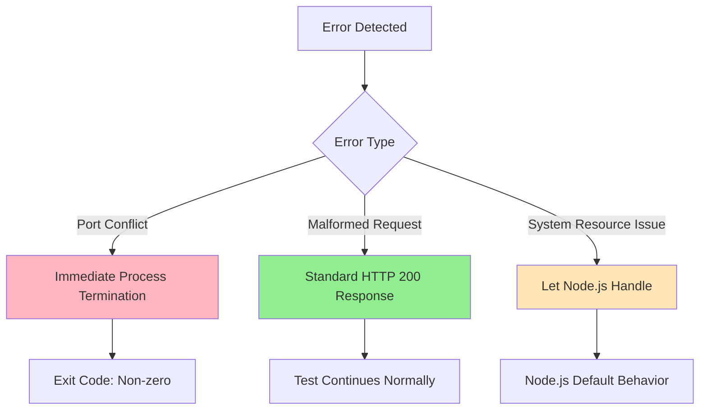
```mermaid
graph TD
    A[Error Detected] --> B{Error Type}
    B -->|Port Conflict| C[Immediate Process Termination]
    B -->|Malformed Request| D[Standard HTTP 200 Response]
    B -->|System Resource Issue| E[Let Node.js Handle]
    
    C --> F[Exit Code: Non-zero]
    D --> G[Test Continues Normally]
    E --> H[Node.js Default Behavior]
    
    style C fill:#FFB6C1
    style D fill:#90EE90
    style E fill:#FFE4B5
```

#### Error Recovery Philosophy

**No Error Recovery Mechanisms**: The system intentionally avoids complex error recovery to maintain predictable test conditions:
- Port conflicts result in immediate termination requiring manual restart
- Malformed requests receive standard HTTP 200 responses to maintain test flow
- System resource issues rely on Node.js runtime handling
- No retry logic or circuit breaker patterns implemented

### 5.4.4 Authentication and Authorization Framework

#### Security Model

**No Authentication/Authorization**: The system implements no security mechanisms by design:
- **Network Security**: Localhost-only binding provides access control
- **Operating System Security**: Relies on OS-level user and process permissions  
- **No Credential Management**: Zero credential storage or validation requirements
- **Test Environment Appropriate**: Security model suitable for isolated test scenarios

### 5.4.5 Performance Requirements and SLAs

#### Service Level Agreements

| Metric | Target | Measurement Method | Business Justification |
|---|---|---|---|
| Response Time | < 10ms average | Client-side timing | Test execution efficiency |
| Startup Time | < 1 second | Process timing | Rapid test cycle enablement |
| Memory Usage | < 50MB peak | OS monitoring tools | Resource efficiency in test environments |
| Availability | 100% during tests | HTTP response success rate | Integration test reliability |

#### Performance Optimization Strategy

The system achieves performance targets through **architectural simplicity**:
- Static response generation eliminates processing overhead
- Zero database queries or external service calls
- Minimal memory allocation through stateless operation
- Event loop efficiency through non-blocking I/O patterns

### 5.4.6 Disaster Recovery Procedures

#### Recovery Strategy

**Manual Restart Protocol**: The system implements no automated disaster recovery:

1. **Failure Detection**: Monitor console output for error messages or absence of startup confirmation
2. **Process Termination**: Identify and terminate any hanging Node.js processes  
3. **Port Cleanup**: Ensure port 3000 is available on localhost interface
4. **Service Restart**: Execute `node server.js` command to restore service
5. **Verification**: Confirm startup message appears in console output

#### Backup and Restore

**No Backup Requirements**: The stateless architecture and single-file implementation eliminate backup needs:
- Source code serves as complete system backup
- No data persistence requires restoration procedures
- Configuration is embedded in source code
- Recovery involves simple process restart

### 5.4.7 Error Handling Flow Diagram

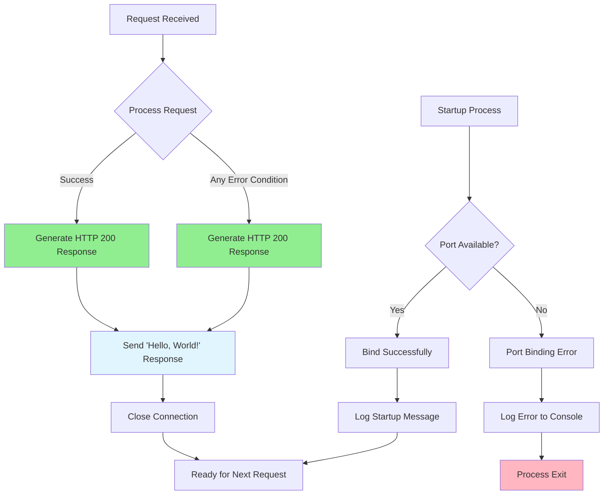
```mermaid
flowchart TD
    A[Request Received] --> B{Process Request}
    B -->|Success| C[Generate HTTP 200 Response]
    B -->|Any Error Condition| D[Generate HTTP 200 Response]
    
    C --> E[Send 'Hello, World!' Response]
    D --> E
    E --> F[Close Connection]
    F --> G[Ready for Next Request]
    
    H[Port Binding Error] --> I[Log Error to Console]
    I --> J[Process Exit]
    
    K[Startup Process] --> L{Port Available?}
    L -->|Yes| M[Bind Successfully]
    L -->|No| H
    M --> N[Log Startup Message]
    N --> G
    
    style C fill:#90EE90
    style D fill:#90EE90  
    style E fill:#e1f5fe
    style J fill:#FFB6C1
```

#### References

#### Repository Files Analyzed
- `server.js` - Complete HTTP server implementation with universal request handler
- `package.json` - NPM configuration confirming zero external dependencies  
- `package-lock.json` - NPM lockfile confirming no external package resolution
- `README.md` - Project documentation confirming backprop integration test purpose

#### Technical Specification Sections Referenced
- `1.2 SYSTEM OVERVIEW` - Business context and high-level system capabilities
- `2.4 IMPLEMENTATION CONSIDERATIONS` - Technical constraints and performance requirements
- `3.5 SYSTEM INTEGRATION ARCHITECTURE` - Integration patterns and technology stack rationale  
- `4.2 DETAILED PROCESS FLOWS` - Service startup and request processing implementation details

# 6. SYSTEM COMPONENTS DESIGN

## 6.1 CORE SERVICES ARCHITECTURE

### 6.1.1 Applicability Assessment

**Core Services Architecture is NOT applicable for this system.** The hao-backprop-test repository implements a monolithic, single-component HTTP server specifically designed as an integration test harness. The system intentionally avoids distributed architecture patterns in favor of maximum simplicity and reliability.

### 6.1.2 System Architecture Analysis

#### 6.1.2.1 Monolithic Design Pattern

The system implements a Zero-Dependency Monolithic Single-Component Architecture consisting of:

- **Single Implementation File**: Complete functionality contained in `server.js` (14 lines)
- **Zero External Dependencies**: Uses only Node.js built-in `http` module
- **Unified Process Model**: All functionality executes within a single Node.js process
- **Hardcoded Configuration**: Static localhost binding (127.0.0.1:3000) with no service discovery

#### 6.1.2.2 Single-Component Implementation

The technical specification documents only ONE component:

| Component | Location | Responsibility | Dependencies |
|-----------|----------|----------------|--------------|
| HTTP Server Module | `server.js` | Handle all HTTP requests with static response | Node.js `http` module only |

### 6.1.3 Why Distributed Services Are Not Required

#### 6.1.3.1 Service Boundaries Analysis

**No Service Boundaries Exist**:
- Entire application is one indivisible unit
- No logical or physical service separation
- Single request handler processes all HTTP methods and paths
- Static "Hello, World!\n" response for all requests

#### 6.1.3.2 Communication Patterns Analysis

**No Inter-Service Communication Required**:
- Single process with no IPC, messaging, or API calls between components
- No service discovery mechanisms needed
- No load balancing requirements (single instance only)
- No circuit breaker patterns (no external dependencies to protect against)

#### 6.1.3.3 Scalability Requirements Analysis

**Intentionally Non-Scalable Design**:
- No horizontal scaling requirements due to test harness purpose
- Limited to Node.js single-process capabilities
- No auto-scaling triggers or rules needed
- Resource allocation is OS-managed for single process

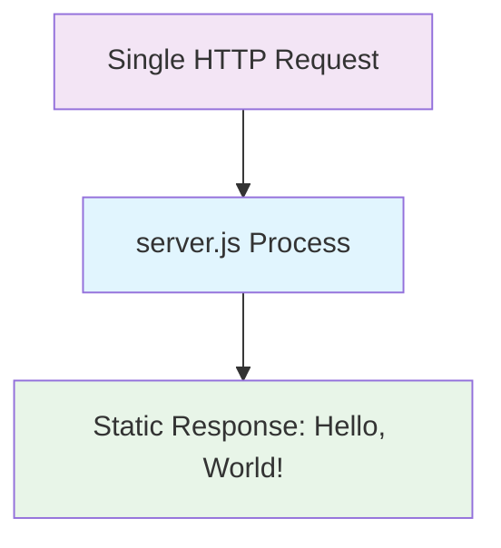
```mermaid
graph TD
    A[Single HTTP Request] --> B[server.js Process]
    B --> C[Static Response: Hello, World!]
    
    style B fill:#e1f5fe
    style A fill:#f3e5f5
    style C fill:#e8f5e8
```

### 6.1.4 Design Philosophy and Rationale

#### 6.1.4.1 Integration Test Harness Purpose

The system serves as a "baseline integration test target" with the following architectural decisions:

- **Priority**: Maximum reliability through simplicity
- **Goal**: Provide consistent test endpoint for backprop integration testing
- **Strategy**: Eliminate complexity that could interfere with testing scenarios
- **Result**: Complete system understanding achievable in under 15 lines of code

#### 6.1.4.2 Simplicity-First Approach

**Performance Through Architectural Simplicity**:

| Metric | Target | Achievement Method |
|--------|--------|-------------------|
| Response Time | < 10ms | Zero processing overhead |
| Memory Usage | < 50MB | Minimal Node.js footprint |
| Startup Time | < 1 second | No initialization complexity |

**Resilience Through Minimal Complexity**:
- **Fault Tolerance**: Fail-fast design with OS-level process management
- **Disaster Recovery**: Simple process restart (manual or automated via PM2/systemd)
- **Data Redundancy**: Not applicable (stateless service)
- **Service Degradation**: Not applicable (single response mode only)

```mermaid
graph LR
    A[Process Start] --> B[Bind to localhost:3000]
    B --> C[Listen for Requests]
    C --> D[Serve Static Response]
    D --> C
    
    E[Process Failure] --> F[OS Process Termination]
    F --> G[Manual/Automated Restart]
    G --> A
    
    style A fill:#e1f5fe
    style E fill:#ffebee
    style G fill:#e8f5e8
```

### 6.1.5 Architectural Decision Context

The technical specification documents the deliberate choice of monolithic architecture over distributed services:

**From Section 5.3 Technical Decisions**:
- **Decision**: Monolithic Single-File Architecture  
- **Rationale**: Minimizes complexity for integration test scenarios
- **Implementation**: Entire system contained in single `server.js` file

**From Section 5.1 High-Level Architecture**:
- **Pattern**: Zero-Dependency Monolithic Pattern
- **Scope**: Single-file implementation containing all functionality
- **Philosophy**: Complete system understanding without distributed complexity

#### References

**Source Files Examined:**
- `server.js` - 14-line HTTP server implementation confirming monolithic architecture
- `package.json` - NPM manifest showing zero dependencies and single entry point  
- `package-lock.json` - Lockfile confirming no external packages
- `README.md` - Project description confirming backprop integration test purpose

**Technical Specification Sections Referenced:**
- Section 5.1 HIGH-LEVEL ARCHITECTURE - Monolithic single-component design confirmation
- Section 5.2 COMPONENT DETAILS - Single HTTP Server Module documentation
- Section 5.3 TECHNICAL DECISIONS - Architecture style decisions and rationale
- Section 5.4 CROSS-CUTTING CONCERNS - Error handling and monitoring approaches
- Section 2.4 IMPLEMENTATION CONSIDERATIONS - Scalability constraints and design philosophy

## 6.2 DATABASE DESIGN

### 6.2.1 Applicability Assessment

**Database Design is not applicable to this system.** The hao-backprop-test repository implements a stateless HTTP service that intentionally operates without any data persistence, storage mechanisms, or database interactions.

#### 6.2.1.1 System Architecture Evidence

The system architecture explicitly eliminates database requirements through the following design decisions:

- **Stateless Service Pattern**: As documented in Section 5.1 HIGH-LEVEL ARCHITECTURE, the system implements "stateless service pattern with no persistent data or session management"
- **Zero-Dependency Design**: The implementation uses only Node.js built-in modules with no database drivers, ORMs, or persistence libraries
- **Monolithic Single-Component Architecture**: Complete functionality contained within a single 14-line `server.js` file with no data storage logic

#### 6.2.1.2 Implementation Evidence

Analysis of the codebase confirms no database infrastructure:

| Component | Evidence | Implication |
|-----------|----------|-------------|
| `server.js` | Uses only `http` module, returns static "Hello, World!" response | No data storage or retrieval operations |
| `package.json` | Zero dependencies listed | No database drivers or persistence libraries |
| `package-lock.json` | No external packages beyond root package | No hidden database dependencies |

#### 6.2.1.3 Functional Requirements Analysis

The system's documented features require no data persistence:

- **F-001**: HTTP Request Handling - Processes requests without storing them
- **F-002**: Static Response Generation - Returns hardcoded string response
- **F-003**: Network Service Binding - Establishes connection without state management
- **F-004**: Service Startup Logging - Console output only, no log persistence

### 6.2.2 Architectural Rationale for No Database

#### 6.2.2.1 Integration Test Harness Design Philosophy

The system serves as a baseline integration test target with intentional architectural limitations:

#### Purpose-Driven Simplicity
- **Primary Function**: Provide predictable HTTP endpoint for backprop integration testing
- **Design Goal**: Maximum reliability through elimination of complexity
- **Test Environment Requirements**: Complete predictability with zero external dependencies

#### Stateless Operation Benefits
- **Test Reliability**: No state persistence between test runs ensures consistent test conditions
- **Resource Efficiency**: Minimal memory footprint (< 50MB target) without database overhead
- **Startup Performance**: Sub-second initialization without database connection establishment
- **Failure Isolation**: No database connection failures that could mask integration issues

#### 6.2.2.2 Intentional Architectural Constraints

The technical specification explicitly documents the omission of persistent storage:

```mermaid
graph TD
    A[HTTP Request] --> B[Static Request Handler]
    B --> C[Hardcoded Response Generation]
    C --> D[HTTP 200 Response: Hello, World!]
    
    E[No Database Layer]
    F[No Caching Layer]
    G[No Session Management]
    H[No State Persistence]
    
    style E fill:#ffebee,stroke:#f44336,stroke-width:2px,stroke-dasharray: 5 5
    style F fill:#ffebee,stroke:#f44336,stroke-width:2px,stroke-dasharray: 5 5
    style G fill:#ffebee,stroke:#f44336,stroke-width:2px,stroke-dasharray: 5 5
    style H fill:#ffebee,stroke:#f44336,stroke-width:2px,stroke-dasharray: 5 5
    
    style A fill:#e3f2fd
    style B fill:#e8f5e8
    style C fill:#e8f5e8
    style D fill:#e3f2fd
```

### 6.2.3 System Data Flow Without Persistence

#### 6.2.3.1 Request Processing Pattern

The system implements a pure request-response pattern with no data retention:

#### Stateless Request Handling
1. **Request Reception**: HTTP requests received via localhost:3000 endpoint
2. **Universal Processing**: All requests handled identically regardless of method or path
3. **Static Response**: Hardcoded "Hello, World!\n" response generated for every request
4. **Connection Termination**: No session state or connection persistence

#### Memory-Only Operations
- **Request Data**: Processed in memory only, immediately discarded after response
- **Response Generation**: Static string served from application memory
- **Service State**: No persistent configuration or runtime state storage

#### 6.2.3.2 Data Flow Diagram

```mermaid
flowchart LR
    A[Test Client] -->|HTTP Request| B[localhost:3000]
    B --> C[server.js Handler]
    C --> D[Static Response Generator]
    D -->|Hello, World!| A
    
    E[Request Data] -.->|Immediately Discarded| F[Memory Cleanup]
    G[No Persistence Layer] -.->|Intentionally Omitted| H[Test Predictability]
    
    style E fill:#fff3e0,stroke:#ff9800,stroke-width:1px,stroke-dasharray: 3 3
    style F fill:#fff3e0,stroke:#ff9800,stroke-width:1px,stroke-dasharray: 3 3
    style G fill:#ffebee,stroke:#f44336,stroke-width:2px,stroke-dasharray: 5 5
    style H fill:#e8f5e8,stroke:#4caf50,stroke-width:2px
```

### 6.2.4 Alternative Data Management Approach

#### 6.2.4.1 Console-Based Logging Strategy

Instead of database logging, the system uses minimal console output for operational visibility:

#### Startup Notification
- **Implementation**: Single console.log statement on server initialization
- **Purpose**: Service discovery for test automation frameworks
- **Format**: Plain text URL logging for programmatic parsing
- **Retention**: OS-managed console buffer only, no persistent storage

#### Error Handling Without Persistence
- **Strategy**: Fail-fast approach with immediate process termination
- **Implementation**: OS-level error handling and process management
- **Recovery**: Manual or automated process restart without state recovery
- **Monitoring**: External process monitoring tools rather than application-level logging

#### 6.2.4.2 Configuration Management Without Storage

| Configuration Aspect | Implementation | Rationale |
|----------------------|----------------|-----------|
| Port Configuration | Hardcoded localhost:3000 | Eliminates configuration file dependencies |
| Response Content | Hardcoded "Hello, World!" | Ensures identical responses across all environments |
| Server Settings | Node.js defaults only | Minimizes configuration complexity |

### 6.2.5 Performance Characteristics Without Database

#### 6.2.5.1 Performance Benefits of No Database

The absence of database operations provides significant performance advantages for the system's test harness purpose:

#### Response Time Optimization
- **No Database Latency**: Zero milliseconds added by database queries
- **No Connection Overhead**: No database connection establishment or pooling
- **No Query Processing**: Immediate static response generation
- **Target Response Time**: < 10ms per request without database bottlenecks

#### Resource Utilization Efficiency
- **Memory Usage**: < 50MB footprint without database connection buffers
- **CPU Usage**: Minimal processing without query execution overhead
- **Network Resources**: Single HTTP port binding without database connections
- **Disk I/O**: Zero persistent storage operations

#### 6.2.5.2 Scalability Through Simplicity

```mermaid
graph TB
    A[Single Process Model] --> B[No Database Connections to Manage]
    B --> C[No Connection Pool Limits]
    C --> D[OS-Level Request Handling]
    D --> E[Node.js Event Loop Scalability]
    
    F[Traditional Database Model] --> G[Connection Pool Management]
    G --> H[Query Execution Bottlenecks]
    H --> I[Database Server Dependencies]
    I --> J[Complex Failure Scenarios]
    
    style A fill:#e8f5e8
    style B fill:#e8f5e8
    style C fill:#e8f5e8
    style D fill:#e8f5e8
    style E fill:#e8f5e8
    
    style F fill:#ffebee,stroke:#f44336,stroke-width:1px,stroke-dasharray: 3 3
    style G fill:#ffebee,stroke:#f44336,stroke-width:1px,stroke-dasharray: 3 3
    style H fill:#ffebee,stroke:#f44336,stroke-width:1px,stroke-dasharray: 3 3
    style I fill:#ffebee,stroke:#f44336,stroke-width:1px,stroke-dasharray: 3 3
    style J fill:#ffebee,stroke:#f44336,stroke-width:1px,stroke-dasharray: 3 3
```

### 6.2.6 Future Considerations

#### 6.2.6.1 Maintaining Database-Free Design

The system's value proposition depends on maintaining its database-free architecture:

#### Design Principles to Preserve
- **Zero External Dependencies**: Any database addition would compromise the system's reliability guarantee
- **Stateless Operation**: Database integration would introduce state management complexity
- **Predictable Behavior**: Database operations would introduce variability in test scenarios
- **Minimal Resource Footprint**: Database connections would significantly increase memory and CPU usage

#### Integration Test Value Protection
- **Consistent Test Environment**: Database presence would create environmental dependencies
- **Test Isolation**: Shared database state could cause test interference
- **Deployment Simplicity**: Database requirements would complicate test environment setup
- **Failure Point Elimination**: Database connectivity issues would mask actual integration problems

#### References

**Technical Specification Sections Analyzed:**
- `Section 1.2 SYSTEM OVERVIEW` - Confirmed "No data persistence or state management"
- `Section 5.1 HIGH-LEVEL ARCHITECTURE` - Documented stateless service pattern and intentional omission of data stores
- `Section 6.1 CORE SERVICES ARCHITECTURE` - Confirmed zero-dependency monolithic single-component architecture
- `Section 2.1 FEATURE CATALOG` - Verified all features are stateless HTTP operations

**Source Files Examined:**
- `server.js` - 14-line HTTP server implementation with no database imports or data storage logic
- `package.json` - NPM manifest confirming zero dependencies and no database drivers
- `package-lock.json` - Lockfile confirming no external packages or hidden database dependencies
- `README.md` - Project description confirming backprop integration test harness purpose

## 6.3 INTEGRATION ARCHITECTURE

### 6.3.1 Integration Architecture Applicability

#### 6.3.1.1 Applicability Assessment

**Integration Architecture is not applicable for this system** in the traditional enterprise sense. The hao-backprop-test system is intentionally designed as a minimal baseline integration test harness with zero external system integrations, third-party service dependencies, or API connections to other systems.

#### 6.3.1.2 Architectural Design Philosophy

The system serves a fundamentally different integration role than typical enterprise applications:

- **Traditional Systems**: Integrate WITH external services, databases, and APIs
- **This System**: Designed to BE integrated WITH as a reliable test target
- **Purpose**: Provides a predictable HTTP endpoint for backprop integration testing workflows
- **Strategy**: Eliminates integration complexity that could interfere with testing scenarios

### 6.3.2 Test Integration Architecture

#### 6.3.2.1 Integration Role Definition

The system functions as a **Baseline Integration Test Target** rather than an integrating system:

| Integration Aspect | Implementation | Technical Detail |
|---|---|---|
| Role | Test target service | Provides predictable HTTP endpoint |
| Protocol | HTTP/1.1 over localhost | Single protocol support |
| Response Contract | Static "Hello, World!" | Guaranteed consistent response |
| Integration Method | Direct HTTP client connection | No service mesh or gateway |

#### 6.3.2.2 Test Automation Integration Patterns

The system integrates with test automation frameworks through a standardized discovery and validation pattern:

```mermaid
stateDiagram-v2
    [*] --> ServiceOff
    ServiceOff --> Starting : node server.js
    Starting --> ServiceReady : Console Log Detected
    Starting --> ServiceFailed : Port Conflict
    ServiceReady --> ProcessingRequest : HTTP Request
    ProcessingRequest --> ServiceReady : Response Sent
    ServiceReady --> ServiceOff : Process Termination
    ServiceFailed --> [*]
    ServiceOff --> [*]
```

#### Integration Validation Checkpoints

Test automation systems validate service behavior through four critical validation points:

1. **Service Availability**: Console output parsing confirms service readiness
2. **Response Consistency**: HTTP 200 status code validation for all requests  
3. **Content Verification**: Exact string match for "Hello, World!\n" response body
4. **Header Validation**: Content-Type verification as "text/plain"

#### 6.3.2.3 Request Processing Flow

```mermaid
flowchart LR
    A[HTTP Request] --> B[server.js Handler]
    B --> C[Static Response Generation]
    C --> D[HTTP 200 + Hello, World!]
    D --> E[Connection Cleanup]
    E --> F[Ready for Next Request]
    
    style A fill:#f3e5f5
    style B fill:#e1f5fe
    style D fill:#e8f5e8
    style F fill:#f0f4c3
```

### 6.3.3 Absence of Traditional Integration Components

#### 6.3.3.1 Missing Integration Layers

The following traditional integration components are intentionally **NOT implemented**:

#### API Design Components
- **API Gateway**: No proxy or gateway layer
- **Authentication Methods**: No auth providers or identity management
- **Authorization Framework**: No role-based access control
- **Rate Limiting Strategy**: No throttling or quota management
- **Versioning Approach**: Single static response version
- **Documentation Standards**: No OpenAPI/Swagger specifications

#### Message Processing Components
- **Event Processing Patterns**: No event streaming or processing
- **Message Queue Architecture**: No message brokers or queues
- **Stream Processing Design**: No data stream processing
- **Batch Processing Flows**: No batch job processing
- **Error Handling Strategy**: Minimal error handling for test predictability

#### External Systems Integration
- **Third-party Integration Patterns**: No external service connections
- **Legacy System Interfaces**: No legacy system connectivity
- **API Gateway Configuration**: No gateway management
- **External Service Contracts**: No SLAs or external dependencies

#### 6.3.3.2 Zero-Dependency Architecture

```mermaid
graph TD
    A[hao-backprop-test System] --> B[Node.js Built-in http Module]
    
    C[External APIs] -.->|NOT CONNECTED| A
    D[Databases] -.->|NOT CONNECTED| A
    E[Message Queues] -.->|NOT CONNECTED| A
    F[Third-party Services] -.->|NOT CONNECTED| A
    G[Authentication Providers] -.->|NOT CONNECTED| A
    H[Caching Layers] -.->|NOT CONNECTED| A
    
    style A fill:#e1f5fe
    style B fill:#e8f5e8
    style C fill:#ffebee
    style D fill:#ffebee
    style E fill:#ffebee
    style F fill:#ffebee
    style G fill:#ffebee
    style H fill:#ffebee
```

### 6.3.4 Integration Surface Area

#### 6.3.4.1 Single Integration Endpoint

| Endpoint Specification | Value |
|---|---|
| Protocol | HTTP/1.1 |
| Host Binding | localhost (127.0.0.1) |
| Port | 3000 |
| Methods Supported | ALL (GET, POST, PUT, DELETE, etc.) |
| Path Handling | Universal (all paths return same response) |

#### 6.3.4.2 Response Contract

| Response Attribute | Value |
|---|---|
| Status Code | 200 OK |
| Content-Type | text/plain |
| Response Body | "Hello, World!\n" |
| Content-Length | 14 bytes |

#### 6.3.4.3 Integration Flow Diagram

```mermaid
sequenceDiagram
    participant TC as Test Client
    participant HS as hao-backprop-test Server
    participant NE as Node.js Engine
    
    TC->>HS: HTTP Request (Any Method/Path)
    HS->>NE: Process via http.createServer()
    NE->>HS: Request Handler Invoked
    HS->>NE: Generate Static Response
    NE->>TC: HTTP 200 + "Hello, World!"
    
    Note over TC,HS: All requests follow identical flow
    Note over HS: No state persistence between requests
```

### 6.3.5 Performance Integration Characteristics

#### 6.3.5.1 Integration Performance Metrics

| Performance Metric | Target Value | Achievement Method |
|---|---|---|
| Response Time | < 10ms | No external API calls or database queries |
| Startup Time | < 1 second | Zero initialization complexity |
| Memory Usage | < 50MB | Minimal Node.js footprint |
| Concurrent Handling | Node.js event loop capacity | Single-threaded async processing |

#### 6.3.5.2 Integration Reliability Guarantees

- **100% Response Availability**: Static response eliminates external failure points
- **Predictable Behavior**: Identical response for all request patterns
- **Zero External Dependencies**: No third-party service availability risks
- **Stateless Operation**: No session or state management complexity

### 6.3.6 Integration Architecture Rationale

#### 6.3.6.1 Design Decision Context

The absence of traditional integration architecture serves the system's core purpose as documented in the technical specification:

#### Strategic Decisions
- **Simplicity First**: Minimum viable technology choices to reduce complexity
- **Predictability**: Consistent behavior across all deployment scenarios  
- **Reliability**: Zero external failure points through dependency elimination
- **Performance**: Sub-second startup and minimal resource footprint

#### Success Metrics Alignment
- **Response Reliability**: 100% HTTP 200 response rate achieved through static response
- **Startup Performance**: < 1 second target met through zero-dependency architecture
- **Resource Consumption**: < 50MB target achieved through minimal Node.js footprint

#### 6.3.6.2 Integration Testing Value Proposition

The minimal integration architecture provides specific value for test automation:

- **Test Reliability**: No external dependencies that could cause test failures
- **Environment Consistency**: Identical behavior across all test environments  
- **Quick Setup**: No configuration or external service requirements
- **Failure Isolation**: Integration issues clearly attributable to test subject, not test harness
- **Predictable Behavior**: Static response ensures repeatable test conditions

#### References

#### Repository Files Examined
- `server.js` - Complete 14-line HTTP server implementation confirming no external integrations
- `package.json` - NPM configuration confirming zero external dependencies  
- `package-lock.json` - NPM lockfile confirming no hidden dependencies
- `README.md` - Project description confirming backprop test harness purpose

#### Technical Specification Sections Referenced
- Section 3.5 System Integration Architecture - Integration patterns and test compatibility
- Section 4.3 Integration Patterns - Test automation integration state machine  
- Section 6.1 Core Services Architecture - Monolithic architecture confirmation
- Section 1.2 System Overview - Intentional limitations and design philosophy

## 6.4 SECURITY ARCHITECTURE

### 6.4.1 Security Model Overview

#### 6.4.1.1 Security Architecture Applicability Statement

**Detailed Security Architecture is not applicable for this system.** The hao-backprop-test project implements a **network isolation security model** specifically designed for integration testing environments, intentionally excluding traditional authentication and authorization mechanisms.

#### 6.4.1.2 Standard Security Practices Applied

The system follows these standard security practices appropriate for a test harness:

| Security Practice | Implementation | Rationale |
|---|---|---|
| Network Isolation | Localhost-only binding (127.0.0.1) | Prevents external network exposure |
| Operating System Security | Process-level access controls | Leverages OS user permissions |
| Minimal Attack Surface | Zero external dependencies | Reduces potential vulnerabilities |
| Secure by Design | Static response only | Eliminates injection attack vectors |

### 6.4.2 Network Isolation Security Framework

#### 6.4.2.1 Access Control Through Network Boundaries

The system implements security through **network-level isolation** rather than application-level controls:

```mermaid
graph TB
    A[External Network] -.->|Blocked| B[Network Interface]
    B --> C{Interface Check}
    C -->|127.0.0.1 Only| D[Allow Access]
    C -->|External Interface| E[Deny Access]
    
    D --> F[Operating System]
    F --> G[Process Permissions]
    G --> H[Node.js HTTP Server]
    H --> I[Static Response Handler]
    
    E --> J[Connection Refused]
    
    subgraph "Security Boundary"
        F
        G
        H
        I
    end
    
    style E fill:#FFB6C1
    style J fill:#FFB6C1
    style D fill:#90EE90
```

#### 6.4.2.2 Security Zone Architecture

```mermaid
graph LR
    subgraph "External Zone"
        A[Internet]
        B[Corporate Network]
        C[Other Hosts]
    end
    
    subgraph "Host Security Boundary"
        D[Operating System]
        
        subgraph "Process Security Zone"
            E[Node.js Runtime]
            F[HTTP Server Process]
            G[Port 3000 Binding]
        end
    end
    
    A -.->|Blocked| D
    B -.->|Blocked| D  
    C -.->|Blocked| D
    
    H[localhost:3000] --> D
    D --> E
    E --> F
    F --> G
    
    style A fill:#FFB6C1
    style B fill:#FFB6C1
    style C fill:#FFB6C1
    style H fill:#90EE90
```

### 6.4.3 Authentication Framework Analysis

#### 6.4.3.1 Authentication Mechanisms - Not Implemented

| Component | Status | Justification |
|---|---|---|
| Identity Management | Not Required | Test harness operates in controlled environment |
| Multi-factor Authentication | Not Applicable | No user accounts or sessions |
| Session Management | Not Implemented | Stateless operation by design |
| Token Handling | Not Required | No authentication tokens needed |

#### 6.4.3.2 Authentication Flow - Network Access Only

```mermaid
sequenceDiagram
    participant Client as Test Client
    participant OS as Operating System
    participant Server as HTTP Server
    
    Client->>OS: Request connection to 127.0.0.1:3000
    
    alt Network Interface Check
        OS->>OS: Verify localhost interface access
        OS-->>Client: Allow connection
    else External Interface Attempt
        OS-->>Client: Connection refused
    end
    
    Client->>Server: HTTP Request (any method/path)
    Server-->>Client: HTTP 200 "Hello, World!"
    
    Note over Client,Server: No authentication required
    Note over OS: Security enforced at network level
```

### 6.4.4 Authorization System Analysis

#### 6.4.4.1 Authorization Mechanisms - Not Implemented

| Authorization Component | Implementation Status | Alternative Control |
|---|---|---|
| Role-based Access Control | Not Required | OS user permissions |
| Permission Management | Not Applicable | Universal request handler |
| Resource Authorization | Not Implemented | Static response only |
| Policy Enforcement Points | Not Required | Network isolation sufficient |

#### 6.4.4.2 Authorization Flow - Universal Access

```mermaid
flowchart TD
    A[HTTP Request Received] --> B{Network Origin Check}
    B -->|localhost| C[Process Request]
    B -->|External| D[Connection Denied by OS]
    
    C --> E{Request Method Check}
    E -->|Any HTTP Method| F[Allow Access]
    
    F --> G{Path Authorization}
    G -->|Any Path| H[Grant Access]
    
    H --> I[Generate Standard Response]
    I --> J[Return HTTP 200]
    
    D --> K[TCP Connection Refused]
    
    style F fill:#90EE90
    style H fill:#90EE90
    style J fill:#90EE90
    style D fill:#FFB6C1
    style K fill:#FFB6C1
```

### 6.4.5 Data Protection Framework

#### 6.4.5.1 Data Protection Requirements - Not Applicable

| Data Protection Area | Requirement Status | Rationale |
|---|---|---|
| Encryption Standards | Not Required | No sensitive data processed |
| Key Management | Not Applicable | No encryption keys needed |
| Data Masking Rules | Not Required | Static "Hello, World!" response only |
| Secure Communication | HTTP Sufficient | Localhost-only communication |

#### 6.4.5.2 Information Security Controls

```mermaid
graph TD
    A[Request Processing] --> B{Data Classification}
    B -->|Static Response| C[Public Information]
    B -->|No Data Storage| D[No Persistence Risk]
    B -->|No User Input Processing| E[No Injection Risk]
    
    C --> F[No Encryption Required]
    D --> G[No Data Protection Needed]  
    E --> H[No Input Validation Required]
    
    F --> I[Standard HTTP Response]
    G --> I
    H --> I
    
    style I fill:#90EE90
```

### 6.4.6 Security Compliance and Controls

#### 6.4.6.1 Security Control Matrix

| Control Category | Implementation | Compliance Level | Risk Assessment |
|---|---|---|---|
| Access Control | Network isolation | Test environment appropriate | Low risk |
| Data Protection | No sensitive data | Not applicable | No risk |
| Communication Security | HTTP localhost | Sufficient for use case | Low risk |
| Audit Logging | Startup logging only | Minimal but adequate | Low risk |

#### 6.4.6.2 Risk Mitigation Strategy

The system mitigates security risks through **architectural design** rather than security controls:

- **Network Exposure Risk**: Mitigated by localhost-only binding
- **Data Breach Risk**: Eliminated by stateless, static response design  
- **Authentication Bypass Risk**: Not applicable due to no authentication requirement
- **Injection Attack Risk**: Eliminated by lack of dynamic processing
- **Session Hijacking Risk**: Not applicable due to stateless operation

### 6.4.7 Security Architecture Decision Rationale

#### 6.4.7.1 Security Design Philosophy

The security architecture follows the principle of **security through simplicity**:

1. **Minimal Attack Surface**: Single file implementation with no external dependencies
2. **Network-Level Protection**: Operating system provides access control
3. **Stateless Security**: No session state to compromise or manage
4. **Test Environment Appropriate**: Security model matches operational context

#### 6.4.7.2 Security Architecture Tradeoffs

| Security Aspect | Traditional Approach | System Implementation | Justification |
|---|---|---|---|
| Authentication | Username/password, tokens | Network isolation only | Test harness in controlled environment |
| Authorization | RBAC, permissions | Universal access | Static response eliminates authorization needs |
| Data Protection | Encryption, masking | No sensitive data | Static content requires no protection |
| Audit Logging | Comprehensive logs | Minimal startup logging | Test predictability prioritized |

#### References

#### Technical Specification Sections Referenced
- `1.2 SYSTEM OVERVIEW` - Security limitations and localhost binding requirements
- `5.3 TECHNICAL DECISIONS` - Security mechanism selection rationale and localhost-only binding decision
- `5.4 CROSS-CUTTING CONCERNS` - Authentication and authorization framework analysis

#### Repository Files Analyzed
- `server.js` - HTTP server implementation confirming no security mechanisms
- `package.json` - Dependencies analysis confirming zero security-related packages
- `README.md` - Project documentation confirming integration test harness purpose

## 6.5 MONITORING AND OBSERVABILITY

**Detailed Monitoring Architecture is not applicable for this system** due to its intentionally minimal design as a backprop integration test harness. The system implements basic monitoring practices specifically optimized for test predictability and automation compatibility, avoiding complex infrastructure that could interfere with integration testing scenarios.

### 6.5.1 MONITORING INFRASTRUCTURE

#### 6.5.1.1 Minimal Infrastructure Approach

The hao-backprop-test system intentionally avoids traditional monitoring infrastructure components to maintain its role as a predictable test target. The monitoring strategy relies on external tooling and basic console-based notifications rather than embedded monitoring frameworks.

#### Metrics Collection Strategy

| Collection Type | Implementation | Purpose | Coverage |
|---|---|---|---|
| Startup Metrics | Console log output | Service discovery for automation | Service availability |
| Performance Metrics | Client-side timing | Response time measurement | Request processing |
| Resource Metrics | OS-level monitoring | Memory and CPU tracking | Resource utilization |

#### Log Aggregation Approach

**Console-Only Logging**: The system implements minimal logging through Node.js console methods:
- **Startup Notification**: Single console.log statement for service discovery
- **Error Reporting**: Console.error for port conflict situations  
- **No Request Logging**: Intentionally omitted to avoid test interference

#### Distributed Tracing Architecture

```mermaid
graph TD
    A[HTTP Request] --> B[Node.js HTTP Server]
    B --> C[Static Response Handler]
    C --> D[HTTP Response]
    
    E[No Distributed Tracing] -.-> F[Single Component Design]
    F -.-> G[Localhost Only Deployment]
    G -.-> H[Zero External Service Calls]
    
    style E fill:#FFE4B5
    style F fill:#FFE4B5  
    style G fill:#FFE4B5
    style H fill:#FFE4B5
```

**Tracing Not Required**: The monolithic single-component architecture eliminates the need for distributed tracing capabilities since all request processing occurs within the Node.js event loop without external service dependencies.

#### 6.5.1.2 Alert Management Framework

#### Alert Infrastructure

```mermaid
flowchart TD
    A[Service Startup] --> B{Console Output Present?}
    B -->|Yes| C[Service Available]
    B -->|No| D[Manual Investigation Required]
    
    E[Port Conflict] --> F[Process Termination]
    F --> G[Console Error Message]
    G --> H[Manual Restart Required]
    
    I[Health Check Requests] --> J{HTTP 200 Response?}
    J -->|Yes| K[Service Healthy]
    J -->|No| L[Service Unavailable]
    L --> M[Manual Intervention]
    
    style D fill:#FFB6C1
    style H fill:#FFB6C1
    style M fill:#FFB6C1
```

#### Alert Threshold Matrix

| Alert Type | Threshold | Response Time | Escalation Level |
|---|---|---|---|
| Service Unavailable | No HTTP 200 response | Immediate | Manual restart |
| Startup Failure | No console output | Immediate | Port conflict resolution |
| Performance Degradation | > 10ms response time | Monitor only | Test environment review |

#### 6.5.1.3 Dashboard Design Philosophy

**No Dashboard Implementation**: Traditional monitoring dashboards are not applicable for this system. Health verification relies on:
- Console output monitoring for service status
- HTTP response success rate tracking through test frameworks
- Operating system tools for resource utilization visibility

### 6.5.2 OBSERVABILITY PATTERNS

#### 6.5.2.1 Health Check Implementation

#### Health Verification Methods

```mermaid
sequenceDiagram
    participant Test as Test Framework
    participant Service as HTTP Service
    participant Console as Console Output
    
    Test->>Service: GET /any-endpoint
    Service->>Test: HTTP 200 "Hello, World!"
    Test->>Console: Log response time
    
    Note over Test,Console: Health = HTTP 200 + Response Time < 10ms
```

#### Health Check Patterns

| Pattern Type | Implementation | Frequency | Purpose |
|---|---|---|---|
| Availability Check | HTTP GET request to any endpoint | Per test execution | Service responsiveness |
| Startup Verification | Console output monitoring | Service startup only | Service ready state |
| Response Validation | Static response content check | Per request | Response consistency |

#### 6.5.2.2 Performance Metrics Collection

#### Performance Monitoring Approach

The system follows **client-side performance measurement** patterns to avoid impacting the test target:

| Metric Category | Collection Method | Target Value | Monitoring Tool |
|---|---|---|---|
| Response Time | Client-side timing | < 10ms average | Test framework instrumentation |
| Startup Time | Process timing | < 1 second | System process monitoring |
| Memory Usage | OS monitoring | < 50MB peak | Operating system tools |
| Availability | Success rate calculation | 100% during tests | HTTP response tracking |

#### 6.5.2.3 Business Metrics and SLA Monitoring

#### Service Level Agreement Targets

Based on the system's role as an integration test target, the following SLAs are maintained through external monitoring:

| SLA Metric | Target | Measurement Window | Monitoring Approach |
|---|---|---|---|
| Test Response Reliability | 100% HTTP 200 responses | Per test execution | Client-side verification |
| Service Startup Performance | < 1 second to ready state | Per startup cycle | Process timing |
| Resource Efficiency | < 50MB memory consumption | Continuous during operation | OS-level monitoring |

#### 6.5.2.4 Capacity Tracking Strategy

**Capacity Monitoring Not Applicable**: The stateless, single-request design and localhost-only deployment eliminate traditional capacity concerns. The system's capacity is bounded by:
- Single Node.js process limitations
- Operating system resource constraints  
- Test environment resource allocation

### 6.5.3 INCIDENT RESPONSE

#### 6.5.3.1 Alert Routing and Escalation

#### Manual Response Protocol

Due to the system's test harness nature, incident response follows a **manual intervention model**:

```mermaid
flowchart TD
    A[Incident Detected] --> B{Incident Type}
    B -->|Service Unavailable| C[Check Console Output]
    B -->|Performance Issue| D[Review Test Environment]
    B -->|Port Conflict| E[Restart Service]
    
    C --> F{Startup Message Present?}
    F -->|No| G[Check Port Availability]
    F -->|Yes| H[Verify HTTP Response]
    
    G --> I[Kill Conflicting Process]
    I --> J[Restart Service]
    
    H --> K{HTTP 200 Response?}
    K -->|No| L[Node.js Process Issue]
    K -->|Yes| M[Test Framework Issue]
    
    E --> N[node server.js]
    J --> N
    L --> N
    
    style N fill:#90EE90
```

#### 6.5.3.2 Runbook Procedures

#### Standard Operating Procedures

| Incident Type | Detection Method | Response Procedure | Recovery Validation |
|---|---|---|---|
| Service Not Starting | No console startup message | 1. Check port 3000 availability<br>2. Kill conflicting processes<br>3. Execute `node server.js` | Console message appears |
| Service Not Responding | HTTP request failures | 1. Verify process running<br>2. Test localhost connectivity<br>3. Restart if needed | HTTP 200 response received |
| Performance Degradation | Response time > 10ms | 1. Check system resources<br>2. Review test load<br>3. Monitor OS performance | Response time returns to < 10ms |

#### 6.5.3.3 Post-Mortem and Improvement Process

#### Incident Documentation

**Simplified Post-Mortem Process**: Due to the minimal system complexity, post-incident analysis focuses on:
- Root cause identification (typically port conflicts or resource constraints)
- Test environment configuration review
- Prevention through improved test automation practices

#### Improvement Tracking

The system's minimal design limits improvement opportunities to:
- Enhanced test framework integration patterns
- Better process management in test environments
- Refined service startup and shutdown procedures

### 6.5.4 MONITORING ARCHITECTURE OVERVIEW

#### 6.5.4.1 Complete Monitoring System Design

```mermaid
graph TB
    subgraph "Test Environment"
        A[hao-backprop-test Service<br/>Port 3000]
        B[Console Output Monitor]
        C[Test Framework HTTP Client]
    end
    
    subgraph "External Monitoring"
        D[Operating System Tools]
        E[Process Monitoring]
        F[Test Automation Framework]
    end
    
    A --> B
    A --> C
    C --> F
    D --> E
    E --> F
    B --> F
    
    F --> G[Test Results & Metrics]
    
    style A fill:#e1f5fe
    style B fill:#f3e5f5
    style C fill:#e8f5e8
    style F fill:#fff3e0
    style G fill:#fce4ec
```

#### 6.5.4.2 Monitoring Data Flow

The monitoring architecture implements a **pull-based external monitoring model** where observability data flows from the minimal service to external monitoring systems without impacting the service's test target functionality.

#### References

#### Repository Files Analyzed
- `server.js` - Core HTTP server implementation showing minimal console logging approach
- `package.json` - NPM configuration confirming zero monitoring dependencies or frameworks
- `package-lock.json` - NPM lockfile verifying no external packages for observability
- `README.md` - Project documentation confirming backprop integration test harness purpose

#### Technical Specification Sections Referenced
- `1.2 SYSTEM OVERVIEW` - Business context and system capabilities defining monitoring scope
- `5.4 CROSS-CUTTING CONCERNS` - Detailed monitoring and observability implementation approach
- `6.1 CORE SERVICES ARCHITECTURE` - Monolithic architecture confirmation eliminating distributed monitoring needs
- `3.4 DEVELOPMENT & DEPLOYMENT` - Deployment model and monitoring requirements for test environments
- `4.2 DETAILED PROCESS FLOWS` - Service startup and request processing details affecting monitoring design
- `2.4 IMPLEMENTATION CONSIDERATIONS` - Performance requirements and logging constraints driving monitoring decisions

## 6.6 TESTING STRATEGY

**Detailed Testing Strategy is not applicable for this system** due to its intentionally minimal design as a backprop integration test harness. The hao-backprop-test system serves as a test target for external integration testing frameworks rather than requiring comprehensive internal testing infrastructure.

### 6.6.1 SYSTEM TESTING CONTEXT

#### 6.6.1.1 Rationale for Minimal Testing Approach

The system's architecture and purpose justify a simplified testing strategy:

| Factor | Impact on Testing Strategy | Justification |
|---|---|---|
| **Single Component Design** | Eliminates integration complexity | Only one HTTP server module requiring validation |
| **Zero External Dependencies** | Removes dependency testing needs | No framework or library compatibility concerns |
| **Static Response Pattern** | Reduces test case complexity | Single predictable output for all inputs |
| **Test Harness Purpose** | External validation focus | System designed to be tested by other systems |

#### 6.6.1.2 Testing Scope Limitations

Given the system's role as an integration test target, comprehensive testing would contradict its design principles:

- **Performance Testing**: External responsibility of consuming test frameworks
- **Load Testing**: Not applicable for localhost-only, single-process deployment
- **Security Testing**: Minimal attack surface with no authentication or data handling
- **User Acceptance Testing**: No user-facing functionality beyond HTTP response

### 6.6.2 BASIC UNIT TESTING APPROACH

#### 6.6.2.1 Unit Testing Framework Selection

#### Recommended Testing Stack

| Component | Framework | Justification | Version Requirement |
|---|---|---|---|
| **Test Runner** | Jest | Node.js ecosystem standard, minimal configuration | ^29.0.0 |
| **HTTP Testing** | Supertest | Specialized for HTTP endpoint testing | ^6.3.0 |
| **Assertion Library** | Built-in Jest | Integrated with test runner | N/A |

#### Framework Integration Strategy

```mermaid
graph TD
    A[Jest Test Runner] --> B[Supertest HTTP Client]
    B --> C[hao-backprop-test Service]
    C --> D[Test Assertions]
    
    E[package.json] --> F[npm test script]
    F --> A
    
    G[Test Coverage Report] --> H[Coverage Validation]
    A --> G
    
    style C fill:#e1f5fe
    style A fill:#f3e5f5
    style B fill:#e8f5e8
```

#### 6.6.2.2 Test Organization Structure

#### File Structure Design

```
tests/
├── unit/
│   ├── server.test.js       # Core HTTP server tests
│   └── startup.test.js      # Service initialization tests
├── fixtures/
│   └── test-data.json       # Static test data (minimal)
└── helpers/
    └── test-utils.js        # Common test utilities
```

#### Test Naming Conventions

| Test Type | Naming Pattern | Example |
|---|---|---|
| **Feature Tests** | `describe('Feature-ID: Feature Name')` | `describe('F-001: HTTP Request Handling')` |
| **Unit Tests** | `it('should [expected behavior]')` | `it('should return HTTP 200 status')` |
| **Negative Tests** | `it('should handle [error condition]')` | `it('should handle port conflict gracefully')` |

#### 6.6.2.3 Core Test Coverage Requirements

#### Feature-Based Test Matrix

| Feature ID | Test Category | Test Cases | Coverage Target |
|---|---|---|---|
| **F-001** | HTTP Request Handling | GET, POST, PUT, DELETE request acceptance | 100% |
| **F-002** | Static Response Generation | Response content, headers, status code | 100% |
| **F-003** | Network Service Binding | Localhost binding, port assignment | 100% |
| **F-004** | Service Startup Logging | Console output verification | 100% |

#### Essential Test Scenarios

```javascript
// Example test patterns for reference (not actual implementation)
describe('F-001: HTTP Request Handling', () => {
  it('should accept GET requests to any path')
  it('should accept POST requests with any payload')
  it('should handle multiple concurrent requests')
})

describe('F-002: Static Response Generation', () => {
  it('should return "Hello, World!" text')
  it('should set Content-Type to text/plain')
  it('should return HTTP status 200')
})
```

#### 6.6.2.4 Test Data Management

#### Minimal Test Data Strategy

Given the system's static response pattern, test data requirements are minimal:

| Data Type | Implementation | Storage Location | Usage Pattern |
|---|---|---|---|
| **Expected Response** | Hardcoded string constant | Test file constants | Response validation |
| **HTTP Methods** | Array of method strings | Test fixtures | Request variety testing |
| **URL Paths** | Array of path strings | Test fixtures | Path independence testing |

### 6.6.3 TEST EXECUTION ARCHITECTURE

#### 6.6.3.1 Test Execution Flow

```mermaid
sequenceDiagram
    participant Developer as Developer
    participant NPM as npm test
    participant Jest as Jest Runner
    participant Supertest as Supertest Client
    participant Service as HTTP Service
    
    Developer->>NPM: Execute npm test
    NPM->>Jest: Launch test runner
    Jest->>Service: Start test server instance
    Jest->>Supertest: Initialize HTTP client
    Supertest->>Service: Send HTTP requests
    Service->>Supertest: Return responses
    Supertest->>Jest: Validate responses
    Jest->>Service: Shutdown test server
    Jest->>Developer: Report test results
```

#### 6.6.3.2 Test Environment Configuration

#### Local Development Testing

| Configuration | Value | Purpose |
|---|---|---|
| **Test Port** | 3001 (avoid conflict) | Separate from development instance |
| **Test Timeout** | 5 seconds | Accommodate startup time requirements |
| **Node Environment** | test | Enable test-specific behavior if needed |

#### NPM Script Configuration

```json
{
  "scripts": {
    "test": "jest --coverage --verbose",
    "test:watch": "jest --watch",
    "test:ci": "jest --coverage --ci --watchAll=false"
  }
}
```

### 6.6.4 QUALITY METRICS AND THRESHOLDS

#### 6.6.4.1 Coverage Requirements

#### Code Coverage Targets

| Metric | Target | Justification | Measurement Tool |
|---|---|---|---|
| **Line Coverage** | 100% | Single-file simplicity enables full coverage | Jest coverage reporter |
| **Function Coverage** | 100% | Limited function count allows complete testing | Jest coverage reporter |
| **Branch Coverage** | 95% | Minimal conditional logic in codebase | Jest coverage reporter |

#### 6.6.4.2 Performance Test Thresholds

#### Response Time Validation

| Test Scenario | Threshold | Validation Method | Failure Action |
|---|---|---|---|
| **Single Request** | < 10ms | Supertest timing | Test failure |
| **Service Startup** | < 1 second | Process timing | Test failure |
| **Memory Usage** | < 50MB | Process monitoring | Warning log |

#### 6.6.4.3 Quality Gates

```mermaid
flowchart TD
    A[Test Execution Start] --> B{All Tests Pass?}
    B -->|No| C[Build Failure]
    B -->|Yes| D{Coverage >= 95%?}
    D -->|No| E[Coverage Failure]
    D -->|Yes| F{Performance Thresholds Met?}
    F -->|No| G[Performance Failure]
    F -->|Yes| H[Quality Gate Passed]
    
    C --> I[Block Deployment]
    E --> I
    G --> I
    H --> J[Allow Deployment]
    
    style H fill:#90EE90
    style I fill:#FFB6C1
```

### 6.6.5 TEST AUTOMATION INTEGRATION

#### 6.6.5.1 Continuous Integration Strategy

#### CI/CD Pipeline Integration

| Stage | Trigger | Test Execution | Success Criteria |
|---|---|---|---|
| **Pre-commit** | Git hooks | Unit tests only | All tests pass |
| **Pull Request** | GitHub PR creation | Full test suite | Tests pass + coverage threshold |
| **Main Branch** | Merge to main | Full suite + coverage report | All quality gates passed |

#### Automated Test Triggers

```mermaid
gitGraph
    commit id: "Initial"
    branch feature
    checkout feature
    commit id: "Changes"
    commit id: "Tests Added"
    checkout main
    merge feature
    commit id: "Auto Test" type: HIGHLIGHT
```

#### 6.6.5.2 Test Reporting Requirements

#### Report Generation Strategy

| Report Type | Format | Recipients | Frequency |
|---|---|---|---|
| **Coverage Report** | HTML + JSON | Development team | Per CI run |
| **Test Results** | JUnit XML | CI system | Per execution |
| **Performance Metrics** | JSON logs | Monitoring system | Per test run |

### 6.6.6 SPECIALIZED TESTING CONSIDERATIONS

#### 6.6.6.1 Integration Test Target Validation

#### External System Testing Support

The system's primary role requires validation as a test target:

| Validation Type | Implementation | External Responsibility |
|---|---|---|
| **Service Discovery** | Console output parsing | Test automation frameworks |
| **Availability Checks** | HTTP health checks | Monitoring systems |
| **Response Consistency** | Content validation | Integration test suites |

#### 6.6.6.2 Security Testing Approach

#### Minimal Security Test Requirements

| Security Aspect | Test Approach | Justification |
|---|---|---|
| **Network Binding** | Verify localhost-only access | Prevent external exposure |
| **Input Validation** | Confirm no request processing | Static response eliminates injection risks |
| **Resource Limits** | Memory usage monitoring | Prevent resource exhaustion |

### 6.6.7 TEST ENVIRONMENT ARCHITECTURE

#### 6.6.7.1 Environment Design

```mermaid
graph TB
    subgraph "Test Environment"
        A[Jest Test Runner] --> B[Test Service Instance]
        B --> C[Supertest Client]
        C --> D[Test Assertions]
        
        E[Coverage Collector] --> F[Coverage Reports]
        A --> E
        
        G[Performance Monitor] --> H[Metrics Collection]
        B --> G
    end
    
    subgraph "External Environment"
        I[Integration Test Frameworks] --> J[Production Service Instance]
        K[Monitoring Systems] --> J
    end
    
    style B fill:#e1f5fe
    style J fill:#fff3e0
```

#### 6.6.7.2 Resource Requirements

#### Test Execution Resources

| Resource Type | Requirement | Scaling Considerations |
|---|---|---|---|
| **Memory** | 100MB (including Jest overhead) | Linear with test parallelization |
| **CPU** | Single core sufficient | No intensive computational testing |
| **Network** | Localhost only | No external network dependencies |
| **Storage** | < 50MB (test reports) | Coverage and result artifacts |

### 6.6.8 MAINTENANCE AND EVOLUTION

#### 6.6.8.1 Test Maintenance Strategy

#### Minimal Maintenance Requirements

Given the system's stable, minimal design:

| Maintenance Type | Frequency | Trigger | Scope |
|---|---|---|---|
| **Dependency Updates** | Quarterly | Security advisories | Test frameworks only |
| **Test Review** | Per feature change | Code modifications | Affected test cases |
| **Coverage Analysis** | Monthly | Quality review | Coverage gap identification |

#### 6.6.8.2 Testing Strategy Evolution

#### Adaptation Criteria

The testing strategy should remain minimal unless system evolution introduces:

- Additional HTTP endpoints or response variations
- External service dependencies
- Configuration management requirements
- Performance optimization needs

#### References

#### Repository Files Examined
- `server.js` - Core HTTP server implementation requiring unit test coverage
- `package.json` - NPM configuration showing placeholder test script requiring replacement
- `package-lock.json` - Dependency lockfile confirming zero testing dependencies currently installed
- `README.md` - Project documentation confirming backprop integration test harness purpose

#### Technical Specification Sections Referenced
- `1.2 SYSTEM OVERVIEW` - System context and success criteria defining testing scope
- `2.1 FEATURE CATALOG` - Four core features (F-001 through F-004) requiring test coverage
- `3.1 PROGRAMMING LANGUAGES` - JavaScript/Node.js technology stack informing framework selection
- `3.2 FRAMEWORKS & LIBRARIES` - Zero-framework architecture confirming minimal testing approach appropriateness
- `6.5 MONITORING AND OBSERVABILITY` - Minimal monitoring approach aligning with simplified testing strategy

## 6.1 CORE SERVICES ARCHITECTURE

### 6.1.1 Applicability Assessment

**Core Services Architecture is NOT applicable for this system.** The hao-backprop-test repository implements a monolithic, single-component HTTP server specifically designed as an integration test harness. The system intentionally avoids distributed architecture patterns in favor of maximum simplicity and reliability.

### 6.1.2 System Architecture Analysis

#### 6.1.2.1 Monolithic Design Pattern

The system implements a Zero-Dependency Monolithic Single-Component Architecture consisting of:

- **Single Implementation File**: Complete functionality contained in `server.js` (14 lines)
- **Zero External Dependencies**: Uses only Node.js built-in `http` module
- **Unified Process Model**: All functionality executes within a single Node.js process
- **Hardcoded Configuration**: Static localhost binding (127.0.0.1:3000) with no service discovery

#### 6.1.2.2 Single-Component Implementation

The technical specification documents only ONE component:

| Component | Location | Responsibility | Dependencies |
|-----------|----------|----------------|--------------|
| HTTP Server Module | `server.js` | Handle all HTTP requests with static response | Node.js `http` module only |

### 6.1.3 Why Distributed Services Are Not Required

#### 6.1.3.1 Service Boundaries Analysis

**No Service Boundaries Exist**:
- Entire application is one indivisible unit
- No logical or physical service separation
- Single request handler processes all HTTP methods and paths
- Static "Hello, World!\n" response for all requests

#### 6.1.3.2 Communication Patterns Analysis

**No Inter-Service Communication Required**:
- Single process with no IPC, messaging, or API calls between components
- No service discovery mechanisms needed
- No load balancing requirements (single instance only)
- No circuit breaker patterns (no external dependencies to protect against)

#### 6.1.3.3 Scalability Requirements Analysis

**Intentionally Non-Scalable Design**:
- No horizontal scaling requirements due to test harness purpose
- Limited to Node.js single-process capabilities
- No auto-scaling triggers or rules needed
- Resource allocation is OS-managed for single process

```mermaid
graph TD
    A[Single HTTP Request] --> B[server.js Process]
    B --> C[Static Response: Hello, World!]
    
    style B fill:#e1f5fe
    style A fill:#f3e5f5
    style C fill:#e8f5e8
```

### 6.1.4 Design Philosophy and Rationale

#### 6.1.4.1 Integration Test Harness Purpose

The system serves as a "baseline integration test target" with the following architectural decisions:

- **Priority**: Maximum reliability through simplicity
- **Goal**: Provide consistent test endpoint for backprop integration testing
- **Strategy**: Eliminate complexity that could interfere with testing scenarios
- **Result**: Complete system understanding achievable in under 15 lines of code

#### 6.1.4.2 Simplicity-First Approach

**Performance Through Architectural Simplicity**:

| Metric | Target | Achievement Method |
|--------|--------|-------------------|
| Response Time | < 10ms | Zero processing overhead |
| Memory Usage | < 50MB | Minimal Node.js footprint |
| Startup Time | < 1 second | No initialization complexity |

**Resilience Through Minimal Complexity**:
- **Fault Tolerance**: Fail-fast design with OS-level process management
- **Disaster Recovery**: Simple process restart (manual or automated via PM2/systemd)
- **Data Redundancy**: Not applicable (stateless service)
- **Service Degradation**: Not applicable (single response mode only)

```mermaid
graph LR
    A[Process Start] --> B[Bind to localhost:3000]
    B --> C[Listen for Requests]
    C --> D[Serve Static Response]
    D --> C
    
    E[Process Failure] --> F[OS Process Termination]
    F --> G[Manual/Automated Restart]
    G --> A
    
    style A fill:#e1f5fe
    style E fill:#ffebee
    style G fill:#e8f5e8
```

### 6.1.5 Architectural Decision Context

The technical specification documents the deliberate choice of monolithic architecture over distributed services:

**From Section 5.3 Technical Decisions**:
- **Decision**: Monolithic Single-File Architecture  
- **Rationale**: Minimizes complexity for integration test scenarios
- **Implementation**: Entire system contained in single `server.js` file

**From Section 5.1 High-Level Architecture**:
- **Pattern**: Zero-Dependency Monolithic Pattern
- **Scope**: Single-file implementation containing all functionality
- **Philosophy**: Complete system understanding without distributed complexity

#### References

**Source Files Examined:**
- `server.js` - 14-line HTTP server implementation confirming monolithic architecture
- `package.json` - NPM manifest showing zero dependencies and single entry point  
- `package-lock.json` - Lockfile confirming no external packages
- `README.md` - Project description confirming backprop integration test purpose

**Technical Specification Sections Referenced:**
- Section 5.1 HIGH-LEVEL ARCHITECTURE - Monolithic single-component design confirmation
- Section 5.2 COMPONENT DETAILS - Single HTTP Server Module documentation
- Section 5.3 TECHNICAL DECISIONS - Architecture style decisions and rationale
- Section 5.4 CROSS-CUTTING CONCERNS - Error handling and monitoring approaches
- Section 2.4 IMPLEMENTATION CONSIDERATIONS - Scalability constraints and design philosophy

## 6.2 DATABASE DESIGN

### 6.2.1 Applicability Assessment

**Database Design is not applicable to this system.** The hao-backprop-test repository implements a stateless HTTP service that intentionally operates without any data persistence, storage mechanisms, or database interactions.

#### 6.2.1.1 System Architecture Evidence

The system architecture explicitly eliminates database requirements through the following design decisions:

- **Stateless Service Pattern**: As documented in Section 5.1 HIGH-LEVEL ARCHITECTURE, the system implements "stateless service pattern with no persistent data or session management"
- **Zero-Dependency Design**: The implementation uses only Node.js built-in modules with no database drivers, ORMs, or persistence libraries
- **Monolithic Single-Component Architecture**: Complete functionality contained within a single 14-line `server.js` file with no data storage logic

#### 6.2.1.2 Implementation Evidence

Analysis of the codebase confirms no database infrastructure:

| Component | Evidence | Implication |
|-----------|----------|-------------|
| `server.js` | Uses only `http` module, returns static "Hello, World!" response | No data storage or retrieval operations |
| `package.json` | Zero dependencies listed | No database drivers or persistence libraries |
| `package-lock.json` | No external packages beyond root package | No hidden database dependencies |

#### 6.2.1.3 Functional Requirements Analysis

The system's documented features require no data persistence:

- **F-001**: HTTP Request Handling - Processes requests without storing them
- **F-002**: Static Response Generation - Returns hardcoded string response
- **F-003**: Network Service Binding - Establishes connection without state management
- **F-004**: Service Startup Logging - Console output only, no log persistence

### 6.2.2 Architectural Rationale for No Database

#### 6.2.2.1 Integration Test Harness Design Philosophy

The system serves as a baseline integration test target with intentional architectural limitations:

#### Purpose-Driven Simplicity
- **Primary Function**: Provide predictable HTTP endpoint for backprop integration testing
- **Design Goal**: Maximum reliability through elimination of complexity
- **Test Environment Requirements**: Complete predictability with zero external dependencies

#### Stateless Operation Benefits
- **Test Reliability**: No state persistence between test runs ensures consistent test conditions
- **Resource Efficiency**: Minimal memory footprint (< 50MB target) without database overhead
- **Startup Performance**: Sub-second initialization without database connection establishment
- **Failure Isolation**: No database connection failures that could mask integration issues

#### 6.2.2.2 Intentional Architectural Constraints

The technical specification explicitly documents the omission of persistent storage:

```mermaid
graph TD
    A[HTTP Request] --> B[Static Request Handler]
    B --> C[Hardcoded Response Generation]
    C --> D[HTTP 200 Response: Hello, World!]
    
    E[No Database Layer]
    F[No Caching Layer]
    G[No Session Management]
    H[No State Persistence]
    
    style E fill:#ffebee,stroke:#f44336,stroke-width:2px,stroke-dasharray: 5 5
    style F fill:#ffebee,stroke:#f44336,stroke-width:2px,stroke-dasharray: 5 5
    style G fill:#ffebee,stroke:#f44336,stroke-width:2px,stroke-dasharray: 5 5
    style H fill:#ffebee,stroke:#f44336,stroke-width:2px,stroke-dasharray: 5 5
    
    style A fill:#e3f2fd
    style B fill:#e8f5e8
    style C fill:#e8f5e8
    style D fill:#e3f2fd
```

### 6.2.3 System Data Flow Without Persistence

#### 6.2.3.1 Request Processing Pattern

The system implements a pure request-response pattern with no data retention:

#### Stateless Request Handling
1. **Request Reception**: HTTP requests received via localhost:3000 endpoint
2. **Universal Processing**: All requests handled identically regardless of method or path
3. **Static Response**: Hardcoded "Hello, World!\n" response generated for every request
4. **Connection Termination**: No session state or connection persistence

#### Memory-Only Operations
- **Request Data**: Processed in memory only, immediately discarded after response
- **Response Generation**: Static string served from application memory
- **Service State**: No persistent configuration or runtime state storage

#### 6.2.3.2 Data Flow Diagram

```mermaid
flowchart LR
    A[Test Client] -->|HTTP Request| B[localhost:3000]
    B --> C[server.js Handler]
    C --> D[Static Response Generator]
    D -->|Hello, World!| A
    
    E[Request Data] -.->|Immediately Discarded| F[Memory Cleanup]
    G[No Persistence Layer] -.->|Intentionally Omitted| H[Test Predictability]
    
    style E fill:#fff3e0,stroke:#ff9800,stroke-width:1px,stroke-dasharray: 3 3
    style F fill:#fff3e0,stroke:#ff9800,stroke-width:1px,stroke-dasharray: 3 3
    style G fill:#ffebee,stroke:#f44336,stroke-width:2px,stroke-dasharray: 5 5
    style H fill:#e8f5e8,stroke:#4caf50,stroke-width:2px
```

### 6.2.4 Alternative Data Management Approach

#### 6.2.4.1 Console-Based Logging Strategy

Instead of database logging, the system uses minimal console output for operational visibility:

#### Startup Notification
- **Implementation**: Single console.log statement on server initialization
- **Purpose**: Service discovery for test automation frameworks
- **Format**: Plain text URL logging for programmatic parsing
- **Retention**: OS-managed console buffer only, no persistent storage

#### Error Handling Without Persistence
- **Strategy**: Fail-fast approach with immediate process termination
- **Implementation**: OS-level error handling and process management
- **Recovery**: Manual or automated process restart without state recovery
- **Monitoring**: External process monitoring tools rather than application-level logging

#### 6.2.4.2 Configuration Management Without Storage

| Configuration Aspect | Implementation | Rationale |
|----------------------|----------------|-----------|
| Port Configuration | Hardcoded localhost:3000 | Eliminates configuration file dependencies |
| Response Content | Hardcoded "Hello, World!" | Ensures identical responses across all environments |
| Server Settings | Node.js defaults only | Minimizes configuration complexity |

### 6.2.5 Performance Characteristics Without Database

#### 6.2.5.1 Performance Benefits of No Database

The absence of database operations provides significant performance advantages for the system's test harness purpose:

#### Response Time Optimization
- **No Database Latency**: Zero milliseconds added by database queries
- **No Connection Overhead**: No database connection establishment or pooling
- **No Query Processing**: Immediate static response generation
- **Target Response Time**: < 10ms per request without database bottlenecks

#### Resource Utilization Efficiency
- **Memory Usage**: < 50MB footprint without database connection buffers
- **CPU Usage**: Minimal processing without query execution overhead
- **Network Resources**: Single HTTP port binding without database connections
- **Disk I/O**: Zero persistent storage operations

#### 6.2.5.2 Scalability Through Simplicity

```mermaid
graph TB
    A[Single Process Model] --> B[No Database Connections to Manage]
    B --> C[No Connection Pool Limits]
    C --> D[OS-Level Request Handling]
    D --> E[Node.js Event Loop Scalability]
    
    F[Traditional Database Model] --> G[Connection Pool Management]
    G --> H[Query Execution Bottlenecks]
    H --> I[Database Server Dependencies]
    I --> J[Complex Failure Scenarios]
    
    style A fill:#e8f5e8
    style B fill:#e8f5e8
    style C fill:#e8f5e8
    style D fill:#e8f5e8
    style E fill:#e8f5e8
    
    style F fill:#ffebee,stroke:#f44336,stroke-width:1px,stroke-dasharray: 3 3
    style G fill:#ffebee,stroke:#f44336,stroke-width:1px,stroke-dasharray: 3 3
    style H fill:#ffebee,stroke:#f44336,stroke-width:1px,stroke-dasharray: 3 3
    style I fill:#ffebee,stroke:#f44336,stroke-width:1px,stroke-dasharray: 3 3
    style J fill:#ffebee,stroke:#f44336,stroke-width:1px,stroke-dasharray: 3 3
```

### 6.2.6 Future Considerations

#### 6.2.6.1 Maintaining Database-Free Design

The system's value proposition depends on maintaining its database-free architecture:

#### Design Principles to Preserve
- **Zero External Dependencies**: Any database addition would compromise the system's reliability guarantee
- **Stateless Operation**: Database integration would introduce state management complexity
- **Predictable Behavior**: Database operations would introduce variability in test scenarios
- **Minimal Resource Footprint**: Database connections would significantly increase memory and CPU usage

#### Integration Test Value Protection
- **Consistent Test Environment**: Database presence would create environmental dependencies
- **Test Isolation**: Shared database state could cause test interference
- **Deployment Simplicity**: Database requirements would complicate test environment setup
- **Failure Point Elimination**: Database connectivity issues would mask actual integration problems

#### References

**Technical Specification Sections Analyzed:**
- `Section 1.2 SYSTEM OVERVIEW` - Confirmed "No data persistence or state management"
- `Section 5.1 HIGH-LEVEL ARCHITECTURE` - Documented stateless service pattern and intentional omission of data stores
- `Section 6.1 CORE SERVICES ARCHITECTURE` - Confirmed zero-dependency monolithic single-component architecture
- `Section 2.1 FEATURE CATALOG` - Verified all features are stateless HTTP operations

**Source Files Examined:**
- `server.js` - 14-line HTTP server implementation with no database imports or data storage logic
- `package.json` - NPM manifest confirming zero dependencies and no database drivers
- `package-lock.json` - Lockfile confirming no external packages or hidden database dependencies
- `README.md` - Project description confirming backprop integration test harness purpose

## 6.3 INTEGRATION ARCHITECTURE

### 6.3.1 Integration Architecture Applicability

#### 6.3.1.1 Applicability Assessment

**Integration Architecture is not applicable for this system** in the traditional enterprise sense. The hao-backprop-test system is intentionally designed as a minimal baseline integration test harness with zero external system integrations, third-party service dependencies, or API connections to other systems.

#### 6.3.1.2 Architectural Design Philosophy

The system serves a fundamentally different integration role than typical enterprise applications:

- **Traditional Systems**: Integrate WITH external services, databases, and APIs
- **This System**: Designed to BE integrated WITH as a reliable test target
- **Purpose**: Provides a predictable HTTP endpoint for backprop integration testing workflows
- **Strategy**: Eliminates integration complexity that could interfere with testing scenarios

### 6.3.2 Test Integration Architecture

#### 6.3.2.1 Integration Role Definition

The system functions as a **Baseline Integration Test Target** rather than an integrating system:

| Integration Aspect | Implementation | Technical Detail |
|---|---|---|
| Role | Test target service | Provides predictable HTTP endpoint |
| Protocol | HTTP/1.1 over localhost | Single protocol support |
| Response Contract | Static "Hello, World!" | Guaranteed consistent response |
| Integration Method | Direct HTTP client connection | No service mesh or gateway |

#### 6.3.2.2 Test Automation Integration Patterns

The system integrates with test automation frameworks through a standardized discovery and validation pattern:

```mermaid
stateDiagram-v2
    [*] --> ServiceOff
    ServiceOff --> Starting : node server.js
    Starting --> ServiceReady : Console Log Detected
    Starting --> ServiceFailed : Port Conflict
    ServiceReady --> ProcessingRequest : HTTP Request
    ProcessingRequest --> ServiceReady : Response Sent
    ServiceReady --> ServiceOff : Process Termination
    ServiceFailed --> [*]
    ServiceOff --> [*]
```

#### Integration Validation Checkpoints

Test automation systems validate service behavior through four critical validation points:

1. **Service Availability**: Console output parsing confirms service readiness
2. **Response Consistency**: HTTP 200 status code validation for all requests  
3. **Content Verification**: Exact string match for "Hello, World!\n" response body
4. **Header Validation**: Content-Type verification as "text/plain"

#### 6.3.2.3 Request Processing Flow

```mermaid
flowchart LR
    A[HTTP Request] --> B[server.js Handler]
    B --> C[Static Response Generation]
    C --> D[HTTP 200 + Hello, World!]
    D --> E[Connection Cleanup]
    E --> F[Ready for Next Request]
    
    style A fill:#f3e5f5
    style B fill:#e1f5fe
    style D fill:#e8f5e8
    style F fill:#f0f4c3
```

### 6.3.3 Absence of Traditional Integration Components

#### 6.3.3.1 Missing Integration Layers

The following traditional integration components are intentionally **NOT implemented**:

#### API Design Components
- **API Gateway**: No proxy or gateway layer
- **Authentication Methods**: No auth providers or identity management
- **Authorization Framework**: No role-based access control
- **Rate Limiting Strategy**: No throttling or quota management
- **Versioning Approach**: Single static response version
- **Documentation Standards**: No OpenAPI/Swagger specifications

#### Message Processing Components
- **Event Processing Patterns**: No event streaming or processing
- **Message Queue Architecture**: No message brokers or queues
- **Stream Processing Design**: No data stream processing
- **Batch Processing Flows**: No batch job processing
- **Error Handling Strategy**: Minimal error handling for test predictability

#### External Systems Integration
- **Third-party Integration Patterns**: No external service connections
- **Legacy System Interfaces**: No legacy system connectivity
- **API Gateway Configuration**: No gateway management
- **External Service Contracts**: No SLAs or external dependencies

#### 6.3.3.2 Zero-Dependency Architecture

```mermaid
graph TD
    A[hao-backprop-test System] --> B[Node.js Built-in http Module]
    
    C[External APIs] -.->|NOT CONNECTED| A
    D[Databases] -.->|NOT CONNECTED| A
    E[Message Queues] -.->|NOT CONNECTED| A
    F[Third-party Services] -.->|NOT CONNECTED| A
    G[Authentication Providers] -.->|NOT CONNECTED| A
    H[Caching Layers] -.->|NOT CONNECTED| A
    
    style A fill:#e1f5fe
    style B fill:#e8f5e8
    style C fill:#ffebee
    style D fill:#ffebee
    style E fill:#ffebee
    style F fill:#ffebee
    style G fill:#ffebee
    style H fill:#ffebee
```

### 6.3.4 Integration Surface Area

#### 6.3.4.1 Single Integration Endpoint

| Endpoint Specification | Value |
|---|---|
| Protocol | HTTP/1.1 |
| Host Binding | localhost (127.0.0.1) |
| Port | 3000 |
| Methods Supported | ALL (GET, POST, PUT, DELETE, etc.) |
| Path Handling | Universal (all paths return same response) |

#### 6.3.4.2 Response Contract

| Response Attribute | Value |
|---|---|
| Status Code | 200 OK |
| Content-Type | text/plain |
| Response Body | "Hello, World!\n" |
| Content-Length | 14 bytes |

#### 6.3.4.3 Integration Flow Diagram

```mermaid
sequenceDiagram
    participant TC as Test Client
    participant HS as hao-backprop-test Server
    participant NE as Node.js Engine
    
    TC->>HS: HTTP Request (Any Method/Path)
    HS->>NE: Process via http.createServer()
    NE->>HS: Request Handler Invoked
    HS->>NE: Generate Static Response
    NE->>TC: HTTP 200 + "Hello, World!"
    
    Note over TC,HS: All requests follow identical flow
    Note over HS: No state persistence between requests
```

### 6.3.5 Performance Integration Characteristics

#### 6.3.5.1 Integration Performance Metrics

| Performance Metric | Target Value | Achievement Method |
|---|---|---|
| Response Time | < 10ms | No external API calls or database queries |
| Startup Time | < 1 second | Zero initialization complexity |
| Memory Usage | < 50MB | Minimal Node.js footprint |
| Concurrent Handling | Node.js event loop capacity | Single-threaded async processing |

#### 6.3.5.2 Integration Reliability Guarantees

- **100% Response Availability**: Static response eliminates external failure points
- **Predictable Behavior**: Identical response for all request patterns
- **Zero External Dependencies**: No third-party service availability risks
- **Stateless Operation**: No session or state management complexity

### 6.3.6 Integration Architecture Rationale

#### 6.3.6.1 Design Decision Context

The absence of traditional integration architecture serves the system's core purpose as documented in the technical specification:

#### Strategic Decisions
- **Simplicity First**: Minimum viable technology choices to reduce complexity
- **Predictability**: Consistent behavior across all deployment scenarios  
- **Reliability**: Zero external failure points through dependency elimination
- **Performance**: Sub-second startup and minimal resource footprint

#### Success Metrics Alignment
- **Response Reliability**: 100% HTTP 200 response rate achieved through static response
- **Startup Performance**: < 1 second target met through zero-dependency architecture
- **Resource Consumption**: < 50MB target achieved through minimal Node.js footprint

#### 6.3.6.2 Integration Testing Value Proposition

The minimal integration architecture provides specific value for test automation:

- **Test Reliability**: No external dependencies that could cause test failures
- **Environment Consistency**: Identical behavior across all test environments  
- **Quick Setup**: No configuration or external service requirements
- **Failure Isolation**: Integration issues clearly attributable to test subject, not test harness
- **Predictable Behavior**: Static response ensures repeatable test conditions

#### References

#### Repository Files Examined
- `server.js` - Complete 14-line HTTP server implementation confirming no external integrations
- `package.json` - NPM configuration confirming zero external dependencies  
- `package-lock.json` - NPM lockfile confirming no hidden dependencies
- `README.md` - Project description confirming backprop test harness purpose

#### Technical Specification Sections Referenced
- Section 3.5 System Integration Architecture - Integration patterns and test compatibility
- Section 4.3 Integration Patterns - Test automation integration state machine  
- Section 6.1 Core Services Architecture - Monolithic architecture confirmation
- Section 1.2 System Overview - Intentional limitations and design philosophy

## 6.4 SECURITY ARCHITECTURE

### 6.4.1 Security Model Overview

#### 6.4.1.1 Security Architecture Applicability Statement

**Detailed Security Architecture is not applicable for this system.** The hao-backprop-test project implements a **network isolation security model** specifically designed for integration testing environments, intentionally excluding traditional authentication and authorization mechanisms.

#### 6.4.1.2 Standard Security Practices Applied

The system follows these standard security practices appropriate for a test harness:

| Security Practice | Implementation | Rationale |
|---|---|---|
| Network Isolation | Localhost-only binding (127.0.0.1) | Prevents external network exposure |
| Operating System Security | Process-level access controls | Leverages OS user permissions |
| Minimal Attack Surface | Zero external dependencies | Reduces potential vulnerabilities |
| Secure by Design | Static response only | Eliminates injection attack vectors |

### 6.4.2 Network Isolation Security Framework

#### 6.4.2.1 Access Control Through Network Boundaries

The system implements security through **network-level isolation** rather than application-level controls:

```mermaid
graph TB
    A[External Network] -.->|Blocked| B[Network Interface]
    B --> C{Interface Check}
    C -->|127.0.0.1 Only| D[Allow Access]
    C -->|External Interface| E[Deny Access]
    
    D --> F[Operating System]
    F --> G[Process Permissions]
    G --> H[Node.js HTTP Server]
    H --> I[Static Response Handler]
    
    E --> J[Connection Refused]
    
    subgraph "Security Boundary"
        F
        G
        H
        I
    end
    
    style E fill:#FFB6C1
    style J fill:#FFB6C1
    style D fill:#90EE90
```

#### 6.4.2.2 Security Zone Architecture

```mermaid
graph LR
    subgraph "External Zone"
        A[Internet]
        B[Corporate Network]
        C[Other Hosts]
    end
    
    subgraph "Host Security Boundary"
        D[Operating System]
        
        subgraph "Process Security Zone"
            E[Node.js Runtime]
            F[HTTP Server Process]
            G[Port 3000 Binding]
        end
    end
    
    A -.->|Blocked| D
    B -.->|Blocked| D  
    C -.->|Blocked| D
    
    H[localhost:3000] --> D
    D --> E
    E --> F
    F --> G
    
    style A fill:#FFB6C1
    style B fill:#FFB6C1
    style C fill:#FFB6C1
    style H fill:#90EE90
```

### 6.4.3 Authentication Framework Analysis

#### 6.4.3.1 Authentication Mechanisms - Not Implemented

| Component | Status | Justification |
|---|---|---|
| Identity Management | Not Required | Test harness operates in controlled environment |
| Multi-factor Authentication | Not Applicable | No user accounts or sessions |
| Session Management | Not Implemented | Stateless operation by design |
| Token Handling | Not Required | No authentication tokens needed |

#### 6.4.3.2 Authentication Flow - Network Access Only

```mermaid
sequenceDiagram
    participant Client as Test Client
    participant OS as Operating System
    participant Server as HTTP Server
    
    Client->>OS: Request connection to 127.0.0.1:3000
    
    alt Network Interface Check
        OS->>OS: Verify localhost interface access
        OS-->>Client: Allow connection
    else External Interface Attempt
        OS-->>Client: Connection refused
    end
    
    Client->>Server: HTTP Request (any method/path)
    Server-->>Client: HTTP 200 "Hello, World!"
    
    Note over Client,Server: No authentication required
    Note over OS: Security enforced at network level
```

### 6.4.4 Authorization System Analysis

#### 6.4.4.1 Authorization Mechanisms - Not Implemented

| Authorization Component | Implementation Status | Alternative Control |
|---|---|---|
| Role-based Access Control | Not Required | OS user permissions |
| Permission Management | Not Applicable | Universal request handler |
| Resource Authorization | Not Implemented | Static response only |
| Policy Enforcement Points | Not Required | Network isolation sufficient |

#### 6.4.4.2 Authorization Flow - Universal Access

```mermaid
flowchart TD
    A[HTTP Request Received] --> B{Network Origin Check}
    B -->|localhost| C[Process Request]
    B -->|External| D[Connection Denied by OS]
    
    C --> E{Request Method Check}
    E -->|Any HTTP Method| F[Allow Access]
    
    F --> G{Path Authorization}
    G -->|Any Path| H[Grant Access]
    
    H --> I[Generate Standard Response]
    I --> J[Return HTTP 200]
    
    D --> K[TCP Connection Refused]
    
    style F fill:#90EE90
    style H fill:#90EE90
    style J fill:#90EE90
    style D fill:#FFB6C1
    style K fill:#FFB6C1
```

### 6.4.5 Data Protection Framework

#### 6.4.5.1 Data Protection Requirements - Not Applicable

| Data Protection Area | Requirement Status | Rationale |
|---|---|---|
| Encryption Standards | Not Required | No sensitive data processed |
| Key Management | Not Applicable | No encryption keys needed |
| Data Masking Rules | Not Required | Static "Hello, World!" response only |
| Secure Communication | HTTP Sufficient | Localhost-only communication |

#### 6.4.5.2 Information Security Controls

```mermaid
graph TD
    A[Request Processing] --> B{Data Classification}
    B -->|Static Response| C[Public Information]
    B -->|No Data Storage| D[No Persistence Risk]
    B -->|No User Input Processing| E[No Injection Risk]
    
    C --> F[No Encryption Required]
    D --> G[No Data Protection Needed]  
    E --> H[No Input Validation Required]
    
    F --> I[Standard HTTP Response]
    G --> I
    H --> I
    
    style I fill:#90EE90
```

### 6.4.6 Security Compliance and Controls

#### 6.4.6.1 Security Control Matrix

| Control Category | Implementation | Compliance Level | Risk Assessment |
|---|---|---|---|
| Access Control | Network isolation | Test environment appropriate | Low risk |
| Data Protection | No sensitive data | Not applicable | No risk |
| Communication Security | HTTP localhost | Sufficient for use case | Low risk |
| Audit Logging | Startup logging only | Minimal but adequate | Low risk |

#### 6.4.6.2 Risk Mitigation Strategy

The system mitigates security risks through **architectural design** rather than security controls:

- **Network Exposure Risk**: Mitigated by localhost-only binding
- **Data Breach Risk**: Eliminated by stateless, static response design  
- **Authentication Bypass Risk**: Not applicable due to no authentication requirement
- **Injection Attack Risk**: Eliminated by lack of dynamic processing
- **Session Hijacking Risk**: Not applicable due to stateless operation

### 6.4.7 Security Architecture Decision Rationale

#### 6.4.7.1 Security Design Philosophy

The security architecture follows the principle of **security through simplicity**:

1. **Minimal Attack Surface**: Single file implementation with no external dependencies
2. **Network-Level Protection**: Operating system provides access control
3. **Stateless Security**: No session state to compromise or manage
4. **Test Environment Appropriate**: Security model matches operational context

#### 6.4.7.2 Security Architecture Tradeoffs

| Security Aspect | Traditional Approach | System Implementation | Justification |
|---|---|---|---|
| Authentication | Username/password, tokens | Network isolation only | Test harness in controlled environment |
| Authorization | RBAC, permissions | Universal access | Static response eliminates authorization needs |
| Data Protection | Encryption, masking | No sensitive data | Static content requires no protection |
| Audit Logging | Comprehensive logs | Minimal startup logging | Test predictability prioritized |

#### References

#### Technical Specification Sections Referenced
- `1.2 SYSTEM OVERVIEW` - Security limitations and localhost binding requirements
- `5.3 TECHNICAL DECISIONS` - Security mechanism selection rationale and localhost-only binding decision
- `5.4 CROSS-CUTTING CONCERNS` - Authentication and authorization framework analysis

#### Repository Files Analyzed
- `server.js` - HTTP server implementation confirming no security mechanisms
- `package.json` - Dependencies analysis confirming zero security-related packages
- `README.md` - Project documentation confirming integration test harness purpose

## 6.5 MONITORING AND OBSERVABILITY

**Detailed Monitoring Architecture is not applicable for this system** due to its intentionally minimal design as a backprop integration test harness. The system implements basic monitoring practices specifically optimized for test predictability and automation compatibility, avoiding complex infrastructure that could interfere with integration testing scenarios.

### 6.5.1 MONITORING INFRASTRUCTURE

#### 6.5.1.1 Minimal Infrastructure Approach

The hao-backprop-test system intentionally avoids traditional monitoring infrastructure components to maintain its role as a predictable test target. The monitoring strategy relies on external tooling and basic console-based notifications rather than embedded monitoring frameworks.

#### Metrics Collection Strategy

| Collection Type | Implementation | Purpose | Coverage |
|---|---|---|---|
| Startup Metrics | Console log output | Service discovery for automation | Service availability |
| Performance Metrics | Client-side timing | Response time measurement | Request processing |
| Resource Metrics | OS-level monitoring | Memory and CPU tracking | Resource utilization |

#### Log Aggregation Approach

**Console-Only Logging**: The system implements minimal logging through Node.js console methods:
- **Startup Notification**: Single console.log statement for service discovery
- **Error Reporting**: Console.error for port conflict situations  
- **No Request Logging**: Intentionally omitted to avoid test interference

#### Distributed Tracing Architecture

```mermaid
graph TD
    A[HTTP Request] --> B[Node.js HTTP Server]
    B --> C[Static Response Handler]
    C --> D[HTTP Response]
    
    E[No Distributed Tracing] -.-> F[Single Component Design]
    F -.-> G[Localhost Only Deployment]
    G -.-> H[Zero External Service Calls]
    
    style E fill:#FFE4B5
    style F fill:#FFE4B5  
    style G fill:#FFE4B5
    style H fill:#FFE4B5
```

**Tracing Not Required**: The monolithic single-component architecture eliminates the need for distributed tracing capabilities since all request processing occurs within the Node.js event loop without external service dependencies.

#### 6.5.1.2 Alert Management Framework

#### Alert Infrastructure

```mermaid
flowchart TD
    A[Service Startup] --> B{Console Output Present?}
    B -->|Yes| C[Service Available]
    B -->|No| D[Manual Investigation Required]
    
    E[Port Conflict] --> F[Process Termination]
    F --> G[Console Error Message]
    G --> H[Manual Restart Required]
    
    I[Health Check Requests] --> J{HTTP 200 Response?}
    J -->|Yes| K[Service Healthy]
    J -->|No| L[Service Unavailable]
    L --> M[Manual Intervention]
    
    style D fill:#FFB6C1
    style H fill:#FFB6C1
    style M fill:#FFB6C1
```

#### Alert Threshold Matrix

| Alert Type | Threshold | Response Time | Escalation Level |
|---|---|---|---|
| Service Unavailable | No HTTP 200 response | Immediate | Manual restart |
| Startup Failure | No console output | Immediate | Port conflict resolution |
| Performance Degradation | > 10ms response time | Monitor only | Test environment review |

#### 6.5.1.3 Dashboard Design Philosophy

**No Dashboard Implementation**: Traditional monitoring dashboards are not applicable for this system. Health verification relies on:
- Console output monitoring for service status
- HTTP response success rate tracking through test frameworks
- Operating system tools for resource utilization visibility

### 6.5.2 OBSERVABILITY PATTERNS

#### 6.5.2.1 Health Check Implementation

#### Health Verification Methods

```mermaid
sequenceDiagram
    participant Test as Test Framework
    participant Service as HTTP Service
    participant Console as Console Output
    
    Test->>Service: GET /any-endpoint
    Service->>Test: HTTP 200 "Hello, World!"
    Test->>Console: Log response time
    
    Note over Test,Console: Health = HTTP 200 + Response Time < 10ms
```

#### Health Check Patterns

| Pattern Type | Implementation | Frequency | Purpose |
|---|---|---|---|
| Availability Check | HTTP GET request to any endpoint | Per test execution | Service responsiveness |
| Startup Verification | Console output monitoring | Service startup only | Service ready state |
| Response Validation | Static response content check | Per request | Response consistency |

#### 6.5.2.2 Performance Metrics Collection

#### Performance Monitoring Approach

The system follows **client-side performance measurement** patterns to avoid impacting the test target:

| Metric Category | Collection Method | Target Value | Monitoring Tool |
|---|---|---|---|
| Response Time | Client-side timing | < 10ms average | Test framework instrumentation |
| Startup Time | Process timing | < 1 second | System process monitoring |
| Memory Usage | OS monitoring | < 50MB peak | Operating system tools |
| Availability | Success rate calculation | 100% during tests | HTTP response tracking |

#### 6.5.2.3 Business Metrics and SLA Monitoring

#### Service Level Agreement Targets

Based on the system's role as an integration test target, the following SLAs are maintained through external monitoring:

| SLA Metric | Target | Measurement Window | Monitoring Approach |
|---|---|---|---|
| Test Response Reliability | 100% HTTP 200 responses | Per test execution | Client-side verification |
| Service Startup Performance | < 1 second to ready state | Per startup cycle | Process timing |
| Resource Efficiency | < 50MB memory consumption | Continuous during operation | OS-level monitoring |

#### 6.5.2.4 Capacity Tracking Strategy

**Capacity Monitoring Not Applicable**: The stateless, single-request design and localhost-only deployment eliminate traditional capacity concerns. The system's capacity is bounded by:
- Single Node.js process limitations
- Operating system resource constraints  
- Test environment resource allocation

### 6.5.3 INCIDENT RESPONSE

#### 6.5.3.1 Alert Routing and Escalation

#### Manual Response Protocol

Due to the system's test harness nature, incident response follows a **manual intervention model**:

```mermaid
flowchart TD
    A[Incident Detected] --> B{Incident Type}
    B -->|Service Unavailable| C[Check Console Output]
    B -->|Performance Issue| D[Review Test Environment]
    B -->|Port Conflict| E[Restart Service]
    
    C --> F{Startup Message Present?}
    F -->|No| G[Check Port Availability]
    F -->|Yes| H[Verify HTTP Response]
    
    G --> I[Kill Conflicting Process]
    I --> J[Restart Service]
    
    H --> K{HTTP 200 Response?}
    K -->|No| L[Node.js Process Issue]
    K -->|Yes| M[Test Framework Issue]
    
    E --> N[node server.js]
    J --> N
    L --> N
    
    style N fill:#90EE90
```

#### 6.5.3.2 Runbook Procedures

#### Standard Operating Procedures

| Incident Type | Detection Method | Response Procedure | Recovery Validation |
|---|---|---|---|
| Service Not Starting | No console startup message | 1. Check port 3000 availability<br>2. Kill conflicting processes<br>3. Execute `node server.js` | Console message appears |
| Service Not Responding | HTTP request failures | 1. Verify process running<br>2. Test localhost connectivity<br>3. Restart if needed | HTTP 200 response received |
| Performance Degradation | Response time > 10ms | 1. Check system resources<br>2. Review test load<br>3. Monitor OS performance | Response time returns to < 10ms |

#### 6.5.3.3 Post-Mortem and Improvement Process

#### Incident Documentation

**Simplified Post-Mortem Process**: Due to the minimal system complexity, post-incident analysis focuses on:
- Root cause identification (typically port conflicts or resource constraints)
- Test environment configuration review
- Prevention through improved test automation practices

#### Improvement Tracking

The system's minimal design limits improvement opportunities to:
- Enhanced test framework integration patterns
- Better process management in test environments
- Refined service startup and shutdown procedures

### 6.5.4 MONITORING ARCHITECTURE OVERVIEW

#### 6.5.4.1 Complete Monitoring System Design

```mermaid
graph TB
    subgraph "Test Environment"
        A[hao-backprop-test Service<br/>Port 3000]
        B[Console Output Monitor]
        C[Test Framework HTTP Client]
    end
    
    subgraph "External Monitoring"
        D[Operating System Tools]
        E[Process Monitoring]
        F[Test Automation Framework]
    end
    
    A --> B
    A --> C
    C --> F
    D --> E
    E --> F
    B --> F
    
    F --> G[Test Results & Metrics]
    
    style A fill:#e1f5fe
    style B fill:#f3e5f5
    style C fill:#e8f5e8
    style F fill:#fff3e0
    style G fill:#fce4ec
```

#### 6.5.4.2 Monitoring Data Flow

The monitoring architecture implements a **pull-based external monitoring model** where observability data flows from the minimal service to external monitoring systems without impacting the service's test target functionality.

#### References

#### Repository Files Analyzed
- `server.js` - Core HTTP server implementation showing minimal console logging approach
- `package.json` - NPM configuration confirming zero monitoring dependencies or frameworks
- `package-lock.json` - NPM lockfile verifying no external packages for observability
- `README.md` - Project documentation confirming backprop integration test harness purpose

#### Technical Specification Sections Referenced
- `1.2 SYSTEM OVERVIEW` - Business context and system capabilities defining monitoring scope
- `5.4 CROSS-CUTTING CONCERNS` - Detailed monitoring and observability implementation approach
- `6.1 CORE SERVICES ARCHITECTURE` - Monolithic architecture confirmation eliminating distributed monitoring needs
- `3.4 DEVELOPMENT & DEPLOYMENT` - Deployment model and monitoring requirements for test environments
- `4.2 DETAILED PROCESS FLOWS` - Service startup and request processing details affecting monitoring design
- `2.4 IMPLEMENTATION CONSIDERATIONS` - Performance requirements and logging constraints driving monitoring decisions

## 6.6 TESTING STRATEGY

**Detailed Testing Strategy is not applicable for this system** due to its intentionally minimal design as a backprop integration test harness. The hao-backprop-test system serves as a test target for external integration testing frameworks rather than requiring comprehensive internal testing infrastructure.

### 6.6.1 SYSTEM TESTING CONTEXT

#### 6.6.1.1 Rationale for Minimal Testing Approach

The system's architecture and purpose justify a simplified testing strategy:

| Factor | Impact on Testing Strategy | Justification |
|---|---|---|
| **Single Component Design** | Eliminates integration complexity | Only one HTTP server module requiring validation |
| **Zero External Dependencies** | Removes dependency testing needs | No framework or library compatibility concerns |
| **Static Response Pattern** | Reduces test case complexity | Single predictable output for all inputs |
| **Test Harness Purpose** | External validation focus | System designed to be tested by other systems |

#### 6.6.1.2 Testing Scope Limitations

Given the system's role as an integration test target, comprehensive testing would contradict its design principles:

- **Performance Testing**: External responsibility of consuming test frameworks
- **Load Testing**: Not applicable for localhost-only, single-process deployment
- **Security Testing**: Minimal attack surface with no authentication or data handling
- **User Acceptance Testing**: No user-facing functionality beyond HTTP response

### 6.6.2 BASIC UNIT TESTING APPROACH

#### 6.6.2.1 Unit Testing Framework Selection

#### Recommended Testing Stack

| Component | Framework | Justification | Version Requirement |
|---|---|---|---|
| **Test Runner** | Jest | Node.js ecosystem standard, minimal configuration | ^29.0.0 |
| **HTTP Testing** | Supertest | Specialized for HTTP endpoint testing | ^6.3.0 |
| **Assertion Library** | Built-in Jest | Integrated with test runner | N/A |

#### Framework Integration Strategy

```mermaid
graph TD
    A[Jest Test Runner] --> B[Supertest HTTP Client]
    B --> C[hao-backprop-test Service]
    C --> D[Test Assertions]
    
    E[package.json] --> F[npm test script]
    F --> A
    
    G[Test Coverage Report] --> H[Coverage Validation]
    A --> G
    
    style C fill:#e1f5fe
    style A fill:#f3e5f5
    style B fill:#e8f5e8
```

#### 6.6.2.2 Test Organization Structure

#### File Structure Design

```
tests/
├── unit/
│   ├── server.test.js       # Core HTTP server tests
│   └── startup.test.js      # Service initialization tests
├── fixtures/
│   └── test-data.json       # Static test data (minimal)
└── helpers/
    └── test-utils.js        # Common test utilities
```

#### Test Naming Conventions

| Test Type | Naming Pattern | Example |
|---|---|---|
| **Feature Tests** | `describe('Feature-ID: Feature Name')` | `describe('F-001: HTTP Request Handling')` |
| **Unit Tests** | `it('should [expected behavior]')` | `it('should return HTTP 200 status')` |
| **Negative Tests** | `it('should handle [error condition]')` | `it('should handle port conflict gracefully')` |

#### 6.6.2.3 Core Test Coverage Requirements

#### Feature-Based Test Matrix

| Feature ID | Test Category | Test Cases | Coverage Target |
|---|---|---|---|
| **F-001** | HTTP Request Handling | GET, POST, PUT, DELETE request acceptance | 100% |
| **F-002** | Static Response Generation | Response content, headers, status code | 100% |
| **F-003** | Network Service Binding | Localhost binding, port assignment | 100% |
| **F-004** | Service Startup Logging | Console output verification | 100% |

#### Essential Test Scenarios

```javascript
// Example test patterns for reference (not actual implementation)
describe('F-001: HTTP Request Handling', () => {
  it('should accept GET requests to any path')
  it('should accept POST requests with any payload')
  it('should handle multiple concurrent requests')
})

describe('F-002: Static Response Generation', () => {
  it('should return "Hello, World!" text')
  it('should set Content-Type to text/plain')
  it('should return HTTP status 200')
})
```

#### 6.6.2.4 Test Data Management

#### Minimal Test Data Strategy

Given the system's static response pattern, test data requirements are minimal:

| Data Type | Implementation | Storage Location | Usage Pattern |
|---|---|---|---|
| **Expected Response** | Hardcoded string constant | Test file constants | Response validation |
| **HTTP Methods** | Array of method strings | Test fixtures | Request variety testing |
| **URL Paths** | Array of path strings | Test fixtures | Path independence testing |

### 6.6.3 TEST EXECUTION ARCHITECTURE

#### 6.6.3.1 Test Execution Flow

```mermaid
sequenceDiagram
    participant Developer as Developer
    participant NPM as npm test
    participant Jest as Jest Runner
    participant Supertest as Supertest Client
    participant Service as HTTP Service
    
    Developer->>NPM: Execute npm test
    NPM->>Jest: Launch test runner
    Jest->>Service: Start test server instance
    Jest->>Supertest: Initialize HTTP client
    Supertest->>Service: Send HTTP requests
    Service->>Supertest: Return responses
    Supertest->>Jest: Validate responses
    Jest->>Service: Shutdown test server
    Jest->>Developer: Report test results
```

#### 6.6.3.2 Test Environment Configuration

#### Local Development Testing

| Configuration | Value | Purpose |
|---|---|---|
| **Test Port** | 3001 (avoid conflict) | Separate from development instance |
| **Test Timeout** | 5 seconds | Accommodate startup time requirements |
| **Node Environment** | test | Enable test-specific behavior if needed |

#### NPM Script Configuration

```json
{
  "scripts": {
    "test": "jest --coverage --verbose",
    "test:watch": "jest --watch",
    "test:ci": "jest --coverage --ci --watchAll=false"
  }
}
```

### 6.6.4 QUALITY METRICS AND THRESHOLDS

#### 6.6.4.1 Coverage Requirements

#### Code Coverage Targets

| Metric | Target | Justification | Measurement Tool |
|---|---|---|---|
| **Line Coverage** | 100% | Single-file simplicity enables full coverage | Jest coverage reporter |
| **Function Coverage** | 100% | Limited function count allows complete testing | Jest coverage reporter |
| **Branch Coverage** | 95% | Minimal conditional logic in codebase | Jest coverage reporter |

#### 6.6.4.2 Performance Test Thresholds

#### Response Time Validation

| Test Scenario | Threshold | Validation Method | Failure Action |
|---|---|---|---|
| **Single Request** | < 10ms | Supertest timing | Test failure |
| **Service Startup** | < 1 second | Process timing | Test failure |
| **Memory Usage** | < 50MB | Process monitoring | Warning log |

#### 6.6.4.3 Quality Gates

```mermaid
flowchart TD
    A[Test Execution Start] --> B{All Tests Pass?}
    B -->|No| C[Build Failure]
    B -->|Yes| D{Coverage >= 95%?}
    D -->|No| E[Coverage Failure]
    D -->|Yes| F{Performance Thresholds Met?}
    F -->|No| G[Performance Failure]
    F -->|Yes| H[Quality Gate Passed]
    
    C --> I[Block Deployment]
    E --> I
    G --> I
    H --> J[Allow Deployment]
    
    style H fill:#90EE90
    style I fill:#FFB6C1
```

### 6.6.5 TEST AUTOMATION INTEGRATION

#### 6.6.5.1 Continuous Integration Strategy

#### CI/CD Pipeline Integration

| Stage | Trigger | Test Execution | Success Criteria |
|---|---|---|---|
| **Pre-commit** | Git hooks | Unit tests only | All tests pass |
| **Pull Request** | GitHub PR creation | Full test suite | Tests pass + coverage threshold |
| **Main Branch** | Merge to main | Full suite + coverage report | All quality gates passed |

#### Automated Test Triggers

```mermaid
gitGraph
    commit id: "Initial"
    branch feature
    checkout feature
    commit id: "Changes"
    commit id: "Tests Added"
    checkout main
    merge feature
    commit id: "Auto Test" type: HIGHLIGHT
```

#### 6.6.5.2 Test Reporting Requirements

#### Report Generation Strategy

| Report Type | Format | Recipients | Frequency |
|---|---|---|---|
| **Coverage Report** | HTML + JSON | Development team | Per CI run |
| **Test Results** | JUnit XML | CI system | Per execution |
| **Performance Metrics** | JSON logs | Monitoring system | Per test run |

### 6.6.6 SPECIALIZED TESTING CONSIDERATIONS

#### 6.6.6.1 Integration Test Target Validation

#### External System Testing Support

The system's primary role requires validation as a test target:

| Validation Type | Implementation | External Responsibility |
|---|---|---|
| **Service Discovery** | Console output parsing | Test automation frameworks |
| **Availability Checks** | HTTP health checks | Monitoring systems |
| **Response Consistency** | Content validation | Integration test suites |

#### 6.6.6.2 Security Testing Approach

#### Minimal Security Test Requirements

| Security Aspect | Test Approach | Justification |
|---|---|---|
| **Network Binding** | Verify localhost-only access | Prevent external exposure |
| **Input Validation** | Confirm no request processing | Static response eliminates injection risks |
| **Resource Limits** | Memory usage monitoring | Prevent resource exhaustion |

### 6.6.7 TEST ENVIRONMENT ARCHITECTURE

#### 6.6.7.1 Environment Design

```mermaid
graph TB
    subgraph "Test Environment"
        A[Jest Test Runner] --> B[Test Service Instance]
        B --> C[Supertest Client]
        C --> D[Test Assertions]
        
        E[Coverage Collector] --> F[Coverage Reports]
        A --> E
        
        G[Performance Monitor] --> H[Metrics Collection]
        B --> G
    end
    
    subgraph "External Environment"
        I[Integration Test Frameworks] --> J[Production Service Instance]
        K[Monitoring Systems] --> J
    end
    
    style B fill:#e1f5fe
    style J fill:#fff3e0
```

#### 6.6.7.2 Resource Requirements

#### Test Execution Resources

| Resource Type | Requirement | Scaling Considerations |
|---|---|---|---|
| **Memory** | 100MB (including Jest overhead) | Linear with test parallelization |
| **CPU** | Single core sufficient | No intensive computational testing |
| **Network** | Localhost only | No external network dependencies |
| **Storage** | < 50MB (test reports) | Coverage and result artifacts |

### 6.6.8 MAINTENANCE AND EVOLUTION

#### 6.6.8.1 Test Maintenance Strategy

#### Minimal Maintenance Requirements

Given the system's stable, minimal design:

| Maintenance Type | Frequency | Trigger | Scope |
|---|---|---|---|
| **Dependency Updates** | Quarterly | Security advisories | Test frameworks only |
| **Test Review** | Per feature change | Code modifications | Affected test cases |
| **Coverage Analysis** | Monthly | Quality review | Coverage gap identification |

#### 6.6.8.2 Testing Strategy Evolution

#### Adaptation Criteria

The testing strategy should remain minimal unless system evolution introduces:

- Additional HTTP endpoints or response variations
- External service dependencies
- Configuration management requirements
- Performance optimization needs

#### References

#### Repository Files Examined
- `server.js` - Core HTTP server implementation requiring unit test coverage
- `package.json` - NPM configuration showing placeholder test script requiring replacement
- `package-lock.json` - Dependency lockfile confirming zero testing dependencies currently installed
- `README.md` - Project documentation confirming backprop integration test harness purpose

#### Technical Specification Sections Referenced
- `1.2 SYSTEM OVERVIEW` - System context and success criteria defining testing scope
- `2.1 FEATURE CATALOG` - Four core features (F-001 through F-004) requiring test coverage
- `3.1 PROGRAMMING LANGUAGES` - JavaScript/Node.js technology stack informing framework selection
- `3.2 FRAMEWORKS & LIBRARIES` - Zero-framework architecture confirming minimal testing approach appropriateness
- `6.5 MONITORING AND OBSERVABILITY` - Minimal monitoring approach aligning with simplified testing strategy

# 7. USER INTERFACE DESIGN

No user interface required.

# 7. USER INTERFACE DESIGN

No user interface required.

## 7.1 PROJECT CONTEXT

### 7.1.1 System Purpose and Scope

The hao-backprop-test project is a minimal HTTP service designed exclusively as an integration testing target for backprop system validation. This backend-only service intentionally excludes any user interface components, as its purpose is to provide a reliable, programmatic HTTP endpoint for automated testing workflows rather than human user interaction.

### 7.1.2 Access Pattern Analysis

The system operates through direct HTTP protocol communication, where:
- **Client Access**: Programmatic HTTP requests only (curl, testing frameworks, automation tools)
- **Response Type**: Plain text response ("Hello, World!\n") with Content-Type: text/plain
- **User Interaction**: None - purely API-based communication
- **Interface Layer**: No presentation layer exists

## 7.2 TECHNICAL ARCHITECTURE VALIDATION

### 7.2.1 Backend-Only Implementation

The comprehensive technical analysis confirms this project implements only server-side functionality:

**HTTP Server Implementation**: The `server.js` file implements a pure Node.js HTTP server using only built-in modules, with no provisions for serving HTML, CSS, or client-side JavaScript files.

**Dependency Analysis**: The `package.json` and `package-lock.json` files confirm zero external dependencies, including no frontend frameworks, UI libraries, templating engines, or build tools typically required for user interface implementation.

**Response Characteristics**: The server returns exclusively plain text responses with hardcoded content, indicating no dynamic content generation or user interface rendering capabilities.

### 7.2.2 Repository Structure Assessment

The complete repository contains only four files:
- `README.md` - Project documentation
- `server.js` - HTTP server implementation
- `package.json` - NPM configuration
- `package-lock.json` - Dependency lockfile

Notable absences that confirm no UI implementation:
- No HTML files or templates
- No CSS stylesheets or static assets
- No client-side JavaScript files
- No public, static, or assets directories
- No frontend source code structures

## 7.3 INTEGRATION TESTING CONTEXT

### 7.3.1 Target Audience

The system serves integration test engineers and automated testing systems rather than end users. The documented success criteria focus on:
- 100% HTTP 200 response rate reliability
- Sub-second startup performance
- Consistent "Hello, World!" response content

### 7.3.2 Interface Boundaries

**External Interface**: HTTP protocol on localhost:3000
- **Request Processing**: Accepts all HTTP methods and paths
- **Response Generation**: Static text response for all requests  
- **Content Type**: text/plain only
- **Status Code**: HTTP 200 for all valid requests

**No User Interface Boundaries**: The system does not implement any user interface boundaries, as all interaction occurs through programmatic HTTP requests.

#### References

**Technical Specification Sections Examined**:
- `1.2 SYSTEM OVERVIEW` - Confirmed minimal test harness with single HTTP endpoint
- `2.1 FEATURE CATALOG` - Validated four backend-only features (HTTP handling, response generation, service binding, logging)
- `3.5 SYSTEM INTEGRATION ARCHITECTURE` - Confirmed baseline integration test target role

**Repository Analysis**:
- Complete repository structure verified to contain only backend implementation files
- No frontend technologies, frameworks, or UI assets identified
- Project scope confirmed as integration testing target only

# 8. INFRASTRUCTURE

**Detailed Infrastructure Architecture is not applicable for this system** due to its intentional design as a minimal backprop integration test harness. The hao-backprop-test system implements a **zero-infrastructure architecture** specifically optimized for predictable test execution and minimal operational overhead.

## 8.1 INFRASTRUCTURE DESIGN RATIONALE

### 8.1.1 Minimal Infrastructure Philosophy

The system deliberately avoids traditional deployment infrastructure to fulfill its role as a reliable integration test target:

| Design Decision | Infrastructure Impact | Business Justification |
|---|---|---|
| **Single-file architecture** | No build or deployment pipeline required | Eliminates variables that could interfere with test reliability |
| **Zero external dependencies** | No dependency management infrastructure | Removes potential failure points from third-party services |
| **Localhost-only deployment** | No network infrastructure or load balancing | Ensures security isolation for test environments |
| **Static response pattern** | No database or caching infrastructure | Provides predictable behavior for integration testing |

### 8.1.2 System Classification

```mermaid
graph TD
    A[Infrastructure Classification] --> B[Standalone Application]
    B --> C[Local Test Harness]
    C --> D[Zero-Dependency System]
    D --> E[Minimal Runtime Requirements]
    
    F[Traditional Infrastructure] -.->|Not Applicable| G[Cloud Services]
    F -.->|Not Applicable| H[Containerization]
    F -.->|Not Applicable| I[Orchestration]
    F -.->|Not Applicable| J[Load Balancing]
    
    style F fill:#FFE4B5
    style G fill:#FFE4B5
    style H fill:#FFE4B5
    style I fill:#FFE4B5
    style J fill:#FFE4B5
```

## 8.2 DEPLOYMENT ENVIRONMENT

### 8.2.1 Target Environment Assessment

#### 8.2.1.1 Environment Type
- **Classification**: Local development and test environments only
- **Deployment Model**: Single-host execution on localhost interface
- **Network Scope**: 127.0.0.1 (loopback interface) exclusive binding
- **Multi-environment Support**: Not applicable - identical behavior across all local environments

#### 8.2.1.2 Geographic Distribution Requirements
- **Distribution**: No geographic distribution - localhost-only operation
- **Replication**: Not required - single instance per test environment
- **Data Residency**: Not applicable - no data persistence or processing
- **Compliance**: No cross-border data transfer concerns

#### 8.2.1.3 Resource Requirements

| Resource Type | Requirement | Peak Usage | Monitoring Method |
|---|---|---|---|
| **Compute** | Single CPU core | Minimal CPU utilization | OS-level process monitoring |
| **Memory** | < 50MB peak consumption | Node.js runtime + HTTP server | Process memory tracking |
| **Storage** | Single 14-line JavaScript file | < 1KB application code | File system monitoring |
| **Network** | Localhost port 3000 availability | TCP listen socket only | Port availability checks |

#### 8.2.1.4 Compliance and Regulatory Requirements
- **Data Protection**: Not applicable - no user data handling or storage
- **Security Standards**: Network-level isolation through localhost binding
- **Audit Requirements**: Console logging provides minimal audit trail
- **Retention Policies**: No data retention requirements

### 8.2.2 Environment Management

#### 8.2.2.1 Infrastructure as Code (IaC) Approach
**IaC Not Applicable**: The system requires no infrastructure provisioning or management. Environment setup consists of:
- Node.js runtime installation (any compatible version)
- Single file deployment (`server.js`)
- Port availability verification (port 3000)

#### 8.2.2.2 Configuration Management Strategy
**Zero Configuration Architecture**: The system intentionally avoids configuration management:
- No environment variables or configuration files
- Hardcoded network binding (127.0.0.1:3000)
- Static response content with no parameterization
- No external service connection strings or API keys

#### 8.2.2.3 Environment Promotion Strategy
**Single Environment Model**: Traditional environment promotion is not applicable:

```mermaid
graph LR
    A[Local Development] --> B[Same Codebase]
    C[Test Environment] --> B
    D[Integration Testing] --> B
    
    B --> E[Identical Behavior]
    E --> F[No Environment Differences]
    
    style B fill:#e1f5fe
    style E fill:#e8f5e8
```

#### 8.2.2.4 Backup and Disaster Recovery Plans
- **Backup Requirements**: Single source file backup only (`server.js`)
- **Recovery Time Objective (RTO)**: < 1 minute (restart service)
- **Recovery Point Objective (RPO)**: Not applicable - no data persistence
- **Disaster Recovery**: Simple service restart with `node server.js`

## 8.3 CLOUD SERVICES

**Cloud Services are not applicable for this system**. The hao-backprop-test system is designed specifically for localhost-only execution to maintain test environment predictability and security isolation. Cloud deployment would contradict the system's fundamental design principles:

- **Network Security**: Cloud deployment would expose the service beyond localhost
- **Test Reliability**: Cloud infrastructure variables could impact integration testing
- **Cost Efficiency**: Localhost execution eliminates cloud service costs
- **Simplicity**: Avoiding cloud complexity maintains the minimal design philosophy

## 8.4 CONTAINERIZATION

**Containerization is not applicable for this system**. The decision to avoid containerization is intentional and based on the following factors:

### 8.4.1 Containerization Assessment

| Evaluation Criteria | Container Approach | Current Approach | Decision Rationale |
|---|---|---|---|
| **Deployment Complexity** | Docker build/run workflow | Direct `node server.js` execution | Minimal approach reduces test variables |
| **Resource Overhead** | Container runtime + Node.js | Node.js process only | Lower memory footprint for test environments |
| **Startup Time** | Container initialization + app startup | Direct process launch (< 1 second) | Faster test execution cycles |
| **Environment Consistency** | Container image standardization | Single JavaScript file consistency | File-based consistency is sufficient |

### 8.4.2 Alternative Deployment Model

```mermaid
sequenceDiagram
    participant Dev as Developer
    participant FS as File System
    participant Node as Node.js Runtime
    participant Service as HTTP Service
    
    Dev->>FS: Access server.js file
    Dev->>Node: Execute 'node server.js'
    Node->>Service: Initialize HTTP server
    Service->>Service: Bind to 127.0.0.1:3000
    Service->>Dev: Console: "Server running..."
    
    Note over Dev,Service: No container layers or orchestration
```

## 8.5 ORCHESTRATION

**Orchestration is not applicable for this system**. Container orchestration platforms (Kubernetes, Docker Swarm, etc.) are unnecessary due to:

- **Single Instance Architecture**: One process per test environment
- **Localhost Deployment**: No distributed system coordination required
- **No Scaling Requirements**: Fixed single-instance deployment model
- **Manual Process Management**: Simple process start/stop operations

## 8.6 CI/CD PIPELINE

### 8.6.1 Current State Assessment

**Formal CI/CD Pipeline Not Implemented**: The system currently operates with manual execution patterns optimized for test environments.

#### 8.6.1.1 Current Workflow

```mermaid
graph TD
    A[Developer] --> B[Edit server.js]
    B --> C[Save File]
    C --> D[Execute 'node server.js']
    D --> E[Service Running]
    
    F[Git Commit] --> G[Manual Deployment]
    G --> H[Process Restart]
    
    style A fill:#e1f5fe
    style E fill:#e8f5e8
```

### 8.6.2 Build Pipeline

#### 8.6.2.1 Zero-Build Architecture

The system implements a **no-build approach** with the following characteristics:

| Build Stage | Traditional Approach | hao-backprop-test Approach | Justification |
|---|---|---|---|
| **Source Control Triggers** | Webhook-based automation | Manual git operations | Minimal change frequency |
| **Build Environment** | Complex build containers | Node.js runtime only | Single file requires no compilation |
| **Dependency Management** | npm install/package resolution | Zero dependencies | Eliminates dependency conflicts |
| **Artifact Generation** | Compiled/bundled outputs | Source file direct execution | 14-line file needs no processing |
| **Quality Gates** | Automated test suites | Manual validation | Test harness validated by external systems |

#### 8.6.2.2 Potential CI/CD Enhancement

If CI/CD integration becomes necessary, the recommended minimal approach would be:

```mermaid
graph TD
    A[Git Push] --> B{GitHub Actions}
    B --> C[Node.js Setup]
    C --> D[File Validation]
    D --> E[Startup Test]
    E --> F[HTTP Response Check]
    F --> G[Deployment Ready]
    
    H[Quality Gates] --> I[File Syntax Valid]
    H --> J[Port 3000 Available]
    H --> K[HTTP 200 Response]
    
    style G fill:#90EE90
```

### 8.6.3 Deployment Pipeline

#### 8.6.3.1 Current Deployment Strategy

**Manual Direct Deployment**: The system uses immediate deployment through direct file execution:

| Deployment Aspect | Implementation | Duration | Validation |
|---|---|---|---|
| **Deployment Strategy** | Direct file execution | < 1 second | Console startup message |
| **Environment Promotion** | File copy operation | Immediate | HTTP response verification |
| **Rollback Procedure** | Process restart with previous file | < 5 seconds | Service availability check |
| **Post-deployment Validation** | HTTP GET request test | < 1 second | HTTP 200 response |
| **Release Management** | File version control only | Variable | Git commit history |

#### 8.6.3.2 Deployment Workflow

```mermaid
sequenceDiagram
    participant Dev as Developer
    participant Git as Git Repository
    participant Env as Test Environment
    participant Service as HTTP Service
    
    Dev->>Git: Commit changes
    Dev->>Env: Copy server.js
    Dev->>Service: Stop previous instance
    Dev->>Service: Execute 'node server.js'
    Service->>Dev: Startup confirmation
    Dev->>Service: HTTP validation request
    Service->>Dev: HTTP 200 response
    
    Note over Dev,Service: Complete deployment in < 10 seconds
```

## 8.7 INFRASTRUCTURE MONITORING

### 8.7.1 Resource Monitoring Approach

#### 8.7.1.1 Minimal Monitoring Architecture

The system implements **external monitoring patterns** to avoid impacting test reliability:

| Monitoring Type | Implementation | Data Collection | Alerting |
|---|---|---|---|
| **Resource Monitoring** | OS-level process monitoring | CPU, memory, network usage | Manual threshold checks |
| **Performance Metrics** | Client-side timing | Response time measurement | Test framework integration |
| **Cost Monitoring** | Not applicable | Zero cloud/infrastructure costs | N/A |
| **Security Monitoring** | Network binding verification | Localhost-only access validation | Manual security checks |
| **Compliance Auditing** | Console log review | Startup/shutdown events | Manual log analysis |

#### 8.7.1.2 Monitoring Data Flow

```mermaid
graph TB
    subgraph "Service Runtime"
        A[hao-backprop-test Process] --> B[Console Logging]
        A --> C[HTTP Response Metrics]
    end
    
    subgraph "External Monitoring"
        D[Operating System Tools] --> E[Process Monitoring]
        F[Test Framework] --> G[Response Time Tracking]
        H[Manual Checks] --> I[Service Validation]
    end
    
    B --> H
    C --> F
    E --> I
    G --> I
    
    style A fill:#e1f5fe
    style I fill:#f3e5f5
```

### 8.7.2 Infrastructure Cost Analysis

#### 8.7.2.1 Cost Structure

| Cost Category | Amount | Frequency | Justification |
|---|---|---|---|
| **Cloud Services** | $0.00 | N/A | No cloud deployment |
| **Container Platform** | $0.00 | N/A | No containerization |
| **Load Balancers** | $0.00 | N/A | Single instance localhost |
| **Database Services** | $0.00 | N/A | No data persistence |
| **Monitoring Tools** | $0.00 | N/A | OS-level monitoring only |
| **CI/CD Platform** | $0.00 | Current | Manual deployment process |

**Total Infrastructure Cost: $0.00**

### 8.7.3 Resource Sizing Guidelines

#### 8.7.3.1 Minimum System Requirements

| Resource | Minimum | Recommended | Maximum Observed |
|---|---|---|---|
| **CPU Cores** | 1 core | 1 core | N/A |
| **RAM** | 100MB available | 200MB available | < 50MB actual usage |
| **Disk Space** | 10MB free | 50MB free | < 1KB application code |
| **Network** | Localhost interface | Localhost interface | Port 3000 availability |

## 8.8 INFRASTRUCTURE DIAGRAMS

### 8.8.1 Infrastructure Architecture Diagram

```mermaid
graph TB
    subgraph "Local Host Environment"
        A[Node.js Runtime] --> B[hao-backprop-test Service]
        B --> C[HTTP Server :3000]
        C --> D[127.0.0.1 Interface]
        
        E[File System] --> F[server.js]
        F --> A
        
        G[Console Output] --> H[Startup Logging]
        B --> G
    end
    
    subgraph "External Test Clients"
        I[Integration Test Framework] --> J[HTTP Client]
        K[Monitoring Tools] --> L[Process Monitor]
    end
    
    J -.->|HTTP Requests| C
    C -.->|HTTP Responses| J
    L -.->|Process Stats| B
    
    style B fill:#e1f5fe
    style C fill:#e8f5e8
    style D fill:#fff3e0
```

### 8.8.2 Deployment Workflow Diagram

```mermaid
flowchart TD
    A[Source Code Change] --> B[Manual File Update]
    B --> C{Service Currently Running?}
    
    C -->|Yes| D[Stop Process]
    C -->|No| E[Execute node server.js]
    
    D --> E
    E --> F[Service Startup]
    F --> G[Console Output Check]
    
    G --> H{Startup Successful?}
    H -->|Yes| I[Service Ready]
    H -->|No| J[Port Conflict Resolution]
    
    J --> K[Kill Conflicting Process]
    K --> E
    
    I --> L[HTTP Validation]
    L --> M[Deployment Complete]
    
    style M fill:#90EE90
    style J fill:#FFB6C1
```

### 8.8.3 Environment Promotion Flow

```mermaid
graph LR
    A[Single Source File] --> B[Development Environment]
    A --> C[Test Environment]
    A --> D[Integration Environment]
    
    B --> E[Identical Behavior]
    C --> E
    D --> E
    
    E --> F[Same Runtime Requirements]
    F --> G[Consistent Response Pattern]
    
    style A fill:#e1f5fe
    style E fill:#e8f5e8
    style G fill:#f3e5f5
```

### 8.8.4 Network Architecture

```mermaid
graph TD
    A[Operating System Network Stack] --> B[Localhost Interface 127.0.0.1]
    B --> C[TCP Port 3000]
    C --> D[Node.js HTTP Server]
    
    E[External Network Interfaces] -.->|Blocked| F[No External Access]
    G[Remote Clients] -.->|Cannot Connect| F
    
    H[Local Test Clients] --> I[Localhost Connection]
    I --> C
    D --> J[HTTP Response]
    J --> I
    I --> H
    
    style D fill:#e1f5fe
    style F fill:#FFE4B5
    style J fill:#e8f5e8
```

## 8.9 INFRASTRUCTURE MAINTENANCE

### 8.9.1 Maintenance Procedures

#### 8.9.1.1 Routine Maintenance Tasks

| Maintenance Type | Frequency | Procedure | Duration |
|---|---|---|---|
| **Service Health Check** | Per test execution | HTTP GET request validation | < 1 second |
| **Port Availability Check** | Weekly | netstat/lsof port 3000 verification | < 5 seconds |
| **File System Check** | Monthly | server.js file integrity verification | < 1 second |
| **Node.js Runtime Update** | Quarterly | Runtime version compatibility testing | < 10 minutes |

#### 8.9.1.2 Disaster Recovery Procedures

**Recovery Scenarios and Procedures:**

1. **Service Not Responding**:
   - Check process status with `ps aux | grep node`
   - Restart service with `node server.js`
   - Validate with HTTP request

2. **Port Conflict**:
   - Identify conflicting process with `lsof -i :3000`
   - Terminate conflicting process
   - Restart hao-backprop-test service

3. **File Corruption**:
   - Restore server.js from version control
   - Execute startup procedure
   - Validate service functionality

### 8.9.2 Infrastructure Evolution Path

#### 8.9.2.1 Potential Enhancement Scenarios

If system requirements evolve, infrastructure enhancements might include:

| Enhancement | Trigger | Implementation Approach | Infrastructure Impact |
|---|---|---|---|
| **Basic CI/CD** | Frequent code changes | GitHub Actions with minimal pipeline | Add build validation workflow |
| **Multi-port Testing** | Multiple test scenarios | Configuration-based port binding | Minimal - still localhost only |
| **Test Automation** | Automated test execution | NPM script integration | Add test framework dependencies |
| **Container Packaging** | Distribution requirements | Minimal Docker image creation | Add container build process |

## 8.10 EXTERNAL DEPENDENCIES

### 8.10.1 Infrastructure Dependencies

| Dependency Type | Component | Version Requirement | Availability Requirement |
|---|---|---|---|
| **Runtime Environment** | Node.js | Any version with built-in `http` module | 100% during test execution |
| **Operating System** | Windows/macOS/Linux | Any Node.js-compatible OS | Localhost interface support required |
| **Network Stack** | TCP/IP implementation | Standard OS networking | Port 3000 binding capability |
| **File System** | Local file access | Read permissions for server.js | File system availability |

### 8.10.2 Infrastructure Security Considerations

#### 8.10.2.1 Security Through Simplicity

The minimal infrastructure approach provides inherent security benefits:

- **Network Isolation**: Localhost-only binding prevents external access
- **No Authentication**: No credentials to manage or compromise
- **No Data Storage**: No sensitive data persistence or transmission
- **Minimal Attack Surface**: Single HTTP endpoint with static response

#### 8.10.2.2 Security Monitoring

| Security Aspect | Monitoring Approach | Validation Method |
|---|---|---|
| **Network Binding** | Startup verification | Check 127.0.0.1 binding only |
| **Process Isolation** | OS-level monitoring | Verify single process instance |
| **File Integrity** | Manual checksums | Compare against version control |

#### References

#### Repository Files Analyzed
- `server.js` - Core HTTP server implementation demonstrating minimal infrastructure requirements
- `package.json` - NPM configuration confirming zero-dependency architecture
- `package-lock.json` - Dependency lockfile verifying no external packages
- `README.md` - Project documentation confirming backprop integration test harness purpose and minimal setup requirements

#### Technical Specification Sections Referenced
- `3.4 DEVELOPMENT & DEPLOYMENT` - Deployment architecture and zero-build approach documentation
- `5.1 HIGH-LEVEL ARCHITECTURE` - Monolithic single-component architecture confirming minimal infrastructure needs
- `6.5 MONITORING AND OBSERVABILITY` - Minimal monitoring approach and external monitoring pattern documentation
- `6.6 TESTING STRATEGY` - Testing context and potential CI/CD integration patterns
- `1.2 SYSTEM OVERVIEW` - System purpose and success criteria defining infrastructure scope

# APPENDICES

##### 9. APPENDICES

## 9.1 ADDITIONAL TECHNICAL INFORMATION

### 9.1.1 Package Configuration Discrepancies

#### Main File Specification Mismatch
The project's `package.json` file specifies `"main": "index.js"` while the actual server implementation resides in `server.js`. This discrepancy does not impact runtime execution since the server launches directly via `node server.js` command, but could cause confusion in scenarios requiring module loading or programmatic import operations.

#### NPM Configuration Details
- **Package Author**: Identified as "hxu" in package.json metadata
- **Test Script Status**: Contains placeholder error message: `"echo \"Error: no test specified\" && exit 1"`
- **Lockfile Version**: Utilizes NPM lockfile version 3, indicating compatibility with npm 7.x or higher versions

### 9.1.2 Implementation-Specific Technical Details

## Node.js Pattern Usage
The server implementation demonstrates specific Node.js coding patterns:
- **HTTP Callback Pattern**: Traditional `(req, res)` parameter structure for request handling
- **ES6 Template Literals**: URL string formatting using `` `Server running at http://${hostname}:${port}/` `` syntax
- **Request Object Handling**: The `req` parameter remains unused in the request handler, confirming universal request processing approach
- **Response Method Chain**: Utilizes three distinct response methods: `res.statusCode`, `res.setHeader()`, and `res.end()`

#### File System Organization
- **Flat Repository Structure**: All files located at repository root without subdirectories
- **Single Entry Point Architecture**: Direct execution model without build process requirements
- **Zero Build Dependencies**: No compilation or preprocessing steps required

### 9.1.3 Version and Licensing Information

#### Repository Naming Convention
- **GitHub Repository Name**: "hao-backprop-test"
- **NPM Package Name**: "hello_world"
- **Package Version**: 1.0.0 (semantic versioning compliance)
- **License**: MIT License providing unrestricted usage flexibility

## 9.2 GLOSSARY

### 9.2.1 Core Technical Terms

| Term | Definition |
|------|------------|
| **Backprop** | Refers to backpropagation or a system/tool with this name used in testing contexts |
| **Test Harness** | A collection of software and test data configured to test a program unit by running it under varying conditions |
| **Integration Testing** | Testing phase where individual software modules are combined and tested as a group |
| **Monolithic Architecture** | Software architecture pattern where all components are unified in a single codebase |

### 9.2.2 System Architecture Terms

| Term | Definition |
|------|------------|
| **Stateless Service** | A service that treats each request independently without maintaining session information |
| **Event Loop** | Node.js execution model that handles asynchronous operations |
| **Pull-based Monitoring** | Monitoring pattern where metrics are retrieved by external systems rather than pushed by the service |
| **Zero-dependency Architecture** | Design pattern where no external libraries or packages are used |

### 9.2.3 Network and Development Terms

| Term | Definition |
|------|------------|
| **Localhost Binding** | Network configuration limiting service access to the local machine only |
| **Static Response** | Fixed, unchanging response content returned for all requests |
| **Request Handler** | Function that processes incoming HTTP requests |
| **CommonJS** | Module system used in Node.js for importing and exporting functionality |

### 9.2.4 Deployment and Operations Terms

| Term | Definition |
|------|------------|
| **Semantic Versioning** | Version numbering convention (MAJOR.MINOR.PATCH) |
| **Process Binding** | Attaching a service to a specific network interface and port |
| **Console Logging** | Output mechanism for displaying runtime information to the terminal |
| **Callback Pattern** | Traditional Node.js asynchronous programming pattern |

## 9.3 ACRONYMS

### 9.3.1 Network and Protocol Acronyms

| Acronym | Full Form | Context |
|---------|-----------|---------|
| **HTTP** | HyperText Transfer Protocol | Primary communication protocol |
| **URL** | Uniform Resource Locator | Server endpoint addressing |
| **API** | Application Programming Interface | Service interface definition |
| **TCP/IP** | Transmission Control Protocol/Internet Protocol | Underlying network protocols |

### 9.3.2 Development and Operations Acronyms

| Acronym | Full Form | Context |
|---------|-----------|---------|
| **NPM** | Node Package Manager | Package management system |
| **JSON** | JavaScript Object Notation | Configuration file format |
| **CI/CD** | Continuous Integration/Continuous Deployment | Development workflow automation |
| **OS** | Operating System | Runtime environment |
| **QA** | Quality Assurance | Testing and validation processes |
| **MIT** | Massachusetts Institute of Technology | License type reference |

### 9.3.3 Technical Specification Acronyms

| Acronym | Full Form | Context |
|---------|-----------|---------|
| **SLA** | Service Level Agreement | Performance requirements |
| **KPI** | Key Performance Indicator | Success metrics |
| **ORM** | Object-Relational Mapping | Database interaction pattern |
| **I/O** | Input/Output | System interaction operations |

### 9.3.4 Units and Measurements

| Acronym | Full Form | Context |
|---------|-----------|---------|
| **MB** | Megabyte | Memory measurement unit |
| **ms** | Milliseconds | Time measurement unit |
| **ES6** | ECMAScript 6 | JavaScript language version |

## 9.4 DESIGN PATTERN REFERENCES

### 9.4.1 Implicit Design Patterns

The following design patterns are implemented in the system but not explicitly documented elsewhere:

- **Singleton Pattern**: Implicit in single server instance design
- **Template Literal Pattern**: ES6 string interpolation used for console output
- **Flat Structure Pattern**: All files at repository root with no subdirectories
- **Single Entry Point Pattern**: Direct execution model without build process

#### References

#### Files Examined:
- `README.md` - Project purpose and backprop integration context
- `server.js` - Complete HTTP server implementation with request handling logic
- `package.json` - NPM configuration with project metadata and test script placeholder
- `package-lock.json` - NPM lockfile confirming zero external dependencies

#### Technical Specification Sections Referenced:
- Multiple sections reviewed for comprehensive coverage and consistency validation
- Cross-referenced with existing documentation to ensure no duplication of content
- Validated terminology usage across all documented sections