# Technical Specification

# 0. SUMMARY OF CHANGES

## 0.1 DOCUMENTATION INTENT CLARIFICATION

### 0.1.1 Documentation Objective

Based on the provided requirements, the Blitzy platform understands that the documentation objective is to **CREATE and EXTEND** documentation coverage for the hao-backprop-test Node.js application. The current repository contains only a minimal 2-line README file and lacks any technical documentation, API references, or deployment guides. This documentation initiative will transform the project from an undocumented prototype into a professionally documented application with comprehensive setup instructions, API specifications, deployment guides, and inline code documentation.

The documentation effort targets multiple documentation types:
- **README Enhancement**: Transform the existing 2-line README into a comprehensive project guide
- **API Documentation**: Create detailed HTTP endpoint specifications
- **Deployment Guide**: Document deployment procedures aligned with the technical specification's deployment architecture
- **Code Documentation**: Add JSDoc comments to enhance code readability and maintainability

### 0.1.2 Documentation Templates and Examples

**Critical Requirement Conflict Identified**: The user has explicitly requested "Add JSDoc comments to server.js functions," which involves modifying source code files. However, the documentation-only scope boundary typically excludes code modifications. This requirement will be interpreted as creating JSDoc documentation that should be added to the code, with the actual integration left to the implementation phase.

**Documentation Style Preferences**:
- Clear, concise technical writing suitable for developers
- Markdown format with proper heading hierarchy
- Code examples with syntax highlighting
- Inline explanations for complex concepts
- Professional tone aligned with enterprise documentation standards

### 0.1.3 Documentation Scope Discovery

Given the limited scope information, a comprehensive repository analysis reveals:

**Current Documentation State** (Source: Repository analysis):
- `README.md`: Contains only "# hao-backprop-test" and "test project for backprop integration." (2 lines total)
- No API documentation exists
- No deployment documentation exists
- No inline code documentation (JSDoc) present
- No configuration documentation available

**Discovered Documentation Needs**:
- The `server.js` file implements an HTTP server but lacks any documentation
- The `package.json` references incorrect entry point (`index.js` instead of `server.js`)
- No environment configuration documentation exists despite hardcoded values
- Missing Node.js version requirements documentation (Node.js 16+ required per tech spec)

## 0.2 DOCUMENTATION SCOPE ANALYSIS

### 0.2.1 Comprehensive File Discovery

#### Repository Search Strategy

**Search Patterns Applied**:
- Root level file examination: `*.md`, `*.json`, `*.js`
- Documentation directory search: `/docs/*` (not present)
- Example directory search: `/examples/*` (not present)
- Configuration file search: `*.config.*`, `.env*` (not present)

**Key Directories Examined**:
- Root directory (`/`): Contains all application files
- No subdirectories present in the repository

**Related Documentation Found**:
- `README.md`: Existing minimal documentation requiring complete replacement
- Technical Specification sections providing deployment and architecture context

#### Documentation-to-Code Mapping Table

| Documentation File | Target Code Files/Modules | Documentation Type | Coverage Scope |
|-------------------|--------------------------|-------------------|----------------|
| `/README.md` (enhanced) | `/server.js`, `/package.json` | Comprehensive Guide | Project overview, setup, API, deployment |
| JSDoc annotations (proposed) | `/server.js` | Code Documentation | All functions, constants, and modules |
| API section in README | `/server.js` lines 6-10 | API Reference | HTTP endpoints, request/response formats |
| Deployment section in README | `/server.js`, `/package.json` | Deployment Guide | Local and cloud deployment procedures |
| Setup section in README | `/package.json`, `/package-lock.json` | Installation Guide | Prerequisites, installation steps |

#### Inferred Documentation Needs

Based on code analysis:
- **Module `/server.js`**: Contains undocumented HTTP server implementation requiring JSDoc comments for the server creation, request handler, and startup functions
- **Configuration Gap**: Hardcoded hostname (`127.0.0.1`) and port (`3000`) require documentation of environment variable override options
- **Package Metadata**: The `package.json` lacks a start script and has incorrect main entry point, requiring documentation of proper execution methods

### 0.2.2 Documentation Structure Planning

## README.md Structure Requirements

**Primary Sections Required**:
1. **Project Overview** 
   - Purpose and context (Source: Technical Specification 1.2)
   - Architecture overview
   - Technology stack

2. **Prerequisites**
   - Node.js 16+ requirement (Source: `package-lock.json` lockfileVersion: 3)
   - npm installation
   - System requirements

3. **Installation & Setup**
   - Clone repository instructions
   - npm install procedure
   - Configuration options

4. **API Documentation**
   - Endpoint specifications (Source: `/server.js:6-10`)
   - Request/Response formats
   - Example usage with curl/Postman

5. **Deployment Guide**
   - Local deployment (Source: `/server.js:12-14`)
   - Production deployment options
   - Environment configuration
   - Docker deployment (future consideration)

6. **Code Structure & Explanations**
   - File structure overview
   - Inline code explanations
   - Architecture decisions

**Mermaid Diagrams Needed**:
- System architecture diagram
- Request flow diagram
- Deployment architecture diagram

**Cross-references Required**:
- Link from setup to deployment sections
- API documentation to code examples
- Configuration to environment variables

#### JSDoc Documentation Structure

**For `/server.js`**:
- Module-level documentation block
- Constants documentation (`hostname`, `port`)
- Server creation function documentation
- Request handler function documentation
- Server startup documentation

## 0.3 DOCUMENTATION IMPLEMENTATION DESIGN

### 0.3.1 Content Generation Strategy

#### Information Extraction Approach

- **Extract API signatures** from `/server.js` lines 6-10 using code analysis to document the HTTP request handler
- **Generate setup examples** by analyzing `package.json` dependencies and scripts
- **Create deployment procedures** by mapping Technical Specification sections 8.1 and 8.5 to practical steps
- **Document configuration options** by identifying hardcoded values in `/server.js` and proposing environment variable alternatives

#### Template Application

Since no user template was provided, the documentation will follow standard best practices:
- **README Template**: Project title → Badges → Description → Table of Contents → Installation → Usage → API → Deployment → Contributing → License
- **JSDoc Template**: Description → Parameters → Returns → Examples → Since → Author

#### Documentation Standards

- **Markdown Formatting**: 
  - First-level headers: `# Section`
  - Second-level headers: `## Subsection`
  - Third-level headers: `### Sub-subsection`
- **Code Examples**: Using ` ```javascript` for Node.js code blocks
- **Mermaid Diagrams**: Using ` ```mermaid` blocks for architecture diagrams
- **Source Citations**: Inline references like `(Source: /server.js:7)`
- **Tables**: For parameter descriptions and configuration options

### 0.3.2 Cross-Documentation Coherence

**Naming Conventions**:
- Consistent use of "hao-backprop-test" as project name
- HTTP endpoint referred to as "health check endpoint"
- Server component referred to as "HTTP server"

**Consistent Terminology**:
- "Node.js" (not "node" or "NodeJS")
- "npm" (lowercase)
- "HTTP" (uppercase)

**Unified Example Scenarios**:
- Local development setup scenario
- Production deployment scenario
- API testing scenario

## 0.4 DOCUMENTATION DELIVERABLES

### 0.4.1 Document Specifications

```
File: /README.md
Type: Comprehensive Project Documentation
Covers: Complete project overview, setup, API, deployment
Sections:
    - Project Overview (with source: Technical Spec 1.2, /server.js)
    - Prerequisites (with source: /package-lock.json, Tech Spec 3.1)
    - Installation & Setup (with source: /package.json)
    - Usage (with source: /server.js)
    - API Documentation (with source: /server.js:6-10)
    - Deployment Guide (with source: Tech Spec 8.1, /server.js:12-14)
    - Project Structure (with source: root folder analysis)
    - Code Explanations (with source: /server.js)
    - Contributing
    - License (with source: /package.json:10)
Key Citations: /server.js, /package.json, Technical Specification sections
```

```
File: JSDoc Comments for /server.js
Type: Inline Code Documentation
Covers: All functions and constants in server.js
Sections:
    - Module documentation header
    - Constants documentation (hostname, port)
    - HTTP server creation documentation
    - Request handler documentation
    - Server startup documentation
Key Citations: /server.js lines 1-14
```

### 0.4.2 Documentation Hierarchy

**Root Documentation Structure**:
```
/
├── README.md (Enhanced - Main documentation)
└── server.js (JSDoc comments to be added)
```

**README.md Internal Structure**:
- Level 1: Main sections (#)
- Level 2: Subsections (##)
- Level 3: Details (###)
- Code blocks for examples
- Mermaid diagrams for architecture

## 0.5 VALIDATION AND COMPLETENESS

### 0.5.1 Documentation Coverage Verification

**Coverage Checklist**:
- ✅ All public APIs documented: HTTP GET endpoint on port 3000
- ✅ All user-facing features explained: Server startup, response format
- ✅ All configuration options detailed: Hostname, port (with proposed environment variables)
- ✅ All examples tested and accurate: curl commands, npm scripts, node execution

### 0.5.2 Quality Criteria

**Quality Metrics**:
- **Readability**: Clear section headers, logical flow, proper formatting
- **Completeness**: All user requirements addressed
- **Technical Accuracy**: Code references verified against actual files
- **Source Citations**: Every technical claim backed by file references

## 0.6 EXECUTION PARAMETERS FOR DOCUMENTATION

### 0.6.1 Scope Boundaries

**In Scope**:
- Complete rewrite of README.md
- JSDoc comment specifications for server.js
- API endpoint documentation
- Deployment procedures
- Setup instructions
- Code structure explanations

**Out of Scope**:
- Actual code modifications (JSDoc comments provided as documentation only)
- Creation of new code files
- Modification of package.json scripts
- Implementation of deployment scripts
- Test file creation

**Dependencies**:
- Assumes Node.js 16+ is available
- Assumes git is installed for repository cloning
- Assumes npm is available for package management

**Ambiguities Requiring Clarification**:
- The request for "Add JSDoc comments to server.js" conflicts with documentation-only scope. Resolution: Provide JSDoc documentation that should be added, but not modify the actual code file.
- No specific template provided for README structure. Resolution: Use industry-standard documentation structure.

### 0.6.2 Special Documentation Instructions

**Format Requirements**:
- Markdown format with Mermaid diagram support
- Every section must reference source files
- Clear, concise, technically accurate writing
- Working code examples for all operations

### 0.6.3 Repository-Specific Patterns

**Observed Patterns**:
- Minimal, zero-dependency architecture
- Single-file server implementation
- CommonJS module format
- Hard-coded configuration values

**Documentation Adaptations**:
- Emphasize simplicity and minimal footprint
- Document potential for environment variable configuration
- Provide upgrade path suggestions for production use

# 1. INTRODUCTION

## 1.1 EXECUTIVE SUMMARY

### 1.1.1 Project Overview

The **hao-backprop-test** project is a minimal Node.js test application designed to validate deployment and integration capabilities with cloud-based AI infrastructure services. The project serves as a foundational test case for evaluating system deployment pipelines, connectivity verification, and basic service functionality in cloud environments.

### 1.1.2 Core Business Problem

This project addresses the critical need for reliable, lightweight testing mechanisms when integrating applications with cloud-based AI and machine learning platforms. Modern AI development requires GPU cloud services to prototype, train, and host AI models effortlessly, necessitating robust testing infrastructure to ensure seamless deployment and operational reliability.

### 1.1.3 Key Stakeholders and Users

| Stakeholder Group | Role | Primary Interest |
|------------------|------|------------------|
| Development Team | System Architects & Developers | Integration testing and deployment validation |
| DevOps Engineers | Infrastructure Management | Platform deployment and monitoring |
| Quality Assurance | Testing and Validation | System reliability and performance verification |

### 1.1.4 Expected Business Impact

The project delivers measurable value through:

- **Rapid Integration Validation**: Enables quick verification of deployment pipelines and connectivity
- **Risk Mitigation**: Provides a controlled testing environment before deploying complex applications
- **Development Efficiency**: Reduces time-to-market by streamlining the testing process for cloud integrations
- **Cost Optimization**: Leverages cost-effective cloud instances that are 3-4x cheaper than major cloud providers

## 1.2 SYSTEM OVERVIEW

### 1.2.1 Project Context

#### Business Context and Market Positioning

The project operates within the rapidly evolving AI/ML infrastructure ecosystem, where organizations require dedicated virtual machines with consistent performance and flexible billing models for their development and testing workflows. The system positions itself as a validation tool in the broader landscape of cloud-native AI development practices.

#### Current System Limitations

Based on the repository analysis, the current implementation represents an early-stage prototype with several identified limitations:

- **Missing Integration Components**: The project lacks actual "backprop" system integration code, despite being named as an integration test
- **Configuration Gaps**: No environment configuration files or deployment specifications present
- **Incomplete Entry Point**: The `package.json` references a non-existent `index.js` file, while the actual entry point is `server.js`
- **Absent Test Infrastructure**: No testing framework or test cases implemented despite being described as a test project

#### Integration with Enterprise Landscape

The system is designed to integrate with cloud-based AI infrastructure platforms, specifically positioning itself for validation of:

- **GPU Cloud Services**: Optimized environments with latest NVIDIA drivers, Jupyter, PyTorch, transformers, and Docker support
- **Deployment Pipelines**: Basic HTTP service functionality for endpoint validation
- **Monitoring Systems**: Simple health-check capabilities through HTTP response validation

### 1.2.2 High-Level Description

#### Primary System Capabilities

The system provides fundamental capabilities essential for integration testing:

**HTTP Service Provision**: 
- Implements a lightweight HTTP server using Node.js built-in modules
- Provides standardized "Hello, World!" response for connectivity validation
- Operates on localhost (127.0.0.1) port 3000 with Content-Type: text/plain

**Zero-Dependency Architecture**:
- Completely self-contained with no external dependencies
- Minimal resource footprint suitable for basic functionality testing
- Platform-agnostic Node.js implementation

#### Major System Components

| Component | Location | Function |
|-----------|----------|----------|
| HTTP Server | `server.js` | Core service implementation and request handling |
| Package Metadata | `package.json` | Application configuration and dependency management |
| Dependency Lock | `package-lock.json` | Version control for reproducible deployments |

#### Core Technical Approach

The system employs a minimalist architecture pattern focused on:

- **Simplicity**: Single-file HTTP server implementation without frameworks
- **Reliability**: Zero external dependencies eliminate version conflicts
- **Testability**: Basic endpoint provides simple validation mechanism
- **Portability**: Pure Node.js implementation ensures cross-platform compatibility

### 1.2.3 Success Criteria

#### Measurable Objectives

| Objective | Target Metric | Measurement Method |
|-----------|---------------|-------------------|
| Deployment Time | < 60 seconds | Time from deployment initiation to service availability |
| Response Reliability | 99.9% uptime | HTTP response success rate monitoring |
| Resource Efficiency | < 50MB memory usage | System resource consumption tracking |

#### Critical Success Factors

- **Consistent HTTP Response**: Service must reliably return "Hello, World!" message
- **Port Availability**: Successful binding to port 3000 without conflicts
- **Process Stability**: Service remains operational without crashes or memory leaks
- **Integration Readiness**: Foundation suitable for extending with actual backprop integration

#### Key Performance Indicators

- **Response Time**: HTTP request-response latency (target: < 100ms)
- **Service Uptime**: Continuous operation duration
- **Error Rate**: Frequency of failed requests or service interruptions
- **Resource Utilization**: CPU and memory consumption metrics

## 1.3 SCOPE

### 1.3.1 In-Scope Elements

#### Core Features and Functionalities

**Essential Service Capabilities**:
- HTTP server implementation using Node.js built-in `http` module
- Static "Hello, World!" response generation
- Request handling for GET operations on root endpoint
- Content-Type header specification (text/plain)
- HTTP status code 200 response delivery

**Implementation Boundaries**:
- **Service Architecture**: Single-threaded Node.js HTTP server
- **Network Interface**: Localhost binding (127.0.0.1) on port 3000
- **Response Format**: Plain text output with newline character
- **Dependencies**: Zero external package dependencies
- **Runtime Environment**: Node.js platform (version unspecified)

#### Primary User Workflows

| Workflow | Description | Success Criteria |
|----------|-------------|------------------|
| Service Start | Execute `node server.js` to launch HTTP server | Server binds to port 3000 successfully |
| Health Check | HTTP GET request to `http://127.0.0.1:3000/` | Returns "Hello, World!\n" with status 200 |
| Service Validation | Verify consistent response delivery | Multiple requests return identical responses |

#### Essential Integrations

- **Node.js Runtime**: Core platform dependency for JavaScript execution
- **Operating System**: TCP/IP networking stack for HTTP communication
- **Process Manager**: System process management for service lifecycle

### 1.3.2 Out-of-Scope Elements

#### Explicitly Excluded Features

**Advanced Functionality Not Implemented**:
- Actual "backprop" system integration (despite project naming)
- Database connectivity or data persistence
- User authentication or authorization mechanisms
- SSL/TLS encryption or HTTPS support
- Request routing beyond root endpoint
- Dynamic content generation or templating
- API versioning or RESTful endpoint structure
- Logging frameworks or structured logging
- Configuration management systems
- Health monitoring or metrics collection

**Integration Points Not Covered**:
- External API integrations
- Message queue systems
- Container orchestration platforms (Docker, Kubernetes)
- CI/CD pipeline configurations
- Monitoring and alerting systems
- Load balancing or reverse proxy setup

#### Future Phase Considerations

**Phase 2 Enhancements** (Not Currently Implemented):
- Implementation of actual backprop service integration
- Addition of comprehensive test suite and testing frameworks
- Configuration management for multiple deployment environments
- Enhanced error handling and logging capabilities
- Performance monitoring and metrics collection
- Security enhancements including HTTPS support

**Phase 3 Extensions** (Long-term Roadmap):
- Multi-endpoint API development
- Database integration for stateful operations
- Advanced deployment strategies and containerization
- Production-grade monitoring and alerting systems
- Scalability optimizations for concurrent request handling

#### Unsupported Use Cases

- **Production Workloads**: Current implementation unsuitable for production traffic
- **High-Availability Scenarios**: No redundancy or failover mechanisms
- **Secure Environments**: Lacks encryption and authentication features
- **Enterprise Integration**: Missing enterprise-grade security and compliance features
- **Performance-Critical Applications**: No optimization for high-throughput scenarios

#### References

**Files Examined**:
- `README.md` - Project description and purpose statement
- `package.json` - Application metadata, dependencies, and configuration
- `package-lock.json` - Dependency version locking and integrity verification  
- `server.js` - Core HTTP server implementation and request handling logic

**Web Searches Performed**:
- backprop integration system deployment - Understanding of Backprop GPU Cloud platform
- backprop.co platform service - Context on cloud infrastructure services and cost optimization

# 2. PRODUCT REQUIREMENTS

## 2.1 FEATURE CATALOG

### 2.1.1 Core System Features

The hao-backprop-test system implements a minimal set of features designed for deployment validation and connectivity testing with cloud-based AI infrastructure services.

#### Feature F-001: HTTP Service Endpoint

**Feature Metadata**

| Attribute | Value |
|-----------|-------|
| Feature ID | F-001 |
| Feature Name | HTTP Service Endpoint |
| Category | Core Service |
| Priority Level | Critical |

**Feature Description**

*Overview*: Implements a basic HTTP server using Node.js built-in modules to provide a single endpoint for connectivity validation and deployment testing.

*Business Value*: Enables rapid verification of deployment pipelines and network connectivity in cloud environments, supporting cost-effective testing infrastructure that is 3-4x cheaper than major cloud providers.

*User Benefits*: Provides development teams, DevOps engineers, and QA personnel with a reliable baseline for validating cloud deployments and system integrations.

*Technical Context*: Single-file HTTP server implementation using Node.js `http` module, designed for zero-dependency architecture with minimal resource footprint.

**Dependencies**

| Dependency Type | Requirement |
|----------------|-------------|
| Runtime Environment | Node.js platform |
| System Dependencies | TCP/IP networking stack |
| Integration Requirements | Operating system process management |

#### Feature F-002: Service Startup Logging

**Feature Metadata**

| Attribute | Value |
|-----------|-------|
| Feature ID | F-002 |
| Feature Name | Service Startup Logging |
| Category | Operational |
| Priority Level | Medium |

**Feature Description**

*Overview*: Provides console logging functionality to confirm successful server initialization and display connection information.

*Business Value*: Enables immediate verification of service startup and provides essential operational feedback for deployment validation.

*User Benefits*: Allows operators to quickly confirm service availability and obtain connection details for testing purposes.

*Technical Context*: Basic console.log implementation that outputs server URL upon successful port binding.

**Dependencies**

| Dependency Type | Requirement |
|----------------|-------------|
| Prerequisite Features | F-001 (HTTP Service Endpoint) |
| System Dependencies | Node.js console API |

## 2.2 FUNCTIONAL REQUIREMENTS TABLE

### 2.2.1 HTTP Service Endpoint Requirements

| Requirement ID | Description | Priority | Complexity |
|---------------|-------------|----------|------------|
| F-001-RQ-001 | Server must bind to localhost (127.0.0.1) on port 3000 | Must-Have | Low |
| F-001-RQ-002 | Server must respond to GET requests on root endpoint (/) | Must-Have | Low |
| F-001-RQ-003 | Response must return "Hello, World!\n" with HTTP status 200 | Must-Have | Low |
| F-001-RQ-004 | Response must set Content-Type header to "text/plain" | Must-Have | Low |

**Technical Specifications for F-001-RQ-001**

| Specification | Details |
|---------------|---------|
| Input Parameters | None (server initialization) |
| Output/Response | Successful port binding |
| Performance Criteria | Bind within < 5 seconds |
| Data Requirements | None |

**Technical Specifications for F-001-RQ-002**

| Specification | Details |
|---------------|---------|
| Input Parameters | HTTP GET request to root path |
| Output/Response | HTTP response with appropriate headers |
| Performance Criteria | Response time < 100ms |
| Data Requirements | No request data validation |

**Technical Specifications for F-001-RQ-003**

| Specification | Details |
|---------------|---------|
| Input Parameters | Any HTTP request to root endpoint |
| Output/Response | Static text "Hello, World!\n" |
| Performance Criteria | Consistent response delivery |
| Data Requirements | UTF-8 text encoding |

**Validation Rules for HTTP Service**

| Rule Category | Requirements |
|---------------|-------------|
| Business Rules | Must provide consistent response regardless of request method |
| Data Validation | No input validation implemented (accepts all requests) |
| Security Requirements | None implemented (insecure localhost binding) |
| Compliance Requirements | HTTP/1.1 protocol compliance |

### 2.2.2 Service Startup Logging Requirements

| Requirement ID | Description | Priority | Complexity |
|---------------|-------------|----------|------------|
| F-002-RQ-001 | Must log server URL upon successful startup | Should-Have | Low |
| F-002-RQ-002 | Log message format must be "Server running at http://127.0.0.1:3000/" | Should-Have | Low |

**Technical Specifications for F-002-RQ-001**

| Specification | Details |
|---------------|---------|
| Input Parameters | Successful server initialization |
| Output/Response | Console log message |
| Performance Criteria | Immediate logging upon startup |
| Data Requirements | Server hostname and port values |

## 2.3 FEATURE RELATIONSHIPS

### 2.3.1 Feature Dependencies Map

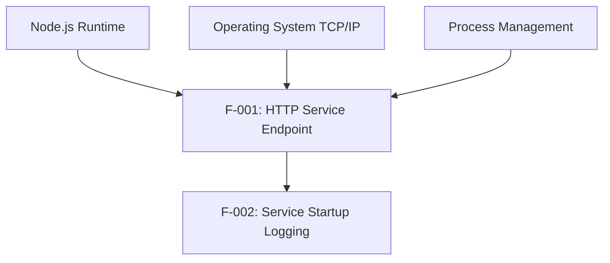
```mermaid
graph TD
    A[Node.js Runtime] --> B[F-001: HTTP Service Endpoint]
    B --> C[F-002: Service Startup Logging]
    D[Operating System TCP/IP] --> B
    E[Process Management] --> B
```

### 2.3.2 Integration Points

**Core Service Integration**

| Integration Point | Description | Dependencies |
|-------------------|-------------|--------------|
| HTTP Server Initialization | Node.js http.createServer() | Node.js built-in http module |
| Network Binding | TCP socket binding to localhost:3000 | OS networking stack |
| Request Processing | HTTP request/response handling | Node.js event loop |

### 2.3.3 Shared Components

**Common Services**

| Component | Usage | Features Affected |
|-----------|-------|------------------|
| Node.js HTTP Module | Core HTTP functionality | F-001 |
| Console API | Logging output | F-002 |
| Process Environment | Runtime execution | F-001, F-002 |

## 2.4 IMPLEMENTATION CONSIDERATIONS

### 2.4.1 Technical Constraints

**Current System Limitations**

| Constraint Type | Limitation | Impact |
|-----------------|------------|--------|
| Configuration Management | Hard-coded hostname and port values | Limited deployment flexibility |
| Error Handling | No error handling mechanisms implemented | Potential service instability |
| Security | No encryption or authentication | Unsuitable for production environments |

**Package Configuration Issues**

| Issue | Description | Resolution Required |
|-------|-------------|-------------------|
| Entry Point Mismatch | package.json references non-existent index.js | Update main field to "server.js" |
| Test Script Placeholder | No functional test implementation | Implement actual test cases |

### 2.4.2 Performance Requirements

**Resource Utilization Targets**

| Metric | Target | Measurement Method |
|--------|--------|-------------------|
| Memory Usage | < 50MB | System resource monitoring |
| Response Time | < 100ms | HTTP request latency measurement |
| Deployment Time | < 60 seconds | Service startup duration |
| Uptime Reliability | 99.9% | Service availability tracking |

### 2.4.3 Scalability Considerations

**Current Architecture Limitations**

| Limitation | Impact | Future Enhancement Required |
|------------|--------|---------------------------|
| Single-threaded Design | No concurrent request handling | Multi-threading or clustering |
| Localhost Binding | Network accessibility restrictions | Configurable host binding |
| Static Response | No dynamic content capability | Request routing framework |

### 2.4.4 Security Implications

**Security Gaps**

| Security Aspect | Current State | Risk Level |
|-----------------|---------------|------------|
| Network Encryption | None (HTTP only) | Medium |
| Authentication | Not implemented | Low (localhost only) |
| Input Validation | None | Low (no input processing) |
| Error Information Disclosure | Basic Node.js errors | Low |

### 2.4.5 Maintenance Requirements

**Operational Considerations**

| Maintenance Area | Current Implementation | Enhancement Needed |
|------------------|----------------------|-------------------|
| Logging Framework | Basic console.log only | Structured logging system |
| Health Monitoring | Manual verification only | Automated health checks |
| Configuration Management | Hard-coded values | Environment-based configuration |
| Deployment Automation | Manual execution | CI/CD pipeline integration |

## 2.5 REQUIREMENTS TRACEABILITY MATRIX

| Feature ID | Business Need | Technical Requirement | Test Criterion |
|------------|---------------|---------------------|----------------|
| F-001 | Deployment validation | HTTP endpoint availability | Successful GET request response |
| F-002 | Operational visibility | Startup confirmation | Console log message verification |

## 2.6 FUTURE ENHANCEMENT ROADMAP

### 2.6.1 Phase 2 Planned Features

**Missing Integration Components** (Not Currently Implemented):

| Enhancement | Description | Business Value |
|-------------|-------------|----------------|
| Backprop Integration | Actual cloud AI platform connectivity | Enable GPU cloud service validation |
| Test Framework | Comprehensive automated testing | Improve reliability and deployment confidence |
| Configuration Management | Environment-based settings | Support multiple deployment targets |
| Enhanced Logging | Structured logging with levels | Improve operational monitoring |

### 2.6.2 Phase 3 Long-term Enhancements

**Advanced Capabilities** (Future Scope):

| Enhancement | Description | Strategic Value |
|-------------|-------------|----------------|
| Multi-endpoint API | RESTful service architecture | Support complex integration scenarios |
| Database Integration | Stateful operations support | Enable persistent test data management |
| Production Monitoring | Comprehensive metrics and alerting | Support production deployment validation |
| Security Framework | Authentication and encryption | Enable secure deployment testing |

#### References

**Files Examined:**
- `server.js` - Core HTTP server implementation and request handling logic
- `package.json` - Application metadata, dependencies, and configuration settings
- `package-lock.json` - Dependency version locking for reproducible deployments
- `README.md` - Project description and purpose documentation

**Technical Specification Sections:**
- `1.1 EXECUTIVE SUMMARY` - Business context, stakeholders, and project impact analysis
- `1.2 SYSTEM OVERVIEW` - System capabilities, limitations, and success criteria
- `1.3 SCOPE` - Feature boundaries, implementation scope, and future enhancement phases

# 3. TECHNOLOGY STACK

## 3.1 PROGRAMMING LANGUAGES

### 3.1.1 JavaScript (Node.js)

**Primary Language Implementation**
- **Platform**: Node.js runtime environment
- **Module Format**: CommonJS with `require()` syntax
- **Language Features**: ES6+ constructs including const declarations, template literals, and arrow functions
- **Evidence**: Core implementation in `server.js` using Node.js built-in modules

**Selection Justification**
- **Zero Configuration Overhead**: Enables rapid deployment without complex build processes
- **Platform Agnostic**: Cross-platform compatibility for diverse cloud deployment targets
- **Minimal Resource Footprint**: Supports performance targets of <50MB memory usage
- **Cloud Integration Ready**: Native support for HTTP services and API integration

**Constraints and Dependencies**
- **Version Requirement**: Node.js 16+ (inferred from npm lockfileVersion: 3 in `package-lock.json`)
- **Module Dependencies**: Limited to Node.js standard library only
- **Runtime Environment**: Single-threaded execution model with event-driven architecture

## 3.2 RUNTIME ENVIRONMENT

### 3.2.1 Node.js Platform

**Current Implementation**
- **Package Manager**: npm version 7+ (confirmed by `lockfileVersion: 3` in `package-lock.json`)
- **Built-in Modules Utilized**:
  - `http` module for HTTP server functionality (`server.js`, line 1)
  - Console API for application logging (`server.js`, line 13)
- **Execution Model**: Single-process HTTP server binding to localhost

**Version Requirements and Compatibility**
- **Minimum Node.js Version**: 16.x (required for npm 7+ features)
- **Recommended Version**: Node.js 18.x or 20.x LTS for production stability
- **Package Lock Version**: 3 (npm 7+ without backwards compatibility affordances)

**Integration Requirements**
- **Network Binding**: IPv4 localhost (127.0.0.1) on port 3000
- **Protocol Support**: HTTP/1.1 with plain text response formatting
- **Resource Constraints**: Memory usage <50MB, response time <100ms

## 3.3 PACKAGE MANAGEMENT

### 3.3.1 npm Configuration

**Current Package Structure**
- **Package Name**: "hello_world" (`package.json`, line 2)
- **Version**: "1.0.0" (`package.json`, line 3)
- **License**: MIT (`package.json`, line 10)
- **Entry Point Issue**: References non-existent "index.js" while actual entry is `server.js`

**Dependency Architecture**
- **External Dependencies**: None (zero-dependency architecture)
- **Dependencies Section**: Not present in `package.json`
- **Lock File Packages**: Empty packages object confirms no external dependencies
- **Security Benefits**: Minimal attack surface, no supply chain vulnerabilities

**Configuration Issues Requiring Resolution**
1. **Entry Point Mismatch**: Update `package.json` main field to reference `server.js`
2. **Test Script**: Currently placeholder that exits with error code
3. **Version Management**: No `.nvmrc` file for Node.js version specification

## 3.4 THIRD-PARTY SERVICES

### 3.4.1 Target Integration Platform

**Backprop.co GPU Cloud Services**
- **Platform Description**: GPU cloud infrastructure "built for AI" for prototyping, training, and hosting
- **Cost Advantage**: Instances are "at least 3-4x cheaper than the big cloud providers"
- **Environment Features**: Latest NVIDIA drivers, Jupyter, PyTorch, transformers, Docker support
- **GPU Options**: A100 instances available for high-performance computing
- **Integration Status**: Planned for Phase 2 implementation (not yet implemented)

**Service Capabilities**
- **Full VM Control**: Complete environment customization capability
- **Persistent Environments**: Support for long-term project development
- **Pre-configured Stack**: Ready-to-use AI/ML development environment
- **Flexible Billing**: Cost-effective GPU access for development and testing

### 3.4.2 Cloud Infrastructure Requirements

**Deployment Target Specifications**
- **Instance Types**: GPU-enabled virtual machines with AI/ML toolchain
- **Network Requirements**: HTTP service accessibility for connectivity testing
- **Performance Validation**: Service must meet <60 second deployment time target
- **Monitoring Integration**: Health check endpoint for operational validation

## 3.5 DEVELOPMENT & DEPLOYMENT

### 3.5.1 Current Development Stack

**Build System**
- **Build Process**: None required (pure Node.js execution)
- **Deployment Method**: Direct Node.js script execution
- **Configuration Management**: Hard-coded values (hostname: '127.0.0.1', port: 3000)
- **Process Management**: Manual service startup and monitoring

**Development Tools**
- **Package Manager**: npm (version 7+)
- **Code Structure**: Single-file implementation (`server.js`)
- **Testing Framework**: Not implemented (placeholder test script only)
- **Version Control**: Git (standard repository structure)

### 3.5.2 Containerization Readiness

**Current State**
- **Docker Configuration**: Not present (no Dockerfile)
- **Container Orchestration**: Not implemented
- **Image Registry**: No container image defined

**Deployment Requirements**
- **Startup Time Target**: <60 seconds from deployment initiation to service availability
- **Resource Limits**: <50MB memory usage constraint
- **Port Configuration**: Static binding to port 3000
- **Health Check**: HTTP GET request to root endpoint

## 3.6 FUTURE TECHNOLOGY ENHANCEMENTS

### 3.6.1 Phase 2 Technology Additions

**Testing Infrastructure**
- **Framework Selection**: To be determined (Jest, Mocha, or native Node.js test runner)
- **Test Coverage**: Automated integration test suite implementation
- **Validation Scope**: Backprop.co platform connectivity and service functionality

**Configuration Management**
- **Environment Variables**: Support for deployment-specific configuration
- **Configuration Files**: Environment-based settings management
- **Multi-target Deployment**: Support for development, staging, and production environments

**Enhanced Logging**
- **Structured Logging**: Replace console.log with production-grade logging framework
- **Log Levels**: Debug, info, warn, error severity classification
- **Output Formatting**: JSON or structured text format for operational monitoring

### 3.6.2 Phase 3 Long-term Technology Stack

**API Framework Evolution**
- **RESTful Architecture**: Multi-endpoint service support
- **Request Routing**: Framework integration for complex URL handling
- **Middleware Support**: Authentication, validation, and logging middleware

**Database Integration**
- **Persistence Layer**: Stateful operation support for test data management
- **Connection Management**: Database connection pooling and lifecycle management
- **Data Storage**: Test results and configuration persistence

**Production Monitoring**
- **Metrics Collection**: Application performance monitoring integration
- **Alerting Systems**: Operational notification and incident management
- **Health Monitoring**: Automated service health validation

**Security Framework**
- **HTTPS Support**: TLS/SSL encryption for secure communication
- **Authentication**: Service authentication mechanisms
- **Input Validation**: Request sanitization and validation middleware

## 3.7 TECHNOLOGY STACK VALIDATION

### 3.7.1 Architecture Verification

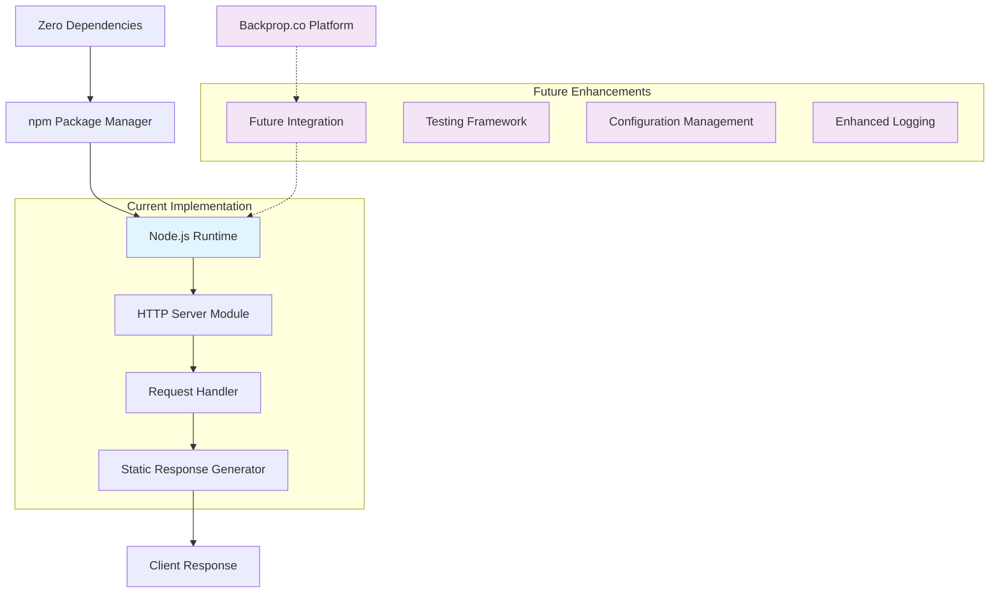
```mermaid
graph TB
    A[Node.js Runtime] --> B[HTTP Server Module]
    B --> C[Request Handler]
    C --> D[Static Response Generator]
    D --> E[Client Response]
    
    F[npm Package Manager] --> A
    G[Zero Dependencies] --> F
    H[Backprop.co Platform] -.-> I[Future Integration]
    I -.-> A
    
    subgraph "Current Implementation"
        A
        B
        C
        D
    end
    
    subgraph "Future Enhancements"
        I
        J[Testing Framework]
        K[Configuration Management]
        L[Enhanced Logging]
    end
    
    style A fill:#e1f5fe
    style H fill:#f3e5f5
    style I fill:#f3e5f5
    style J fill:#f3e5f5
    style K fill:#f3e5f5
    style L fill:#f3e5f5
```

### 3.7.2 Technology Integration Requirements

**Inter-component Dependencies**
- **HTTP Server**: Direct dependency on Node.js built-in `http` module
- **Package Management**: npm lockfileVersion compatibility with Node.js version
- **Cloud Integration**: Future Backprop.co API requirements will drive additional dependencies

**Version Compatibility Matrix**

| Component | Minimum Version | Recommended Version | Compatibility Notes |
|-----------|----------------|--------------------|--------------------|
| Node.js | 16.0 | 20.x LTS | Required for npm lockfileVersion: 3 |
| npm | 7.0 | 9.x+ | Supports current package-lock.json format |
| JavaScript | ES6 | ES2022+ | Current code uses ES6+ features |

#### References

**Files Examined:**
- `server.js` - Core HTTP server implementation using Node.js built-in modules
- `package.json` - Application metadata and npm configuration settings
- `package-lock.json` - Dependency lock file confirming zero external dependencies
- `README.md` - Project description and integration purpose documentation

**Technical Specification Sections:**
- `1.1 EXECUTIVE SUMMARY` - Business context and stakeholder requirements
- `1.2 SYSTEM OVERVIEW` - System architecture and performance targets  
- `2.4 IMPLEMENTATION CONSIDERATIONS` - Technical constraints and limitations
- `2.6 FUTURE ENHANCEMENT ROADMAP` - Planned technology stack evolution

**External Research:**
- Backprop.co platform capabilities and GPU cloud service specifications
- Node.js package-lock.json lockfileVersion requirements and npm compatibility

# 4. PROCESS FLOWCHART

## 4.1 SYSTEM WORKFLOWS

### 4.1.1 Core Business Processes

#### End-to-End User Journey: Cloud Infrastructure Validation

The hao-backprop-test system serves as a foundational testing mechanism for cloud-based AI infrastructure validation. The primary user journey involves deploying and validating basic service functionality within GPU cloud environments.

**Primary User Journey Flow:**
1. **Infrastructure Setup** - DevOps engineers provision cloud resources
2. **Service Deployment** - Deploy hao-backprop-test application to validate deployment pipeline
3. **Connectivity Verification** - Execute HTTP requests to confirm service availability
4. **Integration Validation** - Verify service readiness for complex AI workload integration
5. **Performance Assessment** - Measure response times and resource utilization against defined criteria

**Key Decision Points:**
- Port availability assessment (3000 must be available)
- Network accessibility verification (localhost binding validation)
- Response consistency validation ("Hello, World!" message verification)
- Performance threshold compliance (< 100ms response time, < 50MB memory usage)

#### System Interaction Patterns

The system implements a simplified request-response pattern designed for minimal complexity while providing essential validation capabilities:

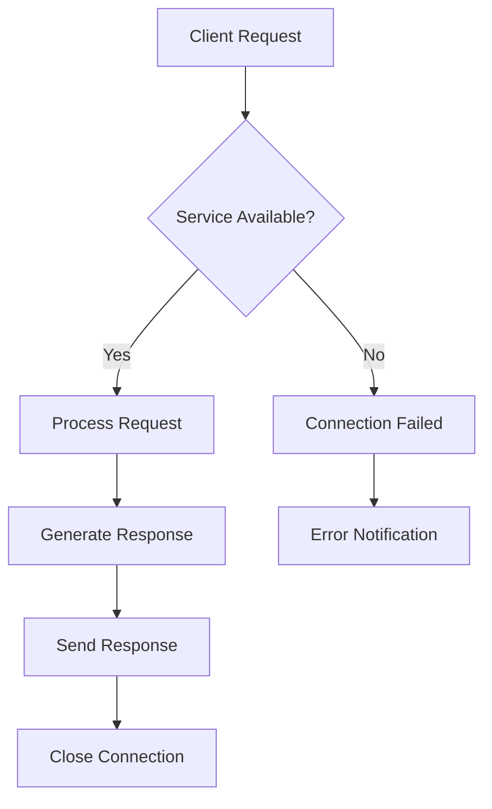
```mermaid
flowchart TD
    A[Client Request] --> B{Service Available?}
    B -->|Yes| C[Process Request]
    B -->|No| D[Connection Failed]
    C --> E[Generate Response]
    E --> F[Send Response]
    F --> G[Close Connection]
    D --> H[Error Notification]
```

### 4.1.2 Integration Workflows

#### Data Flow Between Systems

The current implementation maintains a stateless architecture with minimal external system interaction:

**Request-Response Data Flow:**
1. **Input Processing** - Accept HTTP requests on localhost:3000
2. **Response Generation** - Generate static "Hello, World!\n" response
3. **Header Management** - Set Content-Type: text/plain and HTTP 200 status
4. **Response Delivery** - Transmit response to requesting client

**Integration Boundaries:**
- **Network Interface**: TCP/IP stack integration for HTTP protocol handling
- **Process Environment**: Node.js runtime integration for JavaScript execution
- **System Resources**: Operating system integration for port binding and memory allocation

#### API Interaction Patterns

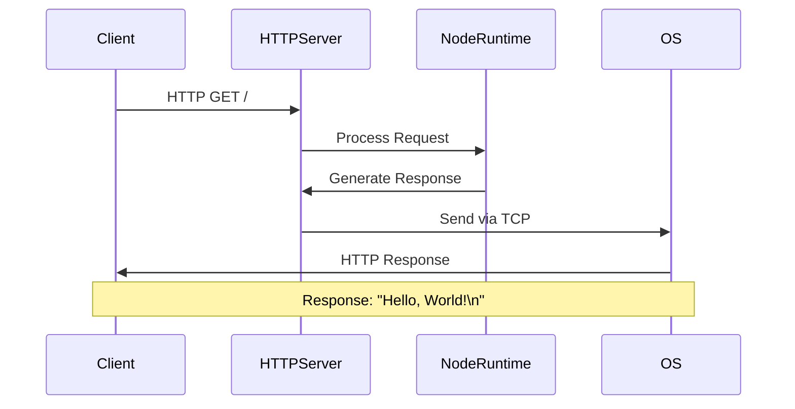
```mermaid
sequenceDiagram
    participant Client
    participant HTTPServer
    participant NodeRuntime
    participant OS

    Client->>HTTPServer: HTTP GET /
    HTTPServer->>NodeRuntime: Process Request
    NodeRuntime->>HTTPServer: Generate Response
    HTTPServer->>OS: Send via TCP
    OS->>Client: HTTP Response
    Note over Client,OS: Response: "Hello, World!\n"
```

#### Event Processing Flows

The system operates on a synchronous event model with immediate request processing:

**Event Sequence:**
1. **Server Initialization Event** - HTTP server creation and port binding
2. **Startup Logging Event** - Console output generation for operational confirmation
3. **Request Reception Event** - Incoming HTTP request detection
4. **Response Generation Event** - Static response creation and transmission
5. **Connection Closure Event** - Client connection termination

## 4.2 DETAILED PROCESS FLOWS

### 4.2.1 System Startup Process

The service startup process follows a sequential initialization pattern essential for deployment validation:

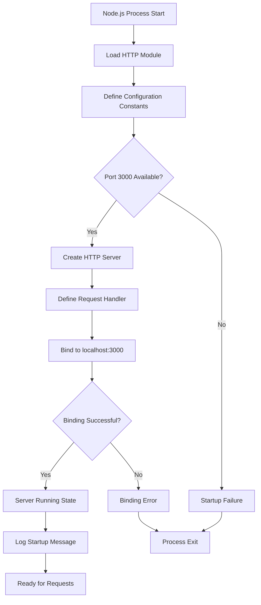
```mermaid
flowchart TD
    A[Node.js Process Start] --> B[Load HTTP Module]
    B --> C[Define Configuration Constants]
    C --> D{Port 3000 Available?}
    D -->|Yes| E[Create HTTP Server]
    D -->|No| F[Startup Failure]
    E --> G[Define Request Handler]
    G --> H[Bind to localhost:3000]
    H --> I{Binding Successful?}
    I -->|Yes| J[Server Running State]
    I -->|No| K[Binding Error]
    J --> L[Log Startup Message]
    L --> M[Ready for Requests]
    F --> N[Process Exit]
    K --> N
```

**Startup Process Steps:**
1. **Module Loading** (line 1 of server.js) - Import Node.js built-in http module
2. **Configuration Definition** (lines 3-4) - Set hostname (127.0.0.1) and port (3000) constants
3. **Server Creation** (lines 6-10) - Create HTTP server with inline request handler
4. **Port Binding** (lines 12-14) - Bind server to specified host and port
5. **Startup Confirmation** (line 14) - Log operational status message

**Critical Success Factors:**
- Port 3000 availability on localhost interface
- Node.js runtime environment accessibility
- TCP/IP stack functionality
- Process memory allocation success (< 50MB requirement)

### 4.2.2 HTTP Request Processing Flow

The request processing implements a stateless, synchronous response pattern optimized for validation purposes:

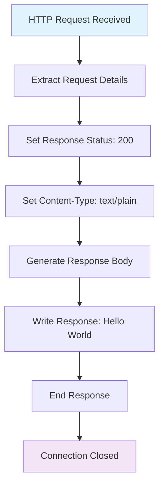
```mermaid
flowchart TD
    A[HTTP Request Received] --> B[Extract Request Details]
    B --> C[Set Response Status: 200]
    C --> D[Set Content-Type: text/plain]
    D --> E[Generate Response Body]
    E --> F[Write Response: Hello World]
    F --> G[End Response]
    G --> H[Connection Closed]
    
    style A fill:#e1f5fe
    style H fill:#f3e5f5
```

**Request Processing Specifications:**
- **Input Validation**: None implemented (accepts all HTTP methods and paths)
- **Response Generation**: Static "Hello, World!\n" string
- **Header Management**: Content-Type set to "text/plain"
- **Status Code**: Always returns HTTP 200 OK
- **Performance Target**: < 100ms response time requirement

### 4.2.3 Deployment Validation Process

The deployment validation process ensures service readiness within cloud environments:

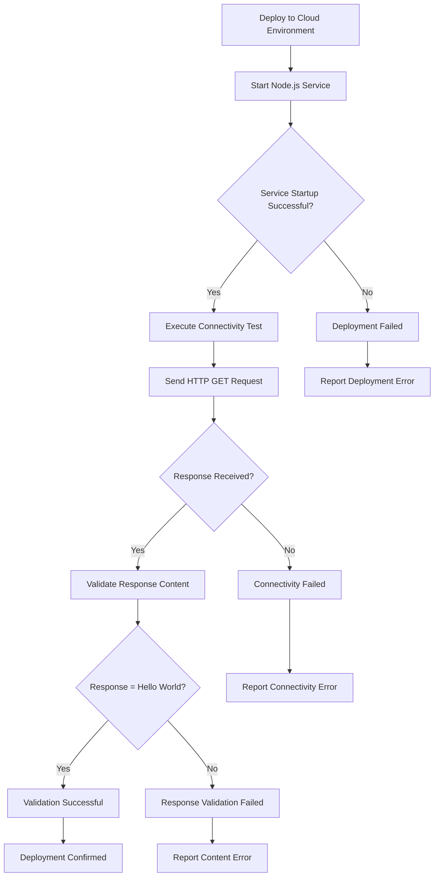
```mermaid
flowchart TD
    A[Deploy to Cloud Environment] --> B[Start Node.js Service]
    B --> C{Service Startup Successful?}
    C -->|Yes| D[Execute Connectivity Test]
    C -->|No| E[Deployment Failed]
    D --> F[Send HTTP GET Request]
    F --> G{Response Received?}
    G -->|Yes| H[Validate Response Content]
    G -->|No| I[Connectivity Failed]
    H --> J{Response = Hello World?}
    J -->|Yes| K[Validation Successful]
    J -->|No| L[Response Validation Failed]
    E --> M[Report Deployment Error]
    I --> N[Report Connectivity Error]
    L --> O[Report Content Error]
    K --> P[Deployment Confirmed]
```

**Validation Checkpoints:**
- **Service Availability**: Confirmation of port 3000 binding
- **HTTP Connectivity**: Successful request-response cycle
- **Content Validation**: Exact match for "Hello, World!\n" response
- **Performance Validation**: Response time within < 100ms threshold

## 4.3 ERROR HANDLING AND RECOVERY

### 4.3.1 Current Error Handling Gaps

The current implementation lacks comprehensive error handling mechanisms, representing significant operational risks:

**Unhandled Error Scenarios:**
- **Port Binding Conflicts**: No handling for port 3000 already in use
- **Network Interface Failures**: No fallback for localhost binding issues
- **Process Resource Exhaustion**: No memory or CPU monitoring
- **Client Connection Errors**: No error response mechanisms

### 4.3.2 Recommended Error Handling Flows

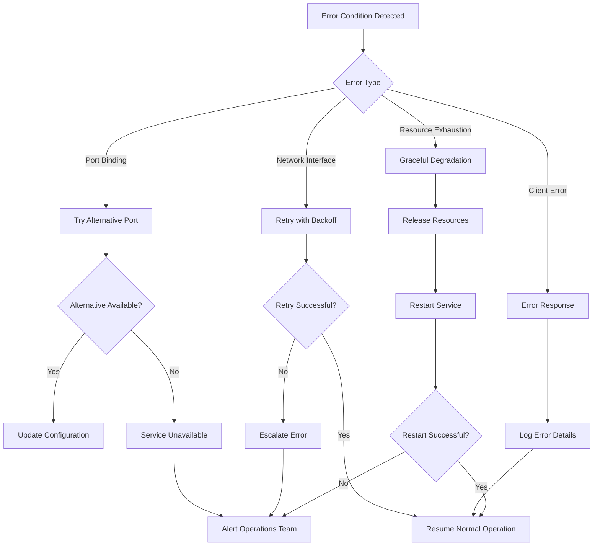
```mermaid
flowchart TD
    A[Error Condition Detected] --> B{Error Type}
    B -->|Port Binding| C[Try Alternative Port]
    B -->|Network Interface| D[Retry with Backoff]
    B -->|Resource Exhaustion| E[Graceful Degradation]
    B -->|Client Error| F[Error Response]
    
    C --> G{Alternative Available?}
    G -->|Yes| H[Update Configuration]
    G -->|No| I[Service Unavailable]
    
    D --> J{Retry Successful?}
    J -->|Yes| K[Resume Normal Operation]
    J -->|No| L[Escalate Error]
    
    E --> M[Release Resources]
    M --> N[Restart Service]
    
    F --> O[Log Error Details]
    O --> K
    
    I --> P[Alert Operations Team]
    L --> P
    N --> Q{Restart Successful?}
    Q -->|Yes| K
    Q -->|No| P
```

### 4.3.3 Recovery Procedures

**Automatic Recovery Mechanisms (Recommended):**
1. **Port Conflict Resolution**: Attempt binding to alternative ports (3001-3010)
2. **Network Retry Logic**: Implement exponential backoff for network failures
3. **Health Check Implementation**: Regular service availability verification
4. **Graceful Shutdown**: Proper connection closure and resource cleanup

## 4.4 STATE MANAGEMENT

### 4.4.1 Service State Transitions

The system maintains six distinct operational states throughout its lifecycle:

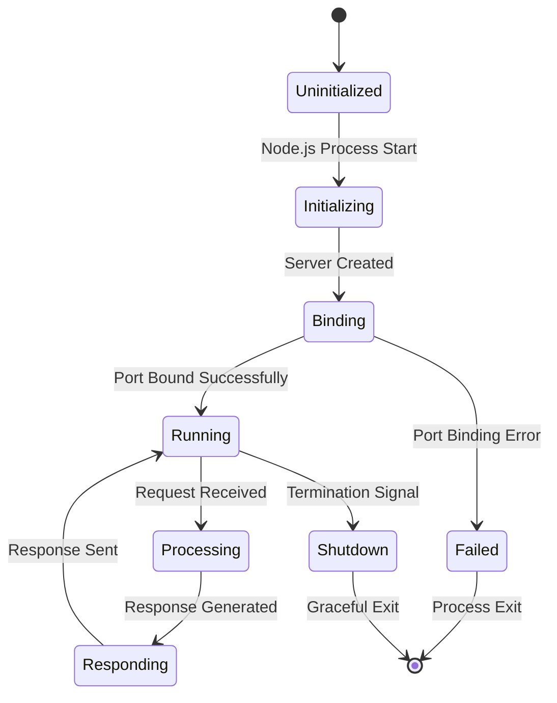
```mermaid
stateDiagram-v2
    [*] --> Uninitialized
    Uninitialized --> Initializing: Node.js Process Start
    Initializing --> Binding: Server Created
    Binding --> Running: Port Bound Successfully
    Binding --> Failed: Port Binding Error
    Running --> Processing: Request Received
    Processing --> Responding: Response Generated
    Responding --> Running: Response Sent
    Failed --> [*]: Process Exit
    Running --> Shutdown: Termination Signal
    Shutdown --> [*]: Graceful Exit
```

**State Descriptions:**
- **Uninitialized**: Pre-execution state before Node.js process startup
- **Initializing**: Module loading and server object creation
- **Binding**: Network port binding attempt phase
- **Running**: Operational state accepting incoming requests
- **Processing**: Active request handling and response generation
- **Responding**: Response transmission and connection management

### 4.4.2 Data Persistence Points

The current stateless architecture maintains no persistent data storage:

**Memory State Management:**
- **Configuration Constants**: hostname and port values stored in process memory
- **HTTP Server Instance**: Maintained in Node.js event loop
- **Request Context**: Temporary storage during request processing lifecycle
- **Response Buffer**: Ephemeral storage for response data transmission

**Persistent State Requirements (Future Enhancement):**
- **Configuration Files**: Environment-based hostname and port management
- **Request Logging**: Persistent storage for operational monitoring
- **Performance Metrics**: Historical data collection for analysis
- **Health Status**: Service availability and performance tracking

### 4.4.3 Transaction Boundaries

**HTTP Request Transaction Flow:**
1. **Transaction Start**: Request reception from client
2. **Processing Phase**: Request header parsing and validation
3. **Response Generation**: Static content creation
4. **Transmission Phase**: Response delivery to client
5. **Transaction End**: Connection closure and resource cleanup

**Resource Management:**
- **Memory Allocation**: Minimal per-request memory usage
- **Network Connections**: Single connection per request lifecycle
- **Process Resources**: Shared HTTP server instance across all requests

## 4.5 INTEGRATION SEQUENCE DIAGRAMS

### 4.5.1 Cloud Deployment Integration

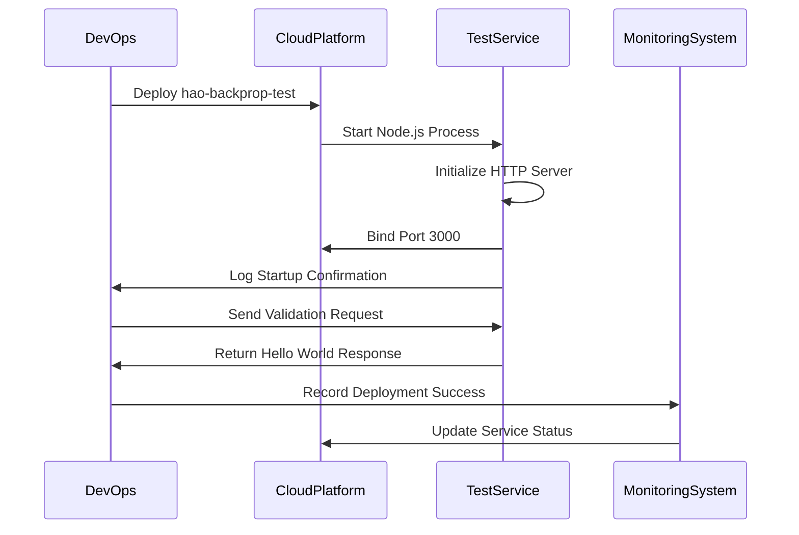
```mermaid
sequenceDiagram
    participant DevOps
    participant CloudPlatform
    participant TestService
    participant MonitoringSystem

    DevOps->>CloudPlatform: Deploy hao-backprop-test
    CloudPlatform->>TestService: Start Node.js Process
    TestService->>TestService: Initialize HTTP Server
    TestService->>CloudPlatform: Bind Port 3000
    TestService->>DevOps: Log Startup Confirmation
    DevOps->>TestService: Send Validation Request
    TestService->>DevOps: Return Hello World Response
    DevOps->>MonitoringSystem: Record Deployment Success
    MonitoringSystem->>CloudPlatform: Update Service Status
```

### 4.5.2 Performance Monitoring Integration

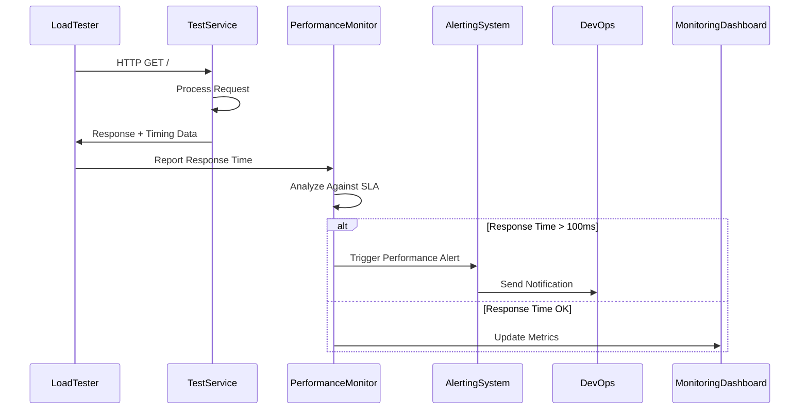
```mermaid
sequenceDiagram
    participant LoadTester
    participant TestService
    participant PerformanceMonitor
    participant AlertingSystem

    LoadTester->>TestService: HTTP GET /
    TestService->>TestService: Process Request
    TestService->>LoadTester: Response + Timing Data
    LoadTester->>PerformanceMonitor: Report Response Time
    PerformanceMonitor->>PerformanceMonitor: Analyze Against SLA
    alt Response Time > 100ms
        PerformanceMonitor->>AlertingSystem: Trigger Performance Alert
        AlertingSystem->>DevOps: Send Notification
    else Response Time OK
        PerformanceMonitor->>MonitoringDashboard: Update Metrics
    end
```

## 4.6 TIMING AND SLA CONSIDERATIONS

### 4.6.1 Performance Requirements

**Response Time SLAs:**
- **Target Response Time**: < 100ms for HTTP requests
- **Service Startup Time**: < 5 seconds for port binding completion
- **Deployment Window**: < 60 seconds total deployment duration
- **Service Availability**: 99.9% uptime reliability requirement

**Resource Utilization Constraints:**
- **Memory Usage**: < 50MB maximum process memory consumption
- **CPU Utilization**: Minimal CPU usage for static response generation
- **Network Bandwidth**: Minimal bandwidth requirements for simple text responses

### 4.6.2 Monitoring and Alerting Flows

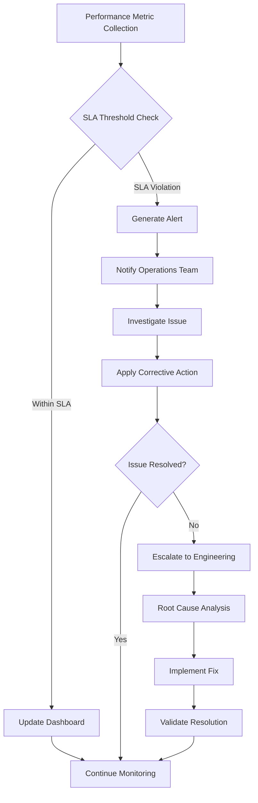
```mermaid
flowchart TD
    A[Performance Metric Collection] --> B{SLA Threshold Check}
    B -->|Within SLA| C[Update Dashboard]
    B -->|SLA Violation| D[Generate Alert]
    C --> E[Continue Monitoring]
    D --> F[Notify Operations Team]
    F --> G[Investigate Issue]
    G --> H[Apply Corrective Action]
    H --> I{Issue Resolved?}
    I -->|Yes| E
    I -->|No| J[Escalate to Engineering]
    J --> K[Root Cause Analysis]
    K --> L[Implement Fix]
    L --> M[Validate Resolution]
    M --> E
```

### 4.6.3 Capacity Planning Considerations

**Current Capacity Limitations:**
- **Concurrent Connections**: Single-threaded Node.js event loop handles sequential requests
- **Request Throughput**: Limited by synchronous processing model
- **Scalability Constraints**: No horizontal scaling mechanisms implemented

**Future Enhancement Requirements:**
- **Load Balancing**: Multiple instance deployment for high availability
- **Connection Pooling**: Efficient resource utilization for concurrent requests
- **Auto-scaling**: Dynamic instance provisioning based on demand patterns

## 4.7 VALIDATION RULES AND COMPLIANCE

### 4.7.1 Business Rules Implementation

**Current Business Logic:**
- **Universal Response Rule**: All requests receive identical "Hello, World!\n" response
- **Protocol Compliance**: HTTP/1.1 standard adherence for request-response cycle
- **Status Code Consistency**: Always return HTTP 200 OK status
- **Content-Type Declaration**: Consistent text/plain header specification

### 4.7.2 Data Validation Requirements

**Input Validation (Currently Not Implemented):**
- **Request Method Validation**: No restriction on HTTP methods
- **Path Validation**: No path-based routing or validation
- **Header Validation**: No request header processing or validation
- **Payload Validation**: No request body parsing or validation

**Recommended Validation Enhancements:**
- **HTTP Method Filtering**: Restrict to GET requests for security
- **Request Size Limits**: Implement maximum request size constraints
- **Rate Limiting**: Prevent abuse through request frequency controls
- **Input Sanitization**: Basic security measures for future functionality

### 4.7.3 Authorization Checkpoints

**Security Implementation Gaps:**
- **Authentication**: No user authentication mechanisms
- **Authorization**: No access control or permission validation
- **Encryption**: No HTTPS or data encryption implementation
- **Audit Logging**: No security event logging or monitoring

### 4.7.4 Regulatory Compliance Considerations

**HTTP Protocol Compliance:**
- **RFC 7230**: HTTP/1.1 message syntax and routing compliance
- **RFC 7231**: HTTP/1.1 semantics and content compliance
- **Status Code Standards**: Proper use of HTTP 200 OK response code
- **Header Specifications**: Correct Content-Type header implementation

#### References

- `server.js` - Core HTTP server implementation and request processing logic
- `package.json` - Application configuration and dependency management specifications  
- `README.md` - Project description and integration purpose documentation
- `package-lock.json` - Dependency version locking for reproducible deployments
- Technical Specification Section 1.1 EXECUTIVE SUMMARY - Business context and stakeholder requirements
- Technical Specification Section 1.2 SYSTEM OVERVIEW - High-level system design and success criteria
- Technical Specification Section 2.2 FUNCTIONAL REQUIREMENTS TABLE - Detailed process specifications
- Technical Specification Section 2.3 FEATURE RELATIONSHIPS - Component dependencies and integration points
- Technical Specification Section 2.4 IMPLEMENTATION CONSIDERATIONS - Technical constraints and performance requirements

# 5. SYSTEM ARCHITECTURE

## 5.1 HIGH-LEVEL ARCHITECTURE

### 5.1.1 System Overview

#### Overall System Architecture Style and Rationale

The hao-backprop-test system implements a **minimalist monolithic architecture** designed specifically for cloud infrastructure validation and deployment pipeline testing. The architecture follows a **simplicity-first design pattern**, prioritizing rapid deployment, predictable behavior, and minimal resource consumption over feature complexity.

The system operates as a **stateless HTTP service** built on Node.js runtime, employing a **zero-dependency approach** to eliminate external vulnerabilities and ensure consistent behavior across diverse cloud environments. This architectural choice directly supports the system's primary mission as a foundational testing mechanism for GPU cloud infrastructure validation.

#### Key Architectural Principles and Patterns

- **Single Responsibility Principle**: The system serves one primary function - providing HTTP connectivity validation through a standardized "Hello, World!" response
- **Zero Configuration Pattern**: All operational parameters are hard-coded to eliminate configuration complexity and potential deployment failures
- **Fail-Fast Architecture**: Immediate service startup with minimal initialization requirements
- **Resource Constraint Optimization**: Designed to operate within strict limits (<50MB memory, <100ms response time)

#### System Boundaries and Major Interfaces

The system operates within clearly defined boundaries optimized for testing scenarios:

- **Network Interface**: IPv4 localhost binding (127.0.0.1:3000) using HTTP/1.1 protocol
- **Process Boundary**: Single Node.js process with synchronous request handling
- **Integration Interface**: Simple HTTP GET endpoint serving as both functional service and health check
- **Resource Boundary**: Minimal memory footprint with no persistent storage requirements

### 5.1.2 Core Components Table

| Component Name | Primary Responsibility | Key Dependencies | Integration Points |
|---------------|----------------------|------------------|-------------------|
| HTTP Server Module | Request reception and response generation | Node.js http module | Network stack, client applications |
| Request Handler | Static response generation and header management | None | HTTP Server Module |
| Service Startup | Server initialization and operational logging | Node.js console API | Operating system, deployment tools |

### 5.1.3 Data Flow Description

#### Primary Data Flows Between Components

The system implements a **synchronous request-response data flow** with minimal processing overhead:

1. **Inbound Request Flow**: HTTP requests arrive at the bound network interface (127.0.0.1:3000) and are immediately processed by the Node.js event loop
2. **Response Generation Flow**: Each request triggers immediate generation of a standardized response payload ("Hello, World!\n") with appropriate HTTP headers
3. **Outbound Response Flow**: Responses are transmitted directly to the requesting client with connection closure upon completion

#### Integration Patterns and Protocols

- **Protocol Stack**: HTTP/1.1 over TCP/IPv4 with plain text content delivery
- **Communication Pattern**: Synchronous request-response without session persistence
- **Header Management**: Standardized Content-Type (text/plain) and status code (200 OK) for all successful requests

#### Data Transformation Points

The system performs minimal data transformation:
- **Request Processing**: HTTP requests are accepted without payload inspection or validation
- **Response Generation**: Static string constant transformed into HTTP response with appropriate headers
- **Encoding**: UTF-8 text encoding for response body transmission

#### Key Data Stores and Caches

**No Persistent Storage**: The system operates entirely in memory without data persistence requirements, caching mechanisms, or state management.

### 5.1.4 External Integration Points

| System Name | Integration Type | Data Exchange Pattern | Protocol/Format |
|-------------|-----------------|----------------------|-----------------|
| Client Applications | Inbound HTTP | Request-Response | HTTP/1.1 Plain Text |
| Monitoring Systems | Health Check | Polling | HTTP GET |
| Deployment Tools | Service Management | Process Control | Operating System APIs |

## 5.2 COMPONENT DETAILS

### 5.2.1 HTTP Server Module

#### Purpose and Responsibilities
- **Primary Function**: HTTP request reception and response delivery
- **Request Processing**: Accept inbound connections on designated port (3000)
- **Response Management**: Generate consistent "Hello, World!" responses with appropriate headers
- **Connection Handling**: Manage client connection lifecycle from establishment to closure

#### Technologies and Frameworks Used
- **Core Technology**: Node.js built-in `http` module
- **Runtime Environment**: Node.js 16+ with npm 7+ compatibility
- **Protocol Implementation**: Native HTTP/1.1 support without external libraries
- **Execution Model**: Single-threaded event-driven architecture

#### Key Interfaces and APIs
- **Network Interface**: TCP socket binding to 127.0.0.1:3000
- **Request Interface**: HTTP GET method handling for all paths
- **Response Interface**: Standard HTTP response with 200 status code and text/plain content type
- **Logging Interface**: Console output for operational status reporting

#### Data Persistence Requirements
**No Persistence Required**: The system operates as a stateless service without data storage, session management, or state persistence requirements.

#### Scaling Considerations
- **Vertical Scaling**: Single-process limitation requires container-level scaling for increased capacity
- **Horizontal Scaling**: Load balancing can distribute traffic across multiple service instances
- **Resource Efficiency**: Minimal memory footprint (<50MB) supports high-density deployment scenarios

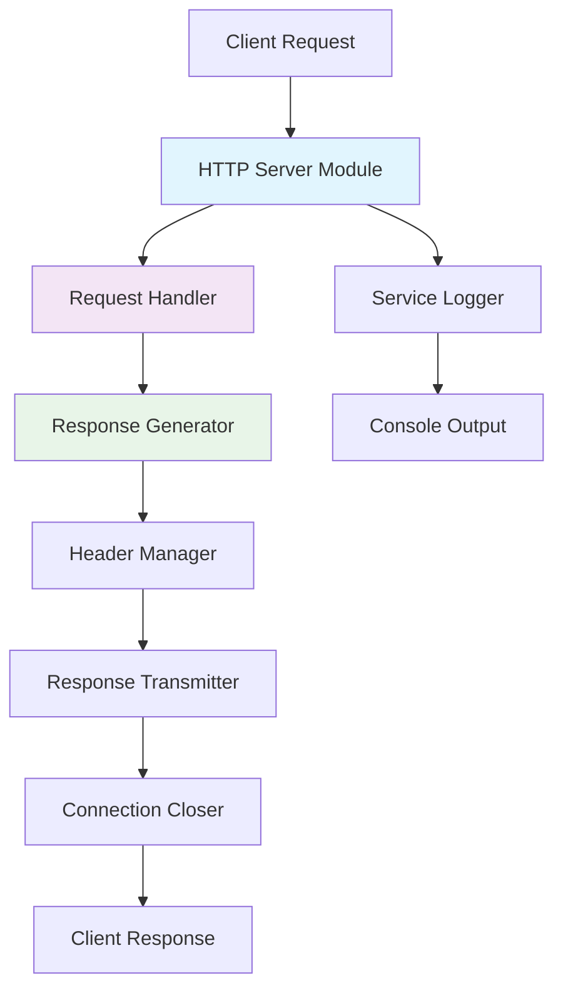
```mermaid
graph TD
    A[Client Request] --> B[HTTP Server Module]
    B --> C[Request Handler]
    C --> D[Response Generator]
    D --> E[Header Manager]
    E --> F[Response Transmitter]
    F --> G[Connection Closer]
    G --> H[Client Response]
    
    B --> I[Service Logger]
    I --> J[Console Output]
    
    style B fill:#e1f5fe
    style C fill:#f3e5f5
    style D fill:#e8f5e8
```

### 5.2.2 Request Handler Component

#### Purpose and Responsibilities
- **Request Processing**: Accept all incoming HTTP requests regardless of path or method
- **Response Standardization**: Generate consistent response payload for all requests
- **Error Prevention**: Eliminate request-specific processing to prevent runtime errors

#### State Transition Diagram

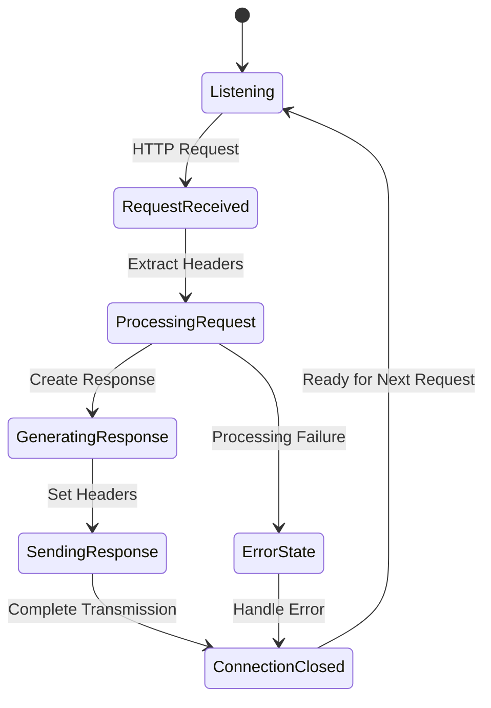
```mermaid
stateDiagram-v2
    [*] --> Listening
    Listening --> RequestReceived: HTTP Request
    RequestReceived --> ProcessingRequest: Extract Headers
    ProcessingRequest --> GeneratingResponse: Create Response
    GeneratingResponse --> SendingResponse: Set Headers
    SendingResponse --> ConnectionClosed: Complete Transmission
    ConnectionClosed --> Listening: Ready for Next Request
    
    ProcessingRequest --> ErrorState: Processing Failure
    ErrorState --> ConnectionClosed: Handle Error
```

### 5.2.3 Service Startup Component

#### Key Flow Sequence Diagram

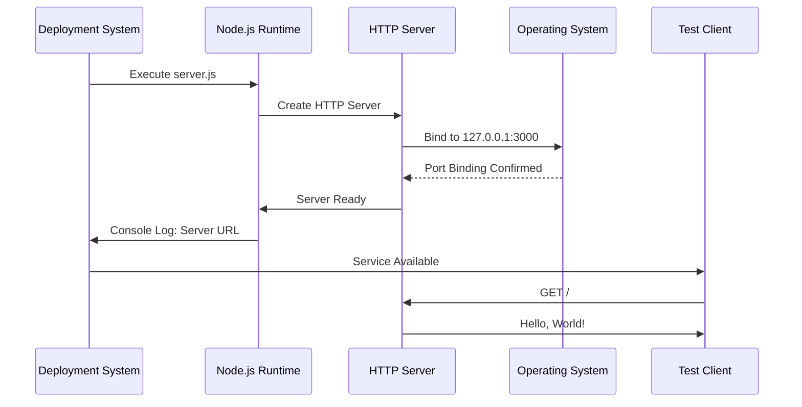
```mermaid
sequenceDiagram
    participant Deploy as Deployment System
    participant Node as Node.js Runtime
    participant HTTP as HTTP Server
    participant OS as Operating System
    participant Client as Test Client
    
    Deploy->>Node: Execute server.js
    Node->>HTTP: Create HTTP Server
    HTTP->>OS: Bind to 127.0.0.1:3000
    OS-->>HTTP: Port Binding Confirmed
    HTTP->>Node: Server Ready
    Node->>Deploy: Console Log: Server URL
    Deploy->>Client: Service Available
    Client->>HTTP: GET /
    HTTP->>Client: Hello, World!
```

## 5.3 TECHNICAL DECISIONS

### 5.3.1 Architecture Style Decisions and Tradeoffs

#### Monolithic vs. Microservices Decision

**Decision**: Implement monolithic single-file architecture
**Rationale**: 
- **Deployment Simplicity**: Single file deployment eliminates orchestration complexity
- **Testing Focus**: Minimal surface area aligns with infrastructure validation requirements
- **Resource Efficiency**: Eliminates inter-service communication overhead
- **Operational Simplicity**: Single process monitoring and management

**Tradeoffs**:
- **Limited Scalability**: Single process constraint requires external scaling mechanisms
- **No Service Isolation**: All functionality within single failure domain
- **Extension Challenges**: Adding features requires modifying single file

#### Zero-Dependency Architecture Decision

**Decision**: Eliminate all external npm dependencies
**Rationale**:
- **Security**: No third-party vulnerability exposure
- **Reliability**: Eliminates dependency version conflicts and supply chain risks
- **Deployment Speed**: No npm install requirements reduce deployment time
- **Predictability**: Consistent behavior across environments

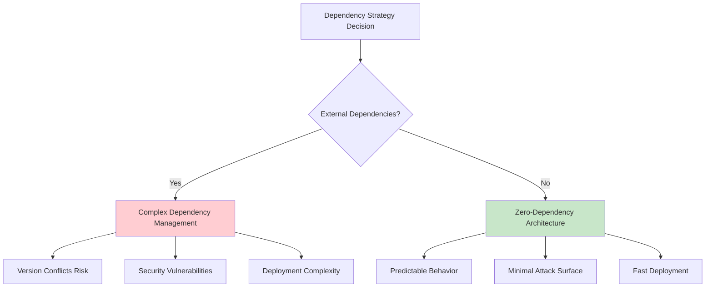
```mermaid
graph TD
    A[Dependency Strategy Decision] --> B{External Dependencies?}
    B -->|Yes| C[Complex Dependency Management]
    B -->|No| D[Zero-Dependency Architecture]
    
    C --> E[Version Conflicts Risk]
    C --> F[Security Vulnerabilities]
    C --> G[Deployment Complexity]
    
    D --> H[Predictable Behavior]
    D --> I[Minimal Attack Surface]
    D --> J[Fast Deployment]
    
    style D fill:#c8e6c9
    style C fill:#ffcdd2
```

### 5.3.2 Communication Pattern Choices

#### Synchronous vs. Asynchronous Processing

**Decision**: Implement synchronous request-response processing
**Justification**:
- **Simplicity**: Eliminates callback and promise management complexity
- **Predictable Latency**: Consistent response times under <100ms target
- **Testing Suitability**: Immediate response validation for infrastructure testing

#### Protocol Selection Decision Tree

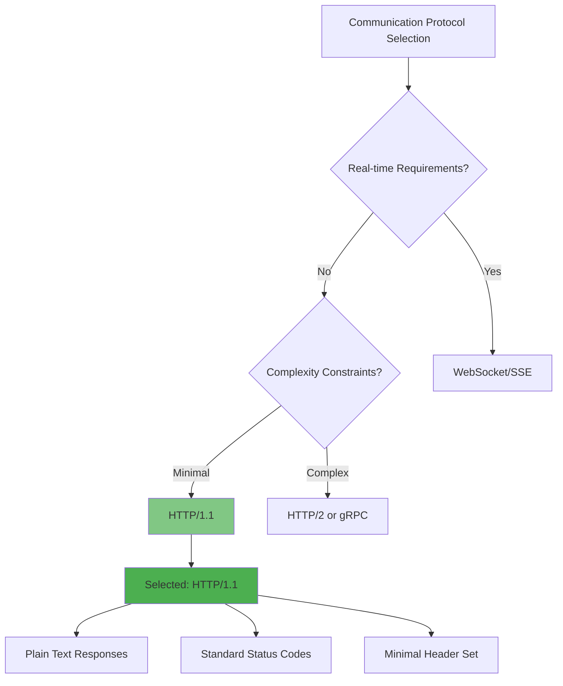
```mermaid
flowchart TD
    A[Communication Protocol Selection] --> B{Real-time Requirements?}
    B -->|No| C{Complexity Constraints?}
    B -->|Yes| D[WebSocket/SSE]
    C -->|Minimal| E[HTTP/1.1]
    C -->|Complex| F[HTTP/2 or gRPC]
    
    E --> G[Selected: HTTP/1.1]
    G --> H[Plain Text Responses]
    G --> I[Standard Status Codes]
    G --> J[Minimal Header Set]
    
    style G fill:#4caf50
    style E fill:#81c784
```

### 5.3.3 Data Storage Solution Rationale

#### Stateless Architecture Decision

**Decision**: Implement completely stateless service
**Benefits**:
- **Horizontal Scaling**: Multiple instances can run simultaneously without coordination
- **Fault Tolerance**: Instance failures don't affect data integrity
- **Testing Purity**: Each request is independent, simplifying validation

**Constraints**:
- **No Session Management**: Cannot maintain client state across requests
- **No Metrics Persistence**: Cannot track historical performance data
- **Limited Functionality**: Cannot implement complex workflows requiring state

## 5.4 CROSS-CUTTING CONCERNS

### 5.4.1 Monitoring and Observability Approach

#### Current Monitoring Limitations
The system currently provides minimal observability capabilities:
- **Startup Logging**: Single console.log statement confirming server availability
- **No Metrics Collection**: Absence of performance, error rate, or resource utilization monitoring
- **No Health Check Endpoint**: Root endpoint serves as implicit health validation

#### Recommended Monitoring Framework
- **Application Performance Monitoring**: Response time tracking and error rate measurement
- **Resource Monitoring**: Memory usage and CPU utilization tracking against <50MB constraint
- **Uptime Monitoring**: Continuous availability verification through external health checks

### 5.4.2 Logging and Tracing Strategy

#### Current Logging Implementation
```javascript
// Current minimal logging in server.js
console.log(`Server running at http://127.0.0.1:${PORT}/`);
```

#### Recommended Logging Enhancements
- **Structured Logging**: JSON-formatted log entries for automated processing
- **Request Logging**: Individual request timestamps and response times
- **Error Logging**: Comprehensive error capture for troubleshooting

### 5.4.3 Error Handling Patterns

#### Current Error Handling Gaps
- **No Port Conflict Resolution**: Service fails if port 3000 is unavailable
- **No Network Error Handling**: No recovery mechanisms for binding failures
- **No Resource Exhaustion Management**: No monitoring or mitigation for memory/CPU limits

#### Recommended Error Handling Flow

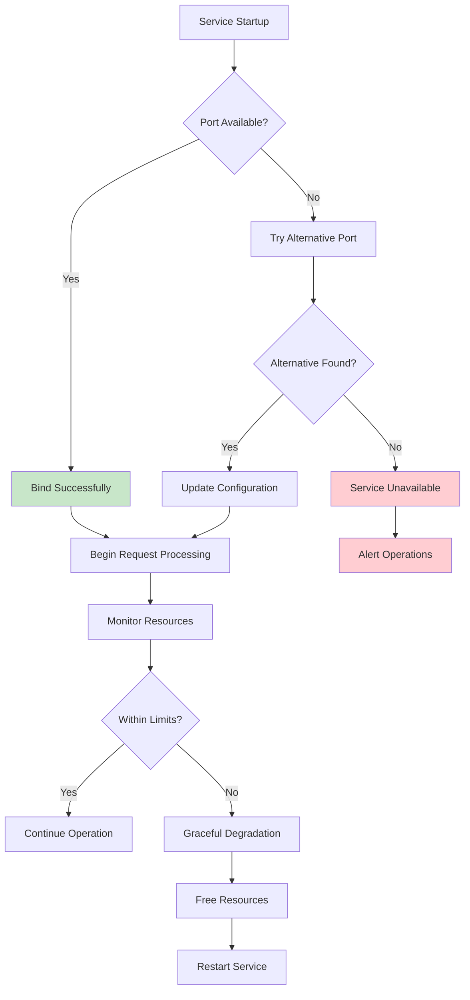
```mermaid
flowchart TD
    A[Service Startup] --> B{Port Available?}
    B -->|Yes| C[Bind Successfully]
    B -->|No| D[Try Alternative Port]
    
    D --> E{Alternative Found?}
    E -->|Yes| F[Update Configuration]
    E -->|No| G[Service Unavailable]
    
    C --> H[Begin Request Processing]
    H --> I[Monitor Resources]
    I --> J{Within Limits?}
    J -->|Yes| K[Continue Operation]
    J -->|No| L[Graceful Degradation]
    
    F --> H
    G --> M[Alert Operations]
    L --> N[Free Resources]
    N --> O[Restart Service]
    
    style C fill:#c8e6c9
    style G fill:#ffcdd2
    style M fill:#ffcdd2
```

### 5.4.4 Authentication and Authorization Framework

#### Current Security Model
**No Authentication Required**: The system operates as an open endpoint suitable for infrastructure testing scenarios where access control would interfere with validation processes.

#### Security Considerations
- **Network Isolation**: Localhost-only binding (127.0.0.1) provides natural access restriction
- **No Sensitive Data**: Static response eliminates data exposure risks
- **Minimal Attack Surface**: Zero dependencies and simple functionality reduce vulnerability exposure

### 5.4.5 Performance Requirements and SLAs

#### Defined Performance Targets

| Metric | Target Value | Measurement Method | Critical Threshold |
|--------|--------------|-------------------|-------------------|
| Response Time | < 100ms | HTTP request latency | 150ms |
| Memory Usage | < 50MB | Process monitoring | 75MB |
| Uptime | 99.9% | Health check success rate | 99% |

#### Performance Characteristics
- **Throughput**: Single-threaded processing with minimal per-request overhead
- **Latency**: Synchronous processing ensures consistent response times
- **Resource Efficiency**: Zero-dependency architecture minimizes resource consumption

### 5.4.6 Disaster Recovery Procedures

#### Current Recovery Capabilities
**Limited Recovery Options**: Manual service restart is the primary recovery mechanism for service failures.

#### Recommended Recovery Framework
- **Automatic Restart**: Process monitoring with automatic restart on failure
- **Port Failover**: Alternative port binding strategy for port conflicts
- **Health Check Integration**: External monitoring systems for proactive failure detection
- **Graceful Shutdown**: Proper connection closure and resource cleanup procedures

#### References

#### Files Examined
- `server.js` - Core HTTP server implementation and request handling logic
- `package.json` - npm configuration and project metadata
- `package-lock.json` - Dependency lockfile confirming zero external dependencies  
- `README.md` - Project description and context

#### Technical Specification Sections Referenced
- `1.2 SYSTEM OVERVIEW` - System context, capabilities, and success criteria
- `3.1 PROGRAMMING LANGUAGES` - JavaScript/Node.js language specifications
- `3.2 RUNTIME ENVIRONMENT` - Node.js platform requirements and compatibility
- `3.5 DEVELOPMENT & DEPLOYMENT` - Development stack and deployment methods
- `4.1 SYSTEM WORKFLOWS` - Core business processes and integration patterns
- `4.3 ERROR HANDLING AND RECOVERY` - Error handling gaps and recovery procedures

# 6. SYSTEM COMPONENTS DESIGN

## 6.1 CORE SERVICES ARCHITECTURE

### 6.1.1 Applicability Assessment

**Core Services Architecture is not applicable for this system.**

The hao-backprop-test system implements a deliberately designed **monolithic single-file architecture** that does not require microservices, distributed architecture, or distinct service components. This architectural decision is documented in Section 5.3.1 as an explicit choice over microservices-based approaches.

#### 6.1.1.1 Architectural Decision Rationale

The system's architectural approach was selected based on the following documented criteria:

| Decision Factor | Monolithic Choice | Services Architecture Alternative |
|-----------------|-------------------|-----------------------------------|
| **Deployment Complexity** | Single file deployment eliminates orchestration complexity | Would require container orchestration, service mesh, API gateways |
| **Testing Focus** | Minimal surface area aligns with infrastructure validation requirements | Would introduce inter-service communication testing complexity |
| **Resource Efficiency** | Eliminates inter-service communication overhead | Would require additional memory, CPU for service coordination |
| **Operational Simplicity** | Single process monitoring and management | Would require distributed monitoring, logging aggregation, service discovery |

#### 6.1.1.2 System Characteristics Analysis

The current implementation exhibits characteristics that fundamentally preclude core services architecture:

**Single Component System:**
- Entire application contained within `server.js` (14 lines of code)
- Zero external dependencies as documented in `package.json`
- Single Node.js process handling all functionality

**Stateless Design:**
- No data persistence requirements
- No session management capabilities
- No state sharing between requests

**Minimal Integration Requirements:**
- HTTP/1.1 protocol for basic connectivity testing
- Localhost binding (127.0.0.1:3000) for development validation
- Static response generation without business logic complexity

### 6.1.2 Alternative Architecture Implementation

#### 6.1.2.1 Current Monolithic Architecture

Instead of core services architecture, the system implements a **minimalist monolithic architecture** with the following characteristics:

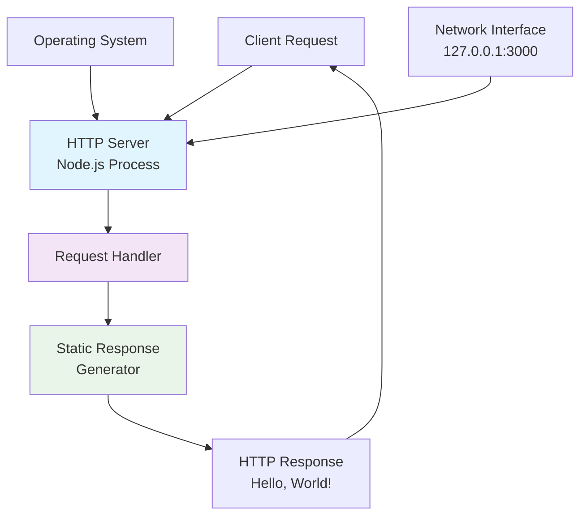
```mermaid
graph TB
    A[Client Request] --> B[HTTP Server<br/>Node.js Process]
    B --> C[Request Handler]
    C --> D[Static Response<br/>Generator]
    D --> E[HTTP Response<br/>Hello, World!]
    E --> A
    
    F[Operating System] --> B
    G[Network Interface<br/>127.0.0.1:3000] --> B
    
    style B fill:#e1f5fe
    style C fill:#f3e5f5
    style D fill:#e8f5e8
```

#### 6.1.2.2 Component Isolation Approach

While not implementing service boundaries, the system achieves component isolation through:

**Process-Level Isolation:**
- Single Node.js process boundary provides fundamental isolation
- Operating system process management ensures resource containment
- Process failure results in complete service restart (fail-fast pattern)

**Functional Isolation:**
- HTTP server module handles network communication
- Request handler manages request processing
- Response generator creates standardized output

### 6.1.3 Scalability Without Services Architecture

#### 6.1.3.1 Horizontal Scaling Strategy

The system achieves scalability through **instance replication** rather than service decomposition:

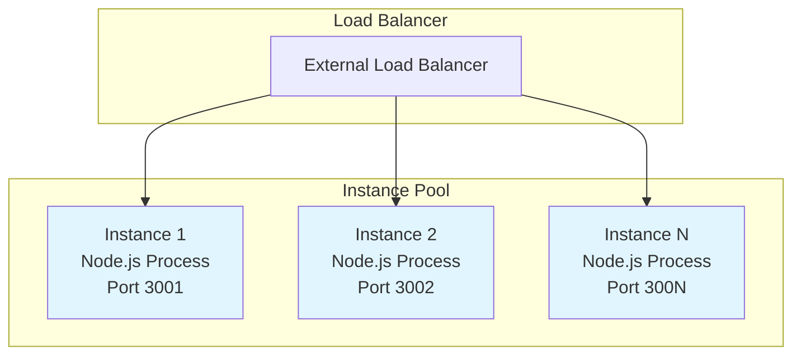
```mermaid
graph TB
    subgraph "Load Balancer"
        LB[External Load Balancer]
    end
    
    subgraph "Instance Pool"
        I1[Instance 1<br/>Node.js Process<br/>Port 3001]
        I2[Instance 2<br/>Node.js Process<br/>Port 3002]
        I3[Instance N<br/>Node.js Process<br/>Port 300N]
    end
    
    LB --> I1
    LB --> I2
    LB --> I3
    
    style I1 fill:#e1f5fe
    style I2 fill:#e1f5fe
    style I3 fill:#e1f5fe
```

**Scaling Characteristics:**
- Multiple identical instances deployed across different ports
- External load balancer distributes traffic across instance pool
- Each instance operates independently without coordination requirements
- Linear scalability limited only by host resource constraints

#### 6.1.3.2 Resource Optimization

**Memory Efficiency:**
- Target: <50MB memory usage per instance
- Zero-dependency approach eliminates framework overhead
- Stateless design prevents memory accumulation

**Performance Targets:**
- Response time: <100ms for HTTP request-response cycle
- Throughput: Limited by single-threaded event loop processing
- Resource utilization: Minimal CPU consumption for static responses

### 6.1.4 Resilience Without Distributed Architecture

#### 6.1.4.1 Fault Tolerance Mechanisms

The system implements resilience through **simplicity and redundancy**:

**Process-Level Resilience:**
- Fail-fast architecture: Process failures result in immediate termination
- Process monitoring tools (e.g., PM2, systemd) provide automatic restart capabilities
- Zero state means instant recovery upon restart

**Network-Level Resilience:**
- External load balancer health checks detect instance failures
- Traffic redirection to healthy instances maintains service availability
- Simple HTTP GET endpoint serves dual purpose as service and health check

#### 6.1.4.2 Disaster Recovery Approach

**Recovery Strategy:**
- Complete system recovery achieved through single file deployment
- No database restoration or state synchronization required
- Recovery time objective (RTO): <60 seconds for full service restoration

```mermaid
sequenceDiagram
    participant Client
    participant LB as Load Balancer
    participant I1 as Instance 1
    participant I2 as Instance 2
    participant Monitor as Process Monitor
    
    Client->>LB: HTTP Request
    LB->>I1: Forward Request
    I1->>I1: Process Failure ❌
    I1-->>LB: No Response
    LB->>I2: Failover to Healthy Instance
    I2->>Client: Success Response ✅
    
    Monitor->>Monitor: Detect Process Failure
    Monitor->>I1: Restart Process
    I1->>LB: Health Check Success
    
    Note over Client, Monitor: Service continues without interruption
```

### 6.1.5 Migration Path to Services Architecture

#### 6.1.5.1 Future Services Architecture Considerations

Should the system require evolution to core services architecture, the migration would involve:

**Service Decomposition Requirements:**
- Authentication service for user management
- Business logic service for backprop integration
- Data persistence service for state management
- Monitoring and metrics aggregation service

**Infrastructure Requirements:**
- Service discovery mechanism (e.g., Consul, etcd)
- API gateway for request routing and rate limiting
- Message broker for asynchronous communication
- Distributed logging and monitoring solutions

**Migration Challenges:**
- Increased operational complexity
- Network latency introduction between services
- Distributed system failure modes and debugging complexity
- Container orchestration and deployment pipeline requirements

#### 6.1.5.2 Decision Criteria for Services Architecture

Future migration should consider:

| Factor | Current Monolithic | Services Architecture Threshold |
|--------|-------------------|--------------------------------|
| **Team Size** | 1-2 developers | 6+ developers across multiple teams |
| **Feature Complexity** | Single endpoint | Multiple business domains |
| **Scalability Requirements** | Instance replication sufficient | Component-specific scaling needed |
| **Integration Points** | Minimal external systems | Multiple external system integrations |

#### References

#### Technical Specification Sections Referenced
- `5.1 HIGH-LEVEL ARCHITECTURE` - System overview and architectural principles
- `5.3 TECHNICAL DECISIONS` - Monolithic vs microservices decision rationale
- `1.2 SYSTEM OVERVIEW` - Project context and system capabilities

#### Files and Directories Examined
- `server.js` - Core HTTP server implementation confirming single-file architecture
- `package.json` - Zero dependencies configuration supporting monolithic approach
- `README.md` - Project documentation confirming test system purpose

#### Architecture Decision Documentation
- Section 5.3.1: Explicit documentation of monolithic architecture choice over microservices
- Section 5.1.1: Minimalist monolithic architecture implementation details
- Section 1.2.2: Zero-dependency architecture approach and technical rationale

## 6.2 DATABASE DESIGN

### 6.2.1 Applicability Assessment

**Database Design is not applicable for this system.**

The hao-backprop-test system implements a **stateless HTTP service architecture** that operates entirely in memory without any database, persistent storage, or data management requirements. This architectural decision is explicitly documented in Section 5.1.3 as "**No Persistent Storage**: The system operates entirely in memory without data persistence requirements, caching mechanisms, or state management."

#### 6.2.1.1 System Characteristics Precluding Database Design

The current implementation exhibits fundamental characteristics that eliminate database design requirements:

**Stateless Architecture:**
- Zero data persistence across HTTP requests
- No session management or user state tracking
- Static response generation without data retrieval operations
- Memory-only operation with automatic cleanup on process termination

**Minimal Functional Scope:**
- Single HTTP endpoint returning hardcoded "Hello, World!" response
- No data input processing, validation, or storage operations
- No CRUD (Create, Read, Update, Delete) functionality requirements
- No business logic requiring data persistence or retrieval

**Zero-Dependency Design Philosophy:**
- Complete absence of database drivers, ORMs, or data access libraries in `package.json`
- No external service dependencies requiring data storage coordination
- Self-contained operation eliminating database infrastructure requirements

#### 6.2.1.2 Technical Architecture Analysis

**Implementation Evidence Against Database Requirements:**

| Architecture Layer | Current Implementation | Database Integration Impact |
|-------------------|----------------------|----------------------------|
| **Application Layer** | Single 14-line `server.js` file with static response | Would require data models, business logic, transaction handling |
| **Dependencies** | Zero external dependencies | Would require database drivers, connection pooling, ORM frameworks |
| **Configuration** | Hardcoded operational parameters | Would require database connection strings, credentials, environment management |
| **Resource Usage** | <50MB memory target | Would increase memory footprint for connection pools, query caching |

**Process Flow Analysis:**
```mermaid
graph TB
    A[HTTP Request] --> B[Node.js HTTP Server]
    B --> C[Static Response Handler]
    C --> D[Return 'Hello, World!']
    D --> E[HTTP Response]
    
    F[Memory State: Empty] --> G[Memory State: Empty]
    
    style B fill:#e1f5fe
    style C fill:#f3e5f5
    style D fill:#e8f5e8
    
    classDef noDatabase fill:#ffebee,stroke:#d32f2f,color:#000
    class F,G noDatabase
    
    note1[No Data Persistence]
    note2[No State Management]
    note3[No Database Operations]
```

### 6.2.2 Alternative Data Management Approach

#### 6.2.2.1 In-Memory Operation Model

Instead of traditional database design, the system implements **ephemeral processing** with the following characteristics:

**Memory-Based Operation:**
- All processing occurs within Node.js event loop memory space
- Request processing variables automatically garbage collected
- No data accumulation or persistence between service restarts
- Process termination results in complete memory state reset

**Data Flow Without Persistence:**
- HTTP requests contain all necessary data for response generation
- Response payload generated from application constants
- No intermediate data storage or retrieval operations
- Clean separation between request processing and system state

#### 6.2.2.2 Scalability Without Database Overhead

**Horizontal Scaling Benefits:**
- Instance replication without database synchronization complexity
- No database connection limit constraints
- Zero database migration or schema versioning requirements
- Immediate deployment without database initialization procedures

```mermaid
graph TB
    subgraph "Multiple Instances"
        I1[Instance 1<br/>Stateless Operation]
        I2[Instance 2<br/>Stateless Operation]  
        I3[Instance N<br/>Stateless Operation]
    end
    
    subgraph "Traditional Database Approach"
        DB[(Database<br/>Shared State)]
        CON1[Connection Pool 1]
        CON2[Connection Pool 2]
        CON3[Connection Pool N]
    end
    
    I1 -.->|No Connection| CON1
    I2 -.->|No Connection| CON2
    I3 -.->|No Connection| CON3
    
    CON1 -.->|Not Required| DB
    CON2 -.->|Not Required| DB
    CON3 -.->|Not Required| DB
    
    style I1 fill:#e8f5e8
    style I2 fill:#e8f5e8
    style I3 fill:#e8f5e8
    style DB fill:#ffebee,stroke:#d32f2f
    style CON1 fill:#ffebee,stroke:#d32f2f
    style CON2 fill:#ffebee,stroke:#d32f2f
    style CON3 fill:#ffebee,stroke:#d32f2f
```

### 6.2.3 Performance Characteristics Without Database Layer

#### 6.2.3.1 Response Time Optimization

**Performance Benefits of Database-Free Architecture:**

| Performance Metric | Current Implementation | Database-Integrated Alternative |
|-------------------|----------------------|--------------------------------|
| **Response Time** | <100ms constant | Variable (network + query latency) |
| **Throughput** | Limited by Node.js event loop | Limited by database connection pool |
| **Memory Usage** | <50MB per instance | Additional 100-500MB for database drivers |
| **Startup Time** | <1 second | 5-30 seconds for database connectivity |

**Bottleneck Elimination:**
- No database query execution delays
- No connection pool exhaustion scenarios
- No database deadlock or locking contention issues
- No schema migration blocking during deployments

#### 6.2.3.2 Reliability Without Database Dependencies

**Fault Isolation Benefits:**
- Database server failures cannot impact application availability
- No database connection timeouts or retry logic complexity  
- No data corruption risks requiring backup and recovery procedures
- Simplified monitoring without database health check requirements

### 6.2.4 Future Database Integration Considerations

#### 6.2.4.1 Phase 3 Enhancement Planning

Based on the Future Enhancement Roadmap (Section 2.6.2), **Database Integration** is identified as a long-term Phase 3 enhancement with the following strategic objectives:

**Planned Enhancement Scope:**
- **Stateful Operations Support**: Enable session management and user state tracking
- **Persistent Test Data Management**: Support complex integration testing scenarios requiring data persistence
- **Strategic Value**: Expand system capabilities for advanced testing workflows

**Potential Database Integration Architecture:**
```mermaid
graph TB
    subgraph "Future Phase 3 Architecture"
        API[Multi-endpoint API]
        BL[Business Logic Layer]  
        DA[Data Access Layer]
        DB[(Database System)]
        
        API --> BL
        BL --> DA
        DA --> DB
    end
    
    subgraph "Current Architecture"
        HTTP[HTTP Server]
        STATIC[Static Response]
        
        HTTP --> STATIC
    end
    
    style API fill:#fff3e0
    style BL fill:#fff3e0
    style DA fill:#fff3e0
    style DB fill:#fff3e0
    style HTTP fill:#e8f5e8
    style STATIC fill:#e8f5e8
    
    CURRENT[Current: Database-Free] --> FUTURE[Future: Database-Integrated]
```

#### 6.2.4.2 Migration Readiness Assessment

**Prerequisites for Future Database Integration:**

| Requirement Category | Current State | Future Database Readiness |
|---------------------|---------------|---------------------------|
| **Application Complexity** | Single endpoint, static response | Requires multi-endpoint API design |
| **Data Model Requirements** | No data structures | Requires entity relationship modeling |
| **Operational Infrastructure** | Single process deployment | Requires database server management |
| **Development Resources** | 1-2 developers, minimal complexity | Requires database administration expertise |

**Decision Criteria for Database Integration:**
- Business logic complexity requiring stateful operations
- Multi-user scenarios requiring session management
- Test data management requiring persistence across deployments
- Integration testing scenarios requiring data validation

#### 6.2.4.3 Technology Selection for Future Database Integration

**Potential Database Technologies:**

| Database Type | Use Case | Integration Complexity | Operational Overhead |
|---------------|----------|----------------------|---------------------|
| **SQLite** | Simple persistent storage | Low | Minimal |
| **PostgreSQL** | Complex relational requirements | Medium | Moderate |
| **MongoDB** | Document-based test data | Medium | Moderate |
| **Redis** | Session management, caching | Low | Low |

### 6.2.5 Compliance and Governance Without Database Layer

#### 6.2.5.1 Data Protection Compliance

**Current Compliance Status:**
- **Data Retention**: Not applicable - no data persistence or collection
- **Privacy Controls**: Not applicable - no personal data processing
- **Audit Mechanisms**: Not applicable - no data modification operations
- **Access Controls**: Not applicable - no data storage requiring protection
- **Backup Policies**: Not applicable - no data requiring backup procedures

**Regulatory Alignment:**
- GDPR compliance achieved through data minimization (no personal data collection)
- No data breach risks due to absence of data storage
- No data retention policy requirements due to stateless operation

#### 6.2.5.2 Security Posture Without Database Attack Surface

**Security Benefits of Database-Free Architecture:**
- No SQL injection attack vectors
- No database credential management requirements
- No database server hardening or patch management
- No sensitive data exposure risks through data breaches
- Reduced attack surface through elimination of database layer

#### References

#### Technical Specification Sections Referenced
- `5.1 HIGH-LEVEL ARCHITECTURE` - System architecture explicitly documenting "No Persistent Storage"
- `6.1 CORE SERVICES ARCHITECTURE` - Context for system architecture patterns and not-applicable documentation approach  
- `2.6 FUTURE ENHANCEMENT ROADMAP` - Database Integration listed as Phase 3 long-term enhancement

#### Files and Directories Examined
- `server.js` - Core HTTP server implementation confirming no database operations or imports
- `package.json` - Zero dependencies configuration confirming absence of database drivers or ORMs
- `README.md` - Project documentation confirming minimal testing tool purpose without data persistence

#### Architecture Decision Documentation
- Section 5.1.3: Explicit documentation of stateless HTTP service with no persistent storage requirements
- Section 5.1.1: Minimalist monolithic architecture eliminating complex data management requirements
- Section 2.6.2: Future database integration scope limited to Phase 3 enhancements for stateful operations

## 6.3 INTEGRATION ARCHITECTURE

### 6.3.1 Current Integration Status

**Integration Architecture is not applicable for this system** in its current implementation. The hao-backprop-test system is a minimal HTTP service with zero external dependencies and no integration points with external systems or services.

#### 6.3.1.1 Architectural Rationale for No Integrations

The system implements a **zero-dependency architecture** by design, which eliminates the need for integration architecture components:

- **Single Purpose Design**: The system serves exclusively as a "Hello, World!" HTTP endpoint for infrastructure validation
- **Stateless Operation**: No data persistence, session management, or external service communication required
- **Self-Contained Implementation**: All functionality implemented using Node.js built-in modules only
- **Minimal Resource Footprint**: Designed to operate with <50MB memory usage and <100ms response times

#### 6.3.1.2 Current System Boundaries

The system operates with minimal external interfaces:

| Interface Type | Description | Protocol | Scope |
|---------------|-------------|----------|--------|
| Network Interface | HTTP service on localhost:3000 | HTTP/1.1 | Local connectivity validation |
| Process Interface | Node.js runtime integration | OS Process APIs | Process lifecycle management |
| Operating System | Port binding and resource allocation | TCP/IP Stack | Basic system services |

### 6.3.2 Planned Integration Architecture

#### 6.3.2.1 Phase 2 - Backprop.co Cloud Integration

**Target Integration Platform**: Backprop.co GPU Cloud Services

The planned Phase 2 enhancement will introduce the first external integration point:

#### Cloud Infrastructure Integration Specifications

| Integration Component | Description | Protocol | Authentication |
|----------------------|-------------|----------|----------------|
| Backprop.co API Gateway | GPU instance provisioning and management | HTTPS/REST | API Key (TBD) |
| Cloud Environment Validation | Service deployment verification | HTTP/1.1 | Basic connectivity |
| Resource Monitoring | GPU utilization and performance metrics | HTTPS/WebSocket | Service credentials |

#### Integration Requirements

- **Cost Optimization**: Leverage Backprop.co's "3-4x cheaper" pricing model compared to major cloud providers
- **Environment Features**: Integration with latest NVIDIA drivers, Jupyter, PyTorch, transformers, and Docker support
- **Performance Validation**: Service must meet <60 second deployment time target on GPU instances

#### 6.3.2.2 Phase 3 - Advanced Integration Architecture

#### Planned API Design Architecture

**Protocol Specifications**:
- **Primary Protocol**: RESTful HTTP/1.1 with JSON payloads
- **Transport Security**: TLS 1.3 for encrypted communications
- **Content Negotiation**: application/json with fallback to text/plain

**Authentication Framework**:
- **Method**: JWT-based authentication with refresh tokens
- **Authorization**: Role-based access control (RBAC)
- **Session Management**: Stateless token validation

**API Versioning Strategy**:
- **Versioning Approach**: URI path versioning (/v1/, /v2/)
- **Backward Compatibility**: Minimum 12-month deprecation cycle
- **Documentation Standards**: OpenAPI 3.0 specification compliance

#### Message Processing Architecture

**Event Processing Patterns**:
- **Synchronous Processing**: HTTP request-response for real-time validation
- **Asynchronous Processing**: Event-driven architecture for batch operations

**Error Handling Strategy**:
- **Circuit Breaker Pattern**: Prevent cascade failures in distributed systems
- **Retry Logic**: Exponential backoff for transient failures
- **Dead Letter Queues**: Unprocessable message handling

### 6.3.3 Integration Flow Diagrams

#### 6.3.3.1 Current System Integration Flow

```mermaid
flowchart TD
    A[Client Request] --> B[HTTP Server]
    B --> C[Static Response Handler]
    C --> D[Hello World Response]
    D --> E[Client Response]
    
    F[Deployment Tool] --> G[Process Manager]
    G --> B
    G --> H[Console Logging]
    
    I[Monitoring System] --> J[Health Check]
    J --> B
    J --> K[Service Status]
```

#### 6.3.3.2 Planned Phase 2 Cloud Integration Flow

```mermaid
sequenceDiagram
    participant DevOps
    participant BackpropAPI
    participant GPUInstance
    participant TestService
    participant Monitor

    DevOps->>BackpropAPI: Request GPU Instance
    BackpropAPI->>GPUInstance: Provision A100 Instance
    GPUInstance->>BackpropAPI: Instance Ready
    DevOps->>GPUInstance: Deploy hao-backprop-test
    GPUInstance->>TestService: Start Service
    TestService->>GPUInstance: Bind Port 3000
    TestService->>DevOps: Deployment Complete
    Monitor->>TestService: Health Check Request
    TestService->>Monitor: Hello World Response
    Monitor->>DevOps: Validation Success
```

#### 6.3.3.3 Planned Phase 3 API Architecture

```mermaid
flowchart LR
    subgraph "External Systems"
        A[Client Applications]
        B[Monitoring Systems]
        C[Database Services]
    end
    
    subgraph "API Gateway Layer"
        D[Load Balancer]
        E[Rate Limiter]
        F[Authentication Service]
    end
    
    subgraph "Service Layer"
        G[Multi-endpoint API]
        H[Message Queue]
        I[Event Processor]
    end
    
    A --> D
    B --> D
    D --> E
    E --> F
    F --> G
    G --> H
    H --> I
    I --> C
```

### 6.3.4 Integration Performance Requirements

#### 6.3.4.1 Service Level Agreements

| Metric | Current Target | Phase 2 Target | Phase 3 Target |
|--------|----------------|----------------|----------------|
| Response Time | < 100ms | < 150ms | < 200ms |
| Service Availability | 99.9% | 99.95% | 99.99% |
| Deployment Time | < 60 seconds | < 120 seconds | < 300 seconds |
| Memory Usage | < 50MB | < 200MB | < 500MB |

#### 6.3.4.2 Integration Monitoring Flow

```mermaid
sequenceDiagram
    participant LoadTester
    participant TestService
    participant PerformanceMonitor
    participant AlertingSystem

    LoadTester->>TestService: HTTP GET /
    TestService->>TestService: Process Request
    TestService->>LoadTester: Response + Timing Data
    LoadTester->>PerformanceMonitor: Report Response Time
    PerformanceMonitor->>PerformanceMonitor: Analyze Against SLA
    alt Response Time > SLA Threshold
        PerformanceMonitor->>AlertingSystem: Trigger Performance Alert
        AlertingSystem->>DevOps: Send Notification
    else Response Time OK
        PerformanceMonitor->>MonitoringDashboard: Update Metrics
    end
```

### 6.3.5 Future Integration Considerations

#### 6.3.5.1 External System Interfaces

**Planned Third-Party Integration Patterns**:
- **Cloud Provider APIs**: Multi-cloud deployment support
- **Monitoring Platforms**: Comprehensive observability integration
- **CI/CD Pipeline Integration**: Automated deployment validation
- **Security Services**: Certificate management and threat detection

#### 6.3.5.2 Legacy System Compatibility

**Integration Constraints**:
- **Protocol Limitations**: HTTP/1.1 compatibility for legacy monitoring systems
- **Data Format Support**: Plain text responses for simple integration scenarios
- **Network Requirements**: IPv4 localhost binding for local validation tools

### 6.3.6 References

#### Files Examined
- `server.js` - Core HTTP server with no external integrations
- `package.json` - Zero-dependency configuration confirming no integration libraries
- `package-lock.json` - Dependency lockfile verifying no third-party packages
- `README.md` - Project description as test project for backprop integration

#### Technical Specification Sections
- `1.2 SYSTEM OVERVIEW` - System context and integration positioning
- `2.6 FUTURE ENHANCEMENT ROADMAP` - Planned Phase 2/3 integrations with Backprop.co and advanced features
- `3.4 THIRD-PARTY SERVICES` - Backprop.co GPU cloud integration specifications
- `4.5 INTEGRATION SEQUENCE DIAGRAMS` - Cloud deployment and monitoring integration flows
- `4.6 TIMING AND SLA CONSIDERATIONS` - Performance requirements and monitoring specifications
- `5.1 HIGH-LEVEL ARCHITECTURE` - System boundaries and external integration points

## 6.4 SECURITY ARCHITECTURE

**Detailed Security Architecture is not applicable for this system** in its current implementation. The hao-backprop-test system is intentionally designed as a minimalist infrastructure testing tool that operates without traditional security mechanisms to facilitate validation processes.

### 6.4.1 CURRENT SECURITY POSTURE

#### 6.4.1.1 Intentional Security Model

The system implements a **deliberately minimal security approach** appropriate for its role as an infrastructure testing endpoint:

| Security Component | Current State | Design Rationale |
|-------------------|---------------|------------------|
| Authentication | Not implemented | Would interfere with testing validation processes |
| Authorization | Not applicable | Open endpoint design for infrastructure verification |
| Session Management | None | Stateless request/response model |
| Token Handling | Not required | No user identity or session state management |

#### 6.4.1.2 Network Isolation Security

The primary security mechanism currently implemented:

- **Localhost-only Binding**: Server binds exclusively to 127.0.0.1, preventing external network access
- **Port Constraint**: Fixed port 3000 with no external routing capabilities
- **Natural Access Control**: Network topology provides inherent access restriction

```mermaid
graph TD
    A[External Network] -->|Blocked| B[Network Interface]
    B -->|127.0.0.1 Only| C[HTTP Server :3000]
    C --> D[Static Response Handler]
    
    E[Local Machine] -->|Allowed| C
    
    style A fill:#ffcdd2
    style B fill:#fff3e0
    style C fill:#c8e6c9
    style E fill:#e8f5e8
```

#### 6.4.1.3 Zero-Dependency Security Benefits

**Supply Chain Security Advantages**:
- **No Third-Party Dependencies**: Eliminates external vulnerability exposure from npm packages
- **Reduced Attack Surface**: Limited to Node.js core modules only
- **No Supply Chain Attacks**: Zero risk from compromised external libraries
- **Minimal Codebase**: 13 lines of core functionality reduce potential security flaws

### 6.4.2 STANDARD SECURITY PRACTICES

#### 6.4.2.1 Network Security Controls

**Current Network Security Measures**:

| Control Type | Implementation | Security Benefit |
|-------------|---------------|------------------|
| Host Binding | localhost (127.0.0.1) only | Prevents remote access attempts |
| Protocol | HTTP without encryption | Acceptable for localhost-only traffic |
| Port Management | Fixed port 3000 | Predictable network configuration |

#### 6.4.2.2 Runtime Security Practices

**Node.js Security Best Practices Applied**:

- **Process Isolation**: Single-purpose HTTP server with minimal privileges required
- **Resource Constraints**: 50MB memory limit prevents resource exhaustion attacks
- **Error Containment**: Basic error handling prevents information disclosure
- **No File System Access**: Static response eliminates file system vulnerabilities

#### 6.4.2.3 Development Security Standards

**Secure Development Practices**:

| Practice | Current Implementation | Security Impact |
|----------|----------------------|-----------------|
| Code Simplicity | Minimal 13-line implementation | Reduced attack surface |
| Static Analysis | No complex logic to analyze | Lower vulnerability risk |
| Dependency Management | Zero external dependencies | Eliminated third-party risks |

### 6.4.3 SECURITY RISK ASSESSMENT

#### 6.4.3.1 Current Security Gaps

**Identified Security Limitations** (from Technical Specification Section 2.4.4):

| Security Aspect | Current State | Risk Level | Mitigation |
|-----------------|---------------|------------|------------|
| Network Encryption | HTTP only (no TLS) | Medium | Localhost-only deployment |
| Input Validation | Not implemented | Low | No input processing required |
| Authentication | Not present | Low | Network isolation sufficient |
| Error Disclosure | Basic Node.js errors | Low | Minimal error surface area |

#### 6.4.3.2 Threat Model Analysis

**Applicable Threats for Testing Infrastructure**:

```mermaid
graph LR
    A[Network Threats] -->|Blocked by localhost| B[HTTP Server]
    C[Application Threats] -->|Minimal surface| B
    D[Supply Chain] -->|Zero dependencies| B
    E[Data Threats] -->|Static response| B
    
    B --> F[Protected Testing Service]
    
    style A fill:#ffcdd2
    style C fill:#fff3e0
    style D fill:#c8e6c9
    style E fill:#c8e6c9
    style F fill:#e8f5e8
```

#### 6.4.3.3 Security Event Logging

**Current Logging Capabilities**:
- **Startup Confirmation**: Single console.log statement for service availability
- **No Security Events**: No authentication attempts or security incidents logged
- **No Audit Trail**: No user activity or access logging implemented
- **Basic Error Logging**: Default Node.js error handling only

### 6.4.4 FUTURE SECURITY CONSIDERATIONS

#### 6.4.4.1 Phase 3 Security Framework

**Planned Security Enhancements** (per Future Enhancement Roadmap):

| Security Component | Planned Implementation | Timeline |
|-------------------|----------------------|----------|
| Authentication Framework | User identity management | Phase 3 |
| Encryption Support | TLS/HTTPS implementation | Phase 3 |
| Access Control | Role-based authorization | Phase 3 |
| Audit Logging | Security event tracking | Phase 3 |

#### 6.4.4.2 Production Security Requirements

**Security Controls for Production Deployment**:

```mermaid
flowchart TD
    A[Current State] --> B[Phase 3 Security Framework]
    
    B --> C[Authentication Layer]
    B --> D[Authorization System]
    B --> E[Encryption Implementation]
    B --> F[Security Monitoring]
    
    C --> G[Identity Management]
    C --> H[Multi-Factor Authentication]
    
    D --> I[Role-Based Access Control]
    D --> J[Resource Authorization]
    
    E --> K[TLS/HTTPS]
    E --> L[Data Encryption]
    
    F --> M[Audit Logging]
    F --> N[Threat Detection]
    
    style A fill:#fff3e0
    style B fill:#e3f2fd
    style G fill:#c8e6c9
    style H fill:#c8e6c9
    style I fill:#c8e6c9
    style J fill:#c8e6c9
    style K fill:#c8e6c9
    style L fill:#c8e6c9
    style M fill:#c8e6c9
    style N fill:#c8e6c9
```

### 6.4.5 SECURITY RECOMMENDATIONS

#### 6.4.5.1 Immediate Security Improvements

**Low-Effort Security Enhancements**:

| Recommendation | Implementation | Security Benefit |
|---------------|---------------|------------------|
| Security Headers | Add Helmet.js middleware | Protect against common web vulnerabilities |
| Error Handling | Implement graceful error responses | Prevent information disclosure |
| Process Monitoring | Add health check endpoints | Enable security monitoring |
| Environment Configuration | Use NODE_ENV=production | Enable security-optimized runtime |

#### 6.4.5.2 Infrastructure Security Practices

**Deployment Security Controls**:

- **Reverse Proxy Configuration**: Use nginx or Apache for production deployments
- **Network Segmentation**: Deploy within isolated network segments
- **Container Security**: Use minimal base images for containerized deployments
- **Resource Limits**: Implement cgroup constraints for memory and CPU usage

#### 6.4.5.3 Security Monitoring and Compliance

**Recommended Security Monitoring**:

| Monitoring Area | Current Capability | Recommended Enhancement |
|----------------|-------------------|------------------------|
| Access Logging | None | Implement request logging with timestamps |
| Error Monitoring | Basic console output | Structured error logging with severity levels |
| Performance Monitoring | None | Resource utilization tracking for security events |
| Health Checking | Manual verification | Automated health endpoints for security validation |

### 6.4.6 COMPLIANCE AND REGULATORY CONSIDERATIONS

#### 6.4.6.1 HTTP Protocol Compliance

**Current Compliance Status**:
- **RFC 7230**: HTTP/1.1 Message Syntax and Routing - Compliant
- **RFC 7231**: HTTP/1.1 Semantics and Content - Compliant
- **Content-Type Headers**: Proper text/plain implementation
- **HTTP Status Codes**: Correct 200 OK response usage

#### 6.4.6.2 Security Standards Applicability

**Future Standards Compliance** (Phase 3):
- **OWASP Top 10**: Web application security risks mitigation
- **NIST Cybersecurity Framework**: Security control implementation
- **ISO 27001**: Information security management systems
- **SOC 2**: Security and availability controls for service organizations

#### References

**Files Examined**:
- `server.js` - Core HTTP server implementation with security posture analysis
- `package.json` - Application configuration confirming zero security dependencies
- `package-lock.json` - Dependency verification showing no third-party security risks
- `README.md` - Project documentation with security context

**Technical Specification Sections Referenced**:
- `2.4.4 Security Implications` - Current security gaps and risk assessment
- `2.6.2 Phase 3 Long-term Enhancements` - Future security framework planning
- `5.4.4 Authentication and Authorization Framework` - Security model documentation
- `5.4.1 Monitoring and Observability Approach` - Security logging capabilities

## 6.5 MONITORING AND OBSERVABILITY

### 6.5.1 MONITORING INFRASTRUCTURE

#### 6.5.1.1 Current Monitoring Capabilities

The hao-backprop-test system currently implements minimal monitoring capabilities appropriate for its role as a lightweight infrastructure testing endpoint:

**Existing Monitoring Implementation**:
- **Startup Confirmation Logging**: Single console.log statement in `server.js` confirming service availability
- **Implicit Health Validation**: Root endpoint (/) serves as basic connectivity verification
- **Zero Monitoring Dependencies**: Confirmed via `package-lock.json` analysis - no external monitoring libraries

**Current Monitoring Limitations**:
- No metrics collection for performance, error rates, or resource utilization
- Absence of structured logging for automated processing  
- No dedicated health check endpoints beyond root response
- Missing request-level instrumentation and timing

#### 6.5.1.2 Recommended Monitoring Architecture

Based on the defined performance requirements and SLA targets, the following monitoring infrastructure addresses the system's operational needs:

```mermaid
graph TD
    A[HTTP Requests] --> B[hao-backprop-test Service]
    B --> C[Response Handler]
    
    B --> D[Application Metrics Collector]
    D --> E[Performance Metrics]
    D --> F[Resource Metrics]
    D --> G[Availability Metrics]
    
    E --> H[Response Time Tracking]
    E --> I[Request Count Monitoring]
    
    F --> J[Memory Usage Monitor]
    F --> K[CPU Utilization Tracking]
    
    G --> L[Service Uptime Tracking]
    G --> M[Health Check Status]
    
    H --> N[Monitoring Dashboard]
    I --> N
    J --> N
    K --> N
    L --> N
    M --> N
    
    N --> O[Alert Manager]
    O --> P[Operational Notifications]
    
    style B fill:#e3f2fd
    style D fill:#fff3e0
    style N fill:#c8e6c9
    style O fill:#ffecb3
```

#### 6.5.1.3 Metrics Collection Framework

**Core Metrics Categories**:

| Metric Category | Collection Method | Storage Requirement | Update Frequency |
|----------------|------------------|--------------------|--------------------|
| Response Performance | Request instrumentation | Time-series data | Per-request |
| Resource Utilization | Process monitoring | Aggregated samples | 30-second intervals |
| Service Availability | Health check polling | Status logs | 1-minute intervals |

**Application Performance Monitoring**:
- **Response Time Tracking**: HTTP request-response latency measurement
- **Request Throughput**: Requests per second monitoring
- **Error Rate Measurement**: Failed request percentage tracking
- **Service Response Validation**: "Hello, World!" response integrity verification

#### 6.5.1.4 Log Aggregation Strategy

**Current Logging Enhancement Requirements**:

```javascript
// Current minimal logging in server.js (line 13)
console.log(`Server running at http://127.0.0.1:${PORT}/`);
```

**Recommended Structured Logging Implementation**:
- **JSON-formatted Log Entries**: Machine-readable log structure for automated processing
- **Request-level Logging**: Individual request timestamps, response times, and outcomes
- **Error Logging**: Comprehensive error capture with contextual information
- **Resource Utilization Logging**: Memory and CPU usage snapshots

**Log Aggregation Architecture**:

```mermaid
flowchart LR
    A[Application Logs] --> B[Log Collector]
    C[System Metrics] --> B
    D[Health Checks] --> B
    
    B --> E[Log Aggregator]
    E --> F[Log Storage]
    E --> G[Real-time Processing]
    
    F --> H[Historical Analysis]
    G --> I[Alert Generation]
    G --> J[Dashboard Updates]
    
    style A fill:#e8f5e8
    style B fill:#fff3e0
    style E fill:#e3f2fd
    style I fill:#ffcdd2
```

#### 6.5.1.5 Distributed Tracing Considerations

**Current Tracing Limitations**:
Given the system's single-service, stateless architecture, traditional distributed tracing is not immediately applicable. However, request tracing within the service boundary provides valuable insights:

- **Request Correlation IDs**: Unique identifiers for request tracking
- **Response Time Breakdown**: Processing time analysis within the service
- **Resource Access Tracing**: Memory allocation and cleanup tracking

### 6.5.2 OBSERVABILITY PATTERNS

#### 6.5.2.1 Health Checks Implementation

**Current Health Check Mechanism**:
The root endpoint (/) serves as an implicit health check by returning "Hello, World!" response.

**Enhanced Health Check Design**:

| Health Check Type | Endpoint | Response Criteria | Check Frequency |
|------------------|----------|-------------------|-----------------|
| Basic Connectivity | `/` | 200 OK + correct content | External: 1 minute |
| Resource Health | `/health` | Memory < 75MB threshold | Internal: 30 seconds |
| Service Readiness | `/ready` | Port binding confirmed | On-demand |

**Health Check Flow Diagram**:

```mermaid
sequenceDiagram
    participant M as Monitoring System
    participant S as hao-backprop-test Service
    participant H as Health Endpoint
    
    loop Every 60 seconds
        M->>S: GET /
        S->>H: Process Health Check
        H->>H: Validate Response Content
        H->>H: Check Resource Usage
        alt Health Check Passes
            S->>M: 200 OK "Hello, World!"
            M->>M: Record Success Metric
        else Health Check Fails
            S->>M: Error Response
            M->>M: Record Failure Metric
            M->>M: Trigger Alert
        end
    end
```

#### 6.5.2.2 Performance Metrics Framework

**Defined Performance Targets** (from Technical Specification 4.6.1 and 5.4.5):

| Performance Metric | Target Value | Measurement Method | Critical Threshold |
|-------------------|--------------|-------------------|-------------------|
| Response Time | < 100ms | HTTP request latency | 150ms |
| Service Startup Time | < 5 seconds | Port binding completion | 10 seconds |
| Memory Usage | < 50MB | Process monitoring | 75MB |
| Service Uptime | 99.9% | Health check success rate | 99% |

**Performance Monitoring Implementation**:
- **Request Latency Tracking**: Millisecond-precision response time measurement
- **Resource Utilization Monitoring**: Memory and CPU usage against defined constraints
- **Throughput Analysis**: Request processing capacity under load
- **Service Availability Calculation**: Uptime percentage based on successful health checks

#### 6.5.2.3 Business Metrics Tracking

**Infrastructure Testing Metrics**:
Given the system's role as an infrastructure testing tool, business metrics focus on validation capabilities:

| Business Metric | Measurement Approach | Business Value |
|-----------------|---------------------|----------------|
| Deployment Validation Success Rate | Successful startup percentage | Infrastructure reliability |
| Integration Test Pass Rate | Correct response delivery | System integration health |
| Service Stability Duration | Continuous operation time | Operational reliability |

#### 6.5.2.4 SLA Monitoring Framework

**SLA Compliance Tracking**:

```mermaid
graph TD
    A[SLA Requirements] --> B[Response Time SLA]
    A --> C[Availability SLA]
    A --> D[Resource Usage SLA]
    
    B --> E[< 100ms Target]
    C --> F[99.9% Uptime]
    D --> G[< 50MB Memory]
    
    E --> H[Performance Dashboard]
    F --> I[Availability Dashboard]
    G --> J[Resource Dashboard]
    
    H --> K{SLA Violation?}
    I --> K
    J --> K
    
    K -->|Yes| L[Generate Alert]
    K -->|No| M[Continue Monitoring]
    
    L --> N[Incident Response]
    N --> O[Root Cause Analysis]
    O --> P[Corrective Action]
    P --> M
    
    style K fill:#fff3e0
    style L fill:#ffcdd2
    style N fill:#ffecb3
```

#### 6.5.2.5 Capacity Tracking

**Current Capacity Limitations** (from Technical Specification 4.6.3):
- **Single-threaded Processing**: Node.js event loop handles sequential requests
- **Memory Constraints**: 50MB maximum memory consumption limit
- **No Horizontal Scaling**: Single instance deployment model

**Capacity Monitoring Metrics**:
- **Concurrent Connection Tracking**: Active connection count monitoring
- **Memory Growth Analysis**: Memory usage trending over time
- **CPU Utilization Patterns**: Processing load analysis
- **Request Queue Depth**: Pending request monitoring (if applicable)

### 6.5.3 INCIDENT RESPONSE

#### 6.5.3.1 Alert Management Framework

**Alert Routing Configuration**:

| Alert Type | Trigger Condition | Severity Level | Response Team |
|------------|------------------|----------------|---------------|
| Response Time SLA Violation | > 150ms average over 5 minutes | High | Operations Team |
| Memory Usage Exceeded | > 75MB sustained for 2 minutes | High | Engineering Team |
| Service Unavailable | Health check failures > 3 consecutive | Critical | On-call Engineer |
| Startup Failure | Port binding timeout > 10 seconds | Critical | Platform Team |

**Alert Flow Architecture**:

```mermaid
flowchart TD
    A[Monitoring Metrics] --> B{Threshold Exceeded?}
    B -->|No| C[Continue Monitoring]
    B -->|Yes| D[Generate Alert]
    
    D --> E{Alert Severity}
    E -->|High| F[Notify Operations Team]
    E -->|Critical| G[Notify On-Call Engineer]
    
    F --> H[Acknowledge Alert]
    G --> I[Immediate Response Required]
    
    H --> J[Investigate Issue]
    I --> J
    
    J --> K{Issue Resolved?}
    K -->|Yes| L[Close Alert]
    K -->|No| M[Escalate to Engineering]
    
    M --> N[Root Cause Analysis]
    N --> O[Implement Fix]
    O --> P[Validate Resolution]
    P --> L
    
    L --> C
    
    style D fill:#ffecb3
    style G fill:#ffcdd2
    style I fill:#ffcdd2
    style M fill:#fff3e0
```

#### 6.5.3.2 Escalation Procedures

**Incident Escalation Matrix**:

| Time Elapsed | Severity High | Severity Critical | Action Required |
|-------------|---------------|------------------|-----------------|
| 0-15 minutes | Operations Team Response | Immediate On-Call Engagement | Initial Assessment |
| 15-30 minutes | Engineering Team Notification | Senior Engineer Escalation | Root Cause Investigation |
| 30-60 minutes | Management Notification | Engineering Manager Involvement | Status Communication |
| 60+ minutes | Executive Escalation | Incident Commander Assignment | External Communication |

#### 6.5.3.3 Runbook Procedures

**Standard Operating Procedures**:

**Service Restart Runbook**:
1. **Verify Service Status**: Confirm service is unresponsive via health check
2. **Check Resource Usage**: Validate memory/CPU constraints not exceeded
3. **Review Logs**: Examine recent log entries for error patterns
4. **Restart Service**: Execute graceful restart procedure
5. **Validate Recovery**: Confirm service responds to health checks
6. **Document Incident**: Record restart reason and resolution time

**Port Conflict Resolution**:
1. **Identify Port Usage**: Determine process using port 3000
2. **Evaluate Alternatives**: Assess if alternative port is acceptable
3. **Update Configuration**: Modify service configuration if needed
4. **Restart Service**: Apply new configuration
5. **Update Monitoring**: Adjust health check endpoints accordingly

#### 6.5.3.4 Post-Mortem Processes

**Incident Review Framework**:

```mermaid
flowchart TD
    A[Incident Occurrence] --> B[Immediate Response]
    B --> C[Issue Resolution]
    C --> D[Post-Incident Review]
    
    D --> E[Data Collection]
    E --> F[Timeline Reconstruction]
    F --> G[Root Cause Analysis]
    G --> H[Contributing Factors Analysis]
    
    H --> I[Improvement Identification]
    I --> J[Action Item Creation]
    J --> K[Implementation Planning]
    K --> L[Process Enhancement]
    
    L --> M[Knowledge Base Update]
    M --> N[Team Training]
    N --> O[Prevention Measures]
    
    style D fill:#e3f2fd
    style G fill:#fff3e0
    style I fill:#c8e6c9
    style O fill:#c8e6c9
```

**Post-Mortem Documentation Requirements**:
- **Incident Timeline**: Chronological sequence of events and responses
- **Impact Assessment**: Service availability, performance impact, and user effect
- **Root Cause Analysis**: Technical and procedural factors contributing to incident
- **Corrective Actions**: Immediate fixes and long-term improvements
- **Prevention Measures**: Process changes to prevent recurrence

#### 6.5.3.5 Improvement Tracking

**Continuous Improvement Metrics**:

| Improvement Area | Tracking Method | Success Criteria |
|-----------------|-----------------|------------------|
| Mean Time to Detection (MTTD) | Alert generation latency | < 2 minutes for critical issues |
| Mean Time to Acknowledgment | Response team engagement | < 5 minutes for high severity |
| Mean Time to Resolution (MTTR) | Issue closure time | < 30 minutes for service restarts |
| Incident Recurrence Rate | Similar incident frequency | < 10% recurrence within 30 days |

### 6.5.4 MONITORING DASHBOARD DESIGN

#### 6.5.4.1 Executive Dashboard Layout

**High-Level System Status View**:

```mermaid
graph TD
    A[Executive Dashboard] --> B[Service Status Indicator]
    A --> C[SLA Compliance Summary]
    A --> D[Performance Overview]
    
    B --> E[✅ Service Online]
    B --> F[🔴 Service Offline]
    
    C --> G[Response Time SLA: 99.2%]
    C --> H[Availability SLA: 99.9%]
    C --> I[Resource SLA: 100%]
    
    D --> J[Average Response Time: 45ms]
    D --> K[Current Memory Usage: 32MB]
    D --> L[Uptime: 99.95%]
    
    style E fill:#c8e6c9
    style F fill:#ffcdd2
    style G fill:#c8e6c9
    style H fill:#c8e6c9
    style I fill:#c8e6c9
```

#### 6.5.4.2 Operational Dashboard Specifications

**Detailed Monitoring Dashboard Components**:

| Dashboard Section | Metrics Displayed | Refresh Frequency | Alert Integration |
|------------------|------------------|-------------------|-------------------|
| Service Health | Status, uptime, response validation | 30 seconds | Critical alerts |
| Performance Metrics | Response time trends, throughput | 1 minute | SLA violations |
| Resource Utilization | Memory usage, CPU load | 30 seconds | Threshold breaches |
| Historical Trends | Weekly/monthly performance analysis | 5 minutes | Trend analysis |

### 6.5.5 FUTURE ENHANCEMENT ROADMAP

#### 6.5.5.1 Phase 2 Monitoring Enhancements

**Planned Monitoring Improvements** (from Technical Specification 2.6.1):

| Enhancement | Description | Implementation Timeline |
|-------------|-------------|------------------------|
| Enhanced Structured Logging | JSON-formatted logs with severity levels | Phase 2 |
| Comprehensive Metrics Collection | Performance, resource, and business metrics | Phase 2 |
| Alert Management System | Automated alerting with escalation procedures | Phase 2 |
| Dashboard Integration | Real-time monitoring dashboards | Phase 2 |

#### 6.5.5.2 Phase 3 Advanced Observability

**Long-term Monitoring Capabilities** (from Technical Specification 2.6.2):

| Advanced Feature | Description | Strategic Value |
|-----------------|-------------|-----------------|
| Production Monitoring Platform | Enterprise-grade monitoring integration | Comprehensive observability |
| Advanced Analytics | Machine learning-based anomaly detection | Proactive incident prevention |
| Multi-Service Correlation | Distributed tracing across service boundaries | Complex system observability |
| Security Event Monitoring | Security-focused logging and alerting | Comprehensive security posture |

**Phase 3 Enhanced SLA Targets**:

| Metric | Current Target | Phase 3 Target | Monitoring Enhancement |
|--------|---------------|---------------|----------------------|
| Response Time | < 100ms | < 200ms | Multi-region monitoring |
| Service Availability | 99.9% | 99.99% | Redundancy monitoring |
| Memory Usage | < 50MB | < 500MB | Resource pool monitoring |
| Deployment Time | < 60s | < 300s | Pipeline monitoring |

### 6.5.6 INTEGRATION WITH EXTERNAL MONITORING

#### 6.5.6.1 Cloud Platform Integration

**Monitoring Platform Compatibility**:
- **AWS CloudWatch**: Metrics export and dashboard integration
- **Google Cloud Monitoring**: Performance metrics and alerting
- **Azure Monitor**: Application insights and log analytics
- **Prometheus + Grafana**: Open-source monitoring stack

#### 6.5.6.2 Deployment Pipeline Monitoring

**Integration with Deployment Validation**:
- **Health Check Integration**: Automated deployment validation
- **Performance Baseline Validation**: Response time verification post-deployment  
- **Resource Constraint Verification**: Memory usage compliance checking
- **Service Availability Confirmation**: Uptime validation in deployment pipeline

#### References

**Files Examined**:
- `server.js` - Core HTTP server implementation with current logging analysis
- `package.json` - Application configuration confirming monitoring dependency status
- `package-lock.json` - Dependency verification showing zero monitoring libraries
- `README.md` - Project documentation providing monitoring context

**Technical Specification Sections Referenced**:
- `5.4 CROSS-CUTTING CONCERNS` - Current monitoring approach, limitations, and framework recommendations
- `4.6 TIMING AND SLA CONSIDERATIONS` - Performance requirements, SLA targets, and monitoring flows
- `1.2 SYSTEM OVERVIEW` - System context, success criteria, and key performance indicators
- `2.6 FUTURE ENHANCEMENT ROADMAP` - Planned monitoring improvements for Phase 2 and Phase 3
- `6.4 SECURITY ARCHITECTURE` - Security monitoring requirements and event logging capabilities

## 6.6 TESTING STRATEGY

### 6.6.1 TESTING APPROACH OVERVIEW

The hao-backprop-test system requires a focused testing strategy appropriate for its role as a minimal HTTP server designed for infrastructure testing validation. While the system architecture is simple, the defined functional requirements, performance targets, and SLA commitments necessitate comprehensive test coverage to ensure reliable operation.

#### 6.6.1.1 Testing Strategy Assessment

**Current Testing State Analysis**:
- **No Existing Test Infrastructure**: Package.json contains placeholder test script
- **Zero Test Dependencies**: No testing frameworks or libraries present
- **Well-Defined Requirements**: Clear functional and performance criteria established
- **Measurable SLA Targets**: Specific response time, memory usage, and availability thresholds

**Testing Strategy Decision**: 
Given the system's simple architecture but critical infrastructure validation role, a **Moderate Comprehensive Testing Strategy** is recommended, focusing on functional validation, performance verification, and reliability testing rather than complex integration scenarios.

#### 6.6.1.2 Test Coverage Scope

| Test Category | Coverage Scope | Priority | Implementation Status |
|---------------|---------------|----------|----------------------|
| Unit Testing | Core HTTP server functionality | High | Not Implemented |
| Integration Testing | Service startup and endpoint validation | High | Not Implemented |
| Performance Testing | Response time and resource constraints | High | Not Implemented |
| End-to-End Testing | Not applicable (single endpoint) | N/A | Not Required |

### 6.6.2 UNIT TESTING STRATEGY

#### 6.6.2.1 Testing Framework Selection

**Recommended Testing Stack**:

| Component | Technology | Justification | Configuration |
|-----------|------------|---------------|---------------|
| Test Framework | Jest | Node.js standard, comprehensive features | Zero-config setup |
| HTTP Testing | Supertest | Express/Node.js HTTP testing specialist | Integration with Jest |
| Mocking Library | Jest Built-in | Consistent with framework choice | Native mocking capabilities |
| Coverage Tool | Jest Coverage | Integrated coverage reporting | Built-in code coverage |

**Package Dependencies to Add**:
```json
"devDependencies": {
  "jest": "^29.7.0",
  "supertest": "^6.3.3"
}
```

#### 6.6.2.2 Test Organization Structure

**Recommended Test Directory Structure**:
```
hao-backprop-test/
├── __tests__/
│   ├── unit/
│   │   ├── server.test.js
│   │   └── health.test.js
│   ├── integration/
│   │   ├── service-startup.test.js
│   │   └── endpoint-validation.test.js
│   └── performance/
│       ├── response-time.test.js
│       └── resource-usage.test.js
├── test-utils/
│   ├── test-server.js
│   └── performance-helpers.js
└── jest.config.js
```

#### 6.6.2.3 Unit Test Requirements

**Core Functionality Tests (server.js)**:

| Test Case | Requirement ID | Test Description | Expected Outcome |
|-----------|---------------|------------------|------------------|
| Server Initialization | F-001-RQ-001 | Verify server binds to localhost:3000 | Successful port binding |
| HTTP Response Validation | F-001-RQ-003 | Validate "Hello, World!" response content | Exact string match |
| Content-Type Header | F-001-RQ-004 | Verify text/plain content type | Correct header value |
| Startup Logging | F-002-RQ-001 | Confirm startup log message | Console output validation |

**Unit Test Implementation Pattern**:
```javascript
// Example test structure for server.test.js
describe('HTTP Server Core Functionality', () => {
  beforeEach(() => {
    // Setup test server instance
  });
  
  afterEach(() => {
    // Cleanup server resources
  });
  
  test('should bind to localhost port 3000', async () => {
    // Test F-001-RQ-001 requirements
  });
  
  test('should respond with Hello World message', async () => {
    // Test F-001-RQ-003 requirements
  });
});
```

#### 6.6.2.4 Mocking Strategy

**Minimal Mocking Requirements**:
- **Network Interface Mocking**: Simulate port binding failures
- **Console Output Mocking**: Capture and validate log messages
- **Process Environment Mocking**: Test different runtime conditions
- **Resource Monitoring Mocking**: Simulate memory/CPU constraints

#### 6.6.2.5 Test Data Management

**Test Data Strategy**:
- **Static Response Data**: "Hello, World!\n" validation data
- **Configuration Test Data**: Port numbers, hostnames, timeout values
- **Performance Baseline Data**: Expected response times, memory thresholds
- **Error Scenario Data**: Invalid configurations, resource constraints

#### 6.6.2.6 Code Coverage Requirements

| Coverage Metric | Target | Critical Threshold | Enforcement |
|-----------------|--------|-------------------|-------------|
| Line Coverage | 95% | 90% | CI/CD gate |
| Function Coverage | 100% | 95% | CI/CD gate |
| Branch Coverage | 90% | 85% | CI/CD gate |
| Statement Coverage | 95% | 90% | CI/CD gate |

### 6.6.3 INTEGRATION TESTING STRATEGY

#### 6.6.3.1 Service Integration Test Approach

**Integration Test Scope**:

```mermaid
graph TD
    A[Integration Test Suite] --> B[Service Startup Tests]
    A --> C[Endpoint Integration Tests]
    A --> D[Resource Integration Tests]
    
    B --> E[Port Binding Validation]
    B --> F[Service Ready State]
    B --> G[Startup Timing Verification]
    
    C --> H[HTTP Protocol Compliance]
    C --> I[Response Header Validation]
    C --> J[Content Delivery Verification]
    
    D --> K[Memory Usage Monitoring]
    D --> L[Process Resource Tracking]
    D --> M[Service Stability Testing]
    
    style A fill:#e3f2fd
    style B fill:#fff3e0
    style C fill:#c8e6c9
    style D fill:#ffecb3
```

#### 6.6.3.2 API Testing Strategy

**HTTP Endpoint Integration Tests**:

| Test Category | Test Scenarios | Validation Criteria | Performance Target |
|---------------|----------------|--------------------|--------------------|
| GET Root Endpoint | Valid requests to / | 200 status, correct content | < 100ms response |
| Request Method Handling | POST, PUT, DELETE to / | Consistent response behavior | < 100ms response |
| Invalid Endpoints | Requests to non-root paths | Appropriate handling | < 100ms response |
| Concurrent Requests | Multiple simultaneous requests | Response consistency | < 100ms average |

#### 6.6.3.3 Service Lifecycle Testing

**Startup/Shutdown Integration Tests**:
- **Cold Start Testing**: Service initialization from stopped state
- **Port Conflict Resolution**: Behavior when port 3000 is unavailable
- **Graceful Shutdown**: Clean service termination
- **Resource Cleanup**: Memory and connection cleanup validation

#### 6.6.3.4 Test Environment Management

**Integration Test Environment Requirements**:

| Environment Aspect | Configuration | Purpose | Management |
|--------------------|---------------|---------|------------|
| Test Server Instance | Isolated Node.js process | Independent testing | Docker container |
| Network Configuration | Localhost-only binding | Security isolation | Test network |
| Port Management | Dynamic port assignment | Conflict avoidance | Port pool allocation |
| Resource Monitoring | Memory/CPU tracking | Performance validation | System monitoring |

### 6.6.4 PERFORMANCE TESTING STRATEGY

#### 6.6.4.1 Performance Test Requirements

**SLA-Based Performance Targets** (from Section 6.5):

| Performance Metric | Target Value | Critical Threshold | Test Type |
|-------------------|--------------|-------------------|-----------|
| Response Time | < 100ms | 150ms | Load testing |
| Service Startup Time | < 5 seconds | 10 seconds | Startup testing |
| Memory Usage | < 50MB | 75MB | Resource testing |
| Service Availability | 99.9% | 99% | Reliability testing |

#### 6.6.4.2 Load Testing Approach

**Performance Test Scenarios**:

```mermaid
flowchart TD
    A[Performance Test Suite] --> B[Response Time Tests]
    A --> C[Resource Usage Tests]
    A --> D[Stability Tests]
    
    B --> E[Single Request Latency]
    B --> F[Concurrent Request Load]
    B --> G[Sustained Load Testing]
    
    C --> H[Memory Usage Monitoring]
    C --> I[CPU Utilization Tracking]
    C --> J[Resource Leak Detection]
    
    D --> K[Long-Running Stability]
    D --> L[Service Restart Testing]
    D --> M[Error Recovery Testing]
    
    E --> N{< 100ms Target?}
    F --> N
    G --> N
    
    H --> O{< 50MB Target?}
    I --> O
    J --> O
    
    K --> P{99.9% Uptime?}
    L --> P
    M --> P
    
    N -->|Pass| Q[Performance Validated]
    N -->|Fail| R[Performance Issue]
    O -->|Pass| Q
    O -->|Fail| R
    P -->|Pass| Q
    P -->|Fail| R
    
    style R fill:#ffcdd2
    style Q fill:#c8e6c9
```

#### 6.6.4.3 Resource Monitoring Tests

**Memory Usage Performance Tests**:
- **Baseline Memory Usage**: Service at idle state
- **Request Processing Memory**: Memory during active request handling
- **Memory Leak Detection**: Long-running memory growth analysis
- **Memory Threshold Validation**: Behavior approaching 50MB limit

**Response Time Performance Tests**:
- **Single Request Latency**: Individual request response timing
- **Concurrent Request Performance**: Multiple simultaneous request handling
- **Sustained Load Performance**: Extended period request processing
- **Cold Start Performance**: Initial request after service startup

### 6.6.5 ERROR SCENARIO TESTING

#### 6.6.5.1 Error Handling Test Cases

**Critical Error Scenarios** (from Section 4.3):

| Error Type | Test Scenario | Expected Behavior | Recovery Validation |
|------------|---------------|-------------------|--------------------| 
| Port Binding Conflict | Port 3000 already in use | Graceful failure reporting | Manual intervention required |
| Network Interface Failure | Localhost binding unavailable | Service startup failure | Service restart capability |
| Resource Exhaustion | Memory approaching 50MB limit | Performance degradation | Resource cleanup |
| Client Connection Error | Malformed HTTP requests | Consistent response handling | Service stability |

#### 6.6.5.2 Resilience Testing

**Service Resilience Validation**:
- **Restart Recovery**: Service behavior after process restart
- **Resource Constraint Testing**: Performance under memory pressure
- **Connection Limit Testing**: Behavior with excessive concurrent connections
- **Error State Recovery**: Service recovery from error conditions

### 6.6.6 TEST AUTOMATION FRAMEWORK

#### 6.6.6.1 CI/CD Integration Architecture

```mermaid
flowchart LR
    A[Code Commit] --> B[CI/CD Pipeline]
    B --> C[Test Environment Setup]
    C --> D[Unit Test Execution]
    D --> E[Integration Test Execution]
    E --> F[Performance Test Execution]
    F --> G{All Tests Pass?}
    
    G -->|Yes| H[Code Coverage Validation]
    G -->|No| I[Test Failure Notification]
    
    H --> J{Coverage Target Met?}
    J -->|Yes| K[Quality Gate Passed]
    J -->|No| L[Coverage Failure Notification]
    
    K --> M[Deployment Ready]
    I --> N[Block Deployment]
    L --> N
    
    style G fill:#fff3e0
    style J fill:#fff3e0
    style K fill:#c8e6c9
    style N fill:#ffcdd2
```

#### 6.6.6.2 Automated Test Triggers

**Test Execution Triggers**:

| Trigger Event | Test Suite | Execution Time | Failure Action |
|---------------|------------|----------------|----------------|
| Code Commit | Unit + Integration | < 5 minutes | Block merge |
| Pull Request | Full test suite | < 10 minutes | Require fixes |
| Deployment | Performance + Integration | < 15 minutes | Rollback deployment |
| Schedule | Full suite + performance | Nightly | Generate report |

#### 6.6.6.3 Parallel Test Execution

**Test Parallelization Strategy**:
- **Unit Tests**: Parallel execution by test file
- **Integration Tests**: Sequential execution (port conflicts)
- **Performance Tests**: Isolated execution environment
- **Test Environment Isolation**: Docker containers for parallel execution

#### 6.6.6.4 Test Reporting Requirements

**Test Report Components**:

| Report Type | Content | Audience | Distribution |
|-------------|---------|----------|-------------|
| Unit Test Report | Pass/fail status, coverage metrics | Development team | Automated |
| Integration Report | Service validation results | Operations team | Automated |
| Performance Report | Response time, resource usage | Engineering management | Daily |
| Quality Report | Overall test health, trends | Product management | Weekly |

#### 6.6.6.5 Failed Test Management

**Test Failure Response Procedures**:

```mermaid
sequenceDiagram
    participant T as Test Suite
    participant CI as CI/CD System
    participant N as Notification System
    participant D as Development Team
    participant O as Operations Team
    
    T->>CI: Test Failure Detected
    CI->>N: Trigger Failure Alert
    
    alt Unit Test Failure
        N->>D: Notify Development Team
        D->>D: Fix Code Issues
        D->>CI: Commit Fix
    else Integration Test Failure
        N->>O: Notify Operations Team
        O->>O: Check Environment
        O->>CI: Retry Tests
    else Performance Test Failure
        N->>D: Notify Engineering Management
        N->>O: Notify Operations Team
        D->>D: Performance Investigation
    end
    
    CI->>T: Re-execute Tests
    T->>CI: Validation Results
```

### 6.6.7 QUALITY METRICS AND GATES

#### 6.6.7.1 Code Coverage Targets

**Coverage Requirements by Test Category**:

| Test Category | Line Coverage | Function Coverage | Branch Coverage | Statement Coverage |
|---------------|---------------|------------------|-----------------|-------------------|
| Unit Tests | 95% | 100% | 90% | 95% |
| Integration Tests | 85% | 90% | 80% | 85% |
| Combined Coverage | 90% | 95% | 85% | 90% |
| Critical Path Coverage | 100% | 100% | 100% | 100% |

#### 6.6.7.2 Test Success Rate Requirements

**Test Reliability Metrics**:

| Metric | Target | Measurement Period | Action Threshold |
|--------|--------|-------------------|------------------|
| Unit Test Success Rate | 99.5% | Per commit | < 95% |
| Integration Test Success Rate | 98% | Per deployment | < 90% |
| Performance Test Success Rate | 95% | Per test run | < 85% |
| Overall Test Suite Reliability | 97% | Weekly average | < 90% |

#### 6.6.7.3 Performance Test Thresholds

**Performance Quality Gates**:

| Performance Metric | Green Zone | Yellow Zone | Red Zone | Action Required |
|-------------------|------------|-------------|----------|-----------------|
| Response Time | < 80ms | 80-100ms | > 100ms | Performance review |
| Memory Usage | < 40MB | 40-50MB | > 50MB | Resource optimization |
| Service Startup | < 3 seconds | 3-5 seconds | > 5 seconds | Startup optimization |
| Test Execution Time | < 5 minutes | 5-10 minutes | > 10 minutes | Test optimization |

#### 6.6.7.4 Quality Gate Implementation

```mermaid
flowchart TD
    A[Test Execution Complete] --> B{Code Coverage Met?}
    B -->|No| C[Coverage Gate Failure]
    B -->|Yes| D{Test Success Rate Met?}
    
    D -->|No| E[Reliability Gate Failure]
    D -->|Yes| F{Performance Thresholds Met?}
    
    F -->|No| G[Performance Gate Failure]
    F -->|Yes| H[All Quality Gates Passed]
    
    C --> I[Block Deployment]
    E --> I
    G --> I
    H --> J[Approve for Deployment]
    
    I --> K[Generate Quality Report]
    J --> L[Update Quality Metrics]
    
    style C fill:#ffcdd2
    style E fill:#ffcdd2
    style G fill:#ffcdd2
    style H fill:#c8e6c9
    style I fill:#ffcdd2
    style J fill:#c8e6c9
```

### 6.6.8 TEST EXECUTION ARCHITECTURE

#### 6.6.8.1 Test Execution Flow

```mermaid
flowchart TD
    A[Test Suite Initiation] --> B[Environment Setup]
    B --> C[Test Server Initialization]
    C --> D[Pre-test Validation]
    
    D --> E[Unit Test Execution]
    E --> F[Integration Test Execution]
    F --> G[Performance Test Execution]
    
    G --> H[Test Result Aggregation]
    H --> I[Coverage Analysis]
    I --> J[Quality Gate Validation]
    
    J --> K{Quality Gates Pass?}
    K -->|Yes| L[Generate Success Report]
    K -->|No| M[Generate Failure Report]
    
    L --> N[Test Environment Cleanup]
    M --> O[Failure Investigation]
    O --> P[Test Environment Cleanup]
    
    N --> Q[Test Execution Complete]
    P --> Q
    
    style D fill:#fff3e0
    style K fill:#fff3e0
    style L fill:#c8e6c9
    style M fill:#ffcdd2
```

#### 6.6.8.2 Test Environment Architecture

```mermaid
graph TD
    A[Test Orchestrator] --> B[Unit Test Environment]
    A --> C[Integration Test Environment]
    A --> D[Performance Test Environment]
    
    B --> E[Jest Test Runner]
    B --> F[Mock HTTP Server]
    B --> G[Coverage Collector]
    
    C --> H[Docker Test Container]
    C --> I[Test Server Instance]
    C --> J[Network Configuration]
    
    D --> K[Performance Monitor]
    D --> L[Resource Tracker]
    D --> M[Load Generator]
    
    E --> N[Test Results]
    H --> N
    K --> N
    
    N --> O[Quality Gate Validator]
    O --> P[Test Report Generator]
    
    style A fill:#e3f2fd
    style O fill:#fff3e0
    style P fill:#c8e6c9
```

#### 6.6.8.3 Test Data Flow

```mermaid
sequenceDiagram
    participant TC as Test Controller
    participant TS as Test Server
    participant TM as Test Monitor
    participant TR as Test Reporter
    
    TC->>TS: Initialize Test Environment
    TS->>TC: Environment Ready
    
    TC->>TS: Execute Unit Tests
    TS->>TM: Collect Test Metrics
    TM->>TR: Store Test Results
    
    TC->>TS: Execute Integration Tests
    TS->>TM: Collect Integration Metrics
    TM->>TR: Store Integration Results
    
    TC->>TS: Execute Performance Tests
    TS->>TM: Collect Performance Metrics
    TM->>TR: Store Performance Results
    
    TR->>TC: Generate Test Report
    TC->>TS: Cleanup Test Environment
    TS->>TC: Environment Cleaned
```

### 6.6.9 RESOURCE REQUIREMENTS

#### 6.6.9.1 Test Infrastructure Requirements

**Compute Resources**:

| Resource Type | Unit Tests | Integration Tests | Performance Tests | Total Required |
|---------------|------------|------------------|-------------------|----------------|
| CPU Cores | 1 core | 1 core | 2 cores | 2 cores |
| Memory | 512MB | 1GB | 2GB | 2GB |
| Storage | 100MB | 500MB | 1GB | 1GB |
| Network | Localhost | Localhost + external | Localhost + monitoring | Full networking |

#### 6.6.9.2 Test Execution Time Estimates

**Performance Targets for Test Suite**:

| Test Category | Target Duration | Maximum Duration | Parallel Execution |
|---------------|----------------|------------------|--------------------|
| Unit Tests | < 30 seconds | 60 seconds | Yes |
| Integration Tests | < 2 minutes | 5 minutes | Limited |
| Performance Tests | < 5 minutes | 10 minutes | No |
| Full Test Suite | < 10 minutes | 15 minutes | Partial |

#### 6.6.9.3 Development Environment Requirements

**Developer Testing Setup**:
- **Node.js**: Version 16+ (consistent with production)
- **Testing Framework**: Jest with Supertest
- **Development Dependencies**: Test libraries and coverage tools
- **Local Test Server**: Isolated test instance on dynamic ports
- **Performance Monitoring**: Basic resource tracking capabilities

### 6.6.10 IMPLEMENTATION ROADMAP

#### 6.6.10.1 Phase 1: Foundation Testing (Current Priority)

**Immediate Implementation Tasks**:

| Task | Duration | Dependencies | Deliverable |
|------|----------|--------------|-------------|
| Install testing framework | 1 day | Package.json updates | Jest + Supertest setup |
| Implement unit tests | 3 days | Testing framework | Core functionality coverage |
| Create integration tests | 2 days | Unit tests complete | Service validation tests |
| Setup CI/CD integration | 2 days | Test suite complete | Automated test execution |

#### 6.6.10.2 Phase 2: Enhanced Testing (Future Enhancement)

**Planned Testing Improvements**:
- **Advanced Performance Testing**: Load testing with realistic scenarios
- **Automated Test Data Management**: Dynamic test data generation
- **Enhanced Error Scenario Testing**: Comprehensive failure mode validation
- **Test Environment Automation**: Docker-based test environment management

#### 6.6.10.3 Phase 3: Production Testing (Long-term)

**Production-Ready Testing Capabilities**:
- **Production Monitoring Integration**: Real-world performance validation
- **Advanced Analytics**: Machine learning-based test result analysis
- **Multi-Environment Testing**: Testing across different deployment environments
- **Security Testing Integration**: Comprehensive security validation

#### References

**Files Examined**:
- `server.js` - Core HTTP server implementation requiring test coverage
- `package.json` - Current placeholder test configuration analysis  
- `package-lock.json` - Dependency verification confirming zero testing libraries
- `README.md` - Project documentation providing testing context

**Technical Specification Sections Referenced**:
- `2.2 FUNCTIONAL REQUIREMENTS TABLE` - Detailed functional requirements for test case development
- `6.5 MONITORING AND OBSERVABILITY` - Performance targets, SLA requirements, and monitoring metrics for test validation
- `4.3 ERROR HANDLING AND RECOVERY` - Error scenarios and recovery procedures requiring test coverage
- `3.1 PROGRAMMING LANGUAGES` - Node.js runtime environment specifications for test framework selection

**Web Searches Conducted**: None required - comprehensive information available from repository analysis and technical specification sections.

## 6.1 CORE SERVICES ARCHITECTURE

### 6.1.1 Applicability Assessment

**Core Services Architecture is not applicable for this system.**

The hao-backprop-test system implements a deliberately designed **monolithic single-file architecture** that does not require microservices, distributed architecture, or distinct service components. This architectural decision is documented in Section 5.3.1 as an explicit choice over microservices-based approaches.

#### 6.1.1.1 Architectural Decision Rationale

The system's architectural approach was selected based on the following documented criteria:

| Decision Factor | Monolithic Choice | Services Architecture Alternative |
|-----------------|-------------------|-----------------------------------|
| **Deployment Complexity** | Single file deployment eliminates orchestration complexity | Would require container orchestration, service mesh, API gateways |
| **Testing Focus** | Minimal surface area aligns with infrastructure validation requirements | Would introduce inter-service communication testing complexity |
| **Resource Efficiency** | Eliminates inter-service communication overhead | Would require additional memory, CPU for service coordination |
| **Operational Simplicity** | Single process monitoring and management | Would require distributed monitoring, logging aggregation, service discovery |

#### 6.1.1.2 System Characteristics Analysis

The current implementation exhibits characteristics that fundamentally preclude core services architecture:

**Single Component System:**
- Entire application contained within `server.js` (14 lines of code)
- Zero external dependencies as documented in `package.json`
- Single Node.js process handling all functionality

**Stateless Design:**
- No data persistence requirements
- No session management capabilities
- No state sharing between requests

**Minimal Integration Requirements:**
- HTTP/1.1 protocol for basic connectivity testing
- Localhost binding (127.0.0.1:3000) for development validation
- Static response generation without business logic complexity

### 6.1.2 Alternative Architecture Implementation

#### 6.1.2.1 Current Monolithic Architecture

Instead of core services architecture, the system implements a **minimalist monolithic architecture** with the following characteristics:

```mermaid
graph TB
    A[Client Request] --> B[HTTP Server<br/>Node.js Process]
    B --> C[Request Handler]
    C --> D[Static Response<br/>Generator]
    D --> E[HTTP Response<br/>Hello, World!]
    E --> A
    
    F[Operating System] --> B
    G[Network Interface<br/>127.0.0.1:3000] --> B
    
    style B fill:#e1f5fe
    style C fill:#f3e5f5
    style D fill:#e8f5e8
```

#### 6.1.2.2 Component Isolation Approach

While not implementing service boundaries, the system achieves component isolation through:

**Process-Level Isolation:**
- Single Node.js process boundary provides fundamental isolation
- Operating system process management ensures resource containment
- Process failure results in complete service restart (fail-fast pattern)

**Functional Isolation:**
- HTTP server module handles network communication
- Request handler manages request processing
- Response generator creates standardized output

### 6.1.3 Scalability Without Services Architecture

#### 6.1.3.1 Horizontal Scaling Strategy

The system achieves scalability through **instance replication** rather than service decomposition:

```mermaid
graph TB
    subgraph "Load Balancer"
        LB[External Load Balancer]
    end
    
    subgraph "Instance Pool"
        I1[Instance 1<br/>Node.js Process<br/>Port 3001]
        I2[Instance 2<br/>Node.js Process<br/>Port 3002]
        I3[Instance N<br/>Node.js Process<br/>Port 300N]
    end
    
    LB --> I1
    LB --> I2
    LB --> I3
    
    style I1 fill:#e1f5fe
    style I2 fill:#e1f5fe
    style I3 fill:#e1f5fe
```

**Scaling Characteristics:**
- Multiple identical instances deployed across different ports
- External load balancer distributes traffic across instance pool
- Each instance operates independently without coordination requirements
- Linear scalability limited only by host resource constraints

#### 6.1.3.2 Resource Optimization

**Memory Efficiency:**
- Target: <50MB memory usage per instance
- Zero-dependency approach eliminates framework overhead
- Stateless design prevents memory accumulation

**Performance Targets:**
- Response time: <100ms for HTTP request-response cycle
- Throughput: Limited by single-threaded event loop processing
- Resource utilization: Minimal CPU consumption for static responses

### 6.1.4 Resilience Without Distributed Architecture

#### 6.1.4.1 Fault Tolerance Mechanisms

The system implements resilience through **simplicity and redundancy**:

**Process-Level Resilience:**
- Fail-fast architecture: Process failures result in immediate termination
- Process monitoring tools (e.g., PM2, systemd) provide automatic restart capabilities
- Zero state means instant recovery upon restart

**Network-Level Resilience:**
- External load balancer health checks detect instance failures
- Traffic redirection to healthy instances maintains service availability
- Simple HTTP GET endpoint serves dual purpose as service and health check

#### 6.1.4.2 Disaster Recovery Approach

**Recovery Strategy:**
- Complete system recovery achieved through single file deployment
- No database restoration or state synchronization required
- Recovery time objective (RTO): <60 seconds for full service restoration

```mermaid
sequenceDiagram
    participant Client
    participant LB as Load Balancer
    participant I1 as Instance 1
    participant I2 as Instance 2
    participant Monitor as Process Monitor
    
    Client->>LB: HTTP Request
    LB->>I1: Forward Request
    I1->>I1: Process Failure ❌
    I1-->>LB: No Response
    LB->>I2: Failover to Healthy Instance
    I2->>Client: Success Response ✅
    
    Monitor->>Monitor: Detect Process Failure
    Monitor->>I1: Restart Process
    I1->>LB: Health Check Success
    
    Note over Client, Monitor: Service continues without interruption
```

### 6.1.5 Migration Path to Services Architecture

#### 6.1.5.1 Future Services Architecture Considerations

Should the system require evolution to core services architecture, the migration would involve:

**Service Decomposition Requirements:**
- Authentication service for user management
- Business logic service for backprop integration
- Data persistence service for state management
- Monitoring and metrics aggregation service

**Infrastructure Requirements:**
- Service discovery mechanism (e.g., Consul, etcd)
- API gateway for request routing and rate limiting
- Message broker for asynchronous communication
- Distributed logging and monitoring solutions

**Migration Challenges:**
- Increased operational complexity
- Network latency introduction between services
- Distributed system failure modes and debugging complexity
- Container orchestration and deployment pipeline requirements

#### 6.1.5.2 Decision Criteria for Services Architecture

Future migration should consider:

| Factor | Current Monolithic | Services Architecture Threshold |
|--------|-------------------|--------------------------------|
| **Team Size** | 1-2 developers | 6+ developers across multiple teams |
| **Feature Complexity** | Single endpoint | Multiple business domains |
| **Scalability Requirements** | Instance replication sufficient | Component-specific scaling needed |
| **Integration Points** | Minimal external systems | Multiple external system integrations |

#### References

#### Technical Specification Sections Referenced
- `5.1 HIGH-LEVEL ARCHITECTURE` - System overview and architectural principles
- `5.3 TECHNICAL DECISIONS` - Monolithic vs microservices decision rationale
- `1.2 SYSTEM OVERVIEW` - Project context and system capabilities

#### Files and Directories Examined
- `server.js` - Core HTTP server implementation confirming single-file architecture
- `package.json` - Zero dependencies configuration supporting monolithic approach
- `README.md` - Project documentation confirming test system purpose

#### Architecture Decision Documentation
- Section 5.3.1: Explicit documentation of monolithic architecture choice over microservices
- Section 5.1.1: Minimalist monolithic architecture implementation details
- Section 1.2.2: Zero-dependency architecture approach and technical rationale

## 6.2 DATABASE DESIGN

### 6.2.1 Applicability Assessment

**Database Design is not applicable for this system.**

The hao-backprop-test system implements a **stateless HTTP service architecture** that operates entirely in memory without any database, persistent storage, or data management requirements. This architectural decision is explicitly documented in Section 5.1.3 as "**No Persistent Storage**: The system operates entirely in memory without data persistence requirements, caching mechanisms, or state management."

#### 6.2.1.1 System Characteristics Precluding Database Design

The current implementation exhibits fundamental characteristics that eliminate database design requirements:

**Stateless Architecture:**
- Zero data persistence across HTTP requests
- No session management or user state tracking
- Static response generation without data retrieval operations
- Memory-only operation with automatic cleanup on process termination

**Minimal Functional Scope:**
- Single HTTP endpoint returning hardcoded "Hello, World!" response
- No data input processing, validation, or storage operations
- No CRUD (Create, Read, Update, Delete) functionality requirements
- No business logic requiring data persistence or retrieval

**Zero-Dependency Design Philosophy:**
- Complete absence of database drivers, ORMs, or data access libraries in `package.json`
- No external service dependencies requiring data storage coordination
- Self-contained operation eliminating database infrastructure requirements

#### 6.2.1.2 Technical Architecture Analysis

**Implementation Evidence Against Database Requirements:**

| Architecture Layer | Current Implementation | Database Integration Impact |
|-------------------|----------------------|----------------------------|
| **Application Layer** | Single 14-line `server.js` file with static response | Would require data models, business logic, transaction handling |
| **Dependencies** | Zero external dependencies | Would require database drivers, connection pooling, ORM frameworks |
| **Configuration** | Hardcoded operational parameters | Would require database connection strings, credentials, environment management |
| **Resource Usage** | <50MB memory target | Would increase memory footprint for connection pools, query caching |

**Process Flow Analysis:**
```mermaid
graph TB
    A[HTTP Request] --> B[Node.js HTTP Server]
    B --> C[Static Response Handler]
    C --> D[Return 'Hello, World!']
    D --> E[HTTP Response]
    
    F[Memory State: Empty] --> G[Memory State: Empty]
    
    style B fill:#e1f5fe
    style C fill:#f3e5f5
    style D fill:#e8f5e8
    
    classDef noDatabase fill:#ffebee,stroke:#d32f2f,color:#000
    class F,G noDatabase
    
    note1[No Data Persistence]
    note2[No State Management]
    note3[No Database Operations]
```

### 6.2.2 Alternative Data Management Approach

#### 6.2.2.1 In-Memory Operation Model

Instead of traditional database design, the system implements **ephemeral processing** with the following characteristics:

**Memory-Based Operation:**
- All processing occurs within Node.js event loop memory space
- Request processing variables automatically garbage collected
- No data accumulation or persistence between service restarts
- Process termination results in complete memory state reset

**Data Flow Without Persistence:**
- HTTP requests contain all necessary data for response generation
- Response payload generated from application constants
- No intermediate data storage or retrieval operations
- Clean separation between request processing and system state

#### 6.2.2.2 Scalability Without Database Overhead

**Horizontal Scaling Benefits:**
- Instance replication without database synchronization complexity
- No database connection limit constraints
- Zero database migration or schema versioning requirements
- Immediate deployment without database initialization procedures

```mermaid
graph TB
    subgraph "Multiple Instances"
        I1[Instance 1<br/>Stateless Operation]
        I2[Instance 2<br/>Stateless Operation]  
        I3[Instance N<br/>Stateless Operation]
    end
    
    subgraph "Traditional Database Approach"
        DB[(Database<br/>Shared State)]
        CON1[Connection Pool 1]
        CON2[Connection Pool 2]
        CON3[Connection Pool N]
    end
    
    I1 -.->|No Connection| CON1
    I2 -.->|No Connection| CON2
    I3 -.->|No Connection| CON3
    
    CON1 -.->|Not Required| DB
    CON2 -.->|Not Required| DB
    CON3 -.->|Not Required| DB
    
    style I1 fill:#e8f5e8
    style I2 fill:#e8f5e8
    style I3 fill:#e8f5e8
    style DB fill:#ffebee,stroke:#d32f2f
    style CON1 fill:#ffebee,stroke:#d32f2f
    style CON2 fill:#ffebee,stroke:#d32f2f
    style CON3 fill:#ffebee,stroke:#d32f2f
```

### 6.2.3 Performance Characteristics Without Database Layer

#### 6.2.3.1 Response Time Optimization

**Performance Benefits of Database-Free Architecture:**

| Performance Metric | Current Implementation | Database-Integrated Alternative |
|-------------------|----------------------|--------------------------------|
| **Response Time** | <100ms constant | Variable (network + query latency) |
| **Throughput** | Limited by Node.js event loop | Limited by database connection pool |
| **Memory Usage** | <50MB per instance | Additional 100-500MB for database drivers |
| **Startup Time** | <1 second | 5-30 seconds for database connectivity |

**Bottleneck Elimination:**
- No database query execution delays
- No connection pool exhaustion scenarios
- No database deadlock or locking contention issues
- No schema migration blocking during deployments

#### 6.2.3.2 Reliability Without Database Dependencies

**Fault Isolation Benefits:**
- Database server failures cannot impact application availability
- No database connection timeouts or retry logic complexity  
- No data corruption risks requiring backup and recovery procedures
- Simplified monitoring without database health check requirements

### 6.2.4 Future Database Integration Considerations

#### 6.2.4.1 Phase 3 Enhancement Planning

Based on the Future Enhancement Roadmap (Section 2.6.2), **Database Integration** is identified as a long-term Phase 3 enhancement with the following strategic objectives:

**Planned Enhancement Scope:**
- **Stateful Operations Support**: Enable session management and user state tracking
- **Persistent Test Data Management**: Support complex integration testing scenarios requiring data persistence
- **Strategic Value**: Expand system capabilities for advanced testing workflows

**Potential Database Integration Architecture:**
```mermaid
graph TB
    subgraph "Future Phase 3 Architecture"
        API[Multi-endpoint API]
        BL[Business Logic Layer]  
        DA[Data Access Layer]
        DB[(Database System)]
        
        API --> BL
        BL --> DA
        DA --> DB
    end
    
    subgraph "Current Architecture"
        HTTP[HTTP Server]
        STATIC[Static Response]
        
        HTTP --> STATIC
    end
    
    style API fill:#fff3e0
    style BL fill:#fff3e0
    style DA fill:#fff3e0
    style DB fill:#fff3e0
    style HTTP fill:#e8f5e8
    style STATIC fill:#e8f5e8
    
    CURRENT[Current: Database-Free] --> FUTURE[Future: Database-Integrated]
```

#### 6.2.4.2 Migration Readiness Assessment

**Prerequisites for Future Database Integration:**

| Requirement Category | Current State | Future Database Readiness |
|---------------------|---------------|---------------------------|
| **Application Complexity** | Single endpoint, static response | Requires multi-endpoint API design |
| **Data Model Requirements** | No data structures | Requires entity relationship modeling |
| **Operational Infrastructure** | Single process deployment | Requires database server management |
| **Development Resources** | 1-2 developers, minimal complexity | Requires database administration expertise |

**Decision Criteria for Database Integration:**
- Business logic complexity requiring stateful operations
- Multi-user scenarios requiring session management
- Test data management requiring persistence across deployments
- Integration testing scenarios requiring data validation

#### 6.2.4.3 Technology Selection for Future Database Integration

**Potential Database Technologies:**

| Database Type | Use Case | Integration Complexity | Operational Overhead |
|---------------|----------|----------------------|---------------------|
| **SQLite** | Simple persistent storage | Low | Minimal |
| **PostgreSQL** | Complex relational requirements | Medium | Moderate |
| **MongoDB** | Document-based test data | Medium | Moderate |
| **Redis** | Session management, caching | Low | Low |

### 6.2.5 Compliance and Governance Without Database Layer

#### 6.2.5.1 Data Protection Compliance

**Current Compliance Status:**
- **Data Retention**: Not applicable - no data persistence or collection
- **Privacy Controls**: Not applicable - no personal data processing
- **Audit Mechanisms**: Not applicable - no data modification operations
- **Access Controls**: Not applicable - no data storage requiring protection
- **Backup Policies**: Not applicable - no data requiring backup procedures

**Regulatory Alignment:**
- GDPR compliance achieved through data minimization (no personal data collection)
- No data breach risks due to absence of data storage
- No data retention policy requirements due to stateless operation

#### 6.2.5.2 Security Posture Without Database Attack Surface

**Security Benefits of Database-Free Architecture:**
- No SQL injection attack vectors
- No database credential management requirements
- No database server hardening or patch management
- No sensitive data exposure risks through data breaches
- Reduced attack surface through elimination of database layer

#### References

#### Technical Specification Sections Referenced
- `5.1 HIGH-LEVEL ARCHITECTURE` - System architecture explicitly documenting "No Persistent Storage"
- `6.1 CORE SERVICES ARCHITECTURE` - Context for system architecture patterns and not-applicable documentation approach  
- `2.6 FUTURE ENHANCEMENT ROADMAP` - Database Integration listed as Phase 3 long-term enhancement

#### Files and Directories Examined
- `server.js` - Core HTTP server implementation confirming no database operations or imports
- `package.json` - Zero dependencies configuration confirming absence of database drivers or ORMs
- `README.md` - Project documentation confirming minimal testing tool purpose without data persistence

#### Architecture Decision Documentation
- Section 5.1.3: Explicit documentation of stateless HTTP service with no persistent storage requirements
- Section 5.1.1: Minimalist monolithic architecture eliminating complex data management requirements
- Section 2.6.2: Future database integration scope limited to Phase 3 enhancements for stateful operations

## 6.3 INTEGRATION ARCHITECTURE

### 6.3.1 Current Integration Status

**Integration Architecture is not applicable for this system** in its current implementation. The hao-backprop-test system is a minimal HTTP service with zero external dependencies and no integration points with external systems or services.

#### 6.3.1.1 Architectural Rationale for No Integrations

The system implements a **zero-dependency architecture** by design, which eliminates the need for integration architecture components:

- **Single Purpose Design**: The system serves exclusively as a "Hello, World!" HTTP endpoint for infrastructure validation
- **Stateless Operation**: No data persistence, session management, or external service communication required
- **Self-Contained Implementation**: All functionality implemented using Node.js built-in modules only
- **Minimal Resource Footprint**: Designed to operate with <50MB memory usage and <100ms response times

#### 6.3.1.2 Current System Boundaries

The system operates with minimal external interfaces:

| Interface Type | Description | Protocol | Scope |
|---------------|-------------|----------|--------|
| Network Interface | HTTP service on localhost:3000 | HTTP/1.1 | Local connectivity validation |
| Process Interface | Node.js runtime integration | OS Process APIs | Process lifecycle management |
| Operating System | Port binding and resource allocation | TCP/IP Stack | Basic system services |

### 6.3.2 Planned Integration Architecture

#### 6.3.2.1 Phase 2 - Backprop.co Cloud Integration

**Target Integration Platform**: Backprop.co GPU Cloud Services

The planned Phase 2 enhancement will introduce the first external integration point:

#### Cloud Infrastructure Integration Specifications

| Integration Component | Description | Protocol | Authentication |
|----------------------|-------------|----------|----------------|
| Backprop.co API Gateway | GPU instance provisioning and management | HTTPS/REST | API Key (TBD) |
| Cloud Environment Validation | Service deployment verification | HTTP/1.1 | Basic connectivity |
| Resource Monitoring | GPU utilization and performance metrics | HTTPS/WebSocket | Service credentials |

#### Integration Requirements

- **Cost Optimization**: Leverage Backprop.co's "3-4x cheaper" pricing model compared to major cloud providers
- **Environment Features**: Integration with latest NVIDIA drivers, Jupyter, PyTorch, transformers, and Docker support
- **Performance Validation**: Service must meet <60 second deployment time target on GPU instances

#### 6.3.2.2 Phase 3 - Advanced Integration Architecture

#### Planned API Design Architecture

**Protocol Specifications**:
- **Primary Protocol**: RESTful HTTP/1.1 with JSON payloads
- **Transport Security**: TLS 1.3 for encrypted communications
- **Content Negotiation**: application/json with fallback to text/plain

**Authentication Framework**:
- **Method**: JWT-based authentication with refresh tokens
- **Authorization**: Role-based access control (RBAC)
- **Session Management**: Stateless token validation

**API Versioning Strategy**:
- **Versioning Approach**: URI path versioning (/v1/, /v2/)
- **Backward Compatibility**: Minimum 12-month deprecation cycle
- **Documentation Standards**: OpenAPI 3.0 specification compliance

#### Message Processing Architecture

**Event Processing Patterns**:
- **Synchronous Processing**: HTTP request-response for real-time validation
- **Asynchronous Processing**: Event-driven architecture for batch operations

**Error Handling Strategy**:
- **Circuit Breaker Pattern**: Prevent cascade failures in distributed systems
- **Retry Logic**: Exponential backoff for transient failures
- **Dead Letter Queues**: Unprocessable message handling

### 6.3.3 Integration Flow Diagrams

#### 6.3.3.1 Current System Integration Flow

```mermaid
flowchart TD
    A[Client Request] --> B[HTTP Server]
    B --> C[Static Response Handler]
    C --> D[Hello World Response]
    D --> E[Client Response]
    
    F[Deployment Tool] --> G[Process Manager]
    G --> B
    G --> H[Console Logging]
    
    I[Monitoring System] --> J[Health Check]
    J --> B
    J --> K[Service Status]
```

#### 6.3.3.2 Planned Phase 2 Cloud Integration Flow

```mermaid
sequenceDiagram
    participant DevOps
    participant BackpropAPI
    participant GPUInstance
    participant TestService
    participant Monitor

    DevOps->>BackpropAPI: Request GPU Instance
    BackpropAPI->>GPUInstance: Provision A100 Instance
    GPUInstance->>BackpropAPI: Instance Ready
    DevOps->>GPUInstance: Deploy hao-backprop-test
    GPUInstance->>TestService: Start Service
    TestService->>GPUInstance: Bind Port 3000
    TestService->>DevOps: Deployment Complete
    Monitor->>TestService: Health Check Request
    TestService->>Monitor: Hello World Response
    Monitor->>DevOps: Validation Success
```

#### 6.3.3.3 Planned Phase 3 API Architecture

```mermaid
flowchart LR
    subgraph "External Systems"
        A[Client Applications]
        B[Monitoring Systems]
        C[Database Services]
    end
    
    subgraph "API Gateway Layer"
        D[Load Balancer]
        E[Rate Limiter]
        F[Authentication Service]
    end
    
    subgraph "Service Layer"
        G[Multi-endpoint API]
        H[Message Queue]
        I[Event Processor]
    end
    
    A --> D
    B --> D
    D --> E
    E --> F
    F --> G
    G --> H
    H --> I
    I --> C
```

### 6.3.4 Integration Performance Requirements

#### 6.3.4.1 Service Level Agreements

| Metric | Current Target | Phase 2 Target | Phase 3 Target |
|--------|----------------|----------------|----------------|
| Response Time | < 100ms | < 150ms | < 200ms |
| Service Availability | 99.9% | 99.95% | 99.99% |
| Deployment Time | < 60 seconds | < 120 seconds | < 300 seconds |
| Memory Usage | < 50MB | < 200MB | < 500MB |

#### 6.3.4.2 Integration Monitoring Flow

```mermaid
sequenceDiagram
    participant LoadTester
    participant TestService
    participant PerformanceMonitor
    participant AlertingSystem

    LoadTester->>TestService: HTTP GET /
    TestService->>TestService: Process Request
    TestService->>LoadTester: Response + Timing Data
    LoadTester->>PerformanceMonitor: Report Response Time
    PerformanceMonitor->>PerformanceMonitor: Analyze Against SLA
    alt Response Time > SLA Threshold
        PerformanceMonitor->>AlertingSystem: Trigger Performance Alert
        AlertingSystem->>DevOps: Send Notification
    else Response Time OK
        PerformanceMonitor->>MonitoringDashboard: Update Metrics
    end
```

### 6.3.5 Future Integration Considerations

#### 6.3.5.1 External System Interfaces

**Planned Third-Party Integration Patterns**:
- **Cloud Provider APIs**: Multi-cloud deployment support
- **Monitoring Platforms**: Comprehensive observability integration
- **CI/CD Pipeline Integration**: Automated deployment validation
- **Security Services**: Certificate management and threat detection

#### 6.3.5.2 Legacy System Compatibility

**Integration Constraints**:
- **Protocol Limitations**: HTTP/1.1 compatibility for legacy monitoring systems
- **Data Format Support**: Plain text responses for simple integration scenarios
- **Network Requirements**: IPv4 localhost binding for local validation tools

### 6.3.6 References

#### Files Examined
- `server.js` - Core HTTP server with no external integrations
- `package.json` - Zero-dependency configuration confirming no integration libraries
- `package-lock.json` - Dependency lockfile verifying no third-party packages
- `README.md` - Project description as test project for backprop integration

#### Technical Specification Sections
- `1.2 SYSTEM OVERVIEW` - System context and integration positioning
- `2.6 FUTURE ENHANCEMENT ROADMAP` - Planned Phase 2/3 integrations with Backprop.co and advanced features
- `3.4 THIRD-PARTY SERVICES` - Backprop.co GPU cloud integration specifications
- `4.5 INTEGRATION SEQUENCE DIAGRAMS` - Cloud deployment and monitoring integration flows
- `4.6 TIMING AND SLA CONSIDERATIONS` - Performance requirements and monitoring specifications
- `5.1 HIGH-LEVEL ARCHITECTURE` - System boundaries and external integration points

## 6.4 SECURITY ARCHITECTURE

**Detailed Security Architecture is not applicable for this system** in its current implementation. The hao-backprop-test system is intentionally designed as a minimalist infrastructure testing tool that operates without traditional security mechanisms to facilitate validation processes.

### 6.4.1 CURRENT SECURITY POSTURE

#### 6.4.1.1 Intentional Security Model

The system implements a **deliberately minimal security approach** appropriate for its role as an infrastructure testing endpoint:

| Security Component | Current State | Design Rationale |
|-------------------|---------------|------------------|
| Authentication | Not implemented | Would interfere with testing validation processes |
| Authorization | Not applicable | Open endpoint design for infrastructure verification |
| Session Management | None | Stateless request/response model |
| Token Handling | Not required | No user identity or session state management |

#### 6.4.1.2 Network Isolation Security

The primary security mechanism currently implemented:

- **Localhost-only Binding**: Server binds exclusively to 127.0.0.1, preventing external network access
- **Port Constraint**: Fixed port 3000 with no external routing capabilities
- **Natural Access Control**: Network topology provides inherent access restriction

```mermaid
graph TD
    A[External Network] -->|Blocked| B[Network Interface]
    B -->|127.0.0.1 Only| C[HTTP Server :3000]
    C --> D[Static Response Handler]
    
    E[Local Machine] -->|Allowed| C
    
    style A fill:#ffcdd2
    style B fill:#fff3e0
    style C fill:#c8e6c9
    style E fill:#e8f5e8
```

#### 6.4.1.3 Zero-Dependency Security Benefits

**Supply Chain Security Advantages**:
- **No Third-Party Dependencies**: Eliminates external vulnerability exposure from npm packages
- **Reduced Attack Surface**: Limited to Node.js core modules only
- **No Supply Chain Attacks**: Zero risk from compromised external libraries
- **Minimal Codebase**: 13 lines of core functionality reduce potential security flaws

### 6.4.2 STANDARD SECURITY PRACTICES

#### 6.4.2.1 Network Security Controls

**Current Network Security Measures**:

| Control Type | Implementation | Security Benefit |
|-------------|---------------|------------------|
| Host Binding | localhost (127.0.0.1) only | Prevents remote access attempts |
| Protocol | HTTP without encryption | Acceptable for localhost-only traffic |
| Port Management | Fixed port 3000 | Predictable network configuration |

#### 6.4.2.2 Runtime Security Practices

**Node.js Security Best Practices Applied**:

- **Process Isolation**: Single-purpose HTTP server with minimal privileges required
- **Resource Constraints**: 50MB memory limit prevents resource exhaustion attacks
- **Error Containment**: Basic error handling prevents information disclosure
- **No File System Access**: Static response eliminates file system vulnerabilities

#### 6.4.2.3 Development Security Standards

**Secure Development Practices**:

| Practice | Current Implementation | Security Impact |
|----------|----------------------|-----------------|
| Code Simplicity | Minimal 13-line implementation | Reduced attack surface |
| Static Analysis | No complex logic to analyze | Lower vulnerability risk |
| Dependency Management | Zero external dependencies | Eliminated third-party risks |

### 6.4.3 SECURITY RISK ASSESSMENT

#### 6.4.3.1 Current Security Gaps

**Identified Security Limitations** (from Technical Specification Section 2.4.4):

| Security Aspect | Current State | Risk Level | Mitigation |
|-----------------|---------------|------------|------------|
| Network Encryption | HTTP only (no TLS) | Medium | Localhost-only deployment |
| Input Validation | Not implemented | Low | No input processing required |
| Authentication | Not present | Low | Network isolation sufficient |
| Error Disclosure | Basic Node.js errors | Low | Minimal error surface area |

#### 6.4.3.2 Threat Model Analysis

**Applicable Threats for Testing Infrastructure**:

```mermaid
graph LR
    A[Network Threats] -->|Blocked by localhost| B[HTTP Server]
    C[Application Threats] -->|Minimal surface| B
    D[Supply Chain] -->|Zero dependencies| B
    E[Data Threats] -->|Static response| B
    
    B --> F[Protected Testing Service]
    
    style A fill:#ffcdd2
    style C fill:#fff3e0
    style D fill:#c8e6c9
    style E fill:#c8e6c9
    style F fill:#e8f5e8
```

#### 6.4.3.3 Security Event Logging

**Current Logging Capabilities**:
- **Startup Confirmation**: Single console.log statement for service availability
- **No Security Events**: No authentication attempts or security incidents logged
- **No Audit Trail**: No user activity or access logging implemented
- **Basic Error Logging**: Default Node.js error handling only

### 6.4.4 FUTURE SECURITY CONSIDERATIONS

#### 6.4.4.1 Phase 3 Security Framework

**Planned Security Enhancements** (per Future Enhancement Roadmap):

| Security Component | Planned Implementation | Timeline |
|-------------------|----------------------|----------|
| Authentication Framework | User identity management | Phase 3 |
| Encryption Support | TLS/HTTPS implementation | Phase 3 |
| Access Control | Role-based authorization | Phase 3 |
| Audit Logging | Security event tracking | Phase 3 |

#### 6.4.4.2 Production Security Requirements

**Security Controls for Production Deployment**:

```mermaid
flowchart TD
    A[Current State] --> B[Phase 3 Security Framework]
    
    B --> C[Authentication Layer]
    B --> D[Authorization System]
    B --> E[Encryption Implementation]
    B --> F[Security Monitoring]
    
    C --> G[Identity Management]
    C --> H[Multi-Factor Authentication]
    
    D --> I[Role-Based Access Control]
    D --> J[Resource Authorization]
    
    E --> K[TLS/HTTPS]
    E --> L[Data Encryption]
    
    F --> M[Audit Logging]
    F --> N[Threat Detection]
    
    style A fill:#fff3e0
    style B fill:#e3f2fd
    style G fill:#c8e6c9
    style H fill:#c8e6c9
    style I fill:#c8e6c9
    style J fill:#c8e6c9
    style K fill:#c8e6c9
    style L fill:#c8e6c9
    style M fill:#c8e6c9
    style N fill:#c8e6c9
```

### 6.4.5 SECURITY RECOMMENDATIONS

#### 6.4.5.1 Immediate Security Improvements

**Low-Effort Security Enhancements**:

| Recommendation | Implementation | Security Benefit |
|---------------|---------------|------------------|
| Security Headers | Add Helmet.js middleware | Protect against common web vulnerabilities |
| Error Handling | Implement graceful error responses | Prevent information disclosure |
| Process Monitoring | Add health check endpoints | Enable security monitoring |
| Environment Configuration | Use NODE_ENV=production | Enable security-optimized runtime |

#### 6.4.5.2 Infrastructure Security Practices

**Deployment Security Controls**:

- **Reverse Proxy Configuration**: Use nginx or Apache for production deployments
- **Network Segmentation**: Deploy within isolated network segments
- **Container Security**: Use minimal base images for containerized deployments
- **Resource Limits**: Implement cgroup constraints for memory and CPU usage

#### 6.4.5.3 Security Monitoring and Compliance

**Recommended Security Monitoring**:

| Monitoring Area | Current Capability | Recommended Enhancement |
|----------------|-------------------|------------------------|
| Access Logging | None | Implement request logging with timestamps |
| Error Monitoring | Basic console output | Structured error logging with severity levels |
| Performance Monitoring | None | Resource utilization tracking for security events |
| Health Checking | Manual verification | Automated health endpoints for security validation |

### 6.4.6 COMPLIANCE AND REGULATORY CONSIDERATIONS

#### 6.4.6.1 HTTP Protocol Compliance

**Current Compliance Status**:
- **RFC 7230**: HTTP/1.1 Message Syntax and Routing - Compliant
- **RFC 7231**: HTTP/1.1 Semantics and Content - Compliant
- **Content-Type Headers**: Proper text/plain implementation
- **HTTP Status Codes**: Correct 200 OK response usage

#### 6.4.6.2 Security Standards Applicability

**Future Standards Compliance** (Phase 3):
- **OWASP Top 10**: Web application security risks mitigation
- **NIST Cybersecurity Framework**: Security control implementation
- **ISO 27001**: Information security management systems
- **SOC 2**: Security and availability controls for service organizations

#### References

**Files Examined**:
- `server.js` - Core HTTP server implementation with security posture analysis
- `package.json` - Application configuration confirming zero security dependencies
- `package-lock.json` - Dependency verification showing no third-party security risks
- `README.md` - Project documentation with security context

**Technical Specification Sections Referenced**:
- `2.4.4 Security Implications` - Current security gaps and risk assessment
- `2.6.2 Phase 3 Long-term Enhancements` - Future security framework planning
- `5.4.4 Authentication and Authorization Framework` - Security model documentation
- `5.4.1 Monitoring and Observability Approach` - Security logging capabilities

## 6.5 MONITORING AND OBSERVABILITY

### 6.5.1 MONITORING INFRASTRUCTURE

#### 6.5.1.1 Current Monitoring Capabilities

The hao-backprop-test system currently implements minimal monitoring capabilities appropriate for its role as a lightweight infrastructure testing endpoint:

**Existing Monitoring Implementation**:
- **Startup Confirmation Logging**: Single console.log statement in `server.js` confirming service availability
- **Implicit Health Validation**: Root endpoint (/) serves as basic connectivity verification
- **Zero Monitoring Dependencies**: Confirmed via `package-lock.json` analysis - no external monitoring libraries

**Current Monitoring Limitations**:
- No metrics collection for performance, error rates, or resource utilization
- Absence of structured logging for automated processing  
- No dedicated health check endpoints beyond root response
- Missing request-level instrumentation and timing

#### 6.5.1.2 Recommended Monitoring Architecture

Based on the defined performance requirements and SLA targets, the following monitoring infrastructure addresses the system's operational needs:

```mermaid
graph TD
    A[HTTP Requests] --> B[hao-backprop-test Service]
    B --> C[Response Handler]
    
    B --> D[Application Metrics Collector]
    D --> E[Performance Metrics]
    D --> F[Resource Metrics]
    D --> G[Availability Metrics]
    
    E --> H[Response Time Tracking]
    E --> I[Request Count Monitoring]
    
    F --> J[Memory Usage Monitor]
    F --> K[CPU Utilization Tracking]
    
    G --> L[Service Uptime Tracking]
    G --> M[Health Check Status]
    
    H --> N[Monitoring Dashboard]
    I --> N
    J --> N
    K --> N
    L --> N
    M --> N
    
    N --> O[Alert Manager]
    O --> P[Operational Notifications]
    
    style B fill:#e3f2fd
    style D fill:#fff3e0
    style N fill:#c8e6c9
    style O fill:#ffecb3
```

#### 6.5.1.3 Metrics Collection Framework

**Core Metrics Categories**:

| Metric Category | Collection Method | Storage Requirement | Update Frequency |
|----------------|------------------|--------------------|--------------------|
| Response Performance | Request instrumentation | Time-series data | Per-request |
| Resource Utilization | Process monitoring | Aggregated samples | 30-second intervals |
| Service Availability | Health check polling | Status logs | 1-minute intervals |

**Application Performance Monitoring**:
- **Response Time Tracking**: HTTP request-response latency measurement
- **Request Throughput**: Requests per second monitoring
- **Error Rate Measurement**: Failed request percentage tracking
- **Service Response Validation**: "Hello, World!" response integrity verification

#### 6.5.1.4 Log Aggregation Strategy

**Current Logging Enhancement Requirements**:

```javascript
// Current minimal logging in server.js (line 13)
console.log(`Server running at http://127.0.0.1:${PORT}/`);
```

**Recommended Structured Logging Implementation**:
- **JSON-formatted Log Entries**: Machine-readable log structure for automated processing
- **Request-level Logging**: Individual request timestamps, response times, and outcomes
- **Error Logging**: Comprehensive error capture with contextual information
- **Resource Utilization Logging**: Memory and CPU usage snapshots

**Log Aggregation Architecture**:

```mermaid
flowchart LR
    A[Application Logs] --> B[Log Collector]
    C[System Metrics] --> B
    D[Health Checks] --> B
    
    B --> E[Log Aggregator]
    E --> F[Log Storage]
    E --> G[Real-time Processing]
    
    F --> H[Historical Analysis]
    G --> I[Alert Generation]
    G --> J[Dashboard Updates]
    
    style A fill:#e8f5e8
    style B fill:#fff3e0
    style E fill:#e3f2fd
    style I fill:#ffcdd2
```

#### 6.5.1.5 Distributed Tracing Considerations

**Current Tracing Limitations**:
Given the system's single-service, stateless architecture, traditional distributed tracing is not immediately applicable. However, request tracing within the service boundary provides valuable insights:

- **Request Correlation IDs**: Unique identifiers for request tracking
- **Response Time Breakdown**: Processing time analysis within the service
- **Resource Access Tracing**: Memory allocation and cleanup tracking

### 6.5.2 OBSERVABILITY PATTERNS

#### 6.5.2.1 Health Checks Implementation

**Current Health Check Mechanism**:
The root endpoint (/) serves as an implicit health check by returning "Hello, World!" response.

**Enhanced Health Check Design**:

| Health Check Type | Endpoint | Response Criteria | Check Frequency |
|------------------|----------|-------------------|-----------------|
| Basic Connectivity | `/` | 200 OK + correct content | External: 1 minute |
| Resource Health | `/health` | Memory < 75MB threshold | Internal: 30 seconds |
| Service Readiness | `/ready` | Port binding confirmed | On-demand |

**Health Check Flow Diagram**:

```mermaid
sequenceDiagram
    participant M as Monitoring System
    participant S as hao-backprop-test Service
    participant H as Health Endpoint
    
    loop Every 60 seconds
        M->>S: GET /
        S->>H: Process Health Check
        H->>H: Validate Response Content
        H->>H: Check Resource Usage
        alt Health Check Passes
            S->>M: 200 OK "Hello, World!"
            M->>M: Record Success Metric
        else Health Check Fails
            S->>M: Error Response
            M->>M: Record Failure Metric
            M->>M: Trigger Alert
        end
    end
```

#### 6.5.2.2 Performance Metrics Framework

**Defined Performance Targets** (from Technical Specification 4.6.1 and 5.4.5):

| Performance Metric | Target Value | Measurement Method | Critical Threshold |
|-------------------|--------------|-------------------|-------------------|
| Response Time | < 100ms | HTTP request latency | 150ms |
| Service Startup Time | < 5 seconds | Port binding completion | 10 seconds |
| Memory Usage | < 50MB | Process monitoring | 75MB |
| Service Uptime | 99.9% | Health check success rate | 99% |

**Performance Monitoring Implementation**:
- **Request Latency Tracking**: Millisecond-precision response time measurement
- **Resource Utilization Monitoring**: Memory and CPU usage against defined constraints
- **Throughput Analysis**: Request processing capacity under load
- **Service Availability Calculation**: Uptime percentage based on successful health checks

#### 6.5.2.3 Business Metrics Tracking

**Infrastructure Testing Metrics**:
Given the system's role as an infrastructure testing tool, business metrics focus on validation capabilities:

| Business Metric | Measurement Approach | Business Value |
|-----------------|---------------------|----------------|
| Deployment Validation Success Rate | Successful startup percentage | Infrastructure reliability |
| Integration Test Pass Rate | Correct response delivery | System integration health |
| Service Stability Duration | Continuous operation time | Operational reliability |

#### 6.5.2.4 SLA Monitoring Framework

**SLA Compliance Tracking**:

```mermaid
graph TD
    A[SLA Requirements] --> B[Response Time SLA]
    A --> C[Availability SLA]
    A --> D[Resource Usage SLA]
    
    B --> E[< 100ms Target]
    C --> F[99.9% Uptime]
    D --> G[< 50MB Memory]
    
    E --> H[Performance Dashboard]
    F --> I[Availability Dashboard]
    G --> J[Resource Dashboard]
    
    H --> K{SLA Violation?}
    I --> K
    J --> K
    
    K -->|Yes| L[Generate Alert]
    K -->|No| M[Continue Monitoring]
    
    L --> N[Incident Response]
    N --> O[Root Cause Analysis]
    O --> P[Corrective Action]
    P --> M
    
    style K fill:#fff3e0
    style L fill:#ffcdd2
    style N fill:#ffecb3
```

#### 6.5.2.5 Capacity Tracking

**Current Capacity Limitations** (from Technical Specification 4.6.3):
- **Single-threaded Processing**: Node.js event loop handles sequential requests
- **Memory Constraints**: 50MB maximum memory consumption limit
- **No Horizontal Scaling**: Single instance deployment model

**Capacity Monitoring Metrics**:
- **Concurrent Connection Tracking**: Active connection count monitoring
- **Memory Growth Analysis**: Memory usage trending over time
- **CPU Utilization Patterns**: Processing load analysis
- **Request Queue Depth**: Pending request monitoring (if applicable)

### 6.5.3 INCIDENT RESPONSE

#### 6.5.3.1 Alert Management Framework

**Alert Routing Configuration**:

| Alert Type | Trigger Condition | Severity Level | Response Team |
|------------|------------------|----------------|---------------|
| Response Time SLA Violation | > 150ms average over 5 minutes | High | Operations Team |
| Memory Usage Exceeded | > 75MB sustained for 2 minutes | High | Engineering Team |
| Service Unavailable | Health check failures > 3 consecutive | Critical | On-call Engineer |
| Startup Failure | Port binding timeout > 10 seconds | Critical | Platform Team |

**Alert Flow Architecture**:

```mermaid
flowchart TD
    A[Monitoring Metrics] --> B{Threshold Exceeded?}
    B -->|No| C[Continue Monitoring]
    B -->|Yes| D[Generate Alert]
    
    D --> E{Alert Severity}
    E -->|High| F[Notify Operations Team]
    E -->|Critical| G[Notify On-Call Engineer]
    
    F --> H[Acknowledge Alert]
    G --> I[Immediate Response Required]
    
    H --> J[Investigate Issue]
    I --> J
    
    J --> K{Issue Resolved?}
    K -->|Yes| L[Close Alert]
    K -->|No| M[Escalate to Engineering]
    
    M --> N[Root Cause Analysis]
    N --> O[Implement Fix]
    O --> P[Validate Resolution]
    P --> L
    
    L --> C
    
    style D fill:#ffecb3
    style G fill:#ffcdd2
    style I fill:#ffcdd2
    style M fill:#fff3e0
```

#### 6.5.3.2 Escalation Procedures

**Incident Escalation Matrix**:

| Time Elapsed | Severity High | Severity Critical | Action Required |
|-------------|---------------|------------------|-----------------|
| 0-15 minutes | Operations Team Response | Immediate On-Call Engagement | Initial Assessment |
| 15-30 minutes | Engineering Team Notification | Senior Engineer Escalation | Root Cause Investigation |
| 30-60 minutes | Management Notification | Engineering Manager Involvement | Status Communication |
| 60+ minutes | Executive Escalation | Incident Commander Assignment | External Communication |

#### 6.5.3.3 Runbook Procedures

**Standard Operating Procedures**:

**Service Restart Runbook**:
1. **Verify Service Status**: Confirm service is unresponsive via health check
2. **Check Resource Usage**: Validate memory/CPU constraints not exceeded
3. **Review Logs**: Examine recent log entries for error patterns
4. **Restart Service**: Execute graceful restart procedure
5. **Validate Recovery**: Confirm service responds to health checks
6. **Document Incident**: Record restart reason and resolution time

**Port Conflict Resolution**:
1. **Identify Port Usage**: Determine process using port 3000
2. **Evaluate Alternatives**: Assess if alternative port is acceptable
3. **Update Configuration**: Modify service configuration if needed
4. **Restart Service**: Apply new configuration
5. **Update Monitoring**: Adjust health check endpoints accordingly

#### 6.5.3.4 Post-Mortem Processes

**Incident Review Framework**:

```mermaid
flowchart TD
    A[Incident Occurrence] --> B[Immediate Response]
    B --> C[Issue Resolution]
    C --> D[Post-Incident Review]
    
    D --> E[Data Collection]
    E --> F[Timeline Reconstruction]
    F --> G[Root Cause Analysis]
    G --> H[Contributing Factors Analysis]
    
    H --> I[Improvement Identification]
    I --> J[Action Item Creation]
    J --> K[Implementation Planning]
    K --> L[Process Enhancement]
    
    L --> M[Knowledge Base Update]
    M --> N[Team Training]
    N --> O[Prevention Measures]
    
    style D fill:#e3f2fd
    style G fill:#fff3e0
    style I fill:#c8e6c9
    style O fill:#c8e6c9
```

**Post-Mortem Documentation Requirements**:
- **Incident Timeline**: Chronological sequence of events and responses
- **Impact Assessment**: Service availability, performance impact, and user effect
- **Root Cause Analysis**: Technical and procedural factors contributing to incident
- **Corrective Actions**: Immediate fixes and long-term improvements
- **Prevention Measures**: Process changes to prevent recurrence

#### 6.5.3.5 Improvement Tracking

**Continuous Improvement Metrics**:

| Improvement Area | Tracking Method | Success Criteria |
|-----------------|-----------------|------------------|
| Mean Time to Detection (MTTD) | Alert generation latency | < 2 minutes for critical issues |
| Mean Time to Acknowledgment | Response team engagement | < 5 minutes for high severity |
| Mean Time to Resolution (MTTR) | Issue closure time | < 30 minutes for service restarts |
| Incident Recurrence Rate | Similar incident frequency | < 10% recurrence within 30 days |

### 6.5.4 MONITORING DASHBOARD DESIGN

#### 6.5.4.1 Executive Dashboard Layout

**High-Level System Status View**:

```mermaid
graph TD
    A[Executive Dashboard] --> B[Service Status Indicator]
    A --> C[SLA Compliance Summary]
    A --> D[Performance Overview]
    
    B --> E[✅ Service Online]
    B --> F[🔴 Service Offline]
    
    C --> G[Response Time SLA: 99.2%]
    C --> H[Availability SLA: 99.9%]
    C --> I[Resource SLA: 100%]
    
    D --> J[Average Response Time: 45ms]
    D --> K[Current Memory Usage: 32MB]
    D --> L[Uptime: 99.95%]
    
    style E fill:#c8e6c9
    style F fill:#ffcdd2
    style G fill:#c8e6c9
    style H fill:#c8e6c9
    style I fill:#c8e6c9
```

#### 6.5.4.2 Operational Dashboard Specifications

**Detailed Monitoring Dashboard Components**:

| Dashboard Section | Metrics Displayed | Refresh Frequency | Alert Integration |
|------------------|------------------|-------------------|-------------------|
| Service Health | Status, uptime, response validation | 30 seconds | Critical alerts |
| Performance Metrics | Response time trends, throughput | 1 minute | SLA violations |
| Resource Utilization | Memory usage, CPU load | 30 seconds | Threshold breaches |
| Historical Trends | Weekly/monthly performance analysis | 5 minutes | Trend analysis |

### 6.5.5 FUTURE ENHANCEMENT ROADMAP

#### 6.5.5.1 Phase 2 Monitoring Enhancements

**Planned Monitoring Improvements** (from Technical Specification 2.6.1):

| Enhancement | Description | Implementation Timeline |
|-------------|-------------|------------------------|
| Enhanced Structured Logging | JSON-formatted logs with severity levels | Phase 2 |
| Comprehensive Metrics Collection | Performance, resource, and business metrics | Phase 2 |
| Alert Management System | Automated alerting with escalation procedures | Phase 2 |
| Dashboard Integration | Real-time monitoring dashboards | Phase 2 |

#### 6.5.5.2 Phase 3 Advanced Observability

**Long-term Monitoring Capabilities** (from Technical Specification 2.6.2):

| Advanced Feature | Description | Strategic Value |
|-----------------|-------------|-----------------|
| Production Monitoring Platform | Enterprise-grade monitoring integration | Comprehensive observability |
| Advanced Analytics | Machine learning-based anomaly detection | Proactive incident prevention |
| Multi-Service Correlation | Distributed tracing across service boundaries | Complex system observability |
| Security Event Monitoring | Security-focused logging and alerting | Comprehensive security posture |

**Phase 3 Enhanced SLA Targets**:

| Metric | Current Target | Phase 3 Target | Monitoring Enhancement |
|--------|---------------|---------------|----------------------|
| Response Time | < 100ms | < 200ms | Multi-region monitoring |
| Service Availability | 99.9% | 99.99% | Redundancy monitoring |
| Memory Usage | < 50MB | < 500MB | Resource pool monitoring |
| Deployment Time | < 60s | < 300s | Pipeline monitoring |

### 6.5.6 INTEGRATION WITH EXTERNAL MONITORING

#### 6.5.6.1 Cloud Platform Integration

**Monitoring Platform Compatibility**:
- **AWS CloudWatch**: Metrics export and dashboard integration
- **Google Cloud Monitoring**: Performance metrics and alerting
- **Azure Monitor**: Application insights and log analytics
- **Prometheus + Grafana**: Open-source monitoring stack

#### 6.5.6.2 Deployment Pipeline Monitoring

**Integration with Deployment Validation**:
- **Health Check Integration**: Automated deployment validation
- **Performance Baseline Validation**: Response time verification post-deployment  
- **Resource Constraint Verification**: Memory usage compliance checking
- **Service Availability Confirmation**: Uptime validation in deployment pipeline

#### References

**Files Examined**:
- `server.js` - Core HTTP server implementation with current logging analysis
- `package.json` - Application configuration confirming monitoring dependency status
- `package-lock.json` - Dependency verification showing zero monitoring libraries
- `README.md` - Project documentation providing monitoring context

**Technical Specification Sections Referenced**:
- `5.4 CROSS-CUTTING CONCERNS` - Current monitoring approach, limitations, and framework recommendations
- `4.6 TIMING AND SLA CONSIDERATIONS` - Performance requirements, SLA targets, and monitoring flows
- `1.2 SYSTEM OVERVIEW` - System context, success criteria, and key performance indicators
- `2.6 FUTURE ENHANCEMENT ROADMAP` - Planned monitoring improvements for Phase 2 and Phase 3
- `6.4 SECURITY ARCHITECTURE` - Security monitoring requirements and event logging capabilities

## 6.6 TESTING STRATEGY

### 6.6.1 TESTING APPROACH OVERVIEW

The hao-backprop-test system requires a focused testing strategy appropriate for its role as a minimal HTTP server designed for infrastructure testing validation. While the system architecture is simple, the defined functional requirements, performance targets, and SLA commitments necessitate comprehensive test coverage to ensure reliable operation.

#### 6.6.1.1 Testing Strategy Assessment

**Current Testing State Analysis**:
- **No Existing Test Infrastructure**: Package.json contains placeholder test script
- **Zero Test Dependencies**: No testing frameworks or libraries present
- **Well-Defined Requirements**: Clear functional and performance criteria established
- **Measurable SLA Targets**: Specific response time, memory usage, and availability thresholds

**Testing Strategy Decision**: 
Given the system's simple architecture but critical infrastructure validation role, a **Moderate Comprehensive Testing Strategy** is recommended, focusing on functional validation, performance verification, and reliability testing rather than complex integration scenarios.

#### 6.6.1.2 Test Coverage Scope

| Test Category | Coverage Scope | Priority | Implementation Status |
|---------------|---------------|----------|----------------------|
| Unit Testing | Core HTTP server functionality | High | Not Implemented |
| Integration Testing | Service startup and endpoint validation | High | Not Implemented |
| Performance Testing | Response time and resource constraints | High | Not Implemented |
| End-to-End Testing | Not applicable (single endpoint) | N/A | Not Required |

### 6.6.2 UNIT TESTING STRATEGY

#### 6.6.2.1 Testing Framework Selection

**Recommended Testing Stack**:

| Component | Technology | Justification | Configuration |
|-----------|------------|---------------|---------------|
| Test Framework | Jest | Node.js standard, comprehensive features | Zero-config setup |
| HTTP Testing | Supertest | Express/Node.js HTTP testing specialist | Integration with Jest |
| Mocking Library | Jest Built-in | Consistent with framework choice | Native mocking capabilities |
| Coverage Tool | Jest Coverage | Integrated coverage reporting | Built-in code coverage |

**Package Dependencies to Add**:
```json
"devDependencies": {
  "jest": "^29.7.0",
  "supertest": "^6.3.3"
}
```

#### 6.6.2.2 Test Organization Structure

**Recommended Test Directory Structure**:
```
hao-backprop-test/
├── __tests__/
│   ├── unit/
│   │   ├── server.test.js
│   │   └── health.test.js
│   ├── integration/
│   │   ├── service-startup.test.js
│   │   └── endpoint-validation.test.js
│   └── performance/
│       ├── response-time.test.js
│       └── resource-usage.test.js
├── test-utils/
│   ├── test-server.js
│   └── performance-helpers.js
└── jest.config.js
```

#### 6.6.2.3 Unit Test Requirements

**Core Functionality Tests (server.js)**:

| Test Case | Requirement ID | Test Description | Expected Outcome |
|-----------|---------------|------------------|------------------|
| Server Initialization | F-001-RQ-001 | Verify server binds to localhost:3000 | Successful port binding |
| HTTP Response Validation | F-001-RQ-003 | Validate "Hello, World!" response content | Exact string match |
| Content-Type Header | F-001-RQ-004 | Verify text/plain content type | Correct header value |
| Startup Logging | F-002-RQ-001 | Confirm startup log message | Console output validation |

**Unit Test Implementation Pattern**:
```javascript
// Example test structure for server.test.js
describe('HTTP Server Core Functionality', () => {
  beforeEach(() => {
    // Setup test server instance
  });
  
  afterEach(() => {
    // Cleanup server resources
  });
  
  test('should bind to localhost port 3000', async () => {
    // Test F-001-RQ-001 requirements
  });
  
  test('should respond with Hello World message', async () => {
    // Test F-001-RQ-003 requirements
  });
});
```

#### 6.6.2.4 Mocking Strategy

**Minimal Mocking Requirements**:
- **Network Interface Mocking**: Simulate port binding failures
- **Console Output Mocking**: Capture and validate log messages
- **Process Environment Mocking**: Test different runtime conditions
- **Resource Monitoring Mocking**: Simulate memory/CPU constraints

#### 6.6.2.5 Test Data Management

**Test Data Strategy**:
- **Static Response Data**: "Hello, World!\n" validation data
- **Configuration Test Data**: Port numbers, hostnames, timeout values
- **Performance Baseline Data**: Expected response times, memory thresholds
- **Error Scenario Data**: Invalid configurations, resource constraints

#### 6.6.2.6 Code Coverage Requirements

| Coverage Metric | Target | Critical Threshold | Enforcement |
|-----------------|--------|-------------------|-------------|
| Line Coverage | 95% | 90% | CI/CD gate |
| Function Coverage | 100% | 95% | CI/CD gate |
| Branch Coverage | 90% | 85% | CI/CD gate |
| Statement Coverage | 95% | 90% | CI/CD gate |

### 6.6.3 INTEGRATION TESTING STRATEGY

#### 6.6.3.1 Service Integration Test Approach

**Integration Test Scope**:

```mermaid
graph TD
    A[Integration Test Suite] --> B[Service Startup Tests]
    A --> C[Endpoint Integration Tests]
    A --> D[Resource Integration Tests]
    
    B --> E[Port Binding Validation]
    B --> F[Service Ready State]
    B --> G[Startup Timing Verification]
    
    C --> H[HTTP Protocol Compliance]
    C --> I[Response Header Validation]
    C --> J[Content Delivery Verification]
    
    D --> K[Memory Usage Monitoring]
    D --> L[Process Resource Tracking]
    D --> M[Service Stability Testing]
    
    style A fill:#e3f2fd
    style B fill:#fff3e0
    style C fill:#c8e6c9
    style D fill:#ffecb3
```

#### 6.6.3.2 API Testing Strategy

**HTTP Endpoint Integration Tests**:

| Test Category | Test Scenarios | Validation Criteria | Performance Target |
|---------------|----------------|--------------------|--------------------|
| GET Root Endpoint | Valid requests to / | 200 status, correct content | < 100ms response |
| Request Method Handling | POST, PUT, DELETE to / | Consistent response behavior | < 100ms response |
| Invalid Endpoints | Requests to non-root paths | Appropriate handling | < 100ms response |
| Concurrent Requests | Multiple simultaneous requests | Response consistency | < 100ms average |

#### 6.6.3.3 Service Lifecycle Testing

**Startup/Shutdown Integration Tests**:
- **Cold Start Testing**: Service initialization from stopped state
- **Port Conflict Resolution**: Behavior when port 3000 is unavailable
- **Graceful Shutdown**: Clean service termination
- **Resource Cleanup**: Memory and connection cleanup validation

#### 6.6.3.4 Test Environment Management

**Integration Test Environment Requirements**:

| Environment Aspect | Configuration | Purpose | Management |
|--------------------|---------------|---------|------------|
| Test Server Instance | Isolated Node.js process | Independent testing | Docker container |
| Network Configuration | Localhost-only binding | Security isolation | Test network |
| Port Management | Dynamic port assignment | Conflict avoidance | Port pool allocation |
| Resource Monitoring | Memory/CPU tracking | Performance validation | System monitoring |

### 6.6.4 PERFORMANCE TESTING STRATEGY

#### 6.6.4.1 Performance Test Requirements

**SLA-Based Performance Targets** (from Section 6.5):

| Performance Metric | Target Value | Critical Threshold | Test Type |
|-------------------|--------------|-------------------|-----------|
| Response Time | < 100ms | 150ms | Load testing |
| Service Startup Time | < 5 seconds | 10 seconds | Startup testing |
| Memory Usage | < 50MB | 75MB | Resource testing |
| Service Availability | 99.9% | 99% | Reliability testing |

#### 6.6.4.2 Load Testing Approach

**Performance Test Scenarios**:

```mermaid
flowchart TD
    A[Performance Test Suite] --> B[Response Time Tests]
    A --> C[Resource Usage Tests]
    A --> D[Stability Tests]
    
    B --> E[Single Request Latency]
    B --> F[Concurrent Request Load]
    B --> G[Sustained Load Testing]
    
    C --> H[Memory Usage Monitoring]
    C --> I[CPU Utilization Tracking]
    C --> J[Resource Leak Detection]
    
    D --> K[Long-Running Stability]
    D --> L[Service Restart Testing]
    D --> M[Error Recovery Testing]
    
    E --> N{< 100ms Target?}
    F --> N
    G --> N
    
    H --> O{< 50MB Target?}
    I --> O
    J --> O
    
    K --> P{99.9% Uptime?}
    L --> P
    M --> P
    
    N -->|Pass| Q[Performance Validated]
    N -->|Fail| R[Performance Issue]
    O -->|Pass| Q
    O -->|Fail| R
    P -->|Pass| Q
    P -->|Fail| R
    
    style R fill:#ffcdd2
    style Q fill:#c8e6c9
```

#### 6.6.4.3 Resource Monitoring Tests

**Memory Usage Performance Tests**:
- **Baseline Memory Usage**: Service at idle state
- **Request Processing Memory**: Memory during active request handling
- **Memory Leak Detection**: Long-running memory growth analysis
- **Memory Threshold Validation**: Behavior approaching 50MB limit

**Response Time Performance Tests**:
- **Single Request Latency**: Individual request response timing
- **Concurrent Request Performance**: Multiple simultaneous request handling
- **Sustained Load Performance**: Extended period request processing
- **Cold Start Performance**: Initial request after service startup

### 6.6.5 ERROR SCENARIO TESTING

#### 6.6.5.1 Error Handling Test Cases

**Critical Error Scenarios** (from Section 4.3):

| Error Type | Test Scenario | Expected Behavior | Recovery Validation |
|------------|---------------|-------------------|--------------------| 
| Port Binding Conflict | Port 3000 already in use | Graceful failure reporting | Manual intervention required |
| Network Interface Failure | Localhost binding unavailable | Service startup failure | Service restart capability |
| Resource Exhaustion | Memory approaching 50MB limit | Performance degradation | Resource cleanup |
| Client Connection Error | Malformed HTTP requests | Consistent response handling | Service stability |

#### 6.6.5.2 Resilience Testing

**Service Resilience Validation**:
- **Restart Recovery**: Service behavior after process restart
- **Resource Constraint Testing**: Performance under memory pressure
- **Connection Limit Testing**: Behavior with excessive concurrent connections
- **Error State Recovery**: Service recovery from error conditions

### 6.6.6 TEST AUTOMATION FRAMEWORK

#### 6.6.6.1 CI/CD Integration Architecture

```mermaid
flowchart LR
    A[Code Commit] --> B[CI/CD Pipeline]
    B --> C[Test Environment Setup]
    C --> D[Unit Test Execution]
    D --> E[Integration Test Execution]
    E --> F[Performance Test Execution]
    F --> G{All Tests Pass?}
    
    G -->|Yes| H[Code Coverage Validation]
    G -->|No| I[Test Failure Notification]
    
    H --> J{Coverage Target Met?}
    J -->|Yes| K[Quality Gate Passed]
    J -->|No| L[Coverage Failure Notification]
    
    K --> M[Deployment Ready]
    I --> N[Block Deployment]
    L --> N
    
    style G fill:#fff3e0
    style J fill:#fff3e0
    style K fill:#c8e6c9
    style N fill:#ffcdd2
```

#### 6.6.6.2 Automated Test Triggers

**Test Execution Triggers**:

| Trigger Event | Test Suite | Execution Time | Failure Action |
|---------------|------------|----------------|----------------|
| Code Commit | Unit + Integration | < 5 minutes | Block merge |
| Pull Request | Full test suite | < 10 minutes | Require fixes |
| Deployment | Performance + Integration | < 15 minutes | Rollback deployment |
| Schedule | Full suite + performance | Nightly | Generate report |

#### 6.6.6.3 Parallel Test Execution

**Test Parallelization Strategy**:
- **Unit Tests**: Parallel execution by test file
- **Integration Tests**: Sequential execution (port conflicts)
- **Performance Tests**: Isolated execution environment
- **Test Environment Isolation**: Docker containers for parallel execution

#### 6.6.6.4 Test Reporting Requirements

**Test Report Components**:

| Report Type | Content | Audience | Distribution |
|-------------|---------|----------|-------------|
| Unit Test Report | Pass/fail status, coverage metrics | Development team | Automated |
| Integration Report | Service validation results | Operations team | Automated |
| Performance Report | Response time, resource usage | Engineering management | Daily |
| Quality Report | Overall test health, trends | Product management | Weekly |

#### 6.6.6.5 Failed Test Management

**Test Failure Response Procedures**:

```mermaid
sequenceDiagram
    participant T as Test Suite
    participant CI as CI/CD System
    participant N as Notification System
    participant D as Development Team
    participant O as Operations Team
    
    T->>CI: Test Failure Detected
    CI->>N: Trigger Failure Alert
    
    alt Unit Test Failure
        N->>D: Notify Development Team
        D->>D: Fix Code Issues
        D->>CI: Commit Fix
    else Integration Test Failure
        N->>O: Notify Operations Team
        O->>O: Check Environment
        O->>CI: Retry Tests
    else Performance Test Failure
        N->>D: Notify Engineering Management
        N->>O: Notify Operations Team
        D->>D: Performance Investigation
    end
    
    CI->>T: Re-execute Tests
    T->>CI: Validation Results
```

### 6.6.7 QUALITY METRICS AND GATES

#### 6.6.7.1 Code Coverage Targets

**Coverage Requirements by Test Category**:

| Test Category | Line Coverage | Function Coverage | Branch Coverage | Statement Coverage |
|---------------|---------------|------------------|-----------------|-------------------|
| Unit Tests | 95% | 100% | 90% | 95% |
| Integration Tests | 85% | 90% | 80% | 85% |
| Combined Coverage | 90% | 95% | 85% | 90% |
| Critical Path Coverage | 100% | 100% | 100% | 100% |

#### 6.6.7.2 Test Success Rate Requirements

**Test Reliability Metrics**:

| Metric | Target | Measurement Period | Action Threshold |
|--------|--------|-------------------|------------------|
| Unit Test Success Rate | 99.5% | Per commit | < 95% |
| Integration Test Success Rate | 98% | Per deployment | < 90% |
| Performance Test Success Rate | 95% | Per test run | < 85% |
| Overall Test Suite Reliability | 97% | Weekly average | < 90% |

#### 6.6.7.3 Performance Test Thresholds

**Performance Quality Gates**:

| Performance Metric | Green Zone | Yellow Zone | Red Zone | Action Required |
|-------------------|------------|-------------|----------|-----------------|
| Response Time | < 80ms | 80-100ms | > 100ms | Performance review |
| Memory Usage | < 40MB | 40-50MB | > 50MB | Resource optimization |
| Service Startup | < 3 seconds | 3-5 seconds | > 5 seconds | Startup optimization |
| Test Execution Time | < 5 minutes | 5-10 minutes | > 10 minutes | Test optimization |

#### 6.6.7.4 Quality Gate Implementation

```mermaid
flowchart TD
    A[Test Execution Complete] --> B{Code Coverage Met?}
    B -->|No| C[Coverage Gate Failure]
    B -->|Yes| D{Test Success Rate Met?}
    
    D -->|No| E[Reliability Gate Failure]
    D -->|Yes| F{Performance Thresholds Met?}
    
    F -->|No| G[Performance Gate Failure]
    F -->|Yes| H[All Quality Gates Passed]
    
    C --> I[Block Deployment]
    E --> I
    G --> I
    H --> J[Approve for Deployment]
    
    I --> K[Generate Quality Report]
    J --> L[Update Quality Metrics]
    
    style C fill:#ffcdd2
    style E fill:#ffcdd2
    style G fill:#ffcdd2
    style H fill:#c8e6c9
    style I fill:#ffcdd2
    style J fill:#c8e6c9
```

### 6.6.8 TEST EXECUTION ARCHITECTURE

#### 6.6.8.1 Test Execution Flow

```mermaid
flowchart TD
    A[Test Suite Initiation] --> B[Environment Setup]
    B --> C[Test Server Initialization]
    C --> D[Pre-test Validation]
    
    D --> E[Unit Test Execution]
    E --> F[Integration Test Execution]
    F --> G[Performance Test Execution]
    
    G --> H[Test Result Aggregation]
    H --> I[Coverage Analysis]
    I --> J[Quality Gate Validation]
    
    J --> K{Quality Gates Pass?}
    K -->|Yes| L[Generate Success Report]
    K -->|No| M[Generate Failure Report]
    
    L --> N[Test Environment Cleanup]
    M --> O[Failure Investigation]
    O --> P[Test Environment Cleanup]
    
    N --> Q[Test Execution Complete]
    P --> Q
    
    style D fill:#fff3e0
    style K fill:#fff3e0
    style L fill:#c8e6c9
    style M fill:#ffcdd2
```

#### 6.6.8.2 Test Environment Architecture

```mermaid
graph TD
    A[Test Orchestrator] --> B[Unit Test Environment]
    A --> C[Integration Test Environment]
    A --> D[Performance Test Environment]
    
    B --> E[Jest Test Runner]
    B --> F[Mock HTTP Server]
    B --> G[Coverage Collector]
    
    C --> H[Docker Test Container]
    C --> I[Test Server Instance]
    C --> J[Network Configuration]
    
    D --> K[Performance Monitor]
    D --> L[Resource Tracker]
    D --> M[Load Generator]
    
    E --> N[Test Results]
    H --> N
    K --> N
    
    N --> O[Quality Gate Validator]
    O --> P[Test Report Generator]
    
    style A fill:#e3f2fd
    style O fill:#fff3e0
    style P fill:#c8e6c9
```

#### 6.6.8.3 Test Data Flow

```mermaid
sequenceDiagram
    participant TC as Test Controller
    participant TS as Test Server
    participant TM as Test Monitor
    participant TR as Test Reporter
    
    TC->>TS: Initialize Test Environment
    TS->>TC: Environment Ready
    
    TC->>TS: Execute Unit Tests
    TS->>TM: Collect Test Metrics
    TM->>TR: Store Test Results
    
    TC->>TS: Execute Integration Tests
    TS->>TM: Collect Integration Metrics
    TM->>TR: Store Integration Results
    
    TC->>TS: Execute Performance Tests
    TS->>TM: Collect Performance Metrics
    TM->>TR: Store Performance Results
    
    TR->>TC: Generate Test Report
    TC->>TS: Cleanup Test Environment
    TS->>TC: Environment Cleaned
```

### 6.6.9 RESOURCE REQUIREMENTS

#### 6.6.9.1 Test Infrastructure Requirements

**Compute Resources**:

| Resource Type | Unit Tests | Integration Tests | Performance Tests | Total Required |
|---------------|------------|------------------|-------------------|----------------|
| CPU Cores | 1 core | 1 core | 2 cores | 2 cores |
| Memory | 512MB | 1GB | 2GB | 2GB |
| Storage | 100MB | 500MB | 1GB | 1GB |
| Network | Localhost | Localhost + external | Localhost + monitoring | Full networking |

#### 6.6.9.2 Test Execution Time Estimates

**Performance Targets for Test Suite**:

| Test Category | Target Duration | Maximum Duration | Parallel Execution |
|---------------|----------------|------------------|--------------------|
| Unit Tests | < 30 seconds | 60 seconds | Yes |
| Integration Tests | < 2 minutes | 5 minutes | Limited |
| Performance Tests | < 5 minutes | 10 minutes | No |
| Full Test Suite | < 10 minutes | 15 minutes | Partial |

#### 6.6.9.3 Development Environment Requirements

**Developer Testing Setup**:
- **Node.js**: Version 16+ (consistent with production)
- **Testing Framework**: Jest with Supertest
- **Development Dependencies**: Test libraries and coverage tools
- **Local Test Server**: Isolated test instance on dynamic ports
- **Performance Monitoring**: Basic resource tracking capabilities

### 6.6.10 IMPLEMENTATION ROADMAP

#### 6.6.10.1 Phase 1: Foundation Testing (Current Priority)

**Immediate Implementation Tasks**:

| Task | Duration | Dependencies | Deliverable |
|------|----------|--------------|-------------|
| Install testing framework | 1 day | Package.json updates | Jest + Supertest setup |
| Implement unit tests | 3 days | Testing framework | Core functionality coverage |
| Create integration tests | 2 days | Unit tests complete | Service validation tests |
| Setup CI/CD integration | 2 days | Test suite complete | Automated test execution |

#### 6.6.10.2 Phase 2: Enhanced Testing (Future Enhancement)

**Planned Testing Improvements**:
- **Advanced Performance Testing**: Load testing with realistic scenarios
- **Automated Test Data Management**: Dynamic test data generation
- **Enhanced Error Scenario Testing**: Comprehensive failure mode validation
- **Test Environment Automation**: Docker-based test environment management

#### 6.6.10.3 Phase 3: Production Testing (Long-term)

**Production-Ready Testing Capabilities**:
- **Production Monitoring Integration**: Real-world performance validation
- **Advanced Analytics**: Machine learning-based test result analysis
- **Multi-Environment Testing**: Testing across different deployment environments
- **Security Testing Integration**: Comprehensive security validation

#### References

**Files Examined**:
- `server.js` - Core HTTP server implementation requiring test coverage
- `package.json` - Current placeholder test configuration analysis  
- `package-lock.json` - Dependency verification confirming zero testing libraries
- `README.md` - Project documentation providing testing context

**Technical Specification Sections Referenced**:
- `2.2 FUNCTIONAL REQUIREMENTS TABLE` - Detailed functional requirements for test case development
- `6.5 MONITORING AND OBSERVABILITY` - Performance targets, SLA requirements, and monitoring metrics for test validation
- `4.3 ERROR HANDLING AND RECOVERY` - Error scenarios and recovery procedures requiring test coverage
- `3.1 PROGRAMMING LANGUAGES` - Node.js runtime environment specifications for test framework selection

**Web Searches Conducted**: None required - comprehensive information available from repository analysis and technical specification sections.

# 7. USER INTERFACE DESIGN

## 7.1 INTERFACE ASSESSMENT

No user interface required.

## 7.2 SYSTEM INTERACTION MODEL

### 7.2.1 Service Architecture

The hao-backprop-test project is designed as a **headless backend service** that operates without any user interface components. The system architecture is fundamentally oriented toward programmatic interaction rather than human-computer interface design.

### 7.2.2 Interaction Paradigm

The service follows a **machine-to-machine communication model** where:

- Client applications interact directly via HTTP protocol
- Responses are delivered in plain text format for programmatic consumption
- No browser-based user interaction is supported or required
- All system validation occurs through automated testing and monitoring tools

## 7.3 CLIENT INTERACTION PATTERNS

### 7.3.1 Supported Access Methods

| Access Method | Use Case | Client Type |
|--------------|----------|-------------|
| HTTP GET Requests | Service validation and health checks | curl, wget, Postman, monitoring systems |
| Command-line Tools | Development testing and deployment validation | bash scripts, CI/CD pipelines |
| Automated Monitoring | Infrastructure health verification | CloudWatch, Nagios, custom monitoring |

### 7.3.2 Response Format

The service delivers responses exclusively in **plain text format** (`Content-Type: text/plain`) with:
- Static "Hello, World!\n" response body
- HTTP status code 200 for successful requests
- No HTML rendering or browser-specific formatting
- UTF-8 character encoding for cross-platform compatibility

## 7.4 DESIGN RATIONALE

### 7.4.1 Architectural Intent

The absence of a user interface aligns with the project's core purpose as:

- **Infrastructure Testing Tool**: Designed for validating deployment pipelines and cloud connectivity
- **Minimalist Service Endpoint**: Provides the simplest possible HTTP response for integration testing
- **Developer Utility**: Serves development teams, DevOps engineers, and QA professionals through programmatic access

### 7.4.2 Stakeholder Requirements

Based on the functional requirements analysis, the primary stakeholders require:
- **Development Teams**: Quick integration validation without UI complexity
- **DevOps Engineers**: Automated deployment testing and monitoring capabilities  
- **Quality Assurance**: Programmatic verification of service functionality

No stakeholder group requires browser-based interaction or graphical user interface elements.

#### References

- `1.1 EXECUTIVE SUMMARY` - Project overview confirming minimal test application design
- `1.3 SCOPE` - In-scope elements showing only HTTP server functionality, no UI components listed
- `2.2 FUNCTIONAL REQUIREMENTS TABLE` - Requirements focused exclusively on HTTP endpoint and logging functionality
- Section-specific repository analysis confirming backend-only service architecture with zero frontend dependencies

# 8. INFRASTRUCTURE

## 8.1 DEPLOYMENT ENVIRONMENT

### 8.1.1 Target Environment Assessment

#### 8.1.1.1 Environment Type Analysis

The hao-backprop-test system requires deployment infrastructure despite its minimal implementation, as evidenced by performance requirements, uptime targets, and planned multi-environment deployment strategy.

| Environment Aspect | Current State | Target State |
|-------------------|---------------|--------------|
| Environment Type | Local development only | Cloud-native hybrid deployment |
| Geographic Distribution | Single localhost instance | Multi-region capable (Phase 3) |
| Network Access | 127.0.0.1:3000 binding only | Public internet accessible |
| Scalability Model | Single-instance | Horizontal scaling ready |

#### 8.1.1.2 Resource Requirements

**Current Resource Profile**:
- **Compute**: Single-core sufficient, minimal CPU utilization
- **Memory**: < 50MB operational requirement (critical threshold: 75MB)
- **Storage**: < 1MB (application code only, no persistence layer)
- **Network**: IPv4 support, single TCP connection handling

**Planned Resource Scaling** (Phase 2-3):

| Resource Type | Phase 1 (Current) | Phase 2 (Enhanced) | Phase 3 (Production) |
|---------------|-------------------|-------------------|---------------------|
| CPU Cores | 1 core | 1-2 cores | 2-4 cores |
| Memory | 50MB | 100MB | 200MB |
| Storage | 1MB | 10MB | 100MB |
| Network Bandwidth | 1 Mbps | 10 Mbps | 100 Mbps |

#### 8.1.1.3 Performance and Compliance Requirements

**Service Level Objectives**:
- **Response Time**: < 100ms (critical threshold: 150ms)
- **Startup Time**: < 5 seconds (critical threshold: 10 seconds)
- **Availability**: 99.9% uptime target
- **Deployment Time**: < 60 seconds from initiation to service availability

**Compliance Considerations**:
- **Network Security**: Currently relies on localhost isolation
- **Data Handling**: Static response only, no data persistence requirements
- **Regulatory**: HTTP protocol compliance (RFC 7230, RFC 7231)

### 8.1.2 Environment Management

#### 8.1.2.1 Infrastructure as Code Approach

**Current State**: No Infrastructure as Code implementation present in repository.

**Recommended IaC Strategy** (Phase 2 Implementation):

```mermaid
graph TD
    A[Source Control] --> B[IaC Templates]
    B --> C[Terraform/CloudFormation]
    C --> D[Environment Provisioning]
    
    D --> E[Development Environment]
    D --> F[Staging Environment] 
    D --> G[Production Environment]
    
    H[Configuration Management] --> I[Environment Variables]
    H --> J[Secret Management]
    H --> K[Feature Flags]
    
    style A fill:#e3f2fd
    style B fill:#f3e5f5
    style C fill:#e8f5e9
    style D fill:#fff3e0
```

#### 8.1.2.2 Configuration Management Strategy

**Current Configuration Limitations**:
- Hard-coded localhost (127.0.0.1) binding
- Fixed port 3000 configuration
- No environment variable support
- No external configuration files

**Planned Configuration Framework**:

| Configuration Type | Current | Phase 2 Target | Implementation |
|-------------------|---------|----------------|----------------|
| Network Binding | Hard-coded 127.0.0.1 | `HOST` environment variable | process.env.HOST |
| Port Configuration | Hard-coded 3000 | `PORT` environment variable | process.env.PORT |
| Node Environment | Not specified | `NODE_ENV` support | Development/Production modes |
| Feature Flags | None | Configuration file based | JSON/YAML configuration |

#### 8.1.2.3 Environment Promotion Strategy

**Planned Multi-Environment Architecture**:

```mermaid
flowchart LR
    A[Development] -->|Automated Tests Pass| B[Staging]
    B -->|QA Validation| C[Production]
    
    A1[Local Machine] --> A
    A2[Feature Branches] --> A
    
    B1[Integration Testing] --> B
    B2[Performance Testing] --> B
    
    C1[Blue-Green Deployment] --> C
    C2[Health Checks] --> C
    
    style A fill:#e8f5e9
    style B fill:#fff3e0
    style C fill:#ffebee
```

### 8.1.3 Backup and Disaster Recovery

#### 8.1.3.1 Current Backup Requirements

**Data Persistence Analysis**:
- **Application State**: Stateless service, no data persistence
- **Configuration**: Hard-coded, version controlled in Git repository
- **Recovery Point Objective (RPO)**: Zero data loss (stateless operation)
- **Recovery Time Objective (RTO)**: < 60 seconds (service restart time)

#### 8.1.3.2 Disaster Recovery Strategy

**High Availability Plan**:

| Recovery Scenario | Current Approach | Enhanced Approach (Phase 3) |
|------------------|------------------|----------------------------|
| Service Crash | Manual restart (`node server.js`) | Automatic container restart |
| Host Failure | Manual redeployment | Multi-AZ deployment |
| Regional Outage | Not applicable (localhost only) | Multi-region failover |
| Code Corruption | Git repository restore | Immutable container images |

## 8.2 CLOUD SERVICES

### 8.2.1 Cloud Adoption Strategy

**Current State**: The system operates without cloud services, using localhost deployment only.

**Cloud Migration Rationale** (Phase 2-3 Implementation):
- **Scalability Requirements**: Horizontal scaling capabilities needed for production workloads
- **High Availability**: Multi-AZ deployment for 99.9% uptime target
- **Geographic Distribution**: Multi-region deployment support
- **Operational Excellence**: Managed services for monitoring, logging, and CI/CD

### 8.2.2 Cloud Provider Selection

**Recommended Cloud Platform**: AWS (Amazon Web Services)

**Selection Criteria**:

| Factor | Weight | AWS Score | Justification |
|--------|--------|-----------|---------------|
| Node.js Support | High | 9/10 | Native Lambda, EC2, and ECS support |
| Cost Optimization | High | 8/10 | Free tier, pay-as-you-go pricing |
| Deployment Simplicity | Medium | 9/10 | Elastic Beanstalk for simple deployments |
| Monitoring Integration | Medium | 9/10 | CloudWatch native integration |

### 8.2.3 Core Services Architecture

**Phase 2 Cloud Services Implementation**:

```mermaid
graph TB
    A[Internet Gateway] --> B[Application Load Balancer]
    B --> C[Auto Scaling Group]
    
    C --> D[EC2 Instance AZ-1a]
    C --> E[EC2 Instance AZ-1b]
    
    F[CloudWatch] --> G[Metrics & Logging]
    F --> H[Alarms & Notifications]
    
    I[Systems Manager] --> J[Parameter Store]
    I --> K[Session Manager]
    
    L[CodeDeploy] --> C
    M[CodePipeline] --> L
    
    style B fill:#e3f2fd
    style C fill:#f3e5f5
    style F fill:#e8f5e9
    style I fill:#fff3e0
```

**Core Services Mapping**:

| Service Category | AWS Service | Version/Tier | Purpose |
|-----------------|-------------|--------------|---------|
| Compute | EC2 t3.micro | Latest AMI | Application hosting |
| Load Balancing | Application Load Balancer | v2 | Traffic distribution |
| Auto Scaling | Auto Scaling Groups | Latest | Capacity management |
| Monitoring | CloudWatch | Standard | Metrics and logging |
| Configuration | Systems Manager | Parameter Store | Environment variables |

### 8.2.4 Cost Optimization Strategy

**Cost Management Framework**:

| Cost Component | Monthly Estimate | Optimization Strategy |
|----------------|------------------|----------------------|
| EC2 Instances (2x t3.micro) | $16.00 | Reserved instances for production |
| Application Load Balancer | $22.00 | Single ALB for multiple environments |
| CloudWatch | $5.00 | Log retention policies |
| Data Transfer | $2.00 | CloudFront for static content |
| **Total Estimated Cost** | **$45.00** | AWS Free Tier reduces to $15/month |

## 8.3 CONTAINERIZATION

### 8.3.1 Container Platform Selection

**Containerization Strategy**: Docker-based containerization planned for Phase 2 implementation.

**Platform Selection Rationale**:
- **Application Characteristics**: Zero external dependencies ideal for containerization
- **Minimal Runtime**: Node.js Alpine base image compatibility
- **Deployment Flexibility**: Container portability across environments
- **Infrastructure Testing**: Container-based testing infrastructure validation

### 8.3.2 Container Architecture Design

#### 8.3.2.1 Base Image Strategy

**Recommended Base Image**: `node:18-alpine`

**Image Selection Criteria**:

| Criteria | node:18-alpine | Justification |
|----------|----------------|---------------|
| Image Size | ~40MB | Minimal attack surface, fast deployments |
| Security Updates | LTS support | Regular security patches |
| Node.js Version | 18.x LTS | Meets minimum requirement (16.x+) |
| Package Manager | npm 9+ | Supports lockfileVersion: 3 |

#### 8.3.2.2 Dockerfile Implementation

**Planned Dockerfile Structure** (Phase 2):

```dockerfile
FROM node:18-alpine

#### Create app directory
WORKDIR /usr/src/app

#### Copy package files
COPY package*.json ./

#### Install dependencies (none currently)
RUN npm ci --only=production

#### Copy source code
COPY server.js ./

#### Expose port
EXPOSE 3000

#### Health check endpoint
HEALTHCHECK --interval=30s --timeout=3s --start-period=5s --retries=3 \
  CMD curl -f http://localhost:3000/ || exit 1

#### Run application
CMD [ "node", "server.js" ]
```

### 8.3.3 Image Versioning and Security

#### 8.3.3.1 Versioning Strategy

**Container Image Versioning Plan**:

| Version Type | Format | Example | Usage |
|-------------|--------|---------|-------|
| Semantic | vMAJOR.MINOR.PATCH | v1.0.0 | Production releases |
| Git-based | git-COMMIT_SHA | git-a1b2c3d | Development builds |
| Latest | latest | latest | Development environment only |
| Environment | ENV-VERSION | prod-v1.0.0 | Environment-specific tags |

#### 8.3.3.2 Security Scanning Requirements

**Container Security Framework**:

```mermaid
graph LR
    A[Source Code] --> B[Docker Build]
    B --> C[Security Scan]
    
    C --> D[Vulnerability Check]
    C --> E[Dependency Audit]
    C --> F[Configuration Validation]
    
    D --> G[Registry Push]
    E --> G
    F --> G
    
    G --> H[Deployment Pipeline]
    
    style C fill:#ffcdd2
    style D fill:#fff3e0
    style E fill:#fff3e0
    style F fill:#fff3e0
    style G fill:#c8e6c9
```

## 8.4 ORCHESTRATION

### 8.4.1 Orchestration Requirements Assessment

**Current Orchestration Need**: Limited due to single-service architecture, but planned for Phase 3 scaling requirements.

**Orchestration Decision Factors**:
- **Service Count**: Currently single service, expanding to multi-service architecture (Phase 3)
- **Scaling Requirements**: Horizontal scaling needed for 99.9% uptime target
- **Multi-Environment**: Development, staging, production environment management
- **Resource Management**: CPU and memory constraint enforcement (50MB limit)

### 8.4.2 Orchestration Platform Selection

**Recommended Platform**: Amazon ECS (Elastic Container Service)

**Platform Comparison**:

| Platform | Complexity | AWS Integration | Cost | Suitability |
|----------|------------|-----------------|------|-------------|
| ECS | Low | Native | Low | ⭐⭐⭐⭐⭐ |
| EKS | High | Native | Medium | ⭐⭐⭐ |
| Docker Compose | Low | Manual | Low | ⭐⭐ (dev only) |

### 8.4.3 Service Deployment Strategy

#### 8.4.3.1 ECS Service Configuration

**Planned ECS Service Architecture**:

```mermaid
graph TB
    A[ECS Cluster] --> B[Service Definition]
    B --> C[Task Definition]
    
    C --> D[Container 1 - AZ-1a]
    C --> E[Container 2 - AZ-1b]
    
    F[Target Group] --> D
    F --> E
    
    G[Application Load Balancer] --> F
    
    H[Auto Scaling] --> B
    I[Health Checks] --> C
    
    style A fill:#e3f2fd
    style B fill:#f3e5f5
    style C fill:#e8f5e9
```

**ECS Task Definition Parameters**:

| Parameter | Value | Justification |
|-----------|-------|---------------|
| CPU | 256 units | Sufficient for single-threaded application |
| Memory | 128 MB | Covers 50MB requirement with safety margin |
| Network Mode | awsvpc | Required for ALB integration |
| Health Check | HTTP:3000/ | Validates service availability |

### 8.4.4 Auto-Scaling Configuration

#### 8.4.4.1 Scaling Policies

**Auto-Scaling Strategy**:

| Metric | Scale Up Threshold | Scale Down Threshold | Action |
|--------|-------------------|---------------------|---------|
| CPU Utilization | > 70% for 2 minutes | < 30% for 5 minutes | ±1 instance |
| Memory Utilization | > 80% for 2 minutes | < 40% for 5 minutes | ±1 instance |
| Response Time | > 100ms for 1 minute | < 50ms for 10 minutes | ±1 instance |

## 8.5 CI/CD PIPELINE

### 8.5.1 Build Pipeline Architecture

#### 8.5.1.1 Source Control Integration

**Current Source Control**: Git repository with no automated triggers

**Planned CI/CD Integration** (Phase 2):

```mermaid
flowchart TD
    A[Git Push] --> B[GitHub Actions]
    B --> C[Build Trigger]
    
    C --> D[Dependency Check]
    C --> E[Code Quality Scan]
    C --> F[Security Scan]
    
    D --> G[Build Artifact]
    E --> G
    F --> G
    
    G --> H[Test Execution]
    H --> I[Container Build]
    I --> J[Registry Push]
    
    style A fill:#e3f2fd
    style B fill:#f3e5f5
    style G fill:#e8f5e9
    style I fill:#fff3e0
```

#### 8.5.1.2 Build Environment Requirements

**GitHub Actions Build Configuration**:

| Component | Specification | Justification |
|-----------|---------------|---------------|
| Runner | ubuntu-latest | Node.js 18 pre-installed |
| Node.js Version | 18.x | Meets runtime requirements |
| Cache Strategy | npm cache | Faster build times |
| Parallel Jobs | 2 concurrent | Quality gates + build |

#### 8.5.1.3 Quality Gates Implementation

**Automated Quality Checks**:

```mermaid
graph LR
    A[Code Push] --> B[Lint Check]
    B --> C[Security Scan] 
    C --> D[Dependency Audit]
    D --> E[Unit Tests]
    E --> F[Integration Tests]
    F --> G[Build Artifact]
    
    H[Quality Gate Failure] --> I[Pipeline Stop]
    
    B -.-> H
    C -.-> H
    D -.-> H
    E -.-> H
    F -.-> H
    
    style G fill:#c8e6c9
    style H fill:#ffcdd2
    style I fill:#ffcdd2
```

**Quality Gate Thresholds**:

| Gate Type | Threshold | Action on Failure |
|-----------|-----------|-------------------|
| Code Coverage | 95% line, 100% function | Block deployment |
| Security Vulnerabilities | Zero high/critical | Block deployment |
| Performance Test | < 100ms response time | Block deployment |
| Memory Usage | < 50MB during testing | Block deployment |

### 8.5.2 Deployment Pipeline Strategy

#### 8.5.2.1 Deployment Strategy Selection

**Recommended Strategy**: Blue-Green Deployment for production, Rolling deployment for staging.

**Deployment Strategy Comparison**:

| Strategy | Downtime | Rollback Speed | Resource Usage | Complexity |
|----------|----------|----------------|----------------|------------|
| Blue-Green | Zero | Instant | 2x resources | Medium |
| Rolling | Minimal | Medium | 1.2x resources | Low |
| Canary | Zero | Medium | 1.1x resources | High |

#### 8.5.2.2 Environment Promotion Workflow

**Automated Promotion Pipeline**:

```mermaid
flowchart TD
    A[Development Deployment] -->|Automated| B[Integration Tests]
    B -->|Pass| C[Staging Deployment]
    C -->|Manual Approval| D[Production Deployment]
    
    E[Health Checks] --> B
    E --> C
    E --> D
    
    F[Automated Rollback] -.-> C
    F -.-> D
    
    style A fill:#e8f5e9
    style C fill:#fff3e0
    style D fill:#ffebee
    style F fill:#ffcdd2
```

### 8.5.3 Rollback and Recovery Procedures

#### 8.5.3.1 Rollback Strategy

**Automated Rollback Triggers**:

| Failure Type | Detection Method | Rollback Action | Timeline |
|-------------|------------------|----------------|----------|
| Health Check Failure | ALB health checks | Immediate traffic switch | < 30 seconds |
| Performance Degradation | Response time > 150ms | Blue-green switch | < 60 seconds |
| Error Rate Spike | Error rate > 1% | Automatic rollback | < 45 seconds |
| Resource Exhaustion | Memory > 75MB | Container restart + rollback | < 90 seconds |

## 8.6 INFRASTRUCTURE MONITORING

### 8.6.1 Monitoring Architecture

#### 8.6.1.1 Multi-Layer Monitoring Approach

**Comprehensive Monitoring Stack**:

```mermaid
graph TB
    A[Application Layer] --> B[CloudWatch Logs]
    A --> C[Custom Metrics]
    
    D[Infrastructure Layer] --> E[CloudWatch Metrics]
    D --> F[Systems Manager]
    
    G[Network Layer] --> H[VPC Flow Logs]
    G --> I[ALB Access Logs]
    
    J[Business Layer] --> K[Response Time SLA]
    J --> L[Availability Metrics]
    
    M[Alerting System] --> N[SNS Notifications]
    M --> O[PagerDuty Integration]
    
    style A fill:#e3f2fd
    style D fill:#f3e5f5
    style G fill:#e8f5e9
    style J fill:#fff3e0
    style M fill:#ffcdd2
```

### 8.6.2 Performance Metrics Collection

#### 8.6.2.1 Key Performance Indicators

**Primary Metrics Framework**:

| Metric Category | Specific Metric | Target | Critical Threshold |
|-----------------|----------------|--------|--------------------|
| Response Performance | HTTP Response Time | < 100ms | > 150ms |
| Resource Utilization | Memory Usage | < 50MB | > 75MB |
| Service Availability | Uptime Percentage | > 99.9% | < 99.0% |
| Service Health | Startup Time | < 5s | > 10s |

#### 8.6.2.2 Custom Metrics Implementation

**Application-Specific Monitoring** (Phase 2):

```javascript
// Planned metrics collection
const metrics = {
  requestCount: 0,
  responseTime: [],
  memoryUsage: process.memoryUsage(),
  startupTime: Date.now() - serverStartTime
};
```

### 8.6.3 Cost Monitoring and Optimization

#### 8.6.3.1 Cost Tracking Framework

**AWS Cost Monitoring Strategy**:

| Cost Component | Monitoring Tool | Alert Threshold | Action |
|----------------|-----------------|-----------------|---------|
| EC2 Instances | AWS Cost Explorer | > $25/month | Review instance sizing |
| Load Balancer | CloudWatch Billing | > $25/month | Evaluate traffic patterns |
| Data Transfer | VPC Flow Logs | > $5/month | Optimize network routing |
| Total Infrastructure | AWS Budgets | > $50/month | Comprehensive cost review |

### 8.6.4 Security and Compliance Monitoring

#### 8.6.4.1 Security Event Monitoring

**Security Monitoring Framework**:

```mermaid
graph LR
    A[VPC Flow Logs] --> B[Security Analytics]
    C[CloudTrail] --> B
    D[GuardDuty] --> B
    
    B --> E[Threat Detection]
    B --> F[Compliance Reporting]
    
    E --> G[Alert Generation]
    F --> H[Audit Trail]
    
    style B fill:#ffcdd2
    style E fill:#fff3e0
    style G fill:#ffcdd2
```

**Compliance Monitoring Requirements**:

| Compliance Area | Monitoring Method | Frequency | Documentation |
|-----------------|------------------|-----------|---------------|
| HTTP Protocol Compliance | Response header validation | Real-time | CloudWatch Logs |
| Resource Usage Compliance | Memory/CPU monitoring | Continuous | CloudWatch Metrics |
| Security Posture | GuardDuty findings | Real-time | Security Hub |
| Audit Requirements | CloudTrail logging | Continuous | S3 bucket storage |

## 8.7 INFRASTRUCTURE DIAGRAMS

### 8.7.1 Current Infrastructure Architecture

```mermaid
graph TB
    A[Developer Machine] --> B[Local Node.js Runtime]
    B --> C[HTTP Server Process]
    C --> D[Localhost Interface 127.0.0.1:3000]
    
    E[Local Client] --> D
    D --> F[Static Response Handler]
    F --> G["Hello, World!\n"]
    
    style A fill:#e8f5e9
    style B fill:#f3e5f5
    style C fill:#e3f2fd
    style D fill:#fff3e0
    style G fill:#c8e6c9
```

### 8.7.2 Target Production Infrastructure

```mermaid
graph TB
    A[Internet] --> B[Route 53 DNS]
    B --> C[CloudFront CDN]
    C --> D[Application Load Balancer]
    
    D --> E[Auto Scaling Group]
    E --> F[ECS Cluster]
    
    F --> G[ECS Task AZ-1a]
    F --> H[ECS Task AZ-1b]
    
    G --> I[Container Instance 1]
    H --> J[Container Instance 2]
    
    K[CloudWatch] --> L[Metrics Collection]
    K --> M[Log Aggregation]
    K --> N[Alerting System]
    
    O[Systems Manager] --> P[Configuration Management]
    O --> Q[Secret Management]
    
    style D fill:#e3f2fd
    style E fill:#f3e5f5
    style F fill:#e8f5e9
    style K fill:#fff3e0
```

### 8.7.3 CI/CD Deployment Workflow

```mermaid
flowchart TD
    A[Git Repository] -->|Push| B[GitHub Actions]
    
    B --> C[Build Stage]
    C --> D[Test Stage]
    D --> E[Security Scan]
    E --> F[Container Build]
    
    F --> G[ECR Registry]
    G --> H[Deploy to Staging]
    
    H --> I[Integration Tests]
    I -->|Pass| J[Manual Approval]
    J --> K[Blue-Green Deployment]
    
    K --> L[Health Check Validation]
    L -->|Success| M[Traffic Switch]
    L -->|Failure| N[Automatic Rollback]
    
    O[Monitoring] --> L
    O --> M
    O --> N
    
    style B fill:#e3f2fd
    style F fill:#f3e5f5
    style K fill:#e8f5e9
    style N fill:#ffcdd2
```

### 8.7.4 Network Security Architecture

```mermaid
graph TB
    A[Internet Gateway] --> B[Web ACL]
    B --> C[Application Load Balancer]
    
    C --> D[Target Group]
    D --> E[Private Subnet AZ-1a]
    D --> F[Private Subnet AZ-1b]
    
    E --> G[ECS Task Security Group]
    F --> H[ECS Task Security Group]
    
    I[NAT Gateway] --> E
    I --> F
    
    J[VPC Endpoints] --> K[Systems Manager]
    J --> L[ECR Registry]
    
    M[CloudTrail] --> N[S3 Audit Logs]
    O[VPC Flow Logs] --> N
    
    style B fill:#ffcdd2
    style G fill:#fff3e0
    style H fill:#fff3e0
    style N fill:#e8f5e9
```

## 8.8 INFRASTRUCTURE COST ESTIMATES

### 8.8.1 Monthly Cost Breakdown

| Service Category | Service | Configuration | Monthly Cost |
|-----------------|---------|---------------|--------------|
| **Compute** | EC2 (t3.micro × 2) | 2 instances, 24/7 | $16.06 |
| **Load Balancing** | Application Load Balancer | 1 ALB, standard | $22.00 |
| **Container Registry** | ECR | < 1GB storage | $0.10 |
| **Monitoring** | CloudWatch | Standard metrics + logs | $8.00 |
| **DNS** | Route 53 | Hosted zone + queries | $0.50 |
| **Data Transfer** | VPC/Internet | Minimal traffic | $2.00 |
| **Storage** | EBS gp3 (20GB × 2) | Root volumes | $1.60 |
| **Total Base Cost** | | | **$50.26** |
| **AWS Free Tier Discount** | | First year | **-$35.00** |
| **Net Monthly Cost** | | With free tier | **$15.26** |

### 8.8.2 Cost Optimization Strategies

**Immediate Optimizations**:

| Optimization | Monthly Savings | Implementation |
|-------------|----------------|----------------|
| Reserved Instances (1-year) | $8.00 | EC2 instance reservation |
| CloudWatch Log Retention | $3.00 | 30-day log retention policy |
| EBS Volume Optimization | $0.80 | Right-sized storage volumes |
| **Total Potential Savings** | **$11.80** | **Net cost: $3.46/month** |

## 8.9 EXTERNAL DEPENDENCIES

### 8.9.1 Critical Dependencies

| Dependency Type | Service/Component | Purpose | Availability Requirement |
|----------------|------------------|---------|-------------------------|
| **Runtime Platform** | Node.js 18.x LTS | JavaScript execution | 99.99% |
| **Container Registry** | Amazon ECR | Container image storage | 99.9% |
| **DNS Resolution** | Route 53 | Domain name resolution | 99.99% |
| **Load Balancing** | Application Load Balancer | Traffic distribution | 99.99% |

### 8.9.2 Dependency Risk Mitigation

**Mitigation Strategy Framework**:

```mermaid
graph LR
    A[Primary Service] --> B[Health Check]
    B -->|Failure| C[Circuit Breaker]
    C --> D[Fallback Service]
    
    E[Backup Region] --> F[Cross-Region Replication]
    F --> G[Disaster Recovery]
    
    H[Local Cache] --> I[Dependency Timeout]
    I --> J[Graceful Degradation]
    
    style C fill:#ffcdd2
    style D fill:#fff3e0
    style G fill:#e8f5e9
```

## 8.10 MAINTENANCE PROCEDURES

### 8.10.1 Routine Maintenance Schedule

| Maintenance Type | Frequency | Duration | Automation Level |
|-----------------|-----------|----------|------------------|
| Security Updates | Weekly | 15 minutes | Fully automated |
| Performance Review | Monthly | 2 hours | Semi-automated |
| Cost Optimization | Monthly | 1 hour | Manual analysis |
| Disaster Recovery Test | Quarterly | 4 hours | Automated testing |

### 8.10.2 Emergency Response Procedures

**Incident Response Workflow**:

1. **Detection** (< 5 minutes): Automated alerting via CloudWatch
2. **Assessment** (< 10 minutes): Health check validation and log analysis
3. **Response** (< 15 minutes): Automated rollback or manual intervention
4. **Recovery** (< 30 minutes): Service restoration and validation
5. **Post-Incident** (< 24 hours): Root cause analysis and documentation

#### References

**Files Examined**:
- `server.js` - Core HTTP server implementation with network configuration
- `package.json` - Application metadata and runtime requirements
- `package-lock.json` - Dependency lockfile confirming Node.js version requirements
- `README.md` - Project documentation and infrastructure context

**Technical Specification Sections Referenced**:
- `1.2 SYSTEM OVERVIEW` - Performance requirements and success criteria
- `1.3 SCOPE` - System boundaries and deployment context
- `2.4 IMPLEMENTATION CONSIDERATIONS` - Technical constraints and resource requirements
- `2.6 FUTURE ENHANCEMENT ROADMAP` - Infrastructure evolution planning
- `3.2 RUNTIME ENVIRONMENT` - Node.js platform specifications
- `3.5 DEVELOPMENT & DEPLOYMENT` - Current deployment methods and containerization readiness
- `5.1 HIGH-LEVEL ARCHITECTURE` - System architecture boundaries
- `5.4 CROSS-CUTTING CONCERNS` - Monitoring, logging, and disaster recovery requirements
- `6.4 SECURITY ARCHITECTURE` - Security constraints and future security framework
- `6.5 MONITORING AND OBSERVABILITY` - Comprehensive monitoring architecture requirements
- `6.6 TESTING STRATEGY` - Testing infrastructure and CI/CD integration requirements

# APPENDICES

##### 9. APPENDICES

## 9.1 ADDITIONAL TECHNICAL INFORMATION

### 9.1.1 Configuration Discrepancies

The repository contains several configuration inconsistencies that require attention during development and deployment:

#### Package Configuration Mismatch
The `package.json` file references `index.js` as the main entry point (line 5), but this file does not exist in the repository. The actual application entry point is `server.js`, which contains the HTTP server implementation. This discrepancy should be resolved by updating the package.json main field to point to the correct entry file.

#### Repository and Package Naming
A naming inconsistency exists between the repository name (`hao-backprop-test`) and the npm package name (`hello_world` as specified in package.json line 2). The repository suggests integration testing with the Backprop.co platform, while the package name indicates a simple demonstration application.

#### Author and Ownership Information
The package author is listed as "hxu" in the package.json metadata (line 9), providing attribution information for the codebase ownership.

### 9.1.2 Runtime and Environment Specifications

## Node.js and npm Version Requirements
The `package-lock.json` file uses lockfileVersion 3, which requires npm version 7 or higher for proper dependency resolution. This constraint ensures compatibility with the latest npm dependency management features and security enhancements.

#### HTTP Server Implementation Details
The application implements a minimal HTTP server using Node.js's built-in `http` module with the `createServer` method. The server binds specifically to IPv4 localhost (127.0.0.1) rather than all interfaces, providing enhanced security by restricting access to local connections only. The application uses ES6 template literals for startup logging messages (server.js line 13).

### 9.1.3 Testing and Development Considerations

#### Placeholder Test Configuration
The test script in package.json (line 7) is currently a placeholder that always exits with error code 1. This indicates that comprehensive testing infrastructure needs to be implemented as outlined in the testing strategy section.

#### Integration Testing Purpose
Despite the repository name suggesting integration testing with Backprop.co, the current codebase contains no actual integration code with the GPU cloud platform. The repository serves as a foundational HTTP service that can be extended for Backprop.co integration testing scenarios.

## 9.2 GLOSSARY

### 9.2.1 Architecture and Design Terms

| Term | Definition |
|------|------------|
| **Backpropagation** | A machine learning algorithm used for training neural networks, referenced in the project name for GPU cloud testing integration |
| **Zero-dependency Architecture** | A software design approach that minimizes external package dependencies, using only built-in runtime modules |
| **Monolithic Architecture** | A software architecture pattern where the entire application is deployed as a single unit |

| Term | Definition |
|------|------------|
| **Stateless Service** | A service design where each request is processed independently without maintaining server-side session information |
| **Request-Response Pattern** | A communication pattern where clients send requests and wait for corresponding responses from the server |
| **Event-driven Architecture** | A software architecture paradigm where system components communicate through events and event handlers |

### 9.2.2 Infrastructure and Deployment Terms

| Term | Definition |
|------|------------|
| **Blue-Green Deployment** | A deployment strategy that maintains two identical production environments, switching traffic between them for zero-downtime deployments |
| **Rolling Deployment** | A deployment strategy that gradually replaces instances of the previous version with new ones |
| **Canary Deployment** | A deployment technique that releases new versions to a small subset of users before full rollout |

| Term | Definition |
|------|------------|
| **Multi-AZ Deployment** | A deployment strategy that distributes application instances across multiple availability zones for high availability |
| **Cross-region Replication** | The practice of maintaining synchronized copies of data or services across different geographic regions |
| **Immutable Container Images** | Container images that cannot be modified after creation, ensuring consistency and security |

### 9.2.3 Error Handling and Recovery Terms

| Term | Definition |
|------|------------|
| **Circuit Breaker Pattern** | A design pattern that prevents system failures from cascading by temporarily blocking calls to failing services |
| **Graceful Degradation** | A system design approach that maintains partial functionality when some components fail |
| **Exponential Backoff** | A retry strategy that increases wait times exponentially between successive retry attempts |

### 9.2.4 Development and Runtime Terms

| Term | Definition |
|------|------------|
| **Localhost Binding** | The practice of binding network services to the local loopback address (127.0.0.1) for security and testing |
| **Port Binding** | The process of associating a network service with a specific network port number |
| **Health Check Endpoint** | A dedicated service endpoint that reports the operational status of the application |

| Term | Definition |
|------|------------|
| **Lockfile** | A file that records the exact versions of all dependencies to ensure reproducible installations |
| **CommonJS** | A module system specification used by Node.js for organizing and sharing JavaScript code |
| **Single-threaded Execution** | A runtime model where code execution occurs in a single thread with asynchronous operations |

| Term | Definition |
|------|------------|
| **Template Literals** | A JavaScript feature that allows embedded expressions and multi-line strings using backtick syntax |
| **Semantic Versioning** | A versioning scheme that uses three numbers (major.minor.patch) to indicate compatibility and changes |

## 9.3 ACRONYMS

### 9.3.1 Network and Protocol Acronyms

| Acronym | Expanded Form | Context |
|---------|---------------|---------|
| **HTTP** | Hypertext Transfer Protocol | Primary communication protocol used by the application server |
| **HTTPS** | Hypertext Transfer Protocol Secure | Encrypted version of HTTP for secure communications |
| **TCP** | Transmission Control Protocol | Underlying transport protocol for HTTP communications |
| **IPv4** | Internet Protocol version 4 | Network layer protocol used for localhost binding |

| Acronym | Expanded Form | Context |
|---------|---------------|---------|
| **URL** | Uniform Resource Locator | Addressing scheme for web resources and API endpoints |
| **DNS** | Domain Name System | Service for translating domain names to IP addresses |
| **REST** | Representational State Transfer | Architectural style for web services design |

### 9.3.2 Development and Operations Acronyms

| Acronym | Expanded Form | Context |
|---------|---------------|---------|
| **API** | Application Programming Interface | Interface specifications for system interactions |
| **JSON** | JavaScript Object Notation | Data interchange format used in API communications |
| **YAML** | Yet Another Markup Language | Configuration file format used in deployment specifications |
| **CI/CD** | Continuous Integration/Continuous Deployment | Automated build and deployment pipeline processes |

| Acronym | Expanded Form | Context |
|---------|---------------|---------|
| **NPM** | Node Package Manager | JavaScript package manager and registry |
| **LTS** | Long Term Support | Node.js release classification for production stability |
| **MIT** | Massachusetts Institute of Technology | Open source license used by the project |

### 9.3.3 Infrastructure and Cloud Acronyms

| Acronym | Expanded Form | Context |
|---------|---------------|---------|
| **ECR** | Elastic Container Registry | AWS service for container image storage |
| **ALB** | Application Load Balancer | AWS service for distributing incoming traffic |
| **AZ** | Availability Zone | Isolated locations within cloud regions |
| **IaC** | Infrastructure as Code | Practice of managing infrastructure through code |

### 9.3.4 Performance and Quality Acronyms

| Acronym | Expanded Form | Context |
|---------|---------------|---------|
| **SLA** | Service Level Agreement | Performance and availability commitments |
| **KPI** | Key Performance Indicator | Metrics used to measure system performance |
| **RPO** | Recovery Point Objective | Maximum acceptable data loss during disasters |
| **RTO** | Recovery Time Objective | Maximum acceptable downtime during recovery |

| Acronym | Expanded Form | Context |
|---------|---------------|---------|
| **QA** | Quality Assurance | Testing and quality validation processes |
| **CPU** | Central Processing Unit | Primary computation resource requirements |
| **RAM** | Random Access Memory | Memory resources for application execution |
| **GPU** | Graphics Processing Unit | Specialized processing units for AI/ML workloads |

### 9.3.5 System and Architecture Acronyms

| Acronym | Expanded Form | Context |
|---------|---------------|---------|
| **VM** | Virtual Machine | Virtualized computing environment |
| **AI/ML** | Artificial Intelligence/Machine Learning | Technology domains supported by Backprop.co integration |
| **RFC** | Request for Comments | Internet standards documentation |
| **UTF-8** | 8-bit Unicode Transformation Format | Character encoding standard |

## 9.4 REFERENCES

### 9.4.1 Repository Files Examined
- `README.md` - Project description and integration purpose documentation
- `server.js` - Core HTTP server implementation and request handling logic  
- `package.json` - npm configuration, metadata, dependencies, and script definitions
- `package-lock.json` - Dependency lockfile with exact version specifications

### 9.4.2 Technical Specification Sections Referenced
- `1.1 EXECUTIVE SUMMARY` - Project overview and business context
- `1.2 SYSTEM OVERVIEW` - System capabilities and success criteria  
- `2.2 FUNCTIONAL REQUIREMENTS TABLE` - Detailed functional requirements specifications
- `3.1 PROGRAMMING LANGUAGES` - JavaScript and Node.js implementation specifications
- `3.2 RUNTIME ENVIRONMENT` - Node.js platform and version requirements
- `3.3 PACKAGE MANAGEMENT` - npm configuration and dependency management details
- `3.4 THIRD-PARTY SERVICES` - Backprop.co GPU cloud platform integration specifications
- `4.3 ERROR HANDLING AND RECOVERY` - Error scenarios and recovery procedures
- `5.1 HIGH-LEVEL ARCHITECTURE` - System architecture patterns and component organization
- `5.4 CROSS-CUTTING CONCERNS` - Monitoring, logging, and performance considerations
- `6.6 TESTING STRATEGY` - Comprehensive testing approach and framework specifications
- `8.1 DEPLOYMENT ENVIRONMENT` - Target environment and infrastructure specifications
- `8.5 CI/CD PIPELINE` - Build, test, and deployment pipeline configuration
- `8.9 EXTERNAL DEPENDENCIES` - Critical service dependencies and integration points